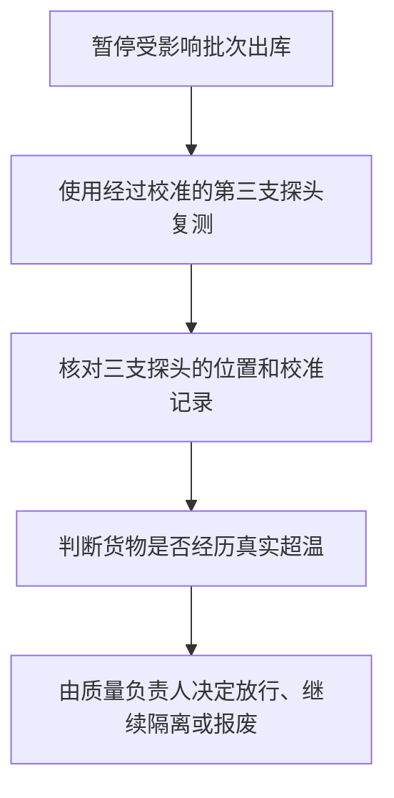
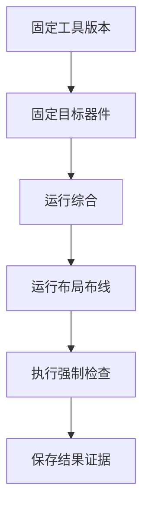

# 完整问答案例

这些案例来自正式质量测试文件，本轮新增案例排在历史回归案例之前

## 1 案例构成

- 全部案例数量：41
- 本轮新增案例数量：8
- 历史回归案例数量：33
- 写作检查失败数量：0
- 样本差异检查失败数量：0

质量测试源文件保留每个回答的原始标题和图表编号

导出程序只调整合并文档中的标题层级和图表编号，让图表编号与所属一级章节保持一致

## 2 完整问答

### 2.1 本轮新增案例

案例来源标识为：`new-cold-chain-evidence-flow`

#### 2.1.1 问题

> 冷库合同要求不高于5℃，传感器连续20分钟读到7.8℃，备用探头是4.9℃，写一份能决定是否隔离货物的报告，要有表格和流程图

#### 2.1.2 回答

<!-- caption-style: personal -->

根据用户本次提供的数据，主传感器连续二十分钟记录为 $7.8\,^\circ\mathrm{C}$，备用探头记录为 $4.9\,^\circ\mathrm{C}$，两个测量结果相互冲突，所以仓库负责人目前无法只凭一个探头判断货物已经超温

SLA 服务等级协议（Service Level Agreement）规定库温不得高于 $5\,^\circ\mathrm{C}$；温度超过合同上限可能影响货物质量，也可能触发客户索赔

##### 2.1.2.1 当前证据

<div align="center">

| 证据来源 | 当前结果 | 能够证明的范围 |
|---|---:|---|
| 主传感器 | $7.8\,^\circ\mathrm{C}$ | 主传感器记录超过合同上限 |
| 备用探头 | $4.9\,^\circ\mathrm{C}$ | 备用位置仍在合同范围内 |
| 连续记录时间 | 二十分钟 | 主传感器结果不是单次瞬时波动 |

表 2.1 冷库温度证据

</div>

两支探头没有形成一致结果，温度差异可能来自库内位置差异、传感器故障或真实局部升温

##### 2.1.2.2 处置流程

下面的流程先保护货物，再核对测量设备：

<div align="center">



图 2.1 冷库温度异常处置流程

</div>

仓库负责人现在应暂停受影响批次出库，并让质量负责人使用经过校准的第三支探头复测；第三支探头和主传感器都超过上限时，质量负责人需要按照货物允许暴露时间继续评估，不能直接放行

<!-- caption-style: end -->

### 2.2 本轮新增案例

案例来源标识为：`new-clear-subject-handover`

#### 2.2.1 问题

> 把“它报警后通知他处理，确认没事就恢复”改成不会认错责任人的交接说明，设备负责人是李工，值班主管是王姐

#### 2.2.2 回答

<!-- caption-style: personal -->

监控系统发出报警后，值班主管王姐负责记录报警时间并通知设备负责人李工

设备负责人李工负责检查报警原因，并把检查证据交给值班主管王姐

值班主管王姐确认设备状态、安全条件和检查记录都符合恢复要求后，才能批准恢复运行

<!-- caption-style: end -->

### 2.3 本轮新增案例

案例来源标识为：`new-battery-formula-source`

#### 2.3.1 问题

> 电池标称100Ah，放掉38Ah，报告直接写SOC 62%，帮我改成能复算、也不会把估算当实测的说法

#### 2.3.2 回答

<!-- caption-style: personal -->

根据用户本次提供的数据，电池标称容量为 $100\,\mathrm{Ah}$，累计放电量为 $38\,\mathrm{Ah}$

SOC 荷电状态（State of Charge）表示电池当前剩余电量占可用容量的比例

本次估算采用下面的计算方法：

$$
\mathrm{SOC}=\frac{100\,\mathrm{Ah}-38\,\mathrm{Ah}}{100\,\mathrm{Ah}}\times100\%=62\%
$$

$62\%$ 来自标称容量和累计放电量的计算结果，维护人员可以使用相同输入重新计算

标称容量会随温度、老化和放电倍率变化，因此 $62\%$ 属于估算结果，不能替代电池管理系统或容量试验产生的实际测量结果

维护人员需要在报告中继续记录电池温度、使用年限和测量设备；这些信息缺失时，报告只能把 $62\%$ 用作维护参考

<!-- caption-style: end -->

### 2.4 本轮新增案例

案例来源标识为：`new-powershell-line-comments`

#### 2.4.1 问题

> 把复制配置、算摘要、核对副本写成新手能执行的PowerShell命令，每一行都要有同行注释

#### 2.4.2 回答

<!-- caption-style: personal -->

PowerShell 命令行环境（PowerShell）负责在 Windows 操作系统（Windows）中执行文件操作

下面的步骤先复制配置，再比较原文件和副本的摘要；摘要一致表示两个文件的内容相同

第一步 创建副本

```powershell
$source = ".\config.json" # 指定需要备份的原始配置文件
$backup = ".\backup\config.json" # 指定独立副本的位置，避免覆盖原文件
New-Item -ItemType Directory -Path ".\backup" -Force # 创建副本目录，让复制命令具有有效目标
Copy-Item -LiteralPath $source -Destination $backup -Force # 复制配置文件，并在同名旧副本存在时更新副本
```

第二步 核对内容

```powershell
$sourceHash = (Get-FileHash -LiteralPath $source -Algorithm SHA256).Hash # 计算原文件摘要，用于代表原文件内容
$backupHash = (Get-FileHash -LiteralPath $backup -Algorithm SHA256).Hash # 使用相同算法计算副本摘要
$sourceHash -eq $backupHash # 比较两个摘要，结果为真时才能确认副本内容一致
```

摘要比较结果为假时，操作人员需要保留两个文件并调查复制过程，不能使用未经核对的副本替换原文件

<!-- caption-style: end -->

### 2.5 本轮新增案例

案例来源标识为：`new-publication-centered-table`

#### 2.5.1 问题

> 论文里要比较两种检测方法，甲方法12次里错2次，乙方法12次里错1次，写成表题在上且整体居中的结果段

#### 2.5.2 回答

<!-- caption-style: publication -->

根据用户本次提供的试验记录，甲方法和乙方法各执行十二次，因此两组错误次数可以在相同试验次数下比较

##### 2.5.2.1 检测结果

<div align="center">

表 2.2 两种检测方法的错误次数

| 检测方法 | 试验次数 | 错误次数 |
|---|---:|---:|
| 甲方法 | 十二次 | 两次 |
| 乙方法 | 十二次 | 一次 |

</div>

乙方法在本轮试验中少出现一次错误，所以本轮数据支持继续评估乙方法

##### 2.5.2.2 证据限制

两组试验各只有十二次，而且原始材料没有提供输入难度和错误类型

研究人员需要扩大样本，并保证两种方法处理相同输入；新增试验仍显示乙方法错误更少时，研究人员才能进一步判断优势是否稳定

<!-- caption-style: end -->

### 2.6 本轮新增案例

案例来源标识为：`new-emergency-branch-layout`

#### 2.6.1 问题

> 机房进水告警，写一段分支明确的处理说明：有人触电风险时、只有地面积水时、确认是假报警时分别怎么办

#### 2.6.2 回答

<!-- caption-style: personal -->

进水告警可能同时影响人员安全和设备供电，所以现场操作人员需要先判断是否存在触电风险

- 如果现场存在人员触电风险：
  - 现场操作人员立即远离积水区域
  - 值班负责人联系应急救援人员
  - 具备授权的电气人员从安全位置切断相关电源

- 如果现场只有地面积水，而且人员可以安全接近：
  - 现场操作人员设置隔离区域
  - 设施人员查找进水来源并停止继续进水
  - 设备负责人检查机柜底部和电缆是否接触积水

- 如果经过现场检查确认是假报警：
  - 设备负责人保存传感器读数和现场照片
  - 维护人员检查传感器故障原因
  - 值班负责人确认告警恢复后关闭事件

每个分支都写明了执行主体；现场人员无法确认安全条件时，应按照存在触电风险的分支处理

<!-- caption-style: end -->

### 2.7 本轮新增案例

案例来源标识为：`new-rpo-rto-natural-terms`

#### 2.7.1 问题

> 报告只写RPO 15分钟、RTO 2小时，我完全不知道这俩会影响什么，用普通话解释

#### 2.7.2 回答

<!-- caption-style: personal -->

根据用户本次提供的报告，RPO 恢复点目标（Recovery Point Objective）为十五分钟；系统发生故障后，最近十五分钟内尚未进入备份的数据可能需要重新录入

RTO 恢复时间目标（Recovery Time Objective）为两小时；故障发生后，技术团队计划在两小时内恢复服务

业务负责人需要分别确认十五分钟的数据损失是否可以接受，以及两小时的停机是否会影响关键业务

<!-- caption-style: end -->

### 2.8 本轮新增案例

案例来源标识为：`new-laboratory-multi-visual-report`

#### 2.8.1 问题

> 实验室记录里三次称量是10.02g、10.01g、10.40g，还有一张天平照片，写成图表都居中、编号跟章节一致的复核报告

#### 2.8.2 回答

<!-- caption-style: personal -->

根据用户本次提供的实验室记录，三次称量结果分别为 $10.02\,\mathrm{g}$、$10.01\,\mathrm{g}$ 和 $10.40\,\mathrm{g}$

第三次结果与前两次结果相差较大，所以实验室负责人需要先复核第三次称量，当前记录还不能直接用于计算最终平均值

##### 2.8.2.1 称量记录

<div align="center">

| 称量顺序 | 记录结果 |
|---|---:|
| 第一次 | $10.02\,\mathrm{g}$ |
| 第二次 | $10.01\,\mathrm{g}$ |
| 第三次 | $10.40\,\mathrm{g}$ |

表 2.3 三次称量结果

</div>

前两次结果相差 $0.01\,\mathrm{g}$，第三次结果比第二次高 $0.39\,\mathrm{g}$；两个差值均根据用户提供的原始记录相减得到

##### 2.8.2.2 设备照片

设备照片用于核对天平显示值、容器位置和设备状态：

<div align="center">


图 2.2 天平称量现场

</div>

原始材料只说明存在这张照片，没有提供照片拍摄时间和文件摘要，所以实验室负责人还需要确认照片是否对应第三次称量

##### 2.8.2.3 复核结论

实验室负责人应重新检查第三次称量的样品、容器和天平归零记录

复测结果接近前两次时，实验室负责人可以把第三次原记录标记为待调查异常

根据用户本次提供的原记录，复测结果仍接近 $10.40\,\mathrm{g}$ 时，实验室负责人需要调查样品是否发生变化

<!-- caption-style: end -->

### 2.9 历史回归案例

案例来源标识为：`short-direct`

#### 2.9.1 问题

> 一句话告诉我项目到底跑完没有

#### 2.9.2 回答

<!-- caption-style: personal -->

本轮规定的软件流程已经跑通，因为完整执行记录已经留下可复核证据；真实设备尚未测试，所以流程完成不等于产品已经获准发布

<!-- caption-style: end -->

### 2.10 历史回归案例

案例来源标识为：`short-casual-browser`

#### 2.10.1 问题

> 网页突然全打不开了，我现在先干啥

#### 2.10.2 回答

<!-- caption-style: personal -->

先做两个测试： 

- 用同一网络的另一台设备打开网页
- 把当前设备切换到手机流量后再试

根据结果判断：

- 如果其他设备也打不开，当前网络更可能有问题
- 如果切换手机流量后能够打开，当前无线网络更可能有问题
- 如果只有一个网站打不开，该网站自身更可能暂时故障

这样可以先缩小问题范围，避免反复修改无关设置

<!-- caption-style: end -->

### 2.11 历史回归案例

案例来源标识为：`short-urgent-disk`

#### 2.11.1 问题

> 服务器磁盘只剩8GB，任务还在跑，马上怎么办

#### 2.11.2 回答

<!-- caption-style: personal -->

根据用户本次提供的数据，GB 千兆字节（Gigabyte）是磁盘容量单位；服务器磁盘只剩 8 GB，继续增加任务可能耗尽空间并破坏尚未写完的文件

立即执行下面三项检查：

- 确认当前任务每分钟增加多少磁盘占用
- 确认哪些临时文件属于已经结束的任务
- 确认现有任务完成前需要的最大剩余空间

只有确认清理对象不属于当前任务后，才能删除临时文件；如果预计空间仍然不足，应让任务安全停止在能够恢复的位置

<!-- caption-style: end -->

### 2.12 历史回归案例

案例来源标识为：`medium-teaching-dns`

#### 2.12.1 问题

> 把DNS讲给完全不懂网络的人听

#### 2.12.2 回答

<!-- caption-style: personal -->

DNS 域名系统（Domain Name System）负责把人能记住的网站名称转换成计算机使用的网络地址；没有这一步，浏览器知道你想访问哪个名称，却不知道应该连接哪台服务器

一次正常访问包含下面三步：

- 你在浏览器中输入网站名称
- 域名系统查找对应的网络地址
- 浏览器连接该地址并请求网页内容

如果名称转换失败，网页会打不开，但网络本身不一定断开；因此其他应用仍能联网时，应先检查名称转换服务，而不是立即重装浏览器

<!-- caption-style: end -->

### 2.13 历史回归案例

案例来源标识为：`medium-statistics`

#### 2.13.1 问题

> Cpk从1.45掉到1.08，到底说明什么，要不要停线

#### 2.13.2 回答

<!-- caption-style: personal -->

根据用户本次提供的数据，用户输入中的 `Cpk` 指 $C_{pk}$ 过程能力指数（Process Capability Index）；这个指数用于比较生产波动和产品允许范围，数值从 $1.45$ 降到 $1.08$，说明生产结果比以前更容易靠近或越过允许边界，因此不合格品风险正在增加

这两个数值还不能单独决定是否停线，因为判断仍缺少下面三类证据：

- 实际不合格品数量是否增加
- 测量设备是否发生偏差
- 生产平均值是否持续向某一侧移动

根据补充结果处理：

- 如果实际不合格品增加，先隔离受影响批次，并评估是否暂停生产
- 如果测量设备存在偏差，先校准设备，再重新计算
- 如果平均值持续偏移，调整生产参数，并提高后续批次的检查比例

原因不同会导致不同处理，所以不能只凭一个指数直接停线，也不能在风险上升后继续按原计划放行

<!-- caption-style: end -->

### 2.14 历史回归案例

案例来源标识为：`long-finance`

#### 2.14.1 问题

> 公司预测DSCR为1.18，银行能不能据此判断明年肯定还得上钱

#### 2.14.2 回答

<!-- caption-style: personal -->

根据用户本次提供的预测数据，DSCR 偿债能力覆盖倍数（Debt Service Coverage Ratio）比较企业可用于还款的资金和同期需要偿还的本息；预测值为 $1.18$，表示预测资金只比预测还款金额高 $18\%$，缓冲空间较小

这个数值来自未来预测，所以不能证明明年一定能够还款；下面三种变化都可能吃掉现有缓冲：

- 收入少于预测
- 成本高于预测
- 客户回款变慢

预测对这些变化越敏感，按时还款的不确定性就越高

不同贷款合同可能采用不同计算口径，所以先确认合同怎样定义可用于还款的资金

即使合同公式没有扣除下面三类支出，判断实际还款能力时也要单独检查：

- 税款
- 购买设备或厂房等长期资产所需的大额支出
- 维持日常经营所需的最低资金

企业最终仍要支付这些资金；如果分析完全忽略它们，实际还款能力就会被高估

随后按照下面三种情况重新计算：

- 如果收入下降 $10\%$，检查剩余资金是否仍能覆盖全部本息
- 如果利率上升，按新的利息金额重新计算
- 如果主要客户晚回款三个月，检查还款日期到来时账户里是否真的有钱

如果任一常见不利变化都会使结果低于 $1$，企业的还款安全性就依赖乐观预测

银行还需要核对下面三类证据：

- 贷款合同
- 现金实际流入和流出记录
- 各笔债务的到期时间

这些证据决定企业在还款日是否真的有足够资金，所以不能只凭 $1.18$ 判断明年肯定能够还款

<!-- caption-style: end -->

### 2.15 历史回归案例

案例来源标识为：`medium-medical`

#### 2.15.1 问题

> 体检eGFR只有58，我是不是肾衰了，吓死了

#### 2.15.2 回答

<!-- caption-style: personal -->

根据用户本次提供的检验数据，单次结果为 $58$ 不能独立证明已经发生肾衰竭

原问题没有提供检验报告采用的参考标准，因此本回答不使用来源不明的固定阈值判断病情；医生需要按照检验报告标注的参考范围和复查结果解释这次数值

下面四类情况都可能暂时影响结果：

- 身体缺水
- 近期使用的药物
- 正在经历的急性疾病
- 检测本身的正常波动

这些影响需要通过复查排除；但这个数值低于常见参考范围，所以也不能忽略

eGFR 估算肾小球滤过率（Estimated Glomerular Filtration Rate）用于估计肾脏过滤血液的能力；医生通常还需要结合下面三类证据判断：

- 结果是否持续异常
- 尿液检查是否发现蛋白
- 肌酐变化是否显示肾功能继续下降

你现在可以先联系医生安排复查，并带上近期用药记录

如果出现下面任何一种表现，应尽快就医：

- 尿量明显减少
- 呼吸困难
- 严重水肿

这些表现可能说明身体已经受到明显影响，所以不应等待常规复查

<!-- caption-style: end -->

### 2.16 历史回归案例

案例来源标识为：`medium-software`

#### 2.16.1 问题

> API一直返回429，别只扔给我一个错误码，告诉我为什么和怎么修

#### 2.16.2 回答

<!-- caption-style: personal -->

API 应用程序接口（Application Programming Interface）持续返回状态码 $429$，通常表示客户端在一段时间内发送了过多请求；服务器为了保护容量而暂时拒绝部分请求，所以立即重复发送只会延长故障

先检查响应内容是否提供等待时间；如果提供，应等待指定时间后再试

随后检查请求来源：

- 如果单个任务短时间集中发送，限制同时发送的请求数量
- 如果失败请求立即重复发送，每次失败后逐步延长等待时间
- 如果多个任务共用同一额度，建立统一队列，避免它们同时抢占额度

修复后记录单位时间内的请求数量和失败数量；只有失败率持续下降，才能说明调整确实有效

<!-- caption-style: end -->

### 2.17 历史回归案例

案例来源标识为：`long-fpga-skeptical`

#### 2.17.1 问题

> 你是不是为了交差才说FPGA阶段完成了，明明板子都没测

#### 2.17.2 回答

<!-- caption-style: personal -->

FPGA 现场可编程门阵列（Field-Programmable Gate Array）本轮的软件流程已经执行并留下记录；真实板卡尚未测试，因此现有证据只能证明流程完成，不能证明产品完成

本轮已经证明下面六件事：

- 设计内容能够转换成芯片可以继续布局连接的结构
- 芯片内部布局和连接能够完成
- 信号到达时间检查能够按规定执行
- 芯片连接规则检查能够按规定执行
- 不同时钟区域之间的信号传递检查能够按规定执行
- 未通过检查的候选会被隔离，不会冒充可发布结果

本轮没有证明下面五件事：

- 真实板卡能够稳定启动
- 外部时钟在实物上满足要求
- 电源在实物上满足要求
- 外部接口在实物上满足要求
- 产品已经达到量产或客户交付条件

项目内部状态 `FLOW_VALIDATED` 属于流程关闭结论；它表示规定的软件验证链路已经跑通，因此可以结束本轮流程验证；它不表示真实板卡已经获准发布

严格实现门禁（ImplementationGate）是一组必须全部通过的检查；任何一项失败都会阻止候选进入可接受结果；这个门禁证明检查机制能够工作，但不能替代真实硬件试验

因此，准确结论是流程验证已经完成，真实板卡验证尚未完成；如果报告把这两者写成同一件事，报告就是错误的

<!-- caption-style: end -->

### 2.18 历史回归案例

案例来源标识为：`long-executive`

#### 2.18.1 问题

> 给管理层写一份订单积压风险简报，数据是OTIF 91%，积压180单，每天新增62单，完成55单，最老订单等了11天

#### 2.18.2 回答

<!-- caption-style: personal -->

以下数值均来自用户本次提供的订单记录

订单积压正在扩大，因为每天新增 $62$ 笔订单，但每天只能完成 $55$ 笔；按照 $62-55=7$ 计算，积压每天净增加 $7$ 笔，现有 $180$ 笔积压不会自行消失

OTIF 按时足量交付率（On Time In Full）统计订单是否同时做到按时交付和数量完整；当前数值为 $91\%$，表示每 $100$ 笔订单中约有 $9$ 笔没有完全达到交付承诺

##### 2.18.2.1 当前事实

- 每天新增 $62$ 笔订单
- 每天完成 $55$ 笔订单
- 每天净增加 $7$ 笔积压
- 最老订单已经等待 $11$ 天

这些数字共同说明两个问题：

- 当前处理能力低于新增需求
- 少数订单已经长时间停滞

##### 2.18.2.2 实际影响

积压继续增加会推高逾期数量；最老订单等待时间继续延长，还会增加客户投诉和取消订单的可能

按当前速度计算：

$$
180 \div 7 \approx 25.7
$$

如果新增数量和完成数量都不变化，积压大约每 $26$ 天增加一倍

这个估算没有考虑下面三项变化：

- 周末的处理能力
- 不同季节的订单数量
- 不同订单的处理难度

这些变化都会影响实际速度，所以估算只能说明风险方向，不能当作精确预测

##### 2.18.2.3 当日行动

今天先处理下面三类订单：

- 已经超过承诺日期的订单
- 等待时间最长的订单
- 重要客户且接近逾期的订单

这些订单最接近造成实际客户损失；每笔订单需要指定负责人和完成时间

##### 2.18.2.4 能力调整

处理能力至少要达到每天 $62$ 笔，积压才不会继续扩大；如果还要在限定时间内消化现有积压，每天完成数量必须高于 $62$ 笔

根据可用资源选择措施：

- 如果能够临时增加人员，把人员优先投入最慢的处理环节
- 如果缺货造成停滞，优先确认补货时间，并向受影响客户提供新的交付日期
- 如果系统处理速度限制产能，先处理能够减少人工重复录入的问题

##### 2.18.2.5 判断边界

现有数据足以证明积压正在扩大，但还不能确定全部原因

管理层仍需补充下面三类数据：

- 每个处理环节的耗时
- 缺货订单所占比例
- 现有人员每天真正用于处理订单的时间

数据补齐后，再选择一项主要措施：

- 增加人员
- 调整库存
- 修改处理流程

不同原因需要不同措施；先确认主要限制来自哪里，才能避免投入资源后仍然无法减少积压

<!-- caption-style: end -->

### 2.19 历史回归案例

案例来源标识为：`micro-angry-correction`

#### 2.19.1 问题

> 别绕了，直接说你刚才错在哪

#### 2.19.2 回答

<!-- caption-style: personal -->

我把软件流程完成误写成产品完成，导致结论超过证据范围；正确结论是软件流程已经验证，真实设备尚未验证

<!-- caption-style: end -->

### 2.20 历史回归案例

案例来源标识为：`micro-delete-logs`

#### 2.20.1 问题

> 现在到底能不能删日志

#### 2.20.2 回答

<!-- caption-style: personal -->

当前任务仍在写入同一目录，删除日志可能破坏结果，所以现在不能删；等任务结束并确认文件不再增长后再清理

<!-- caption-style: end -->

### 2.21 历史回归案例

案例来源标识为：`short-child-fractions`

#### 2.21.1 问题

> 给十岁小孩解释三分之一，别像课本

#### 2.21.2 回答

<!-- caption-style: personal -->

把一张披萨平均切成三块，每一块就是三分之一

这里有两个关键信息：

- 三表示一共平均分成三块
- 一表示你拿了其中一块

如果三块大小不一样，就不能叫三分之一，因为分数要求每一块先分得一样大

<!-- caption-style: end -->

### 2.22 历史回归案例

案例来源标识为：`short-customer-apology`

#### 2.22.1 问题

> 客户退款晚了五天，写一段别推卸责任的回复

#### 2.22.2 回答

<!-- caption-style: personal -->

退款晚了五天，是因为我们没有在承诺时间内完成内部审核；这个延误由我们负责

退款已经重新提交，最晚将在两个工作日内到账；今天下班前我们会发送处理编号，客户无需再次提供材料

如果两个工作日后仍未到账，我们将由专人继续处理，并主动联系客户说明进度

<!-- caption-style: end -->

### 2.23 历史回归案例

案例来源标识为：`medium-legal-renewal`

#### 2.23.1 问题

> 这份NDA写着提前30天不通知就自动续一年，用人话解释我会承担什么

#### 2.23.2 回答

<!-- caption-style: personal -->

NDA 保密协议（Non-Disclosure Agreement）规定哪些信息不能向外披露；这份条款表示合同到期前没有按时发送书面通知，保密义务就会自动延长一年

先确认三个日期：

- 当前合同开始日期
- 当前合同到期日期
- 最晚通知日期

这三个日期决定你现在是否还来得及阻止自动续期

根据结果处理：

- 如果距离到期超过三十天，按照合同规定的送达方式发送不续期通知
- 如果距离到期不足三十天，自动续期可能已经无法单方面阻止，需要与对方协商
- 如果合同没有写清通知怎样送达，先不要只发普通邮件，因为对方可能主张没有收到有效通知

还要检查自动续期后哪些义务继续有效；有些合同只延长保密义务，有些合同还会延长资料返还或违约责任

现有一句条款只能说明续期机制，不能单独证明通知是否有效；最终判断仍要结合完整合同和实际送达记录

<!-- caption-style: end -->

### 2.24 历史回归案例

案例来源标识为：`medium-security-login`

#### 2.24.1 问题

> 我刚在假登录页输完密码，还点了确认，现在怎么办

#### 2.24.2 回答

<!-- caption-style: personal -->

密码可能已经被他人获得，因为假登录页会把你输入的内容发送给攻击者；先使用可信设备打开官方网站，不要继续使用刚才的页面

立即完成下面四项操作：

- 修改该账户密码
- 退出所有已经登录的设备
- 检查账户的备用邮箱和手机号码有没有被修改
- 检查最近登录记录有没有陌生地点

这些操作能够切断攻击者继续使用旧密码的机会

MFA 多因素身份验证（Multi-Factor Authentication）要求登录者同时提供两种以上证明；如果账户支持，应立即启用，因为只有密码泄露时，攻击者仍然缺少第二种证明

根据账户范围继续处理：

- 如果你在其他网站使用了相同密码，那些账户也要分别更换密码
- 如果这个账户属于公司
  - 立即通知负责信息安全的人员
  - 检查是否有人读取近期邮件
  - 检查是否有人下载公司文件
  - 检查是否有人冒充你发送消息

<!-- caption-style: end -->

### 2.25 历史回归案例

案例来源标识为：`medium-code-review`

#### 2.25.1 问题

> 这段代码偶尔报空引用，别只说加判空，解释为什么和怎么验证

#### 2.25.2 回答

<!-- caption-style: personal -->

用户资料不是每次都会存在，但代码直接读取资料中的城市，所以资料为空时就会出现空引用异常（NullReferenceException）；这个异常会中断当前请求，用户只能看到失败结果

##### 2.25.2.1 问题原因

登录成功只能证明用户账户存在，不能证明用户已经填写资料；把这两个条件当成同一件事，才是问题反复出现的原因

##### 2.25.2.2 修复建议

先明确资料缺失时产品应该怎样处理：

- 如果资料不是必填项，返回明确的未填写状态
- 如果资料必须存在，阻止后续流程，并告诉用户需要补充哪些内容

代码可以先检查资料，再读取城市：

```csharp
// 先处理资料缺失情况，避免后续读取空值
if (user.Profile is null)
{
    return ProfileResult.Missing();
}

// 资料存在后再读取城市并返回正常结果
return ProfileResult.Found(user.Profile.City);
```

##### 2.25.2.3 验证方法

至少测试下面三种输入：

- 用户资料完整
- 用户存在但资料为空
- 用户编号不存在

三种输入都得到规定结果后，才能证明修复覆盖了正常情况和缺失情况

<!-- caption-style: end -->

### 2.26 历史回归案例

案例来源标识为：`medium-procurement-table`

#### 2.26.1 问题

> 甲打印机便宜两千，乙耗材便宜，三年选哪个，给我能拍板的比较

#### 2.26.2 回答

<!-- caption-style: personal -->

三年内预计打印十二万页，耗材费用会远高于两千元的购买差价，所以不能只比较机器价格

总使用成本表示从购买到报废期间实际花掉的全部费用；本次把购买后直到报废的全部费用计入

<div align="center">

| 比较项目 | 甲方案 | 乙方案 |
|---|---:|---:|
| 机器价格 | 8000元 | 10000元 |
| 三年耗材 | 24000元 | 15000元 |
| 三年维护 | 6000元 | 4000元 |
| 三年合计 | 38000元 | 29000元 |

表 2.4 三年成本比较

</div>

乙方案虽然购买时多花两千元，但三年合计少花九千元，因此预计打印量能够实现时应选乙方案

拍板前还要确认两项事实：

- 十二万页是否来自真实历史用量
- 乙方案耗材价格是否已经包含未来涨价

如果打印量明显低于预测，耗材节省会变小；如果预计用量可靠，乙方案的成本优势更稳

<!-- caption-style: end -->

### 2.27 历史回归案例

案例来源标识为：`long-construction-incident`

#### 2.27.1 问题

> 把模板下沉事故写成一份业主能看懂的通报，别堆施工术语

#### 2.27.2 回答

<!-- caption-style: personal -->

现场把这次事件记录为模板下沉事故；这个名称表示托住未凝固混凝土的临时结构发生位移，导致三层楼板浇筑区域局部下沉；现场已经停止继续浇筑并封锁受影响区域，目前没有人员受伤

##### 2.27.2.1 发生经过

以下时间和测量值来自现场事件记录

- 08:10 开始浇筑三层楼板
- 09:05 现场人员发现一处支撑杆倾斜
- 09:08 施工负责人要求停止泵送混凝土
- 09:12 受影响区域完成撤离
- 09:25 测量确认楼板局部下沉十八毫米

时间记录表明，现场在发现异常后三分钟内停止继续加荷，因此没有让下沉范围继续扩大

##### 2.27.2.2 已知原因

临时支撑用于托住混凝土，直到混凝土强度足以自行承重

初步检查发现下面三项异常：

- 两根支撑杆底部垫板发生滑动
- 一处水平连接杆没有按图纸位置安装
- 当班检查表缺少现场负责人的签字

这些事实说明支撑体系没有保持规定形状；但现有证据还不能确定问题发生在安装、检查还是地面承载能力

##### 2.27.2.3 立即处置

现场已经完成下面六项措施：

- 停止受影响区域全部施工
- 增加临时支撑，防止继续下沉
- 标记所有发生位移的构件
- 保存当班照片
- 保存当班检查表
- 保存当班材料记录

保存原始证据能够避免后续修复掩盖事故原因

##### 2.27.2.4 后续检查

复工前必须完成下面四项工作：

- 由结构专业人员确认楼板是否需要拆除
- 检查同批支撑杆是否存在变形
- 重新测量支撑地面的承载情况
- 核对安装人员和检查人员的实际操作记录

任何一项没有结论，都不能恢复浇筑，因为继续施工会把新的重量加到状态不明的结构上

##### 2.27.2.5 责任边界

当前可以确认支撑位移直接导致局部下沉

当前不能确认下面三项内容：

- 设计文件是否存在问题
- 材料是否存在制造缺陷
- 检查人员是否故意漏检

这三项需要专业复核和原始记录才能判断；在证据完成前直接指定责任方，会把初步判断误写成最终结论

##### 2.27.2.6 下一次通报

结构检查结果预计在二十四小时内形成

下一次通报将说明下面三项内容：

- 受影响区域是否需要拆除
- 预计停工时间
- 防止再次发生的措施

三项内容形成后，业主才能判断修复范围和工期影响

<!-- caption-style: end -->

### 2.28 历史回归案例

案例来源标识为：`long-agriculture-irrigation`

#### 2.28.1 问题

> 果园三块地都喊缺水，但今晚水只够一块，怎么决定先浇哪块

#### 2.28.2 回答

<!-- caption-style: personal -->

今晚的水只能覆盖一块地，所以应先保护最容易在一夜内受到不可逆损失的果树，而不是简单选择读数最低的地块

土壤含水率表示土壤中水分所占比例；数值越低，根系能够吸收的水通常越少，但不同土壤的保水能力不同，因此三块地不能只按同一个百分比排序

##### 2.28.2.1 当前数据

以下含水率来自当晚的田间传感器记录

- 甲地含水率为 $14\%$，正在开花，土壤以沙土为主
- 乙地含水率为 $17\%$，果实已经膨大，土壤以壤土为主
- 丙地含水率为 $12\%$，果实尚小，土壤以黏土为主

沙土排水快，夜间仍会继续失水；开花期缺水还可能直接降低后续坐果数量，所以甲地虽然不是最低读数，今晚的风险最高

黏土能够保留更多水分，丙地的低读数不一定表示根系今晚就会失去可用水；乙地读数较高，短时间风险也低于甲地

##### 2.28.2.2 今晚安排

先给甲地浇水，并把水量集中在根系主要分布区域

浇水前完成下面两项确认：

- 在甲地不同位置手工取样，排除单个传感器读数错误
- 检查主管道是否漏水，避免有限水量在输送过程中损失

两项检查都没有发现异常后，再启动灌溉

##### 2.28.2.3 明早安排

明早重新测量三块地，并观察下面三种表现：

- 叶片是否持续萎蔫
- 新梢是否停止生长
- 土壤十厘米以下是否仍然干燥

这些表现能够补充单个百分比无法说明的根系实际缺水情况

根据复查结果安排：

- 如果丙地叶片仍然正常，先给乙地补水
- 如果丙地出现持续萎蔫，把丙地调整为第二优先
- 如果甲地浇水后读数没有上升，检查传感器位置和灌溉管路

##### 2.28.2.4 判断边界

现有建议建立在下面三个条件接近的前提上：

- 三块地的树龄
- 三块地的病害情况
- 三块地的果实负载

下面三类额外风险也会降低果树的承受能力：

- 刚完成移栽
- 根系已经受损
- 正在发生病害

如果某块地存在任一额外风险，需要重新排列顺序

因此，今晚优先甲地是综合前述条件作出的临时决定，不是固定的全年灌溉规则

<!-- caption-style: end -->

### 2.29 历史回归案例

案例来源标识为：`long-data-migration-handoff`

#### 2.29.1 问题

> 白班迁库迁到一半，给夜班写一份能接手的交接，别只贴日志

#### 2.29.2 回答

<!-- caption-style: personal -->

迁库表示把正式业务数据从旧系统迁移到新系统；客户资料已经完成复制，但订单资料仍在校验，所以夜班只能继续检查，不能切换正式系统；现在切换会让一部分订单只存在于旧系统，查询结果可能前后不一致

##### 2.29.2.1 当前状态

以下数量和进度来自迁移任务日志

- 客户资料共二百四十万条，已经复制完成
- 订单资料共八百一十万条，已经复制完成
- 订单金额校验完成 $62\%$
- 新系统仍然禁止外部写入
- 旧系统继续承担正式业务

复制完成只说明数据已经到达新系统，不说明内容完全一致；金额校验没有结束前，迁移不能宣布成功

##### 2.29.2.2 时间记录

以下时间和金额差异来自迁移任务日志

- 18:20 客户资料复制完成
- 19:05 订单资料复制完成
- 19:18 开始逐日比较订单金额
- 21:40 发现七月十二日金额相差三百二十元
- 22:10 确认差异来自一笔已经取消但未同步状态的订单
- 22:35 修正转换规则并重新校验七月十二日

修正规则只应用在新的校验任务中，没有覆盖原始数据

##### 2.29.2.3 夜班任务

夜班依次完成下面四项工作：

金额校验进度由迁移任务日志提供

- 等待金额校验达到 $100\%$
- 检查每天的订单数量是否一致
- 抽查取消订单在两个系统中的状态
- 保存最终校验摘要

四项结果全部一致后，才允许提出切换申请

##### 2.29.2.4 恢复边界

RPO 恢复点目标（Recovery Point Objective）表示发生故障时最多允许丢失多长时间的数据；本次要求是不允许丢失任何已经确认的订单

RTO 恢复时间目标（Recovery Time Objective）表示发生故障后业务最多允许中断多久；本次要求为三十分钟

这两个要求决定切换必须具备下面三项准备：

- 旧系统保持可用
- 切换前记录最后一笔订单编号
- 新系统异常时能够在三十分钟内恢复旧系统写入

##### 2.29.2.5 停止条件

- 如果金额再次出现无法解释的差异，停止校验后的切换步骤，并保留差异样本
- 如果新系统出现持续写入错误，不得尝试绕过检查
- 如果旧系统在迁移期间发生故障，优先恢复正式业务，不继续推进迁移

##### 2.29.2.6 联系方式

夜班负责人是数据库值班人员；需要批准切换时联系业务负责人；出现无法解释的数据差异时联系迁移脚本维护人员

数据一致并且恢复措施可用后，迁移负责人才能申请切换；任务运行结束本身不能证明迁移已经具备切换条件

<!-- caption-style: end -->

### 2.30 历史回归案例

案例来源标识为：`long-public-policy`

#### 2.30.1 问题

> 居民调查说公交太慢，能不能直接砍掉低客流站点，写个不拍脑袋的建议

#### 2.30.2 回答

<!-- caption-style: personal -->

现有调查足以证明部分居民认为公交耗时过长，但不能直接证明低客流站点就是主要原因；如果立即取消站点，可能缩短部分乘客的行程，也可能让老人和行动不便居民失去可达服务

##### 2.30.2.1 已有证据

以下调查比例和交通数据来自用户本次提供的问卷结果与交通监测记录

- 一千二百名受访者中有 $46\%$ 认为通勤时间过长
- 高峰时段平均车速比平峰低 $28\%$
- 十四个站点每天上车人数少于二十人
- 调查没有记录低客流站点乘客的年龄和替代出行方式

这些数据说明速度问题真实存在，但仍缺少下面三类影响的单独计算：

- 道路拥堵造成的延误
- 每次停站造成的延误
- 发车间隔造成的等待

三类影响没有分开前，直接取消站点可能处理了次要原因，却保留主要延误

##### 2.30.2.2 不能直接取消的原因

每天上车人数少不代表站点价值一定低

下面三种站点即使客流较少，也可能承担必要服务：

- 医院附近的站点
- 老年社区附近的站点
- 没有其他公共交通的边缘地区站点

取消这类站点会把时间成本转移给最难寻找替代方式的人

##### 2.30.2.3 先做试验

选择两条线路进行四周试验：

- 一条线路减少普通低客流站点
- 一条线路保留站点但调整高峰发车间隔

试验期间记录下面四项结果：

- 全程平均时间
- 每名乘客平均等待时间
- 被取消站点乘客的替代路线
- 投诉数量

四项结果能够判断时间改善来自少停站还是更合理的发车安排

##### 2.30.2.4 决策条件

- 如果减少站点明显缩短行程，而且受影响乘客有可接受替代路线，再考虑扩大实施
- 如果行程缩短很少，但等待时间仍然很长，优先调整车辆数量和发车间隔
- 如果医院或边缘地区乘客明显受损，恢复原站点并寻找其他提速方式

##### 2.30.2.5 建议

现在不直接取消全部低客流站点

先完成小范围试验，再把节省的总时间和新增的不便放在同一份结果中比较；只有总收益明确大于对必要出行的损害，才适合扩大调整

<!-- caption-style: end -->

### 2.31 历史回归案例

案例来源标识为：`very-long-hospital-capacity`

#### 2.31.1 问题

> 急诊等床越来越久，给院领导写完整分析，必须区分事实、推断和还缺什么

#### 2.31.2 回答

<!-- caption-style: personal -->

急诊等床表示患者已经需要住院，但仍在急诊等待病区床位；每天需要住院的人数已经连续两周高于每天能够腾出的床位数量，所以急诊等床时间正在增加；等待继续延长会占用急诊观察区域，使新到患者更难及时接受检查

现有数据足以证明床位周转出现持续失衡，但还不能把原因全部归结为床位总数不足

##### 2.31.2.1 当前事实

以下床位数量、患者数量和比例来自医院床位系统与排班记录

- 过去十四天平均每天有六十八名急诊患者需要住院
- 同期平均每天只有五十九张床位能够腾出
- 每天平均新增九名等待床位的患者
- 等待超过十二小时的患者从每天十一人增加到每天二十七人
- 周末能够腾出的床位比工作日少 $31\%$

每天新增需求持续高于释放数量，所以等待队列不会自行消失

##### 2.31.2.2 患者影响

等待住院的患者会继续占用急诊床位

这会造成下面三项后果：

- 新到患者只能在走廊或临时区域等待
- 护理人员需要同时照看急诊患者和等待住院的患者
- 已经完成急诊处理的患者仍然不能进入对应病区

这些后果会把住院床位问题继续传递到急诊入口

##### 2.31.2.3 可能原因

第一类原因是出院时间过晚

根据医院出院记录，过去十四天中只有 $22\%$ 的出院患者在中午前离院；大量床位到傍晚才空出，上午到达的住院患者只能继续等待

第二类原因是周末服务减少

周末能够完成的检查和出院手续更少，所以部分原本可以离院的患者需要多住一到两天

第三类原因是少数患者等待院外安排

部分患者已经不需要继续住院治疗，但仍在等待下面任一安排：

- 康复机构接收
- 家庭照护准备
- 转运车辆到位

这类等待占用床位，却不能只靠病区加快医疗处理解决

第四类原因才可能是床位总数不足

现有数据没有提供不同病区的空床分布；全院看似还有床位时，特定病区仍可能没有适合的床位

##### 2.31.2.4 立即行动

今天先建立两次全院床位核对：

- 上午十点核对预计当天出院的患者
- 下午三点核对仍未完成的出院事项

每次核对都要明确下面三项内容：

- 哪名患者预计离院
- 哪个事项仍在阻止离院
- 谁负责在什么时间前完成

明确责任能够把笼统的等待转化为可以处理的具体事项

急诊同时建立等待名单，并按照患者需要的病区和等待时间排序

等待时间最长不一定代表医学风险最高，所以排序仍要保留医护人员对病情紧急程度的判断

##### 2.31.2.5 七天改进

第一项改进是提前准备出院

医生在预计出院前一天确认下面三项内容：

- 离院后的用药
- 后续复诊时间
- 离院交通安排

患者达到离院条件后，不再从头开始办理

第二项改进是补齐周末环节

先统计周末最常阻塞出院的三项服务，再决定是否增加值班人员；没有统计前直接增加所有岗位，会提高成本，却不一定改善主要限制

第三项改进是处理院外等待

为等待康复机构或家庭照护的患者建立单独清单；医院管理人员每天与接收机构核对可用位置

第四项改进是公开病区差异

各病区分别报告下面三项数据：

- 可用床位
- 预计出院人数
- 已经等待的患者人数

只看全院合计会掩盖局部短缺

##### 2.31.2.6 判断标准

七天后比较下面四项结果：

- 等待超过十二小时的患者数量
- 中午前完成出院的比例
- 周末能够腾出的床位数量
- 因等待院外安排而继续住院的天数

根据七天后的结果判断：

- 如果前三项改善而等待仍然增加，床位总数不足的可能性会上升
- 如果中午前出院比例没有提高，先继续解决出院准备问题，不应立即用新增病床掩盖流程延误
- 如果周末差距明显缩小，说明增加关键服务有效，可以评估长期排班

##### 2.31.2.7 仍缺证据

最终决定是否增加床位前，还需要补充下面五类数据：

- 各病区每天的实际空床时间
- 不同病种的住院天数
- 等待院外安排的具体原因
- 周末缺少的检查项目
- 护理人员能够安全照看的患者数量

这些数据决定问题来自空间、人员还是出院安排

##### 2.31.2.8 结论边界

本轮可以确认床位周转失衡已经影响急诊

本轮不能确认新增固定床位是唯一解决方案

先用七天改进验证主要限制，再从下面三类措施中选择：

- 增加人员
- 调整服务时间
- 扩充床位

根据真实限制选择措施，能够避免投入大量资金后仍然保留原来的等待原因

<!-- caption-style: end -->

### 2.32 历史回归案例

案例来源标识为：`very-long-energy-investment`

#### 2.32.1 问题

> 光伏项目预测回报很好，给投委会写一份不被乐观模型骗到的决策稿

#### 2.32.2 回答

<!-- caption-style: personal -->

光伏项目通过太阳能组件发电，项目收入会随着光照条件和设备状态变化；项目在基准预测下能够回收投入，但盈利高度依赖下面三项假设：

- 发电量
- 售电价格
- 融资成本

三项假设只要同时出现小幅不利变化，预计收益就可能低于公司的最低要求

因此，现阶段适合进入有条件批准，不适合直接作出不可撤销的最终投资

##### 2.32.2.1 项目概况

以下投入、周期、发电量、价格和借款比例来自供应商方案与项目模型，尚未全部由独立证据验证

- 初始投入为一亿二千万元
- 预计运营期为二十五年
- 基准年发电量为一亿千瓦时
- 基准售电价格为每千瓦时零点四二元
- 借款占总投入的 $65\%$

##### 2.32.2.2 净现值

NPV 净现值（Net Present Value）把未来每年的收入和支出换算成今天的价值；结果大于零，表示按照设定的最低回报要求计算后仍有剩余价值

计算结构如下：

$$
NPV = \sum_{t=1}^{n}\frac{CF_t}{(1+r)^t}-I_0
$$

其中：

- $CF_t$ 表示第 $t$ 年实际能够留下的现金
- $r$ 表示公司要求的最低回报率
- $I_0$ 表示最初投入

基准预测的净现值为一千八百万元

这个结果建立在未来假设全部实现的条件上，因此实际收益仍可能低于估算

##### 2.32.2.3 内部回报率

IRR 内部回报率（Internal Rate of Return）表示让项目净现值刚好等于零的回报率；它可以与公司的最低回报要求比较，但不能说明项目在最差年份是否缺少现金

项目模型计算的基准内部回报率为 $10.8\%$，公司投资政策记录的最低要求为 $9\%$

根据 $10.8\%-9\%=1.8\%$ 计算，两者只相差 $1.8$ 个百分点，所以安全空间并不大

##### 2.32.2.4 关键假设

第一项假设是发电量

模型采用设备供应商提供的衰减速度，但没有使用同地区已运行项目的实际数据；如果设备老化快于预测，后期收入会持续下降

第二项假设是售电价格

模型假设二十五年价格基本稳定，但合同只锁定前八年；第九年后的收入存在明显不确定性

第三项假设是融资成本

模型采用当前利率，却没有计算贷款重新定价后的影响；利率上升会直接增加每年还款额

第四项假设是停机时间

模型只预留每年三天停机，但当地同类项目过去三年的平均停机时间为七天

##### 2.32.2.5 不利情况

按照下面三种情况重新计算：

以下百分比是投资团队设定的压力测试假设值

- 发电量比基准低 $8\%$
- 第九年后的售电价格低 $10\%$
- 借款利率上升两个百分点

根据组合结果判断：

- 如果三项分别发生，项目净现值仍为正
- 如果三项同时发生，净现值降为负九百万元，内部回报率降到 $7.6\%$

共同发生并非极端到无法想象，因为低发电量可能与设备故障同时增加维护支出，融资环境变化也可能在同一时期影响电价

##### 2.32.2.6 现金缺口

项目第七年需要更换一批关键设备

基准模型假设更换费用可以从当年经营收入支付，但不利情况下当年现金不足；如果没有备用资金，项目即使长期仍有价值，也可能在当年无法按时还款

因此还要检查每年最低现金余额，不能只看整个运营期的总回报

##### 2.32.2.7 合同风险

设备供应商承诺的发电效率只覆盖前五年

工程总包合同没有明确延误超过六个月时的全部补偿

土地使用协议允许部分费用每三年调整一次

三项合同条件都会把模型中的固定数字变成可能变化的实际支出

##### 2.32.2.8 批准条件

投资委员会可以先批准继续准备，但付款前必须完成下面五项工作：

- 使用同地区实际运行数据重新估计发电量
- 取得第九年后售电安排的书面说明
- 让贷款方提供利率上升情况下的还款表
- 为第七年设备更换建立备用资金
- 补充工程延误的赔偿上限

五项工作能够验证最敏感假设，并把无法消除的部分控制在公司能够承担的范围内

##### 2.32.2.9 停止条件

- 如果不利情况导致最低现金余额仍为负，而且没有备用资金，停止最终投资
- 如果售电价格在第九年后完全没有保障，把项目回报要求提高后重新评估
- 如果实际发电数据明显低于供应商预测，要求调整价格或性能保证

##### 2.32.2.10 决策

基准模型支持项目继续准备，但不能支持立即无条件投资

有条件批准能够保留项目机会，同时阻止公司在关键假设尚未验证时承担全部风险

<!-- caption-style: end -->

### 2.33 历史回归案例

案例来源标识为：`very-long-research-critique`

#### 2.33.1 问题

> 论文摘要说新训练方法显著提高记忆力，你帮我挑刺，但不要为了挑刺否定一切

#### 2.33.2 回答

<!-- caption-style: personal -->

现有结果支持新训练方法可能改善短期测试成绩，但不能证明它已经稳定提高日常记忆能力

下面三项因素都会限制结论：

- 研究比较的范围
- 中途退出的人数
- 记忆能力的测量方式

这些限制没有排除前，摘要不能把一次短期测试扩大成稳定的日常改善

因此，这项研究值得继续，但摘要中的表述需要缩小

##### 2.33.2.1 研究设计

RCT 随机对照试验（Randomized Controlled Trial）通过随机分组减少两组参与者原有差异；本研究把一百二十名参与者随机分成训练组和对照组

训练组连续六周使用新方法

对照组只收到一般健康建议

两组在开始前和六周后完成同一套记忆测试

随机分组是优点，因为它降低了训练组本来就更擅长记忆的可能性

##### 2.33.2.2 主要结果

以下分数、组间差异和 $p$ 值来自研究摘要

- 训练组平均提高十二分
- 对照组平均提高五分
- 两组差异为七分
- 研究报告的 $p$ 值为 $0.03$

$p$ 值用于衡量在实际没有组间差异时，观察到当前结果或更极端结果的可能程度；数值较小只能说明结果不容易由随机波动单独解释，不能说明效果一定很大，也不能说明研究没有其他偏差

##### 2.33.2.3 效果大小

摘要只写显著提高，却没有说明七分差异在日常生活中是否重要

根据测试总分范围判断：

- 如果测试总分为一百分，七分可能有实际意义
- 如果测试总分为五百分，七分可能很小

研究需要同时报告下面三项内容：

- 测试总分范围
- 每个人的变化幅度
- 达到实际改善标准的人数

没有这些信息，读者只能知道两组数字不同，不能判断这种不同是否值得投入六周训练

##### 2.33.2.4 退出人数

训练组有十八人中途退出，对照组有五人退出

训练组退出人数更多，所以退出者可能不是随机离开；只分析完成者会高估训练效果

研究应说明下面三项内容：

- 每名退出者退出的时间
- 已知的退出原因
- 退出者在退出前已经完成的测试结果

这些信息决定退出是否可能系统性改变结果

##### 2.33.2.5 对照条件

训练组每周与指导人员接触三次，对照组没有同等接触

训练组还同时经历下面三项变化：

- 获得更多关注
- 进行更规律的练习
- 对改善产生更强期待

这些变化也可能提高测试成绩，因此不能把全部改善都归入新方法

更严格的后续研究应让对照组接受相同时间的另一种训练；这样才能把新方法的具体作用与额外关注分开

##### 2.33.2.6 重复测试

两组前后使用同一套题目

参与者第二次看到相似题目时，成绩可能因为熟悉测试而提高

对照组也提高五分，说明重复测试确实可能贡献一部分变化

后续研究可以使用难度相当但题目不同的测试，减少记住题目的影响

##### 2.33.2.7 持续时间

研究只测量六周结束时的成绩

这能够证明短期变化，不能证明三个月或一年后仍然有效

如果效果在停止训练后迅速消失，使用价值会低于摘要给人的印象

研究至少需要增加一次延后复查

##### 2.33.2.8 适用人群

参与者全部来自同一所大学，年龄集中在十八岁到二十二岁

这个样本不能直接代表下面人群：

- 老年人
- 已经存在记忆障碍的人
- 工作压力很高的成年人
- 教育背景不同的人

研究可以先把结论限定为参与本试验的年轻成年人

##### 2.33.2.9 安全信息

摘要没有报告不适或负担

训练每周需要六小时，这本身可能造成疲劳和退出

即使没有严重伤害，也应报告下面三项信息：

- 头痛人数
- 睡眠变化人数
- 无法坚持训练的人数

这些信息决定收益是否值得付出

##### 2.33.2.10 可以保留的结论

研究有随机分组，也观察到训练组比对照组提高更多，所以不能简单说结果毫无价值

现有证据最稳妥地支持下面结论：

在这批年轻参与者中，新训练方法与六周后的记忆测试成绩改善有关

##### 2.33.2.11 需要删除的结论

现有证据不能支持下面表述：

- 训练已经被证明能够长期提高记忆力
- 所有人都能从训练中获益
- 训练效果完全来自方法本身
- 统计差异必然代表生活中的明显改善

##### 2.33.2.12 下一步

后续研究应完成下面四项改进：

- 扩大参与者来源
- 使用活动量相当的对照训练
- 减少重复题目影响
- 增加延后复查

这些改进能够判断效果能否重复出现，并观察停止训练后还保留多久；两项结果共同决定方法是否值得推广

<!-- caption-style: end -->

### 2.34 历史回归案例

案例来源标识为：`very-long-messy-handoff`

#### 2.34.1 问题

> 这些笔记乱得要命：测试过了、客户还没签、接口偶尔超时、周五想上线、旧版能回退、负责人请假了，把它改成完整交接报告

#### 2.34.2 回答

<!-- caption-style: personal -->

系统内部测试已经通过，但客户尚未确认验收，而且接口仍有偶发超时，所以当前不具备周五直接上线的完整条件

旧版本可以恢复，这降低了上线失败后的持续影响；但负责人请假会延长判断和处置时间，因此不能把可回退当作可以忽略风险

##### 2.34.2.1 当前结论

本轮可以确认下面三项内容：

- 规定的内部功能测试已经完成
- 旧版本恢复步骤已经演练
- 偶发超时问题仍然存在

本轮不能确认下面三项内容：

- 客户是否接受当前功能
- 超时是否会在正式流量下扩大
- 周五上线时是否有足够人员处理异常

完成测试只证明已测试范围内的功能符合预期，不代表客户验收或正式运行已经准备完成

##### 2.34.2.2 已完成工作

测试团队完成了下面四条主要流程：

- 登录
- 查询
- 提交
- 结果导出

每条流程都留下测试记录，失败用例已经修复并重新执行

旧版本恢复演练从发现异常到恢复服务共用十八分钟

恢复结果说明回退步骤能够执行，但演练环境的访问量低于正式环境，所以实际时间仍可能更长

##### 2.34.2.3 客户验收

客户尚未签署验收确认

目前只收到口头反馈，表示主要页面可以使用，但客户没有确认下面三项内容：

- 导出格式是否满足业务要求
- 权限设置是否覆盖全部岗位
- 历史数据是否完整

三项内容都会直接影响客户是否能够正式使用系统

周五上线前必须取得书面确认，或者由项目负责人明确接受未验收上线的风险

##### 2.34.2.4 超时问题

API 应用程序接口（Application Programming Interface）负责在不同系统之间传递请求和结果；当前接口大约每一千次请求出现三次超时

超时表示请求在规定时间内没有得到结果

现有日志显示超时主要集中在大批量查询，但还没有确定原因来自数据库、网络还是外部系统

上线前至少完成下面三项检查：

- 记录超时发生时的查询数量
- 比较正常请求和超时请求的处理步骤
- 确认外部系统是否在同一时间变慢

这些检查能够缩小原因范围

如果周四结束前仍然无法解释超时，周五只能进行受控上线，不能一次开放全部用户

##### 2.34.2.5 上线方式

受控上线表示先开放少量用户，并在指标稳定后逐步扩大范围

第一阶段开放内部用户

第二阶段开放一个客户小组

第三阶段才开放全部用户

每个阶段至少观察两小时，并记录下面四项结果：

- 请求总数
- 超时数量
- 错误数量
- 用户反馈

只有四项结果没有持续恶化，才能进入下一阶段

##### 2.34.2.6 回退条件

出现下面任何一种情况时，立即恢复旧版本：

下面的时间和比例阈值来自上线值班清单草案

- 连续十分钟无法提交核心业务
- 超时比例超过 $2\%$
- 数据结果出现无法解释的不一致
- 客户明确要求停止

这些条件必须在上线前写入值班清单，避免故障发生后临时争论是否回退

##### 2.34.2.7 人员安排

原负责人周五请假，当前没有正式代理人

上线前需要分别指定下面三类负责人：

- 决定是否继续上线的人
- 执行恢复旧版本的人
- 联系客户并说明影响的人

同一个人可以承担多个职责，但每项职责都必须有明确姓名和联系方式

如果周四下班前仍未指定代理人，周五上线应延期，因为技术步骤可用并不能替代现场决策

##### 2.34.2.8 周四检查

周四结束前逐项确认：

- 客户书面验收是否收到
- 超时原因是否已经缩小
- 受控上线范围是否确定
- 回退条件是否写入值班清单
- 三类负责人是否已经指定

任何一项未完成，都要在上线决定中明确记录影响

##### 2.34.2.9 周五决定

- 如果客户完成验收、超时风险可控并且人员齐备，按照受控方式上线
- 如果客户没有验收但业务必须上线，由项目负责人书面接受风险后只开放小范围
- 如果没有代理负责人，延期上线
- 如果超时比例继续上升，延期上线并优先修复

##### 2.34.2.10 证据清单

最终交接包应包含下面六类文件：

- 内部功能测试记录
- 失败用例重新执行结果
- 旧版本恢复演练记录
- 接口超时日志
- 客户验收文件
- 上线值班名单

这些文件覆盖从功能验证到上线准备的完整证据

##### 2.34.2.11 交接结论

内部测试已经完成，但下面三项工作仍待闭环，因此项目还不能无条件上线：

- 客户验收
- 超时原因
- 上线值班安排

周五是否上线取决于三项未完成工作能否在周四结束前形成真实证据

<!-- caption-style: end -->

### 2.35 历史回归案例

案例来源标识为：`long-fpga-environment-report`

#### 2.35.1 问题

> 把这些芯片验证记录写成人能直接核对的报告：Vivado 2024.1，器件 xcvu19p，综合过了，实现门禁过了，DRC和CDC都是零问题，板卡没测

#### 2.35.2 回答

<!-- caption-style: personal -->

综合、布局布线和实现门禁都留下通过记录，所以本轮芯片软件流程已经跑通；实现门禁包含全部强制检查，任一检查失败都会阻止结果进入交付；真实板卡尚未测试，所以这份结果只证明软件流程，不能证明产品可以发布

##### 2.35.2.1 环境

Vivado 芯片设计套件（Vivado Design Suite）负责把设计转换成目标芯片能够实现的连接和布局

项目 Vivado 冻结版本为：2024.1

目标器件冻结为：`xcvu19p`

这两个值决定复现时使用哪套工具规则和哪种芯片资源；任一值变化，都需要重新检查结果

##### 2.35.2.2 验证链路

综合先把设计转换成逻辑结构

实现阶段再完成布局和布线

实现门禁只有在全部强制检查通过后才会接受实现结果

DRC 设计规则检查（Design Rule Check）负责发现连接或布局是否违反器件规则

CDC 时钟区域跨越检查（Clock Domain Crossing）负责发现信号跨越不同时钟区域时可能出现的不稳定问题

两项检查都记录为零问题，所以本轮软件实现结果可以接受

##### 2.35.2.3 结果

<div align="center">

| 检查项目 | 结果 | 能够证明的范围 |
|---|---|---|
| 综合 | 通过 | 设计能够转换成目标逻辑结构 |
| 布局布线 | 通过 | 目标器件能够完成本轮实现 |
| 设计规则检查 | 零问题 | 没有发现器件规则违规 |
| 时钟区域跨越检查 | 零问题 | 没有发现已知跨时钟风险 |
| 真实板卡测试 | 未执行 | 不能证明真实硬件行为 |

表 2.5 本轮验证结果

</div>

注：软件检查通过不等于真实板卡已经完成验证

##### 2.35.2.4 复现

下面的流程图按照复现顺序展示检查关系，流程图和图题共同居中，图题仍然放在流程图下方 [1]

<div align="center">



图 2.3 芯片软件流程复现顺序

</div>

复现者需要使用相同工具版本和目标器件，再逐项比较输出记录；任何强制检查失败，本轮结果都不能接受

##### 2.35.2.5 参考文献

[1] IEEE, “IEEE Editorial Style Manual for Authors,” 2025. [Online]. Available: https://journals.ieeeauthorcenter.ieee.org/wp-content/uploads/sites/7/IEEE-Editorial-Style-Manual-for-Authors.pdf

<!-- caption-style: end -->

### 2.36 历史回归案例

案例来源标识为：`medium-deployment-steps`

#### 2.36.1 问题

> 把“拉代码、装依赖、跑检查、失败别发布”写成新手能照着做的部署步骤，命令必须有注释

#### 2.36.2 回答

<!-- caption-style: personal -->

下面的步骤先验证本地结果，再决定是否允许发布；检查失败时停止在当前步骤，避免把已知问题带到正式环境

第一步 下载代码

```powershell
git clone https://example.com/project.git # 下载项目文件并保留版本历史
Set-Location .\project # 进入项目目录，让后续命令作用于正确项目
```

下载失败通常来自地址错误或访问权限不足；解决失败原因后重新执行这一步

第二步 安装依赖

```powershell
npm install # 安装项目声明的依赖，缺少依赖时程序无法完成检查
npm audit # 检查已知依赖风险，并保存检查结果
```

依赖安装必须完整结束；如果出现错误，不进入下一步

第三步 运行检查

```powershell
npm test # 运行自动测试，确认已有功能没有被当前修改破坏
npm run build # 生成交付文件，并确认项目能够完成构建
```

两条命令都成功后，交付文件才具备发布候选资格

第四步 决定是否发布

- 如果自动测试失败，修复失败用例后重新运行检查
- 如果构建失败，修复配置或代码后重新生成交付文件
- 如果两项都通过，记录版本号和检查结果，再进入发布流程

这些条件把失败限制在发布之前，避免新手把“命令已经执行”误解成“结果已经通过”

<!-- caption-style: end -->

### 2.37 历史回归案例

案例来源标识为：`medium-personal-caption-layout`

#### 2.37.1 问题

> 写一段个人项目周报，带结果表；我喜欢表题和图题都放在下方，章节标题不要写成问题

#### 2.37.2 回答

<!-- caption-style: personal -->

本周完成了登录、查询和导出检查，三项检查都留下了可以复核的记录，因此本轮功能验证可以结束

##### 2.37.2.1 本周验证结果

<div align="center">

| 检查项目 | 结果 | 后续处理 |
|---|---|---|
| 登录 | 通过 | 保留测试记录 |
| 查询 | 通过 | 保留查询样本 |
| 导出 | 通过 | 核对文件格式 |

表 2.6 本周功能验证结果

</div>

三项检查全部通过，说明当前测试环境能够完成主要操作

##### 2.37.2.2 下周处理重点

真实用户尚未参与验收，所以当前结果只能证明内部测试完成

下周需要邀请真实用户执行相同操作，并记录失败步骤和实际业务影响

<!-- caption-style: end -->

### 2.38 历史回归案例

案例来源标识为：`medium-publication-caption-layout`

#### 2.38.1 问题

> 按照论文出版格式整理下面的测试结果，表题使用出版位置，章节标题使用陈述句

#### 2.38.2 回答

<!-- caption-style: publication -->

本次试验比较两种方法的处理时间，全部数据来自同一批输入，因此结果可以在相同条件下比较

##### 2.38.2.1 试验结果

<div align="center">

表 2.7 两种处理方法的时间比较

| 处理方法 | 平均时间 | 失败次数 |
|---|---:|---:|
| 方法一 | 42秒 | 3次 |
| 方法二 | 31秒 | 1次 |

</div>

注：平均时间只统计成功完成的任务

方法二的平均处理时间更短，而且失败次数更少，因此本轮试验支持优先选择方法二

##### 2.38.2.2 结果限制

本次试验只使用一批输入，数据量不足以证明方法二在全部场景中都更稳定

后续试验需要增加输入规模和异常类型，再判断这个优势是否能够保持

<!-- caption-style: end -->

### 2.39 历史回归案例

案例来源标识为：`medium-explicit-faq-headings`

#### 2.39.1 问题

> 把下面内容整理成常见问题页面，问题直接作为标题：为什么禁用自动删除，历史文件怎样恢复

#### 2.39.2 回答

<!-- caption-style: personal -->

##### 2.39.2.1 为什么禁用自动删除？

自动删除会在保留期限到达后直接移除文件；如果期限配置错误，仍然需要调查的历史文件也会消失

项目先保留人工确认步骤，负责人确认文件已经完成归档后，系统才允许删除

##### 2.39.2.2 历史文件怎样恢复？

历史文件每天保存一份独立副本，所以误删后可以从最近一次有效副本恢复

恢复前先确认需要的日期和文件范围，再把副本恢复到临时目录

核对文件数量和摘要一致后，才能替换当前目录，避免错误副本覆盖仍然有效的文件

<!-- caption-style: end -->

### 2.40 历史回归案例

案例来源标识为：`medium-numeric-provenance`

#### 2.40.1 问题

> 报告写着完成率82%、还要3天，我不知道数字哪来的，帮我改成能核对的说法

#### 2.40.2 回答

<!-- caption-style: personal -->

项目看板记录的任务完成率为 $82\%$，这个比例来自已经关闭的任务数量除以任务总数

根据项目看板记录的四十一项已关闭任务和五十项总任务重新计算：

$$
41 \div 50 = 82\%
$$

这个比例只表示任务数量，不表示剩余任务的工作量相同；如果未完成任务更复杂，实际剩余时间可能高于任务比例显示的结果

团队根据最近五次同规模发布的经验估计，剩余工作需要三天

三天属于经验估计，适用条件是测试环境持续可用，而且没有新增缺陷；任一条件变化后，项目负责人需要重新估计完成时间

项目负责人应在报告中同时保留项目看板导出时间、任务筛选条件和五次历史发布记录，否则读者无法重新计算完成率，也无法判断三天估计是否适用于本次发布

<!-- caption-style: end -->

### 2.41 历史回归案例

案例来源标识为：`short-centered-image`

#### 2.41.1 问题

> 写一段产品说明并插入设备正面图，图片和图题都要在页面中间

#### 2.41.2 回答

<!-- caption-style: personal -->

设备正面图用于帮助读者确认接口位置，因此图片需要保留能够说明内容的替代文字

<div align="center">


图 2.4 设备正面接口位置

</div>

图片和图题共同居中后，读者可以直接把图形与名称对应起来；交付到不支持页面居中的纯文本阅读器时，需要明确说明阅读器会忽略版式设置

<!-- caption-style: end -->

