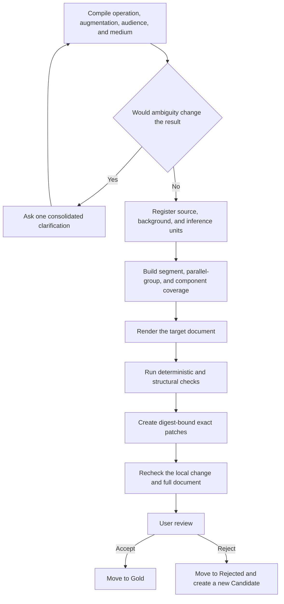

<h1 align="center">AIALRA Verifiable Chinese Writing</h1>

<strong>Preserve source information, track explanatory additions, and generate Chinese that remains readable, auditable, and locally repairable</strong>

<strong>Status: round-four user decisions are recorded and five new revisions await manual review</strong>

  <a href="evals/reviews/vnext-1.1-round-5-REVIEW-PACKET.md">5 revised candidates</a> ·
  <a href="docs/design/vnext-1.1-authoritative-plan.md">Authoritative design</a> ·
  <a href="README.md">简体中文</a>

This repository maintains the `human-readable-technical-writing` Codex Skill; vNext 1.1 separates the base writing operation from the permitted explanatory augmentation, while tracking source statements, user-supplied facts, external background, and inferences independently

## 1. Purpose

The system protects five boundaries:

* Source completeness for transformations and translations
* Explicit provenance for definitions, mechanisms, examples, and inferences
* Readable structures for terminology, parallel groups, images, tables, and code
* Minimal, digest-bound repairs instead of full-document regeneration
* User authority over Gold and Rejected examples

Facts, conditions, scope, quantities, provenance, and source completeness are hard boundaries; tone and ordinary narrative choices are calibrated through user-reviewed examples

## 2. Processing Flow

Figure 2.1. vNext 1.1 processing flow from task compilation to user review

Automated checks may produce a review packet; only explicit user acceptance may promote a Candidate to Gold

## 3. Task Model

Each task combines two independent dimensions:

* Base operation: `TRANSFORM`, `TRANSLATE`, `COMPRESS`, `EXPLAIN`, `GENERATE`, or `FORMAT_ONLY`
* Explanatory augmentation: `NONE`, `GLOSS`, `EXPLANATORY`, `TEACHING`, or `RESEARCHED`

`TRANSLATE + EXPLANATORY` preserves all source information while adding separately sourced background needed by the target reader

## 4. Round-Five Finalization Changes

The current candidate adds five general mechanisms:

* Complete first-use contracts for professional terms, including official names, definitions, name rationale, present role, and impact
* Indented lists for Agent-declared parallel groups, regardless of whether a colon appears
* GitHub render evidence at 1280-pixel and 390-pixel viewports in light and dark themes
* Per-statement code coverage through legal comments or independently locatable line-by-line explanations
* Same-line comments aligned after the longest commentable code line in each block, with line-by-line fallback for JSON and other non-commentable formats
* AEMP content-sufficiency routing for reader tasks, first-screen information, evidence binding, three-layer drill-down, and deletion testing
* Removal of superseded requirements unless history, audit, evidence, or revocation context explicitly requires them

The official lowercase `npm` form is preserved; authored prose explains it as the package-management client and package registry used by the Node.js ecosystem, without inventing `Node.js Package Manager` as an expansion

## 5. Verification

The current local evidence is:

* Deterministic fixtures: 236/236
* Context fixtures: 32/32
* Lifecycle records: 62/62, comprising 27 Gold, 30 Rejected, and 5 Candidate records
* Exact patch tests: 18/18
* Runtime tests: 30/30
* Trigger matrix: 72/72 isolated tasks passed on fixed `gpt-5.6-sol`; raw bodies remain in a local private report and the repository stores only digests, event summaries, counts, and deidentified conclusions
* Original forward-round acceptance: 8/20, or 40%

The 8/20 result is permanent evidence from the first unseen round; revised answers do not replace that score

## 6. Manual Review

The [round-five review packet](evals/reviews/vnext-1.1-round-5-REVIEW-PACKET.md) contains `CANDIDATE-03-R6` and four `CANDIDATE-FWD-R1-*-R3` answers

No new forward round will be generated until all five revised candidates are explicitly accepted; release then requires two consecutive unseen rounds at 20/20 unchanged user acceptance with zero hard factual, scope, provenance, quantity, or source-coverage errors

The [round-four implementation audit](docs/audits/2026-08-31-vnext-1.1-round-4/audit.md) records migration provenance, explicit decisions, counts, and the remaining release gates

## 7. Repository Structure

The active implementation is divided into focused directories:

* `constitution/` stores source, provenance, rule-level, and user-review boundaries
* `runtime/` stores task compilation, source understanding, content blueprints, rendering, verification, and repair
* `contracts/` stores JSON Schema definitions for tasks, mappings, patches, lifecycle records, and forward reports
* `profiles/` stores operations, augmentation levels, media, components, and the Lucas profile
* `registries/` stores terms, units, and protected patterns
* `validators/` stores deterministic, contextual, and advisory checks
* `patcher/` stores conflict detection, transaction validation, and the deterministic committer
* `evals/` separates Candidate, Gold, Rejected, deterministic, and forward-test evidence

## 8. Privacy

The public repository stores synthetic cases, deidentified technical feedback, repository-relative paths, and public references only

The following content is prohibited:

* Raw conversations, account data, and personal absolute paths
* Tokens, passwords, cookies, private keys, and connection strings
* Unredacted images, unexplained remote image requests, and active SVG content
* Unsourced additions presented as facts

## 9. Release Boundary

`main` remains frozen, the candidate Skill is not installed, and no pull request is created

## 10. License

The repository uses the [MIT License](LICENSE); third-party method and license notices are recorded in [THIRD_PARTY_NOTICES.md](THIRD_PARTY_NOTICES.md)
