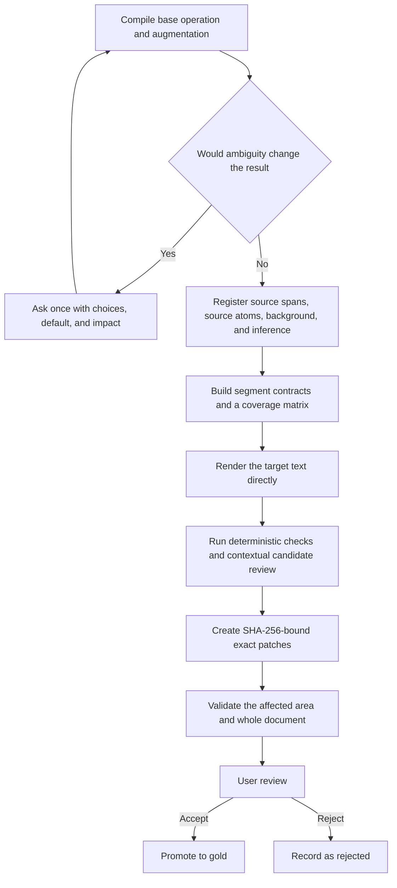

<div align="center">

<h1 align="center">AIALRA Verifiable Chinese Writing</h1>

<p><strong>Preserve every source claim, track explanatory additions separately, and render Chinese for a real reader</strong></p>

<p><strong>Status: vNext 1.1 candidate awaiting user review</strong></p>

<p>
  <a href="docs/design/vnext-1.1-authoritative-plan.md">Authoritative design</a> ·
  <a href="evals/candidate/REVIEW-PACKET.md">Review 12 candidate anchors</a> ·
  <a href="constitution/principles.md">Principles</a> ·
  <a href="README.md">简体中文</a>
</p>

</div>

This repository maintains the `human-readable-technical-writing` Codex Skill. vNext 1.1 models each task as a base operation plus an augmentation level, then tracks source claims, user-supplied facts, external background, and inference separately.

The candidate branch contains the constitution, structural contracts, task profiles, exact-patch foundation, and 12 candidate anchors. The user has not reviewed those answers yet, so none of them are gold examples and the candidate has not been installed as a released Skill.

## 1. Problem and scope

Ordinary rewriting can preserve only the gist. Ordinary explanation can change emphasis, reorder content, or add unsupported conclusions. vNext 1.1 protects two independent requirements:

- Source completeness: rewriting and translation retain every source item that carries information.
- Explanatory provenance: background, definitions, mechanisms, examples, and inference are tracked separately from the source.

The system does not impose one universal writing style. It makes provenance, coverage, location, repair scope, and human acceptance inspectable.

## 2. Architecture



Figure 2.1 vNext 1.1 path from task compilation to user-approved gold examples

## 3. Task model

| Dimension | Values | Decision |
| --- | --- | --- |
| Base operation | `TRANSFORM`, `TRANSLATE`, `COMPRESS`, `EXPLAIN`, `GENERATE`, `FORMAT_ONLY` | What to do with the source material |
| Augmentation | `NONE`, `GLOSS`, `EXPLANATORY`, `TEACHING`, `RESEARCHED` | How much explanation outside the source may be added |

Table 3.1 Independent task dimensions

Common combinations include:

- Faithful rewrite: `TRANSFORM + NONE`.
- Glossed rewrite: `TRANSFORM + GLOSS`.
- Explanatory translation: `TRANSLATE + EXPLANATORY`.
- Teaching rewrite: `TRANSFORM + TEACHING`.

## 4. Provenance and coverage

The intermediate representation separates four provenance types:

- `SOURCE`: directly stated by the source and linked to a source location.
- `USER_SUPPLIED`: provided by the user for the current task.
- `EXTERNAL_BACKGROUND`: added to support understanding and linked to a reference.
- `INFERENCE`: derived from registered material with confidence preserved.

Rewrite and translation tasks measure source coverage and added-claim provenance coverage separately. Both targets are `100%`; extra explanation cannot compensate for missing source information.

## 5. Rule levels

| Level | Authority | Failure behavior |
| --- | --- | --- |
| `MACHINE_FINAL` | Deterministic code | Block immediately |
| `MACHINE_CANDIDATE` | Agent or user in context | Confirm, reject as a false positive, or request a decision |
| `PROFILE_REQUIRED` | Active task or user profile | Block for this contract |
| `ADVISORY` | User preference | Optimize without blocking |

Table 5.1 Rule levels and enforcement

Ordinary words, fixed sentence-length limits, common word order, and a universal section template are not machine-final rules. Changes to facts, conditions, scope, quantities, provenance, and source completeness remain blocking defects.

## 6. Exact patches

The committer accepts only literal replacements bound to the current document digest. Before writing, it checks:

- Document SHA-256.
- Authorized node range.
- Expected old-text occurrence count.
- Patch overlap.
- Local and whole-document validators.

Any failure rejects the complete batch and leaves the original file unchanged.

## 7. Candidate anchors

The first 12 candidates cover:

- Two faithful rewrites.
- Two glossed rewrites.
- Two explanatory translations.
- Two teaching rewrites.
- One image, table, code, and multi-turn example each.

Every case has `status: candidate` and `approved_by_user: false`. Use the [candidate review packet](evals/candidate/REVIEW-PACKET.md) to accept, reject, or request changes for each case.

## 8. Candidate validation

The validation commands require Python 3.12 or a compatible version, plus `jsonschema` and `PyYAML`.

```powershell
python scripts/validate_vnext_foundation.py # Validate the authority digest, 11 schemas, grouped YAML, 12 candidates, structured examples, and privacy patterns

python -m unittest discover -s tests -p 'test_deterministic_committer.py' -v # Test digest, range, count, conflict, rollback, and atomic-write behavior

python scripts/build_candidate_review_packet.py # Regenerate the human review packet from structured candidate cases
```

Current candidate baseline:

- Foundation validation passed across 11 schemas, 13 grouped YAML files, 12 candidates, 2 structured examples, 19 Skill resources, 10 local links, 1 SVG asset, and 108 public files.
- The exact committer passed 10 of 10 tests covering accepted replacement, missing authorization, and all currently implemented rejection paths.

These results establish deterministic candidate consistency. They do not prove user preference and cannot promote candidates to gold.

## 9. Repository map

| Directory | Responsibility |
| --- | --- |
| `constitution/` | Source priority, provenance, rule levels, and user-gold boundary |
| `runtime/` | Task compilation, clarification, source understanding, blueprinting, constrained rendering, and repair |
| `contracts/` | JSON Schemas for tasks, provenance, segments, support, findings, patches, and candidates |
| `profiles/` | Operations, augmentation, genres, media, audiences, components, and Lucas preferences |
| `registries/` | Terms, units, and protected patterns |
| `validators/` | Deterministic, contextual-candidate, and advisory checks |
| `patcher/` | Patch planning, conflicts, transaction validation, and exact commits |
| `evals/` | Candidate, gold, rejected, hidden, and component cases |

Table 9.1 vNext 1.1 directory responsibilities

Read the [authoritative vNext 1.1 plan](docs/design/vnext-1.1-authoritative-plan.md) for the complete design and the [migration map](docs/migration/current-to-vnext-1.1.md) for decisions about retained, downgraded, and replaced rules.

## 10. Privacy and security

- Do not scan complete local conversations.
- Do not store accounts, tokens, private paths, or raw sessions.
- Candidate cases use synthetic material and repository-local assets.
- The SVG candidate image contains no scripts, event handlers, or remote references.
- Run the independent GitHub publication safety gate before pushing.

If a real secret has reached a remote, stop routine updates, rotate the credential, and follow an incident cleanup process.

## 11. Current limit and next stage

This version stops at the first user-review gate. It does not yet contain user-approved gold cases, user-rejected cases, the gold-calibrated full runtime, or the planned expanded evaluation sets.

The project stops here because implementing more validators before the user approves representative answers would turn model preferences into the optimization target again.

## 12. License

The repository uses the [MIT License](LICENSE). Third-party methods and copied material are recorded in [THIRD_PARTY_NOTICES.md](THIRD_PARTY_NOTICES.md).
