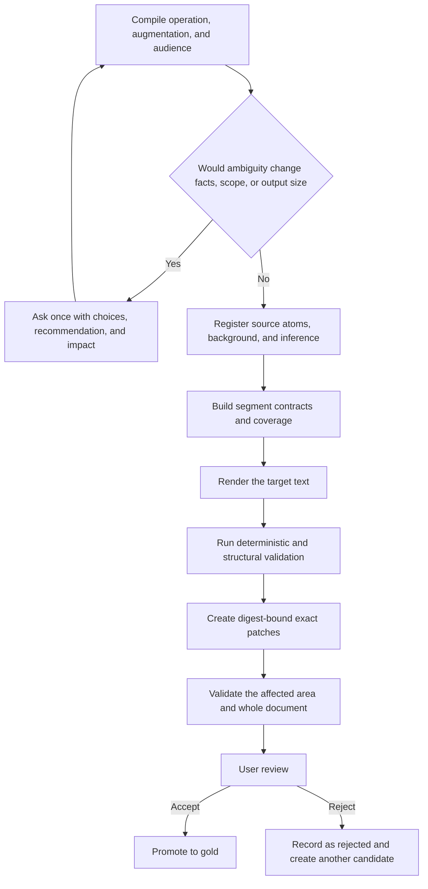

<div align="center">

<h1 align="center">AIALRA Verifiable Chinese Writing</h1>

<p><strong>Preserve complete source information, track explanatory additions separately, and produce Chinese that can be read, audited, and repaired locally</strong></p>

<p><strong>Status: vNext 1.1 runtime candidate awaiting second-round user review</strong></p>

<p>
  <a href="evals/candidate/REVIEW-PACKET.md">Round-two review packet</a> ·
  <a href="docs/design/vnext-1.1-authoritative-plan.md">Authoritative design</a> ·
  <a href="docs/audits/2026-08-30-vnext-1.1-round-1/audit.md">Implementation audit</a> ·
  <a href="README.md">简体中文</a>
</p>

</div>

This repository maintains the `human-readable-technical-writing` Codex Skill. vNext 1.1 models each task as a base operation plus an augmentation level, then records source claims, user-supplied facts, external background, and inference separately.

The first manual review produced two gold and ten rejected cases. Those ten rejected cases now have R2 revisions, but each revision remains a candidate until the user reviews it again.

## 1. Problem and scope

Ordinary rewriting can preserve only the gist. Ordinary explanation can add unsupported background or present an explanatory addition as the source author's conclusion.

vNext 1.1 protects four requirements:

- Source completeness: every source item that carries information remains represented.
- Explanatory provenance: definitions, mechanisms, examples, and inference are tracked separately.
- Bounded repair: a defect in a phrase or segment does not authorize whole-document regeneration.
- User authority: model scores cannot promote a candidate to gold.

The system does not impose a universal Chinese style. Facts, conditions, scope, quantities, provenance, and source completeness are hard boundaries; tone and ordinary narrative order are calibrated through user-approved gold examples.

## 2. Processing path



Figure 2.1 vNext 1.1 path from task compilation to user-approved gold

The first half protects provenance and coverage. The second half makes deterministic defects locatable and reversible. Automated checks can create a review packet, but only an explicit user decision can create gold.

## 3. Task contract

| Dimension | Values | Decision |
| --- | --- | --- |
| Base operation | `TRANSFORM`, `TRANSLATE`, `COMPRESS`, `EXPLAIN`, `GENERATE`, `FORMAT_ONLY` | What to do with the source material |
| Augmentation | `NONE`, `GLOSS`, `EXPLANATORY`, `TEACHING`, `RESEARCHED` | How much explanation outside the source may be added |

Table 3.1 Independent task dimensions

For example, `TRANSLATE + EXPLANATORY` means complete translation plus the background and mechanism needed to understand the source. Additions retain separate provenance and cannot compensate for omitted source content.

## 4. Provenance and coverage

The intermediate representation distinguishes:

- `SOURCE`: directly stated by the source and linked to its location.
- `USER_SUPPLIED`: supplied by the user for the active task.
- `EXTERNAL_BACKGROUND`: added for understanding and linked to a reference.
- `INFERENCE`: derived from registered material with evidence and confidence retained.

The ten R2 cases currently map 35 of 35 source atoms and 35 of 35 background atoms. This proves structural allocation only; it does not prove that the user accepts the wording.

## 5. Executable runtime

The local entry point provides:

- `compile`: fill deterministic defaults and validate a task contract.
- `verify`: check provenance, segments, terms, components, support maps, and evidence boundaries.
- `repair`: validate an exact patch and perform the smallest authorized replacement.
- `report`: return `PASS`, `FAIL`, or `REVIEW_REQUIRED` with cause, impact, and next action.

```powershell
python scripts/run_vnext.py --help # List compile, verify, repair, and report without changing a file
```

The runtime does not infer arbitrary natural-language meaning. The Agent builds the semantic model; deterministic code checks structure, references, coverage, and exact edits.

## 6. Validation

Use Python 3.12 or a compatible version with `jsonschema` and `PyYAML`.

```powershell
python scripts/validate_vnext_foundation.py # Check the authority digest, contracts, grouped YAML, links, SVG, and public-file privacy patterns

python scripts/run_vnext_fixtures.py # Execute all 160 deterministic positive and negative cases

python scripts/validate_vnext_round2.py # Check 22 lifecycle records, ten rejected regressions, ten R2 candidates, and complete mappings

python -m unittest discover -s tests -p "test_deterministic_committer.py" -v # Execute 18 digest, range, conflict, rollback, and atomic-write tests

python -m unittest discover -s tests -p "test_vnext_runtime.py" -v # Execute six compile, verify, repair, and report tests

python scripts/build_candidate_review_packet.py # Regenerate the ten-case manual review packet
```

Current local evidence:

- 160 of 160 deterministic fixtures match their reviewed expectations.
- All 22 lifecycle records are valid.
- Ten of ten rejected answers trigger their case-specific regression lock, while all ten R2 answers have zero registered hard defects.
- All 18 exact-patch tests and all six runtime tests pass.

These numbers do not constitute user acceptance.

## 7. Repository map

| Directory | Responsibility |
| --- | --- |
| `constitution/` | Source priority, provenance, rule levels, and user-gold boundary |
| `runtime/` | Task compilation, source understanding, blueprinting, rendering, validation, and repair |
| `contracts/` | Schemas for tasks, provenance, segments, support, findings, patches, and lifecycle cases |
| `profiles/` | Operations, augmentation, genres, media, audiences, components, and Lucas preferences |
| `registries/` | Terms, units, and protected patterns |
| `validators/` | Deterministic rules, contextual candidates, and advisory checks |
| `patcher/` | Patch planning, conflict handling, transaction validation, and exact commits |
| `evals/` | Candidate, gold, rejected, and deterministic cases |

Table 7.1 vNext 1.1 directory responsibilities

Read the [authoritative design](docs/design/vnext-1.1-authoritative-plan.md) for the complete model and the [implementation audit](docs/audits/2026-08-30-vnext-1.1-round-1/audit.md) for evidence, gaps, and re-review conditions.

## 8. Privacy and security

The public repository stores synthetic cases, redacted technical feedback, repository-relative paths, and public references. It does not store raw conversations, account data, personal absolute paths, credentials, or unreviewed screenshots.

An independent publication safety gate runs before every remote push. If a real secret reaches a remote, routine updates stop until the credential is rotated and the incident process addresses history.

## 9. Current boundary and next step

`main` remains frozen during second-round review, and the candidate Skill is not installed into the active user Skill directory.

The next step is to review the [ten R2 candidates](evals/candidate/REVIEW-PACKET.md). Only ten explicit acceptances can convert the first anchor set into 12 gold cases and permit the formal-branch, installation, and fresh-task activation stages.

## 10. License

The repository uses the [MIT License](LICENSE). Third-party methods and copied material are listed in [THIRD_PARTY_NOTICES.md](THIRD_PARTY_NOTICES.md).
