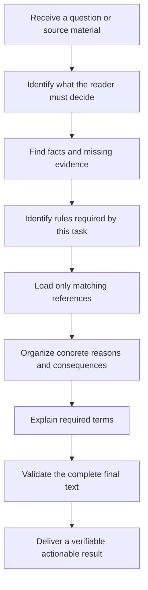

<div align="center">

<h1>Human-Readable Technical Chinese for Agents</h1>

<p><strong>Help an Agent produce Chinese technical content that a first-time reader can understand, verify, and act on</strong></p>

<p>
  <a href=".github/workflows/quality.yml"></a>
  <a href="LICENSE"></a>
  <a href="scripts/Test-HumanReadableChinese.Tests.ps1"></a>
  <a href="QA-CASES.md"></a>
  <a href="#privacy-boundary"></a>
</p>

<p>
  <a href="#rewrite-effect">Rewrite effect</a> ·
  <a href="#get-started">Get started</a> ·
  <a href="#processing-workflow">Workflow</a> ·
  <a href="QA-CASES.md">Complete cases</a> ·
  <a href="references/style-rules.md">Detailed rules</a> ·
  <a href="#quality-validation">Quality validation</a>
</p>

<p><a href="README.md">简体中文</a> · <a href="README.en.md">English</a></p>

</div>

An Agent generates or edits content according to the user's instructions

When the Agent uses internal names directly and assumes that the reader already knows them, a first-time reader cannot determine the actual result

This Skill first identifies what the reader must decide, and then explains facts and next actions in ordinary Chinese

The reader does not need project history in advance and does not need to guess which action an internal state allows

<a id="rewrite-effect"></a>

## 1 Rewrite effect

A good rewrite lets an unfamiliar reader identify completion scope, evidence boundaries, practical risk, and the next action

Replacing `FLOW_VALIDATED` with “the flow was validated” still leaves those questions unanswered

The same chip-verification record below shows the difference

### 1.1 Original output

> `S01-F` entered `FLOW_VALIDATED`
>
> `strict ImplementationGate` passed, and both `DRC` and `CDC` are `clean`
>
> `HostCompletion V5` remains `NOT_RELEASED`

The original keeps internal names but does not say which part finished, what the checks prove, or why release remains blocked

The reader cannot decide whether the project is complete or the product can ship

### 1.2 Rewritten output

> `S01-F` is the internal identifier for this chip-verification stage
>
> The project records the current state as `FLOW_VALIDATED`; this state means the software implementation flow and mandatory checks are complete, but it closes only the software flow
>
> The `strict ImplementationGate`, or Strict Implementation Gate, passed; it requires all mandatory checks to pass, and any failure blocks this result from delivery
>
> The final log also records two checks
>
> - `DRC`, the Design Rule Check, found no routing or layout rule violation
> - `CDC`, the Clock Domain Crossing check, found no known signal-stability risk between clock domains
>
> Both checks left reproducible records, so the software implementation result has reviewable pass evidence
>
> `HostCompletion V5` is the project host-completion record; `NOT_RELEASED` means the physical board has not completed runtime testing, so current evidence does not permit product release
>
> The project owner may archive this software flow and its check evidence; the board owner must complete physical-board testing and decide whether release may proceed

The rewrite turns internal states into reader decisions

<div align="center">

表 1.1 Table 1.1 Decision information produced by the rewrite

| Reader question | Information supplied after the rewrite |
|---|---|
| Which part is complete | The chip software implementation flow is complete |
| Where the pass conclusion comes from | The final log records implementation and mandatory checks |
| What current evidence proves | The software result has reproducible pass evidence |
| What current evidence does not prove | Stable physical-board operation remains unverified |
| Who owns the next action | The project owner archives software evidence and the board owner runs physical testing |

</div>

A real rewrite supplies evidence, boundaries, ownership, and action so the reader can decide and proceed

## 2 Writing rules

The Skill organizes its requirements into `21` mechanically and manually reviewable rules

### 2.1 Preserve and explain formal terms

Keep formal terms, abbreviations, and internal names so readers can search logs, verify configuration, and communicate with specialists

At the first appearance in one continuous document, explain naturally what the term is, why it matters, and what happens when it fails

### 2.2 Support judgments with facts

Every decision, risk, restriction, and recommendation needs nearby evidence or a concrete reason

Do not invent a cause, result, number, or responsibility that the source material does not provide

### 2.3 Separate parallel content

Place independently understandable facts, causes, objects, and actions on separate lines

Keep a short label and its value on one line when they belong to the same logical frame

### 2.4 Pair conditions with outcomes

Each condition branch must identify its own result and next action

Use indentation when one condition has multiple subordinate results

### 2.5 Separate completion boundaries

State what completed, what remains incomplete, what current evidence proves, and which owner acts next

Do not let one successful check imply completion of a wider product or release stage

### 2.6 Make code readable to a first-time reader

Annotate every user-visible code sample

Comment independent statements inline and introduce each continuous logic block before the block begins

### 2.7 Present processes in reading order

Show the flow from concrete input or evidence to consequence, conclusion, and action

Prefer top-to-bottom Mermaid diagrams for multi-step relationships

### 2.8 Use stable decimal section numbering

Number multi-section documents from `1` and use decimal hierarchy such as `2.1` and `2.1.1`

Keep the hierarchy consistent throughout the document

### 2.9 Make procedures explicit

Chinese procedures use `第一步`, `第二步`, and later ordinals with a blank line between top-level steps

Every step states its operator, purpose, prerequisite, success result, and failure handling when those details matter

### 2.10 Break lines by logic

Use a new line when the subject, evidence role, consequence, or action changes

Do not split short labels mechanically or compress unrelated statements into one line

### 2.11 State ownership

Attach versions, states, limits, deadlines, and results to the exact project, component, test, or record they describe

Repeat the noun when several possible referents exist

### 2.12 Deliver content in the body

The final document contains verified content, evidence gaps, and ownership

It excludes editing-progress narration, placeholders, and promises to fill a section later unless the user explicitly requests an editing-status report

### 2.13 Keep subjects explicit

Use subject, action or state, and result as the default order

When the subject changes, name the new subject in the sentence where the change occurs

### 2.14 Give numbers a source

For every business number, measurement, threshold, configuration value, prediction, or estimate, state whether it comes from a cited record, calculation, application, user input, or experience

Mark an unverified number as requiring source confirmation and do not present it as established fact

### 2.15 Number tables and figures

Number tables and figures independently within their first-level section

Put a table title above the table and a figure caption below the figure

### 2.16 Center visual material together

Center a table, image, or Mermaid diagram with its title or caption as one visual unit

Keep supplemental information under a `Note:` line

### 2.17 Use sequential references

Use Institute of Electrical and Electronics Engineers (IEEE) sequential numbering

Cite sources as `[1]`, `[2]`, and later numbers in the order of first appearance, then provide matching entries at the end

### 2.18 Keep negation direct

Avoid double negatives and negative-first rhetorical contrasts

Use a direct positive statement or one simple negative statement

### 2.19 Prefer Arabic numerals for exact quantities

Use Arabic numerals for exact counts, measurements, dates, durations, currency, percentages, and thresholds

Keep Chinese ordinals for procedural steps and preserve official names or verbatim evidence

### 2.20 Preserve official native names

When a product, software item, model, or unit has no established Chinese name, retain its official name and follow it with a natural Chinese explanation

Do not invent a rigid transliteration

### 2.21 Show relational calculations

When a number is expanded, aggregated, deduplicated, or converted from other numbers, show the inputs, relation, substituted formula, and result

For example, expanding `74` multi-channel objects into `179` objects requires the channel counts and the sum:

$$
179 = 19 \times 1 + 20 \times 2 + 20 \times 3 + 15 \times 4
$$

A mebibyte, abbreviated MiB, uses `1024^2` bytes as one binary capacity unit

Converting `8,605,650` valid bits into `1.026 MiB` requires division by `8` and then by `1024^2`:

$$
1.026\ \mathrm{MiB} \approx \frac{8{,}605{,}650}{8 \times 1024^2}
$$

An aggregate such as `45` shapes also needs a field definition, inclusion scope, exclusions, and deduplication method

<a id="get-started"></a>

## 3 Get started

Clone the repository into the personal Skill directory:

```powershell
git clone https://github.com/AIALRA-0/agent-human-readable-technical-writing.git "$HOME\.codex\skills\human-readable-technical-writing" # Download the Skill under its stable internal name
Copy-Item "$HOME\.codex\skills\human-readable-technical-writing\AGENTS.example.md" "$HOME\.codex\AGENTS.example.md" # Copy the rule template without overwriting an active personal configuration
```

If the personal configuration already contains `AGENTS.md`, merge the template manually and do not overwrite the existing file

An Agent can load the Skill automatically when it recognizes a Chinese writing task

To invoke it explicitly, begin the request with:

> Use `$human-readable-technical-writing` and follow my Chinese technical-writing rules; load only references required for this task, inspect the complete final text for large tasks, and fix every failure before answering

This instruction loads the core rules and routes only to report, structure, or technical references required by the current task

<a id="processing-workflow"></a>

## 4 Processing workflow

<div align="center">



图 4.1 Figure 4.1 Technical Chinese processing workflow

</div>

The process solves the reader's problem first and then adds formal names and traceable evidence

Technical names remain searchable but no longer carry the explanation by themselves

## 5 Reference routing

The repository separates materials by purpose so an ordinary answer does not load development tests or every long-report rule

<div align="center">

表 5.1 Table 5.1 When each rule source is read

| Source | Load condition | Purpose |
|---|---|---|
| Global rule template | Every Chinese writing task | Retains non-negotiable expression boundaries |
| Core Skill | At the start of a Chinese writing task | Orders causality, makes subjects explicit, and selects references |
| Structured-document rules | Sections, procedures, branches, tables, figures, flows, or citations appear | Standardizes hierarchy, numbering, captions, and references |
| Technical-content rules | Terms, internal names, numbers, formulas, or code appear | Preserves traceable names and adds explanations and provenance |
| Complex-report rules | Reports, audits, retrospectives, or handoffs are written | Controls long-form narrative, evidence boundaries, and full-text validation |
| Detailed positive and negative examples | A user reports a problem or rules conflict | Resolves edge cases and disputed styles |
| Skill-development tests | The Skill, checker, cases, or quality process changes | Verifies rules, complete answers, and repository consistency |

</div>

Adding development cases does not increase the context required by every ordinary answer because routing remains conditional

## 6 Complete cases

[QA-CASES.md](QA-CASES.md) publishes `51` complete questions and answers so readers can judge naturalness, clarity, and evidence sufficiency directly

It presents new relational-number, Arabic-numeral, and native-name cases first, followed by `49` historical regression cases

The cases cover five response sizes, from very short answers through complete reports

They also cover ordinary questions, angry challenges, urgent procedures, disorganized source cleanup, professional review, beginner explanation, tables, formulas, code review, procedural steps, figure numbering, sequential citations, chip-design reports, handoffs, responsibility clarification, numeric provenance, cold-chain evidence, disaster-recovery terminology, visual-material layout, publication captions, precise verbs, engineering retrospectives, evidence boundaries, owner-grouped actions, and removal of editing-process narration

Short answers and long reports expose different failures, so both remain in the suite

<a id="quality-validation"></a>

## 7 Quality validation

The current version must pass both rule-pair tests and complete-answer evaluation

Rule-pair tests confirm that correct writing is accepted and known mechanical failures are detected

Hard errors include Chinese full stops, terminal Chinese semicolons, field-label definitions, compressed parallel content, unindented branches, unsupported conclusions, unannotated code, incorrectly annotated independent statements, malformed formulas, missing decimal section numbers, malformed procedural steps, missing or misplaced captions, uncentered visual units, question-form headings in non-question content, non-sequential citations, double negatives, mechanically split labels, ownerless versions, ambiguous pronouns, ownerless delivery actions, unsourced business numbers, weak nominalized verbs, deeply nested sentences, repeated defensive scope statements, editing-progress narration, empty introductions, Chinese-written exact counts, and relational numbers without reproducible calculations

Whether an English term needs explanation depends on the entire document, so the checker reports those findings as manual warnings

An official native name followed by a natural Chinese explanation is accepted without an invented transliteration

The complete-answer suite tests multiple lengths, scenarios, tones, readers, tasks, and structures

According to the current repository test scripts and generated cases, the public suite contains:

- `172` positive and negative rule tests
- `51` complete question and answer tests
- `24` original-term preservation tests
- `5` response lengths
- `51` content directions
- `34` tones
- `38` target-reader types
- `41` task types
- `40` content structures

Run the complete quality chain:

```powershell
pwsh -NoProfile -File ".\scripts\Test-HumanReadableChinese.Tests.ps1" # Run 172 positive and negative rule tests
pwsh -NoProfile -File ".\evals\Invoke-QualityEvaluation.20260729.ps1" # Run 51 complete-answer evaluations
pwsh -NoProfile -File ".\scripts\Export-QualityCases.ps1" # Regenerate case documentation from passing results
pwsh -NoProfile -File ".\scripts\Test-RepositoryContent.ps1" # Check public documents case synchronization and relative links
pwsh -NoProfile -File ".\scripts\Measure-SkillBehavior.ps1" -SkillRoot "." -OutputPath "<private-path-outside-repository>" -AuthPath "<Codex-auth-file>" -CodexExecutable "<current-Codex-executable>" # Compare the no-Skill baseline with the current Skill in isolated fresh tasks
```

The live behavior evaluation uses synthetic prompts only; keep its report outside the repository and replace the authentication and executable placeholders with local values

Automated validation finds mechanically identifiable writing problems but cannot prove that source facts are correct

Important reports still require human comparison with primary evidence and a check that conclusions stay within the evidence boundary

## 8 File map

<div align="center">

表 8.1 Table 8.1 Repository file responsibilities

| Path | Content |
|---|---|
| `SKILL.md` | Core rules loaded when an Agent starts writing |
| `AGENTS.example.md` | Global-rule template for a personal configuration |
| `references/structured-documents.md` | Sections, steps, branches, tables, figures, flows, and citations |
| `references/technical-content.md` | Terms, internal names, numbers, formulas, and code |
| `references/complex-reports.md` | Reports, audits, retrospectives, and handoffs |
| `references/style-rules.md` | Detailed positive and negative examples for disputed cases |
| `references/quality-development.md` | Quality process loaded only when the Skill changes |
| `scripts/Test-HumanReadableChinese.ps1` | Checker for mechanically detectable writing problems |
| `scripts/Test-HumanReadableChinese.Tests.ps1` | Positive and negative checker tests |
| `scripts/Measure-SkillBehavior.ps1` | Isolated Sol evaluation for output quality activation false positives and response length |
| `scripts/Export-QualityCases.ps1` | Generator for the complete-case document |
| `scripts/Test-RepositoryContent.ps1` | Public-document, case-sync, and relative-link validation |
| `evals/Invoke-QualityEvaluation.20260729.ps1` | Multi-domain complete answers and sample-difference requirements |
| `QA-CASES.md` | All public questions and complete answers |

</div>

The separation retains test evidence while avoiding irrelevant context in ordinary tasks

<a id="privacy-boundary"></a>

## 9 Privacy boundary

The repository collects no usage data

It does not read private projects proactively and does not send answer content to an external service

Public cases use generic or synthetic scenarios and exclude:

- Secrets
- Access tokens
- Server addresses
- Personal email addresses
- Private project paths
- Customer data

The pre-publication sensitive-data scan reported no match

Writing rules reduce accidental exposure of internal names but do not replace a human redaction review before publication

## 10 Contribute an improvement

An issue should include the original question, the unsatisfactory answer, and what a first-time reader must ultimately understand or do

A new rule also requires one correct case and one incorrect case

The pair demonstrates that the rule fixes a real failure while reducing regression risk for other writing scenarios

## 11 Roadmap

- Add paired tests for converting English technical source material into Chinese
- Add longer multi-file project reports
- Record how many follow-up questions real readers still need to ask
- Add optional hover explanations for terms
- Provide installation templates for more agent environments

## 12 Current status

The current repository can be used as a personal writing Skill, and all public tests pass

Those tests show stable execution of current writing rules but do not guarantee that input facts are correct and do not replace professional judgment

## 13 License

The repository uses the [MIT License](LICENSE)

Others may use, modify, and redistribute the project while retaining the license notice

## 14 Reference

[1] IEEE, “IEEE Editorial Style Manual for Authors,” 2025. [Online]. Available: https://journals.ieeeauthorcenter.ieee.org/wp-content/uploads/sites/7/IEEE-Editorial-Style-Manual-for-Authors.pdf
