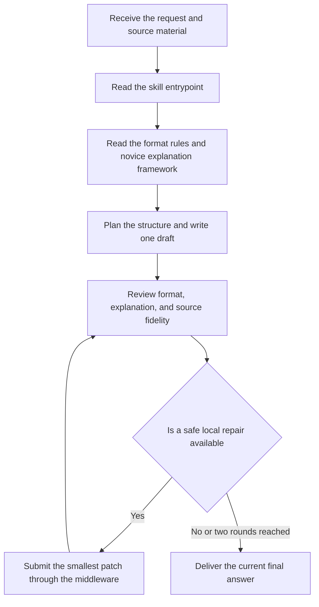

<div align="center">

<h1>AIALRA Verifiable Chinese Writing</h1>

<p><strong>Help coding agents follow stable Chinese formatting rules and explain unfamiliar technical material to first-time readers</strong></p>

<p>Current path: lightweight writing guidance · optional local review · user-controlled acceptance</p>

<p>
  <a href="README.md">简体中文</a> ·
  <a href="SKILL.md">Skill entrypoint</a> ·
  <a href="#2-get-started">Get started</a> ·
  <a href="#6-validation-scope-and-limitations">Validation scope</a>
</p>

</div>

This repository maintains an installable Chinese writing skill

It first constrains punctuation, headings, lists, terminology, code, formulas, images, and tables, then applies a novice-oriented explanation framework that supplies the prerequisites, reasons, process, outcomes, and conditions needed to continue

Ordinary use reads one entrypoint and two core rule files; it does not require another agent, model voting, or the full evaluation system

## 1 Purpose

The skill addresses two recurring failures

- Unstable formatting
  - Ordinary Chinese prose does not use Chinese full stops
  - Independent parallel items are separated and indented by semantic level
  - Terminology, bilingual naming, code comments, formulas, images, and tables use consistent, reviewable structures
- Explanations that assume prior knowledge
  - Education, occupation, or earlier exposure to a term is not treated as proof of background knowledge
  - Every key object explains what it is, why it is needed, how it works, what result it produces, and when it does not apply
  - Source facts, conditions, quantities, negations, scope, and provenance remain intact when explanatory material is added

The skill is intended for Chinese answers, transformations, explanatory translations, technical instructions, status reports, and mixed-media documents

It does not automatically apply Chinese prose rules to code-only, data-only, numeric-only, or explicitly non-Chinese output

## 2 Get started

### 2.1 Ask a coding agent to install it

Give the following request to an agent that can install skills from a GitHub repository

```text
Install the skill from the repository root of https://github.com/AIALRA-0/agent-human-readable-technical-writing at main, using the name human-readable-technical-writing
```

### 2.2 Install manually

Confirm that the destination does not contain an older copy, then clone the repository into the skills directory of the active Codex home

```powershell
# Clone the latest main branch directly into the active Codex skills directory
git clone --depth 1 https://github.com/AIALRA-0/agent-human-readable-technical-writing.git "$env:CODEX_HOME\skills\human-readable-technical-writing"
```

The skill becomes discoverable in a new task

### 2.3 Invoke it explicitly

Name the skill directly when predictable activation matters

```text
Use $human-readable-technical-writing to explain the following technical material to a first-time reader while preserving every fact, condition, number, and exception
```

An agent may also invoke the skill from its description, but explicit naming makes the intended writing contract clear

## 3 Execution flow

The ordinary path remains lightweight; one agent reads the rules, writes, reviews, and applies local repairs

<div align="center">


```mermaid
flowchart TD
    A[Receive the request and source material] --> B[Read the skill entrypoint]
    B --> C[Read the format rules and novice explanation framework]
    C --> D[Plan the structure and write one draft]
    D --> E[Review format, explanation, and source fidelity]
    E --> F{Is a safe local repair available}
    F -->|Yes| G[Submit the smallest patch through the middleware]
    G --> E
    F -->|No or two rounds reached| H[Deliver the current final answer]
```

<p>Figure 3.1　Ordinary writing flow from request intake to final delivery</p>

</div>

Task contracts, source mappings, strict validators, and forward cases support development, audits, and specialized evaluation; they are not prerequisites for an ordinary answer

## 4 Core rules

### 4.1 Format first

- Ordinary Chinese prose, headings, list items, captions, and explanations outside tables do not use Chinese full stops
- Two or more independent definitions, steps, facts, reasons, comparison targets, or actions are placed on separate lines
- Nested content increases indentation instead of flattening semantic levels
- Multi-topic content uses hierarchical headings, while short single-topic content may omit headings
- Images with figure captions and tables with table captions share centered containers when the target medium supports them
- A wide table scrolls inside its own container rather than overflowing the page

See the complete [top-level format rules](references/format-rules.md)

### 4.2 Teach a first-time reader

- Supply each required prerequisite before using an unfamiliar concept
- Explain the object, input, change, result, and reason behind every key mechanism
- Provide a complete worked example for abstract mechanisms, calculations, or multi-step operations
- Explain conditions, negations, exceptions, scope, and common confusion where they affect use
- Preserve images, tables, code, and logs before explaining how to read them and what they support

See the complete [novice explanation framework](references/explanation-framework.md)

### 4.3 Preserve source information

- Transformations and translations cannot retain only the gist
- Added background cannot masquerade as an author's conclusion
- An unsourced mechanism cannot be stated as established fact
- A local defect changes only the affected character, phrase, sentence, or list item
- Automated checks cannot substitute for user acceptance

## 5 Optional tools

Ordinary writing does not require repository tools

The following entrypoints are available for complex structured material or auditable output

```powershell
# Show the structured-composition input format
python scripts/compose_writing.py --help

# Inspect Chinese formatting and produce locatable findings
python scripts/review_writing.py --help

# Show the strict task-contract, verification, repair, and reporting interfaces
python scripts/run_vnext.py --help
```

These programs verify deterministic structure and exact modifications; they do not claim to prove universal semantic equivalence or complete understanding for every reader

## 6 Validation scope and limitations

The current `main` branch is continuously checked by [GitHub Actions](https://github.com/AIALRA-0/agent-human-readable-technical-writing/actions/workflows/quality.yml)

Evidence registered for the current version covers

- 288 deterministic pass and fail fixtures
- 48 contextual contracts
- 72 trigger-matrix cases
- 8 long-context stress cases
- 371 passing local unit tests, with 1 intentionally skipped
- 21 combined format cases registering all 120 format rules

These results show consistency among the corresponding cases, inventories, and program behavior; they do not guarantee a perfect natural-language result for arbitrary input

The following boundaries remain

- Automated checks do not mean the user accepted the writing style
- Semantic completeness still depends on the source, context, and user feedback
- A medium that cannot reliably center objects or contain table scrolling must state that limitation
- Historical evaluations and manual reviews describe their original version and sample set rather than replacing current hands-on feedback

## 7 Repository map

- [`SKILL.md`](SKILL.md)
  - The only entrypoint required for ordinary tasks
- [`references/format-rules.md`](references/format-rules.md)
  - Punctuation, structure, terminology, code, and visual formatting
- [`references/explanation-framework.md`](references/explanation-framework.md)
  - Novice-oriented explanation logic
- [`runtime/`](runtime)
  - Task compilation, composition, verification, and repair
- [`contracts/`](contracts)
  - Structured task, evidence, patch, and lifecycle contracts
- [`evals/`](evals)
  - Candidate, user-accepted, user-rejected, and automated cases
- [`docs/design/vnext-1.1-authoritative-plan.md`](docs/design/vnext-1.1-authoritative-plan.md)
  - Authoritative design background for `vNext 1.1`

## 8 Help, contribution, and license

- Open an [Issue](https://github.com/AIALRA-0/agent-human-readable-technical-writing/issues) for usage questions and ordinary defects
- Preserve user decisions, provenance boundaries, and minimal-patch behavior when proposing changes
- Do not paste tokens, passwords, private keys, real account data, or internal addresses into public issues
- The repository is available under the [MIT License](LICENSE)
- Third-party methods and licenses are documented in [THIRD_PARTY_NOTICES.md](THIRD_PARTY_NOTICES.md)
