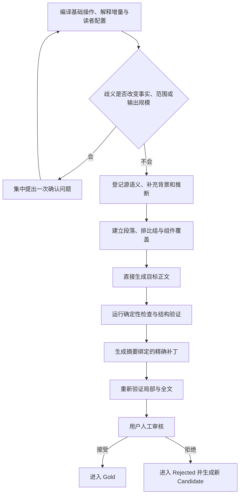

<div align="center">

<h1 align="center">AIALRA 可验证中文写作</h1>

<p><strong>完整保留源信息，分开追踪补充解释，再生成能够阅读、核对和局部修复的中文</strong></p>

<p><strong>当前状态：vNext 1.1 已完成第四轮人工决定落账，5 个新修订候选等待用户审核</strong></p>

<p>
  <a href="evals/reviews/vnext-1.1-round-5-REVIEW-PACKET.md">5 个修订候选</a> ·
  <a href="docs/design/vnext-1.1-authoritative-plan.md">权威设计</a> ·
  <a href="README.en.md">English</a>
</p>

</div>

这个仓库维护 `human-readable-technical-writing` Codex Skill；vNext 1.1 把写作任务拆成基础操作和解释增量，并把原文、用户补充、外部背景与推断分别登记

## 1. 项目解决什么问题

普通改写容易只保留大意；普通解释又可能加入没有来源的背景，甚至把补充内容写成原作者结论

vNext 1.1 同时保护以下内容：

* 源内容完整：改写和翻译保留所有承担信息作用的原文内容
* 补充来源清楚
  * 背景、定义、机制、例子和推断分别登记
* 阅读结构明确
  * 专业名词、排比组、图片、表格和代码分别采用可核对的说明方式
* 修复范围可控：一个词或一段有问题时，只修改对应范围
* 人工决定有效：模型评分不能把 Candidate 候选案例自动改成 Gold 人工接受案例

事实、条件、范围、数值、来源和原文完整性属于硬边界；语气与普通叙述顺序由用户审核案例持续校准

## 2. 当前处理流程

`Mermaid` 是一种使用文本描述流程图和关系图的绘图语法；这里用它展示任务从编译到用户审核的完整顺序，读者可以沿箭头查看每个阶段和返回关系



<p align="center">图 2.1. vNext 1.1 从任务编译到用户审核的处理路径</p>

流程先保证来源、内容覆盖和结构关系，再允许程序执行最小修复；只有用户明确接受的答案才能进入 Gold，自动测试通过只允许生成审核包

## 3. 任务模型

每个任务由两个独立维度组成：

* 基础操作
  * 决定对原始材料执行改写、翻译、压缩、解释、生成或仅排版
  * `TRANSFORM`：同语种改写
  * `TRANSLATE`：跨语种翻译
  * `COMPRESS`：在授权范围内提高信息密度，同时保留必要换行
  * `EXPLAIN`：围绕问题重新组织知识
  * `GENERATE`：根据请求和来源从零成文
  * `FORMAT_ONLY`：只调整结构和版式
* 解释增量：决定允许增加多少帮助理解的内容
  * `NONE`：不增加背景
  * `GLOSS`
    * 解释术语、缩写、符号和局部关系
  * `EXPLANATORY`
    * 增加必要背景、机制、例子和因果说明
  * `TEACHING`：从零先验开始建立完整知识路径
  * `RESEARCHED`：检索外部资料并为新增主张登记来源

`TRANSLATE + EXPLANATORY` 表示完整翻译原文，同时补充理解原文所需的背景；补充解释具有独立来源，不能抵消原文遗漏

## 4. 第四轮收尾约束

本轮根据第一轮未见前向测试增加以下通用能力：

* 专业名词
  * 独立阅读单元首次出现时登记正式中文、官方英文、缩写、定义、名称含义、当前作用和实际影响
  * 无法核对官方写法时进入人工复核
* 排比组
  * 两个以上承担相同作用的定义、步骤、比较对象或事实换行并缩进
  * 是否出现冒号不影响判断
* GitHub 视觉
  * 图片和表格使用居中 HTML，流程图使用原生代码块和居中题注
  * 桌面、移动端、亮色和暗色实际渲染结果决定是否通过
* 代码覆盖
  * 原始代码继续保留；每个有效语句需要合法注释或独立可定位的逐行解释
  * 使用注释时，每个代码块内的注释始终从最长可注释代码行之后的同一列开始，允许对齐增加行宽
  * JSON 等不能合法添加注释的格式使用逐行解释，不伪造注释覆盖
* AEMP 内容充分性
  * 教程、操作、参考、解释、决策、状态、审计和项目变化先登记读者必须理解、看到、决定和验证的内容
  * 复杂内容最多分为三层，重要主张分别绑定证据，并通过删除测试移除不改变理解和行动的噪声
* 多轮替换
  * 追加要求替换旧要求后，只保留当前有效内容
  * 历史、审计、证据核对或撤销说明任务可以明确保留旧要求

`npm` 使用官方小写形式；正文自然说明它是 Node.js 生态使用的包管理客户端和软件包仓库，不把它展开成 `Node.js Package Manager`

## 5. 可执行运行时

本地入口提供以下操作：

* `compile`：填充确定性默认值并验证任务合同
* `verify`
  * 检查来源、段落、术语、排比组、组件、代码单元、多轮替换、支持映射和证据边界
* `repair`：验证精确补丁并执行最小替换
* `report`
  * 输出 `PASS`、`FAIL` 或 `REVIEW_REQUIRED`，同时说明原因、影响和下一步

```powershell
python scripts/run_vnext.py --help # 系统显示 compile、verify、repair 和 report 四个入口；该命令只读取帮助，不修改文件
```

运行时代码不自动猜测任意自然语言含义；Agent 负责建立语义模型，程序负责检查结构、引用、覆盖状态和精确修改

## 6. 当前验证结果

需要 Python `3.12` 或兼容版本，并安装 `jsonschema` 与 `PyYAML`

```powershell
python scripts/validate_vnext_foundation.py # 核对权威计划、合同、YAML 分类、案例、链接、SVG 和公开文件隐私模式

python scripts/run_vnext_fixtures.py # 执行 252 个确定性正反例；预期结果为 252/252

python scripts/validate_vnext_lifecycle.py # 核对 82 个生命周期记录、用户快照、原始前向答案和 20 个第二轮待审首稿

python scripts/validate_context_cases.py # 核对 40 个术语、排比、代码、长上下文、多轮、主语、标点和段落语境案例

python scripts/validate_forward_rounds.py # 核对五档长度、五类受众、七类任务、变化配额和跨轮去重

python scripts/validate_long_context_stress.py # 核对 8 个长上下文真实任务的脱敏发布证据，不写入人工接受

python scripts/validate_trigger_matrix.py --require-results # 核对 72 个真实触发案例、固定模型、脱敏摘要和全部通过结果

python scripts/validate_forward_round1.py # 分别报告原始文件完整性、人工接受率和是否允许生成下一轮

python -m unittest discover -s tests -p "test_deterministic_committer.py" -v # 执行 18 个摘要、范围、冲突、回滚和原子写入测试

python -m unittest discover -s tests -p "test_vnext_runtime.py" -v # 执行 38 个任务编译、长上下文拒绝、精确修复和结果报告测试
```

当前本地结果如下：

* 确定性案例：252/252
  * 新增 16 项覆盖长文元数据、全篇复核、分散锚点、数字归属、术语边界、来源优先级和冲突展示
* 语境案例：40/40
  * 新增 8 项长上下文边界；程序只检查已登记结构，语义判断继续保留给 Agent 或用户
* 生命周期记录：82/82
  * 当前共有 32 个 Gold、30 个 Rejected 和 20 个第二轮 Candidate
* 精确补丁测试：18/18
  * 摘要、位置、出现次数、冲突和事务回滚均有正反测试
* 运行时测试：38/38
  * 任务编译、代码同行对齐、长文锚点、数字归属、术语边界、来源优先级和全篇复核均有可执行测试
* 真实触发矩阵：72/72
  * 三类任务各含 6 个显式触发、6 个隐式触发、6 个负向不触发和 6 个规则遵守案例
  * 固定 `gpt-5.6-sol` 在隔离 Codex 任务中全部符合预期；5 个同行对齐案例均登记确定性辅助器调用事件
  * 原始正文只保存在仓库外私有报告；仓库仅保存正文与事件摘要、分组计数和脱敏结论
* 第一轮前向人工接受：8/20
  * 实际接受率为 40%，原因是 12 个首次答案仍存在术语、结构、居中、代码和内容充分性问题
* 长上下文压力矩阵：8/8
  * 8 项输入为 1312–1585 字，覆盖远距离条件、数字归属、术语一致性、同词异义、来源冲突、表文绑定、代码日志混合和多轮覆盖
  * 原始正文只保存在仓库外；公开报告保留两次评测器误报修订历史，模型没有重跑
* 第二轮前向首稿：20 个待人工审核
  * 五档篇幅和五类受众各 4 个；确定性检查发现 14 项问题，涉及 12 个答案的用户标点配置和 2 个答案未原样保留源代码

自动检查通过不等于风格已经合格；第一轮 8/20 的成绩永久保留，修订版不能替换第一次未见测试结果

## 7. 人工审核入口

[第二轮广覆盖审核包](evals/forward/round-2/REVIEW-PACKET.md)包含 20 个已经一次生成并冻结的首稿；第五轮 5 个修订候选已由用户全部接受，历史审核包继续保留但不再表示待审状态

第二轮每项必须由用户明确接受或拒绝；自动测试、模型评分和压力矩阵都不能写入人工接受字段；只有第二轮首稿 20/20 才形成连续完美轮次 1 并允许生成第三轮，任一拒绝都会永久保留本轮成绩并把连续计数归零

第四轮迁移来源、决定绑定、计数和未完成发布门槛记录在[实施审计](docs/audits/2026-08-31-vnext-1.1-round-4/audit.md)

## 8. 仓库结构

* `constitution/`
  * 保存源信息优先、来源分层、规则等级和用户审核边界
* `runtime/`
  * 保存任务编译、来源理解、内容骨架、成文、验证和修复说明
* `contracts/`
  * 保存任务、来源、支持映射、Finding、Patch、生命周期和前向报告 Schema
* `profiles/`
  * 保存操作、解释增量、文体、媒介、组件和 Lucas 配置
* `registries/`：保存术语、单位和受保护模式
* `validators/`：分离确定性规则、语境候选和建议性检查
* `patcher/`
  * 保存补丁规划、冲突处理、事务验证和确定性提交器
* `evals/`
  * 分开保存 Candidate、Gold、Rejected、确定性案例和前向测试

## 9. 隐私与发布边界

公开仓库只保存合成案例、脱敏技术反馈、仓库相对路径和公开资料链接

以下内容禁止进入仓库：

* 原始完整对话、账户信息和个人绝对路径
* 令牌、密码、Cookie、私钥和连接字符串
* 未脱敏图片、远程图片请求和含活动内容的 SVG
* 没有来源却作为事实写入的补充解释

`main` 继续冻结，本机正式 Skill 不安装候选版本；远程候选分支只保存审核材料和验证证据，不创建 PR

## 10. 许可

仓库采用 [MIT License](LICENSE)；第三方方法与实质内容的来源和许可证记录在 [THIRD_PARTY_NOTICES.md](THIRD_PARTY_NOTICES.md)
