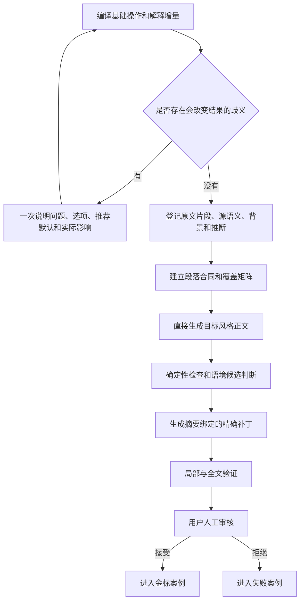

<div align="center">

<h1 align="center">AIALRA 可验证中文写作</h1>

<p><strong>完整保留原文信息，分开追踪补充解释，再为真实读者生成能够核对的中文</strong></p>

<p><strong>当前状态：vNext 1.1 候选版本等待用户审核</strong></p>

<p>
  <a href="docs/design/vnext-1.1-authoritative-plan.md">权威设计</a> ·
  <a href="evals/candidate/REVIEW-PACKET.md">审核 12 个候选锚点</a> ·
  <a href="constitution/principles.md">基本原则</a> ·
  <a href="README.en.md">English</a>
</p>

</div>

这个仓库维护 `human-readable-technical-writing` Codex Skill；vNext 1.1 把写作任务拆成基础操作和解释增量，再把原文、用户补充、外部背景与推断分别登记

当前候选分支已经完成理念层、结构契约、任务配置、精确补丁基础和 12 个候选锚点；候选答案尚未经过用户审核，因此没有案例被标记为金标，也没有候选版被安装成正式 Skill

## 1. 解决什么问题

普通改写经常只保留大意；普通解释又可能改变重点、重排内容或加入没有来源的结论；vNext 1.1 同时保护两件事：

- 源内容完整：改写和翻译保留全部有效原文信息
- 解释来源清楚：
  - 新增背景、定义、机制、例子和推断分别登记
  - 新增内容不伪装成原作者主张

这套系统不强制一种死板文风；它强制来源、覆盖、位置、修复范围和人工验收能够核对

## 2. 核心架构



图 2.1 vNext 1.1 从任务编译到人工金标的处理路径

## 3. 任务模型

每个任务使用两个独立维度

| 维度 | 可选值 | 决定内容 |
| --- | --- | --- |
| 基础操作 | `TRANSFORM`、`TRANSLATE`、`COMPRESS`、`EXPLAIN`、`GENERATE`、`FORMAT_ONLY` | 用户要求系统对原始材料做什么 |
| 解释增量 | `NONE`、`GLOSS`、`EXPLANATORY`、`TEACHING`、`RESEARCHED` | 为了让目标读者理解，可以增加多少原文以外的说明 |

表 3.1 写作任务的两个独立维度

常用组合包括：

- 忠实改写：`TRANSFORM + NONE`；只改变表达和结构
- 注释式改写：`TRANSFORM + GLOSS`；保留原文并解释术语和局部关系
- 解释性翻译：`TRANSLATE + EXPLANATORY`；完整翻译并补齐必要背景和机制
- `TRANSFORM + TEACHING` 用于教学式改写；它保留全部原文内容，同时从零先验建立理解路径

## 4. 来源与覆盖

中间层把内容分为 4 类：

- `SOURCE`：原文直接表达，并指向原文位置
- `USER_SUPPLIED`：用户在当前任务中补充
- `EXTERNAL_BACKGROUND`：为了理解而加入，并登记来源
- `INFERENCE`：根据已登记内容推导，并保留置信度

改写和翻译分别计算：

- 源信息覆盖率：目标为 `100%`
- 补充主张来源覆盖率：目标为 `100%`

补充解释不能抵消原文遗漏；没有来源的内容不能作为事实进入正文

## 5. 规则分级

| 等级 | 谁决定 | 失败行为 |
| --- | --- | --- |
| `MACHINE_FINAL` | 确定性代码 | 直接阻断 |
| `MACHINE_CANDIDATE` | Agent 或用户结合语境 | 确认、判定误报或请求决定 |
| `PROFILE_REQUIRED` | 当前任务或用户配置 | 按本次契约阻断 |
| `ADVISORY` | 用户偏好 | 只用于优化 |

表 5.1 四级规则与处理方式

普通词语、固定句长、常见语序和单一章节模板不能成为通用硬门；事实、条件、范围、数值、来源和原文完整性错误始终阻断

## 6. 精确补丁

提交器只支持摘要绑定的字面替换；它在写入以前检查：

- 当前文档摘要
- 授权节点范围
- 旧文本出现次数
- 补丁区间冲突
- 局部与全文验证结果

任一检查失败时整批不写入；该行为避免一个局部术语错误触发全文重新生成，也避免失败事务留下半修改文件

## 7. 首批候选锚点

当前 12 个候选案例覆盖：

- 忠实改写：2 个
- 注释式改写：2 个
- 解释性翻译：2 个
- 教学式改写：2 个
- 图片、表格、代码和多轮任务：各 1 个

全部案例的 `status` 为 `candidate`，`approved_by_user` 为 `false`；请从 [候选审核包](evals/candidate/REVIEW-PACKET.md) 逐个给出接受、拒绝或修改意见

## 8. 候选版验证

需要 Python `3.12` 或兼容版本，以及 `jsonschema` 和 `PyYAML`

```powershell
python scripts/validate_vnext_foundation.py # 验证权威计划摘要、11 个契约、YAML 分类、12 个候选案例、结构化示例和公开文件隐私模式

python -m unittest discover -s tests -p 'test_deterministic_committer.py' -v # 验证摘要拒绝、节点边界、次数检查、冲突拒绝、整批回滚和原子写入

python scripts/build_candidate_review_packet.py # 从结构化候选案例重新生成统一人工审核包
```

当前候选基线结果：

- vNext 基础检查通过；检查范围为：
  - `11` 个契约
  - `13` 个分类 YAML
  - `12` 个候选案例
  - `2` 个结构化示例
  - `19` 个 Skill 路由资源
  - `10` 个本地文档链接
  - `1` 个 SVG 候选资产
  - `108` 个公开文件
- 精确提交器的 `10/10` 个测试通过；覆盖范围为：
  - 成功替换
  - 摘要不符
  - 授权缺失
  - 次数不符
  - 节点越界
  - 补丁重叠
  - 并行非重叠补丁
  - 验证失败回滚
  - 文件提交
  - 输入不变性

这些结果只证明候选基础符合当前确定性设计；它们不能证明候选答案符合用户偏好，也不能把候选案例升级成金标

## 9. 仓库结构

| 目录 | 作用 |
| --- | --- |
| `constitution/` | 保存不能偏离的基本原则、来源分层、规则等级和用户金标边界 |
| `runtime/` | 说明任务编译、问答确认、来源理解、内容骨架、受约束成文和验证修复 |
| `contracts/` | 保存任务、来源、段落、支持关系、Finding、Patch 和候选案例的 JSON Schema |
| `profiles/` | 保存基础操作、解释增量、文体、媒介、读者、内容组件和 Lucas 配置 |
| `registries/` | 保存术语、单位和受保护模式 |
| `validators/` | 按确定性、候选和建议分离检查职责 |
| `patcher/` | 保存补丁规划、冲突处理、事务验证和确定性提交器 |
| `evals/` | 分开保存候选、金标、拒绝、隐藏和组件案例 |

表 9.1 vNext 1.1 目录职责

完整设计见 [vNext 1.1 权威计划](docs/design/vnext-1.1-authoritative-plan.md)；现有版本到新结构的取舍见 [迁移映射](docs/migration/current-to-vnext-1.1.md)

## 10. 隐私与安全边界

- 不扫描完整本地对话
- 不保存账户、令牌、私有路径或原始会话
- 候选案例使用合成材料和仓库内测试资产
- 图片资产使用本地 SVG，不加载远程资源，不包含脚本、事件处理器或外部引用
- GitHub 推送以前执行独立发布隐私检查

发现真实秘密进入远端时停止普通更新；先轮换凭据并按照事故流程处理历史内容

## 11. 当前限制与下一阶段

当前版本停在首批人工审核门；尚未完成的内容包括：

- 用户接受版本进入 `evals/gold/`
- 用户拒绝版本进入 `evals/rejected/`
- 根据真实金标实现完整运行时
- 扩展到 48 个可见金标、隐藏组合、长文、多轮、图片、表格、代码和真实失败案例

这些内容没有提前实现；原因是没有经过用户审核的标准答案时，继续扩大检查器和运行框架会再次把模型偏好误当成用户目标

## 12. 许可

仓库采用 [MIT License](LICENSE)；第三方方法或实质内容的来源与许可证记录在 [THIRD_PARTY_NOTICES.md](THIRD_PARTY_NOTICES.md)
