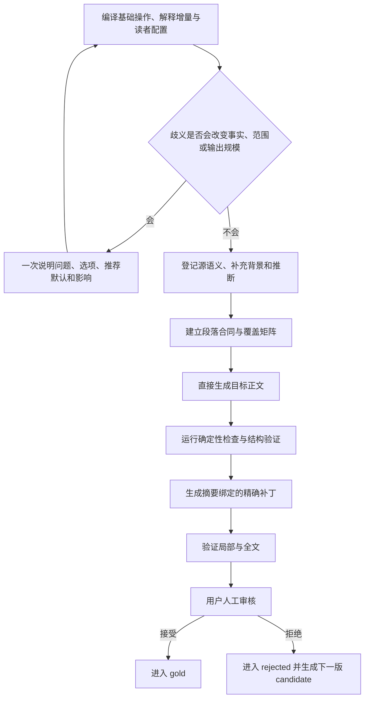

<div align="center">

<h1 align="center">AIALRA 可验证中文写作</h1>

<p><strong>完整保留源信息，分开追踪补充解释，再生成能够阅读、核对和局部修复的中文</strong></p>

<p><strong>当前状态：vNext 1.1 候选等待 C03-R4 与第一轮未见前向审核</strong></p>

<p>
  <a href="evals/candidate/REVIEW-PACKET.md">C03-R4 审核包</a> ·
  <a href="evals/forward/round-1/REVIEW-PACKET.md">20 个未见案例</a> ·
  <a href="docs/design/vnext-1.1-authoritative-plan.md">权威设计</a> ·
  <a href="docs/audits/2026-08-31-vnext-1.1-c03-r4/audit.md">C03-R4 审计</a> ·
  <a href="README.en.md">English</a>
</p>

</div>

这个仓库维护 `human-readable-technical-writing` Codex Skill；vNext 1.1 把写作任务拆成基础操作和解释增量，并把原文、用户补充、外部背景与推断分别登记

三轮锚点审核已经形成 11 个 Gold 和 12 个 Rejected；目前只剩 `CANDIDATE-03-R4` 等待决定，另有 20 个未见案例用于检验规则能否离开首批材料继续工作

## 1. 项目解决什么问题

普通改写容易只保留大意；普通解释又可能加入没有来源的背景，甚至把补充内容写成原作者结论

vNext 1.1 同时保护：

- 源内容完整；改写和翻译保留所有承担信息作用的原文内容
- 补充来源清楚；背景、定义、机制、例子和推断分别登记
- 修复范围可控；一个词或一段有问题时，只修改对应范围
- 人工决定有效；模型评分不能把候选自动改成 gold

这套系统不强制所有中文使用同一种句式；事实、条件、范围、数值、来源和原文完整性属于硬边界，语气与普通叙述顺序主要由用户金标持续校准

## 2. 当前处理流程



<p align="center">图 2.1 vNext 1.1 从任务编译到用户金标的处理路径</p>

图中的前半段保证来源与内容覆盖，后半段保证确定性问题能够定位和回滚；流程结果只有在用户明确接受后才会进入 gold，自动测试通过只允许生成审核包

## 3. 任务合同

每个任务由两个独立维度组成：

- 基础操作；决定对原始材料执行改写、翻译、压缩、解释、生成或仅排版
- 解释增量；决定允许增加术语注释、必要背景、教学说明或带来源的研究补充

| 维度 | 可选值 | 决定内容 |
| --- | --- | --- |
| 基础操作 | `TRANSFORM`、`TRANSLATE`、`COMPRESS`、`EXPLAIN`、`GENERATE`、`FORMAT_ONLY` | 对原始材料做什么 |
| 解释增量 | `NONE`、`GLOSS`、`EXPLANATORY`、`TEACHING`、`RESEARCHED` | 为了让目标读者理解，可以增加多少说明 |

<p align="center">表 3.1 写作任务的两个独立维度</p>

`TRANSLATE + EXPLANATORY` 表示完整翻译原文，同时补充理解原文所需的背景和机制；补充解释具有独立来源，不能抵消原文遗漏

## 4. 来源与覆盖

中间层区分：

- `SOURCE`；原文直接表达，并指向原文位置
- `USER_SUPPLIED`；用户在当前任务中补充的事实或要求
- `EXTERNAL_BACKGROUND`；为了理解而加入，并登记外部来源
- `INFERENCE`；根据已经登记的内容推导，并保留证据与置信度

改写和翻译分别计算源信息覆盖与补充背景来源覆盖；当前 `CANDIDATE-03-R4` 的源信息映射为 `3/3`，补充背景映射为 `5/5`，原因是每个登记单元都具有支持映射；该结果只能证明结构覆盖完整，不能证明文字已经达到用户偏好

## 5. 可执行运行时

本地入口提供：

- `compile`；填充确定性默认值并验证任务合同
- `verify`；检查来源、段落、术语、组件、支持映射和证据边界
- `repair`；验证精确补丁并执行最小替换
- `report`；输出 `PASS`、`FAIL` 或 `REVIEW_REQUIRED`，同时说明原因、影响和下一步

```powershell
python scripts/run_vnext.py --help # 显示 compile、verify、repair 和 report 四个入口；该命令只查看帮助，不修改文件
```

运行时代码不自动猜测任意自然语言含义；Agent 负责建立语义模型，程序负责检查结构、引用、覆盖状态和精确修改，因此项目没有声称能够用代码绝对证明完全同义

## 6. 首次验证

需要 Python `3.12` 或兼容版本，并安装 `jsonschema` 与 `PyYAML`；前者验证 JSON Schema，后者读取 YAML 配置

```powershell
python scripts/validate_vnext_foundation.py # 核对权威计划摘要、合同、YAML 分类、链接、SVG 和公开文件隐私模式

python scripts/run_vnext_fixtures.py # 执行 188 个确定性正反例；预期结果为 188/188

python scripts/validate_vnext_round3.py # 核对 24 个生命周期记录、Gold 快照、版本化拒绝和 C03-R4 来源映射

python scripts/validate_context_cases.py # 核对 16 个主语、标点、段落和大小写语境案例；未知官方写法必须进入人工复核

python scripts/validate_forward_round1.py # 核对 20 个首次生成答案的摘要、声明来源、原始组件和隐私结果

python -m unittest discover -s tests -p "test_deterministic_committer.py" -v # 执行 18 个摘要、范围、冲突、回滚和原子写入测试

python -m unittest discover -s tests -p "test_vnext_runtime.py" -v # 执行 15 个 compile、verify、repair 和 report 运行时测试

python scripts/build_candidate_review_packet.py # 从 C03-R4 重新生成锚点审核包

python scripts/build_forward_review_packet.py # 从 20 个首次生成答案构建人工前向审核包，不修改答案
```

当前本地结果：

- 188 个确定性案例全部符合预期；原因是十类规则加入 12 个括号英文、官方形式和逐字保留正反例，影响是已登记大小写错误能够被确定性阻断
- 24 个生命周期记录全部有效；原因是 11 个 Gold、12 个 Rejected 和 1 个 Candidate 使用同一合同，影响是模型不能越过用户决定
- 9 个新 Gold 的审核正文变化为 0；原因是每份正文都与 `approved_snapshot_sha256` 绑定，影响是后续格式优化不能冒充原审核版本
- 16 个语境案例结构全部有效；原因是新增案例区分生成正文、命令、逐字证据和未知官方写法，影响是原文不会被误改，未知名称也不会被程序猜测
- 18 个精确补丁测试与 15 个运行时测试全部通过；原因是摘要、范围、次数、冲突、术语大小写、禁止展开和人工复核都有可执行测试，影响是无效修改会在写入前停止
- 第一轮 20 个未见答案保持首次生成原文，其中 3 个答案出现中文句号；原因是隔离生成仍未稳定遵守用户标点配置，影响是本轮状态已经判定为 `FAIL`，第二轮生成停止

这些数字不等于用户验收；`CANDIDATE-03-R4` 和第一轮 20 个未见答案仍需用户逐项决定，3 个确定性失败不会因为其他自动检查通过而被隐藏

## 7. 仓库结构

| 目录 | 作用 |
| --- | --- |
| `constitution/` | 保存源信息优先、来源分层、规则等级和用户金标边界 |
| `runtime/` | 保存任务编译、来源理解、内容骨架、成文、验证和修复说明 |
| `contracts/` | 保存任务、来源、段落、支持映射、Finding、Patch 与案例生命周期 Schema |
| `profiles/` | 保存操作、解释增量、文体、媒介、读者、组件和 Lucas 配置 |
| `registries/` | 保存术语、单位和受保护模式 |
| `validators/` | 分离确定性规则、语境候选和建议性检查 |
| `patcher/` | 保存补丁规划、冲突处理、事务验证和确定性提交器 |
| `evals/` | 分开保存 candidate、gold、rejected 和确定性案例 |

<p align="center">表 7.1 vNext 1.1 目录职责</p>

完整设计见 [vNext 1.1 权威计划](docs/design/vnext-1.1-authoritative-plan.md)；本轮大小写规则、外部依据和剩余风险见 [C03-R4 审计](docs/audits/2026-08-31-vnext-1.1-c03-r4/audit.md)

## 8. 隐私与安全

公开仓库只保存合成案例、脱敏技术反馈、仓库相对路径和公开资料链接

禁止进入仓库：

- 原始完整对话、账户信息和个人绝对路径
- 令牌、密码、Cookie、私钥和连接字符串
- 未脱敏图片、远程图片请求和含活动内容的 SVG
- 没有来源却作为事实写入的补充解释

每次远程推送以前执行独立发布安全门禁；发现真实秘密已经进入远端时停止普通更新，先轮换凭据并按照事故流程处理历史内容

## 9. 当前边界与下一步

`main` 在 C03-R4 和两轮未见前向测试全部通过前保持冻结；候选 Skill 不安装到本机正式目录

下一步先审核 [C03-R4](evals/candidate/REVIEW-PACKET.md) 和 [第一轮 20 个未见候选](evals/forward/round-1/REVIEW-PACKET.md)；第一轮至少接受 18/20 且事实硬错误为 0，系统才生成第二轮；连续两轮通过后才能更新 `main`、安装 Skill 并运行新任务触发验收

## 10. 许可

仓库采用 [MIT License](LICENSE)；第三方方法与实质内容的来源和许可证记录在 [THIRD_PARTY_NOTICES.md](THIRD_PARTY_NOTICES.md)
