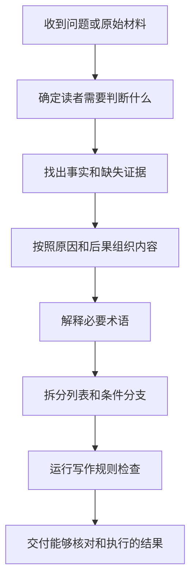

<div align="center">

# 面向智能体的中文可读技术写作

**让智能体生成的中文技术内容第一次就能被读懂、核对并执行**

[](https://github.com/AIALRA-0/agent-human-readable-technical-writing/actions/workflows/quality.yml)
[](LICENSE)
[](scripts/Test-HumanReadableChinese.Tests.ps1)
[](QA-CASES.md)
[](#9-隐私边界)

[查看改写效果](#1-改写效果) · [开始使用](#3-开始使用) · [了解处理过程](#4-处理过程) · [检查完整案例](QA-CASES.md) · [阅读详细规则](references/style-rules.md) · [运行质量检查](#7-质量检查)

</div>

智能体会按照用户指令生成或修改内容

如果智能体直接使用项目内部名称，并默认读者已经知道这些名称的含义，第一次阅读的人就无法判断实际结果

这个技能先找出读者真正需要判断的事情，再用普通中文说明事实和下一步行动

读者不需要预先了解项目历史，也不需要猜测某个状态名称允许采取什么行动

## 1 改写效果

好的改写需要让不认识内部名称的读者直接判断完成范围、证据边界、实际风险和下一步行动

如果只把 `FLOW_VALIDATED` 换成 `流程已经验证`，读者仍然得不到这些信息

下面使用同一份芯片验证记录展示改写前后的差别

### 1.1 原始输出

> `S01-F` 已进入 `FLOW_VALIDATED`
>
> `strict ImplementationGate` 通过，`DRC` 与 `CDC` 均为 `clean`
>
> `HostCompletion V5` 保持 `NOT_RELEASED`

原始输出保留了内部状态和检查名称，但没有说明完成的是哪一部分、检查通过证明了什么，以及为什么仍然不能发布

读者只能看到结果标签，无法据此决定项目是否能够结束或产品是否能够交付

### 1.2 改写后的输出

> `S01-F` 是本次芯片验证阶段的内部编号
>
> 项目把当前状态记录为 `FLOW_VALIDATED`；这个内部状态表示本轮软件实现流程和规定检查已经完成，但它只关闭软件流程
>
> `strict ImplementationGate` 严格实现门禁（Strict Implementation Gate）已经通过；这个门禁要求所有强制检查同时通过，任一检查失败都会阻止本轮结果进入交付
>
> 最终日志还记录了两项检查结果
>
> - `DRC` 设计规则检查（Design Rule Check）没有发现违规连接或布局
> - `CDC` 时钟域交叉检查（Clock Domain Crossing）没有发现已知的信号不稳定风险
>
> 两项检查都留下了能够重新核对的记录，因此本轮软件实现结果具备通过证据
>
> `HostCompletion V5` 是项目的主机完成状态记录；其中 `NOT_RELEASED` 表示真实板卡尚未完成运行测试，现有证据仍不允许产品发布
>
> 项目负责人现在可以归档本轮软件流程和检查记录；板级负责人仍需完成真实板卡测试，并根据测试结果决定是否进入产品发布

改写后的正文把内部状态还原成读者真正需要的判断：

<div align="center">

| 读者需要判断的事情 | 改写后能够获得的信息 |
|---|---|
| 哪部分已经完成 | 芯片软件实现流程已经完成 |
| 通过结论来自哪里 | 最终日志记录了实现过程和强制检查结果 |
| 现有证据能证明什么 | 软件实现结果具备可复核的通过证据 |
| 现有证据不能证明什么 | 真实板卡能否稳定工作仍未验证 |
| 谁负责下一步 | 项目负责人归档软件证据，板级负责人完成真实板卡测试 |

表 1.1 技术状态改写后形成的判断信息

</div>

真正的改写会补齐证据、边界、责任人和下一步行动，让第一次阅读的人能够直接判断和执行

## 2 写作规则

这个技能把写作要求整理成十七项能够检查的规则

### 2.1 正式术语需要保留并解释

原文已经使用的正式术语、英文缩写和内部名称继续保留，读者可以使用原名称搜索日志、核对配置并与专业人员沟通

术语首次出现后，正文立即说明它是什么、为什么重要以及失败会造成什么

术语和解释共同构成完整内容；术语不能独自承担说明任务，通俗解释也不能抹掉原始名称

正文使用自然短句解释，不使用字段标签拼接括号定义

### 2.2 判断需要事实支撑

具体原因先出现，读者理解事实后，再看到实际后果和下一步行动

这种顺序避免读者先记住抽象结论，再回头寻找结论依据

### 2.3 并列内容需要换行

两个以上能够分别理解的内容分行展示

读者能够逐项检查内容，不需要在长句中自行拆分

### 2.4 条件结果需要对应

一个条件只有一个结果时，条件和结果保持在同一项目中

一个条件对应多个结果时，条件单独成项，后续结果换行并缩进

### 2.5 完成边界需要分开

下面三种完成状态必须分别说明：

- 软件流程是否跑通
- 真实设备是否完成验证
- 产品是否允许发布

其中一项完成不能证明另外两项也已经完成

### 2.6 代码需要帮助第一次阅读

命令和配置采用逐行同行注释

需要结合上下文理解的连续逻辑采用段落开头注释

注释说明代码为什么存在以及会产生什么结果，不复述代码字面内容

### 2.7 流程需要顺着阅读

流程关系优先使用文本流程图（Mermaid）

图中的节点默认从上到下排列，让阅读顺序和执行顺序保持一致

只有横向比较更重要，或者竖向排列会让页面过长时，才改用横向排列

### 2.8 章节需要稳定编号

内容确实需要分成多个部分时，标题使用 `1`、`1.1`、`1.2.3` 这种十进制层级编号

编号从 `1` 开始，标题层级改变时，编号层级也需要同步改变

标题默认使用陈述式主题，例如“本项目禁止形式化验证的原因”

常见问题、访谈记录、问答页面或用户明确要求保留问题时，才使用“为什么本项目禁止形式化验证”这类疑问句标题

### 2.9 步骤需要明确顺序

需要读者依次操作时，使用“第一步”“第二步”这种中文顺序

相邻步骤之间保留一个空行，避免操作说明挤成连续段落

### 2.10 换行需要服从逻辑

两个以上能够分别核对的内容换行

同一逻辑框架中的简短标签和值保持同行，避免无意义的视线跳转

Vivado 芯片设计套件（Vivado Design Suite）负责完成芯片设计处理

项目配置文件记录的 Vivado 冻结版本为：2024.1

目标器件冻结为：`xcvu19p-fsva3824-1-e`

### 2.11 对象需要写清归属

版本、状态、限制、期限和结果需要写明属于哪个对象

`项目冻结版本` 无法说明被冻结的是工具、文件还是产品，所以需要改成 `项目 Vivado 冻结版本` 或其他准确对象

### 2.12 主语对象需要明确

每个动作、状态、判断和责任都要写明对应主体

前文同时出现服务器和监督器时，后文不能只写“它会生成报告”；正文需要直接写明由监督器生成报告，避免读者猜测代词指向

### 2.13 数值需要说明来源

业务数值、测量结果、阈值、配置值、预测值和经验值都要说明来源

引用数值需要提供顺序引用编号；计算数值需要写明输入和公式；软件产生的数值需要写明系统、日志或配置文件；经验估计需要说明样本和适用条件

来源无法确认时，正文标记“来源待核对”，不能把数值作为已经证实的事实

### 2.14 图表需要编号题注

图表编号由所属一级章节号和本章序号组成，例如第 1 章的前两个图依次写成“图 1.1”“图 1.2”

图形和表格分别计数，进入新章节后从 `1` 重新开始；没有编号章节的短文才使用“图 1”“表 1”

个人文档默认把表题与图题都放在对应内容下方，让题注位置保持视觉统一

用户明确要求论文、期刊、会议或其他出版格式时，才采用表题在上、图题在下的出版惯例 [1]

### 2.15 图表需要共同居中

表格、图片、流程图及其题注默认在页面中共同居中，读者可以直接看出题注属于哪个对象

支持网页标签的 Markdown 轻量标记语言（Markdown）文档使用 `<div align="center">` 包住对象和题注

Word 文字处理文档（Microsoft Word）、PDF 便携式文档格式（Portable Document Format）、幻灯片和网页使用目标格式提供的原生居中设置

纯轻量标记语言阅读器可能忽略网页标签，交付时需要说明这个版式限制，并继续保留完整内容和题注

### 2.16 引用需要顺序编码

正文按照来源第一次出现的顺序使用 `[1]`、`[2]`

文末按照相同编号列出完整来源，重复引用同一来源时沿用原编号

### 2.17 否定需要保持直接

`不能不处理` 需要先消化两次否定，改成“必须处理”后能够直接理解

正文优先使用直接肯定或单一否定

## 3 开始使用

先把仓库复制到个人技能目录：

```powershell
git clone https://github.com/AIALRA-0/agent-human-readable-technical-writing.git "$HOME\.codex\skills\human-readable-technical-writing" # 下载技能并保留稳定的内部技能名称
Copy-Item "$HOME\.codex\skills\human-readable-technical-writing\AGENTS.example.md" "$HOME\.codex\AGENTS.example.md" # 复制规则模板，避免直接覆盖现有个人配置
```

如果个人配置目录已经存在 `AGENTS.md`，需要人工合并模板内容，不能直接覆盖原文件

智能体识别到中文写作任务后，可以自动读取这个技能

需要明确调用时，可以在问题开头加入下面这段话：

> 使用 `$human-readable-technical-writing`，按照我的中文技术写作规范回答；交付前运行写作检查，检查失败就先修改再回答

这条指令会要求智能体读取技能规则，并在交付前检查明显的格式问题

## 4 处理过程

下面的流程图展示一份材料怎样变成能够直接阅读的结果：

<div align="center">



图 4.1 中文技术内容处理流程

</div>

这个过程先解决读者的问题，再补充正式名称和原始证据

技术名称不会被删除，但它们也不会继续承担解释工作

## 5 规则读取方式

项目把不同用途的内容分开保存，普通回答不需要读取全部测试材料

<div align="center">

| 内容 | 什么时候读取 | 解决什么问题 |
|---|---|---|
| 全局规则模板 | 每次中文写作 | 保存不能违反的表达边界 |
| 核心技能 | 中文写作任务开始时 | 安排因果顺序并处理术语和列表 |
| 详细写作规则 | 复杂报告或争议案例出现时 | 提供边界条件和完整示例 |
| 完整测试材料 | 运行质量检查时 | 检查规则是否只适合少数短回答 |

表 5.1 规则材料的读取时机

</div>

完整测试材料不会自动进入普通对话，因此增加测试案例不会等量增加每次回答需要读取的内容

## 6 完整案例

读者需要亲自判断实际回答是否自然、清楚并且有足够依据，所以[完整问答案例](QA-CASES.md)公开展示四十一个问题和对应回答

案例文档先展示本轮新增的八组案例，再保留三十三组历史案例用于回归检查

这种排列让读者能够直接找到新内容，同时继续验证新规则没有破坏原有写作能力

案例覆盖五种长度：

- 极短回答
- 短回答
- 中等回答
- 长回答
- 完整报告

案例还覆盖多种使用场景：

- 普通提问
- 愤怒质疑
- 紧急操作
- 混乱材料整理
- 专业审查
- 新手解释
- 表格比较
- 公式说明
- 代码审查
- 操作步骤
- 图表编号
- 顺序引用
- 芯片设计环境报告
- 完整交接报告
- 主语和责任对象澄清
- 数值引用、计算来源和经验估计
- 冷链异常证据整理
- 灾难恢复术语说明
- 实验室多种视觉材料编排
- 出版格式表格题注

同一套规则在短句和长报告中可能出现不同问题，所以测试必须保留这些差异

## 7 质量检查

当前版本必须同时通过两类检查

第一类检查使用正确写法和错误写法进行成对测试，确认下面两件事：

- 正确写法不会被错误拦截
- 已知的机械写作问题能够被发现

检查器目前能够发现下面这些问题：

- 中文句号
- 行尾中文分号
- 字段标签式括号定义
- 未解释的英文缩写
- 挤在同一行的并列内容
- 没有缩进的多结果分支
- 抽象结论先出现而具体原因后补充
- 没有注释的代码段
- 只注释重要行的独立代码语句
- 没有使用数学公式排版语法的上下标和公式符号
- 缺少十进制层级编号的多章节文档
- 没有使用中文顺序的操作步骤
- 缺少编号题注的图表
- 图表编号与所属章节不匹配
- 图表使用零编号或进入新章节后没有重新计数
- 个人文档和出版格式使用了错误的表题位置
- 表格、图片、流程图或对应题注没有共同居中
- 非问答内容使用疑问句标题
- 不符合顺序编码格式的引用
- 双重否定
- 被机械拆成两行的简短标签和值
- 没有写明所属对象的版本
- 多个对象后指向含糊的代词
- 没有写明执行主体的发布或交付动作
- 没有说明引用、计算、应用或经验来源的业务数值

第二类检查使用完整问题和完整回答，验证不同篇幅和不同场景，避免项目只对少数样例表现良好

当前公开测试包含下面这些差异：

- 一百二十一组规则正反测试
- 四十一组完整问答测试
- 十九组原始术语保留问答测试
- 五种回答长度
- 四十一个内容方向
- 二十七种表达语气
- 三十一类目标读者
- 三十一类任务
- 三十一种内容结构

运行全部检查：

```powershell
pwsh -NoProfile -File ".\scripts\Test-HumanReadableChinese.Tests.ps1" # 执行一百二十一组规则正反测试
pwsh -NoProfile -File ".\evals\Invoke-QualityEvaluation.20260729.ps1" # 执行四十一组完整问答质量测试
pwsh -NoProfile -File ".\scripts\Export-QualityCases.ps1" # 使用已经通过检查的结果重新生成案例文档
pwsh -NoProfile -File ".\scripts\Test-RepositoryContent.ps1" # 检查全部公开文档、案例同步状态和相对链接
```

自动检查只能发现能够明确识别的写作问题，不能证明报告中的事实一定正确

重要报告仍然需要人工核对原始证据，并确认结论没有超过证据能够证明的范围

## 8 文件说明

<div align="center">

| 路径 | 内容 |
|---|---|
| `SKILL.md` | 智能体开始写作时读取的核心规则 |
| `AGENTS.example.md` | 可以合并到个人配置中的全局规则模板 |
| `references/style-rules.md` | 复杂写作问题需要的详细规则和示例 |
| `scripts/Test-HumanReadableChinese.ps1` | 检查能够明确识别的写作问题 |
| `scripts/Test-HumanReadableChinese.Tests.ps1` | 验证检查器能接受正确写法并拒绝错误写法 |
| `scripts/Export-QualityCases.ps1` | 使用正式测试结果生成完整案例文档 |
| `scripts/Test-RepositoryContent.ps1` | 使用技能自身检查全部公开文档、案例同步状态和相对链接 |
| `evals/Invoke-QualityEvaluation.20260729.ps1` | 保存多行业完整问答和样本差异要求 |
| `QA-CASES.md` | 展示全部问题和完整回答 |

表 8.1 仓库文件说明

</div>

这些文件按照实际用途分开保存，既保留验证证据，也避免普通任务读取无关内容

## 9 隐私边界

这个仓库不收集使用数据

它不会主动读取私人项目，也不会把回答内容发送给外部服务

公开案例使用通用或合成场景，不包含下面这些信息：

- 密钥
- 访问令牌
- 服务器地址
- 个人电子邮箱
- 私人项目路径
- 客户资料

发布前的敏感信息扫描没有发现匹配内容

规则可以降低无意暴露内部名称的概率，但不能替代发布前的人工脱敏检查

## 10 提交改进

提交问题时，请提供下面三项内容：

- 原始问题
- 不理想的实际回答
- 第一次阅读的人最终需要理解或执行什么

新增规则还需要提供一个正确案例和一个错误案例

这两个案例能够证明修改解决了真实问题，并降低新规则破坏其他写作场景的风险

## 11 后续计划

- 增加英文技术内容转写成中文的成对测试
- 增加更长的多文件项目报告
- 记录真实用户阅读后仍然需要提出的问题数量
- 增加可选的悬停术语解释
- 为更多智能体环境提供安装模板

## 12 当前状态

当前版本可以作为个人写作技能使用，全部公开测试已经通过

这些测试证明项目能够稳定执行当前写作规则，但不能保证输入事实自动正确，也不能替代任何专业判断

## 13 许可证

本仓库使用 MIT 开源许可证（MIT License）

其他人可以自由使用这个项目，也可以继续修改并重新分发，但必须保留许可证说明

## 14 参考文献

[1] IEEE, “IEEE Editorial Style Manual for Authors,” 2025. [Online]. Available: https://journals.ieeeauthorcenter.ieee.org/wp-content/uploads/sites/7/IEEE-Editorial-Style-Manual-for-Authors.pdf
