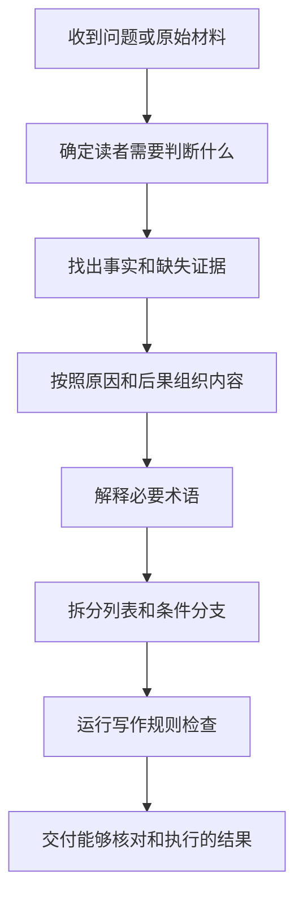

<div align="center">

# 人类可读中文技术写作

**让技术内容第一次就能被读懂、核对并执行**

[](https://github.com/AIALRA-0/codex-human-readable-chinese/actions/workflows/quality.yml)
[](LICENSE)
[](scripts/Test-HumanReadableChinese.Tests.ps1)
[](QA-CASES.md)
[](#隐私边界)

[查看改写效果](#改写效果) · [开始使用](#开始使用) · [了解处理过程](#处理过程) · [检查完整案例](QA-CASES.md) · [阅读详细规则](references/style-rules.md) · [运行质量检查](#质量检查)

</div>

编程智能体会按照用户指令生成或修改内容

如果它直接使用项目内部名称，并默认读者已经知道这些名称的含义，第一次阅读的人就无法判断实际结果

这个技能先找出读者真正需要判断的事情，再用普通中文说明事实和下一步行动

读者不需要预先了解项目历史，也不需要猜测某个状态名称允许采取什么行动

## 改写效果

下面三个例子展示这个技能解决的实际问题：

| 原始表达 | 改写后的正文 |
|---|---|
| `FLOW_VALIDATED` | 本轮规定的软件流程已经跑通，但真实设备尚未测试，因此流程验证可以结束，产品仍不能发布 |
| `strict ImplementationGate` | 实现结果只有在全部强制检查通过后才会被接受；任何一项失败，本轮结果都不能交付 |
| `Cpk dropped to 1.08` | 生产结果比以前更容易越过允许边界，因此不合格品风险正在增加 |

改写后的正文直接回答下面三个问题：

- 发生了什么
- 为什么重要
- 接下来能够做什么

缺少其中任何一项，读者仍然需要自行猜测技术名称背后的实际含义

## 写作规则

这个技能把写作要求整理成七项能够检查的规则

### 陌生词需要自然解释

陌生词首次出现时，正文先说明它是什么，再解释为什么重要以及失败后果

正文不会使用字段标签拼接括号定义

### 判断需要事实支撑

具体原因先出现，读者理解事实后，再看到实际后果和下一步行动

这种顺序避免读者先记住抽象结论，再回头寻找结论依据

### 并列内容需要换行

两个以上能够分别理解的内容分行展示

读者能够逐项检查内容，不需要在长句中自行拆分

### 条件结果需要对应

一个条件只有一个结果时，条件和结果保持在同一项目中

一个条件对应多个结果时，条件单独成项，后续结果换行并缩进

### 完成边界需要分开

下面三种完成状态必须分别说明：

- 软件流程是否跑通
- 真实设备是否完成验证
- 产品是否允许发布

其中一项完成不能证明另外两项也已经完成

### 代码需要帮助第一次阅读

命令和配置采用逐行同行注释

需要结合上下文理解的连续逻辑采用段落开头注释

注释说明代码为什么存在以及会产生什么结果，不复述代码字面内容

### 流程需要顺着阅读

流程关系优先使用文本流程图（Mermaid）

图中的节点默认从上到下排列，让阅读顺序和执行顺序保持一致

只有横向比较更重要，或者竖向排列会让页面过长时，才改用横向排列

## 开始使用

先把仓库复制到个人技能目录：

```powershell
git clone https://github.com/AIALRA-0/codex-human-readable-chinese.git "$HOME\.codex\skills\human-readable-technical-writing" # 下载技能并保留稳定的内部技能名称
Copy-Item "$HOME\.codex\skills\human-readable-technical-writing\AGENTS.example.md" "$HOME\.codex\AGENTS.example.md" # 复制规则模板，避免直接覆盖现有个人配置
```

如果个人配置目录已经存在 `AGENTS.md`，需要人工合并模板内容，不能直接覆盖原文件

编程智能体识别到中文技术写作任务后，可以自动读取这个技能

需要明确调用时，可以在问题开头加入下面这段话：

> 使用 `$human-readable-technical-writing`，按照我的中文技术写作规范回答；交付前运行写作检查，检查失败就先修改再回答

这条指令会要求编程智能体读取技能规则，并在交付前检查明显的格式问题

## 处理过程

下面的流程图展示一份材料怎样变成能够直接阅读的结果：



这个过程先解决读者的问题，再补充正式名称和原始证据

技术名称不会被删除，但它们也不会继续承担解释工作

## 规则读取方式

项目把不同用途的内容分开保存，普通回答不需要读取全部测试材料

| 内容 | 什么时候读取 | 解决什么问题 |
|---|---|---|
| 全局规则模板 | 每次中文写作 | 保存不能违反的表达边界 |
| 核心技能 | 技术写作任务开始时 | 安排因果顺序并处理术语和列表 |
| 详细写作规则 | 复杂报告或争议案例出现时 | 提供边界条件和完整示例 |
| 完整测试材料 | 运行质量检查时 | 检查规则是否只适合少数短回答 |

完整测试材料不会自动进入普通对话，因此增加测试案例不会等量增加每次回答需要读取的内容

## 完整案例

读者需要亲自判断实际回答是否自然、清楚并且有足够依据，所以[完整问答案例](QA-CASES.md)公开展示二十六个问题和对应回答

案例覆盖五种长度：

- 极短回答
- 短回答
- 中等回答
- 长回答
- 完整报告

案例还覆盖多种使用场景：

- 普通提问
- 愤怒质疑
- 紧急操作
- 混乱材料整理
- 专业审查
- 新手解释
- 表格比较
- 公式说明
- 代码审查
- 完整交接报告

同一套规则在短句和长报告中可能出现不同问题，所以测试必须保留这些差异

## 质量检查

当前版本必须同时通过两类检查

第一类检查使用正确写法和错误写法进行成对测试，确认下面两件事：

- 正确写法不会被错误拦截
- 已知的机械写作问题能够被发现

检查器目前能够发现下面这些问题：

- 中文句号
- 行尾中文分号
- 字段标签式括号定义
- 未解释的英文缩写
- 挤在同一行的并列内容
- 没有缩进的多结果分支
- 抽象结论先出现而具体原因后补充
- 没有注释的代码段
- 没有使用数学公式排版语法的上下标和公式符号

第二类检查使用完整问题和完整回答，验证不同篇幅和不同场景，避免项目只对少数样例表现良好

当前公开测试包含下面这些差异：

- 五十五组规则正反测试
- 二十六组完整问答测试
- 五种回答长度
- 二十六个内容方向
- 二十二种表达语气
- 十七类目标读者
- 十七类任务
- 十六种内容结构

运行全部检查：

```powershell
pwsh -NoProfile -File ".\scripts\Test-HumanReadableChinese.Tests.ps1" # 执行五十五组规则正反测试
pwsh -NoProfile -File ".\evals\Invoke-QualityEvaluation.20260729.ps1" # 执行二十六组完整问答质量测试
pwsh -NoProfile -File ".\scripts\Export-QualityCases.ps1" # 使用已经通过检查的结果重新生成案例文档
```

自动检查只能发现能够明确识别的写作问题，不能证明报告中的事实一定正确

重要报告仍然需要人工核对原始证据，并确认结论没有超过证据能够证明的范围

## 文件说明

| 路径 | 内容 |
|---|---|
| `SKILL.md` | 编程智能体开始写作时读取的核心规则 |
| `AGENTS.example.md` | 可以合并到个人配置中的全局规则模板 |
| `references/style-rules.md` | 复杂写作问题需要的详细规则和示例 |
| `scripts/Test-HumanReadableChinese.ps1` | 检查能够明确识别的写作问题 |
| `scripts/Test-HumanReadableChinese.Tests.ps1` | 验证检查器能接受正确写法并拒绝错误写法 |
| `scripts/Export-QualityCases.ps1` | 使用正式测试结果生成完整案例文档 |
| `evals/Invoke-QualityEvaluation.20260729.ps1` | 保存多行业完整问答和样本差异要求 |
| `QA-CASES.md` | 展示全部问题和完整回答 |

这些文件按照实际用途分开保存，既保留验证证据，也避免普通任务读取无关内容

## 隐私边界

这个仓库不收集使用数据

它不会主动读取私人项目，也不会把回答内容发送给外部服务

公开案例使用通用或合成场景，不包含下面这些信息：

- 密钥
- 访问令牌
- 服务器地址
- 个人电子邮箱
- 私人项目路径
- 客户资料

发布前的敏感信息扫描没有发现匹配内容

规则可以降低无意暴露内部名称的概率，但不能替代发布前的人工脱敏检查

## 提交改进

提交问题时，请提供下面三项内容：

- 原始问题
- 不理想的实际回答
- 第一次阅读的人最终需要理解或执行什么

新增规则还需要提供一个正确案例和一个错误案例

这两个案例能够证明修改解决了真实问题，并降低新规则破坏其他写作场景的风险

## 后续计划

- 增加英文技术内容转写成中文的成对测试
- 增加更长的多文件项目报告
- 记录真实用户阅读后仍然需要提出的问题数量
- 增加可选的悬停术语解释
- 为其他编程智能体提供安装模板

## 当前状态

当前版本可以作为个人写作技能使用，全部公开测试已经通过

这些测试证明项目能够稳定执行当前写作规则，但不能保证输入事实自动正确，也不能替代任何专业判断

## 许可证

本仓库使用 MIT 开源许可证（MIT License）

其他人可以自由使用这个项目，也可以继续修改并重新分发，但必须保留许可证说明
