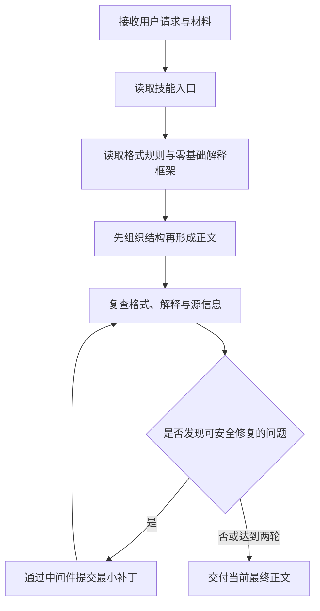

<div align="center">

<h1>AIALRA 可验证中文写作</h1>

<p><strong>让编码代理稳定遵守中文格式要求，并把陌生技术讲到第一次接触的人能够继续使用</strong></p>

<p>当前主线：轻量写作指导 · 可选本地检查 · 用户决定最终是否满意</p>

<p>
  <a href="README.en.md">English</a> ·
  <a href="SKILL.md">技能入口</a> ·
  <a href="#2-开始使用">开始使用</a> ·
  <a href="#6-验证范围与限制">验证范围</a>
</p>

</div>

这个仓库维护一套可安装的中文写作技能

它首先约束标点、标题、列表、术语、代码、公式、图片和表格的呈现方式，再按照零基础解释框架补齐读者理解下一步所需的前提、原因、过程、结果与适用条件

普通使用只需要读取技能入口和两份核心规则，不依赖其他代理、模型投票或完整评测系统

## 1 项目用途

这套技能主要解决两个问题

- 格式不稳定
  - 禁止普通中文正文使用中文句号
  - 独立并列项目必须分行并按语义层级缩进
  - 专业术语、中英文、代码注释、公式、图片和表格使用统一的可检查格式
- 解释默认读者已经懂
  - 不从学历、职业或以前出现过某个词推断读者具有背景知识
  - 每个关键对象都说明它是什么、为什么需要、怎样运作、会得到什么结果以及何时不适用
  - 原文事实、条件、数值、否定、范围和来源在补充解释后仍需保持

这套技能适合中文回答、改写、解释性翻译、技术说明、状态报告和混合图文内容

纯代码、纯数据、纯数字或用户明确要求非中文输出时，不自动套用中文正文规则

## 2 开始使用

### 2.1 让编码代理安装

把下面这段请求交给支持从代码仓库安装技能的编码代理

```text
请从 https://github.com/AIALRA-0/agent-human-readable-technical-writing 的 main 分支安装仓库根目录技能，名称为 human-readable-technical-writing
```

### 2.2 手动安装

先确认目标目录中没有同名旧版本，再把仓库克隆到当前 Codex 主目录的技能目录

```powershell
# 把最新 main 分支直接克隆到当前 Codex 技能目录
git clone --depth 1 https://github.com/AIALRA-0/agent-human-readable-technical-writing.git "$env:CODEX_HOME\skills\human-readable-technical-writing"
```

重新开始一个任务后，技能即可被发现

### 2.3 明确调用

需要稳定触发时，在请求中直接写出技能名称

```text
使用 $human-readable-technical-writing，把下面的技术材料解释给第一次接触这件事的人，并保留全部事实、条件、数字和例外
```

编码代理也可以根据技能描述自动调用，但明确写出名称更容易确认当前任务确实需要这套规则

## 3 执行逻辑

普通写作路径保持轻量，同一个编码代理完成读取、写作、复核和局部修复

<div align="center">


```mermaid
flowchart TD
    A[接收用户请求与材料] --> B[读取技能入口]
    B --> C[读取格式规则与零基础解释框架]
    C --> D[先组织结构再形成正文]
    D --> E[复查格式、解释与源信息]
    E --> F{是否发现可安全修复的问题}
    F -->|是| G[通过中间件提交最小补丁]
    G --> E
    F -->|否或达到两轮| H[交付当前最终正文]
```

<p>图 3.1　普通写作从接收请求到交付正文的实际路径</p>

</div>

仓库中的任务合同、来源映射、严格验证器和前向案例用于开发、审计与专项评测，不是普通回答的必经步骤

## 4 核心规则

### 4.1 格式先行

- 普通中文正文、标题、列表项、题注和表格外说明不使用中文句号
- 两个以上独立定义、步骤、事实、原因、比较对象或动作必须分行
- 嵌套内容继续增加一级缩进，不把不同语义层级压成同一层
- 单个连续语义区块可以不设标题；一旦回答包含多个独立语义区块，每个同级区块都使用同级标题，是否编号沿用当前文档
- 图片与图题、表格与表题在媒介支持时位于同一个居中容器
- 宽表只在自己的容器内横向滚动，不能让页面整体横向溢出

完整格式要求见 [顶层格式规则](references/format-rules.md)

### 4.2 面向零基础读者

- 在陌生概念首次使用以前补齐必要前提
- 关键机制说明作用对象、输入、发生的变化、结果和成立原因
- 抽象机制、计算或多步操作提供能够跟随的完整示范
- 主要公式从直观用途进入，再解释每个首次符号、关键组分、运算路径、可复算示范、结果判断、适用边界和正式定义
- 条件、否定、例外、范围和容易混淆的情况在实际使用位置说明
- 图片、表格、代码和日志先保留原对象，再就近解释怎样看和能够得出什么

完整解释要求见 [零基础解释框架](references/explanation-framework.md)

需要解释公式时按需读取 [公式解释规则](references/formula-explanation.md)

### 4.3 保留源信息

- 改写和翻译不能只保留大意
- 补充背景不能冒充原作者结论
- 没有来源的机制不能写成确定事实
- 局部错误只修对应字符、词组、句子或列表项
- 自动检查不能代替用户接受

## 5 可选工具

普通写作不要求运行仓库工具

需要处理复杂结构化材料或生成可审计结果时，可以使用以下入口

```powershell
# 查看结构化排版输入格式
python scripts/compose_writing.py --help

# 检查中文格式并生成可定位的问题
python scripts/review_writing.py --help

# 查看严格任务合同、验证、修复和报告接口
python scripts/run_vnext.py --help
```

这些程序负责确定性结构和精确修改，不声称能够独立证明任意自然语言完全同义或让所有读者都完全理解

## 6 验证范围与限制

当前 `main` 分支由 [GitHub 自动任务](https://github.com/AIALRA-0/agent-human-readable-technical-writing/actions/workflows/quality.yml)持续检查

截至当前版本，本地与仓库登记证据覆盖

- 确定性正反例 288 项
- 语境合同 48 项
- 触发矩阵 72 项
- 长上下文压力案例 8 项
- 本地单元测试 384 项通过，1 项按设计跳过
- 格式层 21 个组合案例，登记覆盖 121 条格式规则

这些结果证明对应案例、清单和程序行为保持一致，不代表任意输入都能获得绝对正确的自然语言结果

仍需保留以下边界

- 自动检查通过不等于用户已经接受文风
- 语义是否完整仍需要结合原文、上下文和用户反馈判断
- 目标媒介不能可靠实现居中或局部滚动时，正文必须说明限制
- 历史评测和人工审核材料只证明当时版本与当时样本，不自动替代当前实机反馈

## 7 仓库导航

- [`SKILL.md`](SKILL.md)
  - 普通任务的唯一入口
- [`references/format-rules.md`](references/format-rules.md)
  - 标点、结构、术语、代码和图表格式
- [`references/explanation-framework.md`](references/explanation-framework.md)
  - 零基础解释逻辑
- [`references/formula-explanation.md`](references/formula-explanation.md)
  - 公式的直观入口、符号、组分、运算、示范、边界和正式定义
- [`runtime/`](runtime)
  - 任务编译、成文、验证和修复实现
- [`contracts/`](contracts)
  - 结构化任务、证据、补丁和生命周期合同
- [`evals/`](evals)
  - 候选、人工接受、人工拒绝和自动案例
- [`docs/design/vnext-1.1-authoritative-plan.md`](docs/design/vnext-1.1-authoritative-plan.md)
  - `vNext 1.1` 的权威设计背景

## 8 帮助、贡献与许可

- 使用问题和普通缺陷可以提交到 [Issues](https://github.com/AIALRA-0/agent-human-readable-technical-writing/issues)
- 提交修改时需要保留用户人工决定、来源边界和最小补丁原则
- 不要在公开问题中粘贴令牌、密码、私钥、真实账户数据或内部地址
- 仓库使用 [MIT License](LICENSE)
- 第三方方法与许可说明见 [THIRD_PARTY_NOTICES.md](THIRD_PARTY_NOTICES.md)
