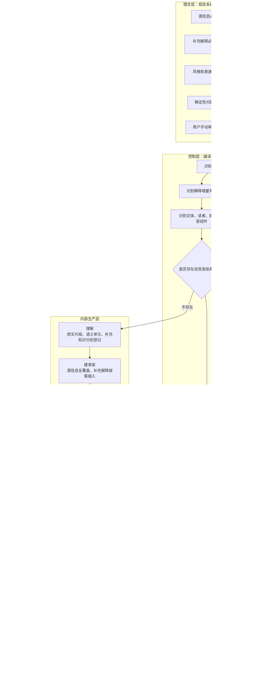
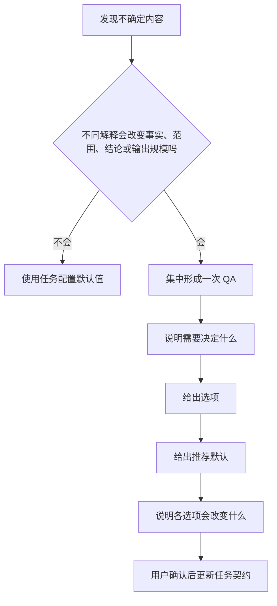
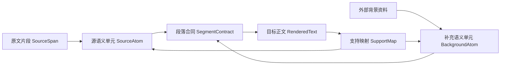
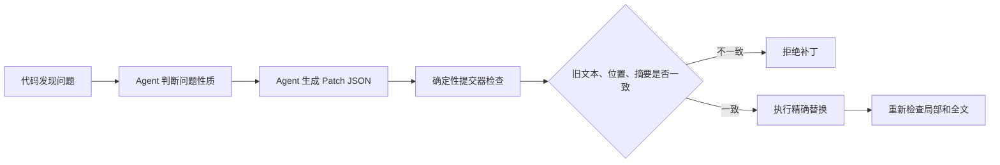
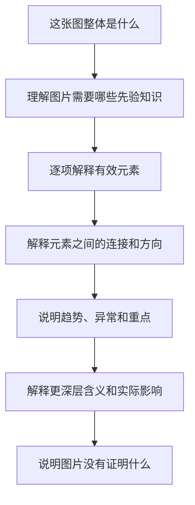
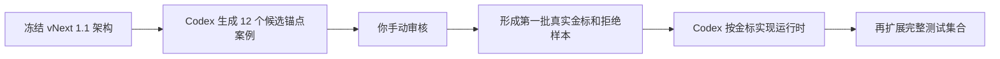

# AIALRA 可验证写作系统 vNext 1.1 全量计划书

你这个修正是对的

**改写和翻译不应该等于“只能使用原文中的词，绝对不能增加任何内容”**

论文、法律文件、技术报告经常把大量先验知识压缩在术语、公式和一句结论里，原文虽然信息完整，但对普通读者并不自足，直接翻译只会得到一份中文形式的晦涩原文

但也不能简单把它归入普通“解释”，因为普通解释允许：

- 重选重点
- 改变内容顺序
- 省略部分原文
- 使用外部知识重建答案

而你的核心要求仍然是：

> **原文全部有效信息必须保留，同时允许增加帮助理解的背景、定义、机制、例子和关系说明**

因此，最合适的做法不是把“改写”并入“解释”，而是把任务拆成两个互相独立的维度：
```text
基础操作：对原文做什么
+
解释增量：为了让读者理解，需要补充到什么程度
```

这样既能无损保留原文，也能补齐论文等高密度材料默认省略的先验知识

---

# 1. 最终运行架构


这套系统强制的不是某一种死板文风，而是：

> **原文不丢、语义不改、补充不混、结构可追、错误可定位、修复可回滚、结果由用户最终确认**

---

# 2. 理念层

Codex 在修改框架、规则、检查器或案例以前，必须先理解下面这些思想

否则它很容易把本项目做成更多正则、更多禁词、更多硬模板和更多不稳定的外部 Agent

| 核心思想            | 实际含义                           |
| --------------- | ------------------------------ |
| 源信息优先           | 改写、翻译和解释性扩写不得改变原文事实、关系、条件和语气强度 |
| 内容完整优先          | 不能只保留大意，必须保留所有承担信息作用的原文内容      |
| 允许解释增量          | 可以补充读者理解原文所需的背景、定义、机制、例子和关系    |
| 来源必须分层          | 原文内容、外部背景、合理推断和用户补充不能混成同一种陈述   |
| 结构先于表达          | 先确认内容覆盖和关系，再生成最终正文             |
| 风格不等于真理         | 语气、句长、段落方式和普通叙述顺序主要是建议，不普遍硬编码  |
| 确定性问题代码化        | 能准确判断的格式、术语、编号、数值和标识问题由程序检查    |
| 修复优先采用补丁        | 一个词错了只改这个词，一个段落错了只改这个段落        |
| 外部 Agent 不是核心依赖 | 可以用于开发实验，不能成为正式运行的必要条件         |
| 不确定则停止推断        | 原意无法确认时进入 QA，不允许为了顺畅擅自解释       |
| 用户验收是最终标准       | 脚本通过和模型评分不能取代用户是否真正愿意阅读        |
| 零先验解释           | 图片、表格、代码和陌生技术内容默认按照第一次接触的读者处理  |

这部分应独立保存为：
```text
constitution/principles.md
```

任何 Agent 开始修改仓库前必须先读取

---

# 3. 任务模式改为“基础操作 + 解释增量”

这是本次最重要的修订

## 3.1. 基础操作

基础操作只回答：

> 用户要求我们对原始材料做什么

| 基础操作          | 作用                   |
| ------------- | -------------------- |
| `TRANSFORM`   | 使用同一种语言重新表达原文        |
| `TRANSLATE`   | 将原文转换到另一种语言          |
| `COMPRESS`    | 在用户允许的范围内压缩原文        |
| `EXPLAIN`     | 围绕一个问题重新组织知识，目标是建立理解 |
| `GENERATE`    | 根据问题和来源从零生成内容        |
| `FORMAT_ONLY` | 只调整结构和版式，不改变语言内容     |

这些操作仍然需要保留，因为它们对源信息覆盖要求不同

---

## 3.2. 解释增量

解释增量回答：

> 为了让目标读者真正理解，可以增加多少原文以外的解释

| 增量等级          | 允许增加什么                          |
| ------------- | ------------------------------- |
| `NONE`        | 不增加背景，只重新表达原文                   |
| `GLOSS`       | 只解释陌生术语、缩写、符号和局部关系              |
| `EXPLANATORY` | 增加必要背景、机制、前置概念、例子和因果说明          |
| `TEACHING`    | 从零先验开始建立完整知识路径，可增加类比、反例、图表和分层说明 |
| `RESEARCHED`  | 允许检索外部资料补充背景、争议和最新进展，必须提供来源     |

因此，一个任务不再只有一个标签

例如：
```yaml
base_operation: TRANSLATE
augmentation: EXPLANATORY
```

表示：

> 完整翻译原文，同时增加理解论文所需的背景和机制解释

这不是普通翻译，也不是脱离原文重新讲一个主题

它可以命名为：

> **解释性翻译**

---

另一个例子：
```yaml
base_operation: TRANSFORM
augmentation: TEACHING
```

表示：

> 原文全部内容保留，但改写成零先验读者能够逐步理解的版本

它可以命名为：

> **教学式改写**

---

## 3.3. 三种最常用的输出配置

### 忠实改写
```yaml
base_operation: TRANSFORM
augmentation: NONE
source_coverage: 100%
```

只改变中文表达和结构，不增加外部信息

适合：

- UI 文案
- 短消息
- 普通项目状态
- 已经足够自足的材料

### 注释式改写
```yaml
base_operation: TRANSFORM
augmentation: GLOSS
source_coverage: 100%
```

原文全部保留，同时解释术语、缩写、状态和局部关系

适合：

- README
- API 文档
- 技术邮件
- 简短专业说明

### 教学式改写或解释性翻译
```yaml
base_operation: TRANSLATE
augmentation: EXPLANATORY
source_coverage: 100%
```

完整保留原文，同时补充：

- 前置知识
- 术语定义
- 因果机制
- 例子
- 公式含义
- 作者默认读者已经知道的背景

适合：

- 学术论文
- 芯片文档
- 法律文件
- 技术标准
- 高密度项目报告

---

# 4. 原文信息与补充解释必须分开管理

允许增加背景以后，最大的风险是：

> Agent 把自己的补充解释写成原作者的结论

因此中间层必须区分至少 4 种来源类型
```yaml
provenance_type:
  - SOURCE
  - USER_SUPPLIED
  - EXTERNAL_BACKGROUND
  - INFERENCE
```

## 4.1. `SOURCE`

原文直接表达的内容

必须指向原文位置
```yaml
id: ATOM-021
provenance_type: SOURCE
source_span_id: SRC-014
claim: 软件流程已经通过
```

## 4.2. `USER_SUPPLIED`

用户在当前对话中补充的事实或要求
```yaml
id: ATOM-022
provenance_type: USER_SUPPLIED
claim: 目标读者完全不了解 FPGA
```

## 4.3. `EXTERNAL_BACKGROUND`

为了帮助理解而加入的外部背景知识
```yaml
id: BG-004
provenance_type: EXTERNAL_BACKGROUND
claim: 两级同步器通常用于降低单比特控制信号跨时钟域时的亚稳态传播风险
source_reference: REF-008
```

它不能被写成：

> 作者证明了两级同步器可以解决所有跨时钟问题

## 4.4. `INFERENCE`

根据原文和背景推导出的解释
```yaml
id: INF-002
provenance_type: INFERENCE
claim: 当前结果只能支持软件流程层面的完成结论
confidence: high
supported_by:
  - ATOM-021
  - ATOM-023
```

推断必须保留强度，不能自动升级成事实

---

# 5. 补充解释怎样进入最终正文

原文与补充内容不必在最终文字中写成生硬的数据库标签，但读者必须能够知道哪些是原文主张，哪些是帮助理解的解释

推荐使用 3 种自然方式

## 5.1. 就近解释

原文第一次出现陌生概念时，紧跟一句短解释
```text
论文使用了 CDC，也就是时钟域跨越检查

这项检查用于发现信号从一个时钟区域进入另一个时钟区域时可能出现的不稳定问题
```

## 5.2. 前置背景

原文依赖大量先验知识时，在正文前增加：
```text
理解这一段以前，需要先知道两个概念
```

然后解释必要背景

原文信息仍然完整进入后续正文

## 5.3. 独立补充说明

补充知识较多时，使用：
```text
补充解释
```

或者：
```text
理解这一结论需要的背景
```

这样不会让读者误以为全部内容都是原作者直接写出的

---

# 6. 补充解释的边界

允许补充不等于允许自由发挥

新增内容必须满足下面条件：
```text
帮助理解原文
+
不会改变原文立场
+
不会代替原文证据
+
能够说明来源或知识性质
+
不会让读者误认为原作者已经证明
```

不得补充：

- 与当前理解无关的领域百科
- 仅为了增加篇幅的历史背景
- 没有来源的机制解释
- 未经证明的唯一根因
- 把原文争议写成已经确定的结论
- 把一个局部结果扩大成通用规律

对于 `TRANSFORM + EXPLANATORY` 和 `TRANSLATE + EXPLANATORY`：

$$
\text{源信息覆盖率}=100%
$$

同时：

$$
\text{补充主张来源覆盖率}=100%
$$

这两个指标必须分开计算

补充解释不能用于掩盖原文信息丢失

---

# 7. QA 控制层

QA 应保留，但只用于阻塞性歧义


## 7.1. 本次修订后新增的 QA 情况

例如用户说：

> 把这篇论文翻译成我能看懂的中文

系统可以默认采用：
```yaml
base_operation: TRANSLATE
augmentation: EXPLANATORY
```

因为“能看懂”已经授权加入必要解释

但如果用户只说：

> 翻译这篇论文

系统默认使用：
```yaml
base_operation: TRANSLATE
augmentation: GLOSS
```

只进行必要术语解释，不大幅扩展背景

只有下面情况需要问：

- 是否需要保留原论文结构
- 是否允许把背景知识插入正文
- 是否需要引用外部文献
- 是否需要把全文扩展成教学材料
- 补充解释可能使长度增加数倍

QA 应一次问清，不在写作过程中反复中断

---

# 8. 理解阶段采用原文锚定

## 8.1. 中间层关系


## 8.2. 原文片段
```yaml
source_span_id: SRC-014
location: 第 3 段第 1 句
text: 软件流程已经通过，但真实板卡尚未测试
```

## 8.3. 源语义单元
```yaml
- id: ATOM-021
  source_span_id: SRC-014
  provenance_type: SOURCE
  subject: 软件流程
  state: 已经通过

- id: ATOM-022
  source_span_id: SRC-014
  provenance_type: SOURCE
  subject: 真实板卡
  state: 尚未测试
```

## 8.4. 补充语义单元
```yaml
- id: BG-003
  provenance_type: EXTERNAL_BACKGROUND
  purpose: 解释真实板卡测试和软件流程验证的区别
  claim: 真实板卡测试会引入实际供电、时钟、接口和物理环境条件
  source_reference: REF-006
```

## 8.5. 支持映射
```yaml
sentence_id: SENT-032

supports:
  - ATOM-021
  - ATOM-022
  - BG-003

roles:
  - source_restatement
  - explanatory_background
```

任何新增句子至少需要满足一项：

- 表达源语义
- 表达用户补充
- 提供有来源的背景
- 连接必要逻辑
- 解释图片、表格或代码
- 承担必要过渡

否则才是删除候选

---

# 9. 如何防止语义模型过拟合

Agent 不能把自己生成的摘要当作新的事实来源

每个语义单元必须指向：

- 原文片段
- 用户消息
- 外部来源
- 已登记的推断关系

无法指向来源的内容不能进入正文

原文存在多个合理解释时保留多个候选：
```yaml
status: unresolved

interpretations:
  - id: INT-A
    meaning: 软件流程完成

  - id: INT-B
    meaning: 整个产品完成

next_action: ask_user
```

Agent 不能为了得到一个整洁模型，自行选择最顺畅的解释

理解阶段必须通过：

- 每个有效原文片段已经处理
- 每个源语义单元有原文位置
- 每个背景单元有来源或明确知识性质
- 每个数字、日期、版本、路径和代码标识已经保护
- 每个否定、条件、范围和可能性已经单独保留
- 每个歧义已经解决或明确阻断

---

# 10. 建骨架阶段

这一阶段不写漂亮中文，只解决：

> 原文中的所有信息放在哪里，补充解释插在哪里，读者按照什么顺序最容易理解

## 10.1. 信息段落合同
```yaml
segment_id: SEG-04

purpose: 说明软件验证和真实板卡验证的区别

source_atoms:
  - ATOM-021
  - ATOM-022

background_atoms:
  - BG-003

must_not_claim:
  - 真实板卡已经验证
  - 产品已经获准发布

preferred_order:
  - 软件流程已经通过
  - 真实板卡尚未测试
  - 真实板卡还会引入实际物理条件
  - 当前证据只覆盖软件流程
  - 因此不能据此批准产品发布
```

## 10.2. 覆盖矩阵

| 内容单元       | 类型    | 是否必须保留 | 目标段落   | 当前状态  |
| ---------- | ----- | -----: | ------ | ----- |
| 软件流程通过     | 原文    |      是 | SEG-02 | 已分配   |
| 板卡尚未测试     | 原文    |      是 | SEG-04 | 已分配   |
| 当前不能发布     | 原文    |      是 | SEG-04 | 已分配   |
| 真实板卡包含物理条件 | 补充背景  |  按解释需求 | SEG-04 | 已分配   |
| 空洞引导句      | 零信息表达 |      否 | 不进入正文  | 已说明理由 |

进入成文以前必须满足：

- 所有原文语义单元都已分配
- 补充解释都有明确目的
- 没有段落只承担装饰作用
- 没有补充背景抢占原文主线
- 不允许必要条件只出现在脚注或表格里
- 不允许同一信息机械重复

---

# 11. 内容充分性的双重标准

## 11.1. 源内容充分性

对于改写和翻译：

> 原文承担信息作用的内容必须全部保留

## 11.2. 理解充分性

对于开启解释增量的任务：

> 目标读者理解原文所必需的先验知识必须补齐

因此最终内容集合是：

$$
\text{最终内容}
===========

\text{完整源信息}
\+
\text{必要理解背景}
-------------

## \text{零信息套话}

\text{无意义重复}
$$

这比原来单独讨论“能不能增加信息”更准确

---

# 12. 受约束成文

第三阶段不再叫二次重写，而叫：

> **受约束成文**

正确顺序是：
```text
理解原文
→ 建立内容骨架
→ 直接生成目标风格正文
→ 精确修复
```

不是：
```text
先翻译一遍
→ 再解释一遍
→ 再全篇改写一遍
```

这样可以避免多次生成造成事实漂移

成文 Agent 只能调整：

- 中文措辞
- 句子长度
- 段落节奏
- 标题
- 列表
- 术语解释方式
- 正式或口语程度
- 图片、表格、代码和公式的呈现方式
- Lucas 个人标点和阅读习惯

不能调整：

- 源语义单元
- 原文条件、否定和范围
- 原文作者的结论强度
- 背景信息的来源类型
- 已确认的逻辑依赖
- 用户没有授权的新结论

---

# 13. 规则重新分级

当前 `SKILL.md` 把几乎所有写法统一声明为硬要求，但普通写作又不运行完整仓库检查，因此现在的“强制”仍然主要依靠模型自行记忆。

新版本分成 4 级：

| 等级                  | 处理方式                | 示例                    |
| ------------------- | ------------------- | --------------------- |
| `MACHINE_FINAL`     | 代码可以确定，不通过就阻断       | 数字、路径、术语登记、编号、JSON 结构 |
| `MACHINE_CANDIDATE` | 代码发现候选，Agent 判断是否误报 | 可能重复、可能过长、可能缺少解释      |
| `PROFILE_REQUIRED`  | 本次任务或 Lucas 配置要求    | 图片全解释、表格全解释、代码注释      |
| `ADVISORY`          | 只用于优化，不单独阻断         | 语气、节奏、普通叙述顺序、列表偏好     |

必须杜绝下面这种通用硬门：

- 出现“进行”就失败
- 出现“基于”就失败
- 出现某个名词就失败
- 句子超过固定长度就失败
- 所有内容必须使用同一种因果顺序
- 每个术语都机械填满固定字段
- 所有文档都使用同一章节模板

这些最多属于候选提醒

但下面这些仍然是硬约束：

- 因果方向不能改变
- 条件和结果不能互换
- “可能”不能改成“已经确认”
- “建议”不能改成“必须”
- 原文信息不能未经授权删除
- 外部背景不能伪装成原文主张
- 没有来源的内容不能作为事实加入

---

# 14. 确定性检查与 Agent 判定

## 14.1. 检查器负责批量发现
```json
{
  "finding_id": "TERM-AMD-001",
  "rule_id": "TERM_CANONICAL_FIRST_USE",
  "node_id": "SEG-014",
  "span_start": 128,
  "span_end": 165,
  "observed": "超微半导体（Advanced Micro Devices，AMD ）",
  "expected_pattern": "AMD 超微半导体（Advanced Micro Devices）",
  "severity": "MACHINE_FINAL"
}
```

## 14.2. Agent 只判定上下文敏感问题
```json
{
  "finding_id": "STYLE-042",
  "disposition": "confirmed",
  "reason": "该句没有增加源信息、背景解释或逻辑作用",
  "repair_scope": "sentence"
}
```

或者：
```json
{
  "finding_id": "STYLE-042",
  "disposition": "false_positive",
  "reason": "该边界说明位于可独立传播的安全提示中，需要单独成立",
  "repair_scope": "none"
}
```

真正可以完全确定的 `MACHINE_FINAL` 不交给 Agent 随意否决

真正依赖语境的检测从一开始就不能伪装成确定性硬规则

---

# 15. 中间层精确补丁系统


AMD 示例：
```json
{
  "operation": "replace_exact",
  "document_sha256": "当前文档摘要",
  "node_id": "SEG-014",
  "old_text": "超微半导体（Advanced Micro Devices，AMD ）",
  "new_text": "AMD 超微半导体（Advanced Micro Devices）",
  "expected_occurrences": 1,
  "reason": "术语登记表要求首次出现采用缩写、中文名称、英文全称的顺序",
  "preserve": [
    "公司实体不变",
    "AMD 缩写不变",
    "Advanced Micro Devices 英文全称不变"
  ],
  "rerun_validators": [
    "term_registry",
    "protected_tokens",
    "sentence_mapping"
  ]
}
```

确定性提交器检查：

- 文档摘要是否一致
- `node_id` 是否仍然指向同一段
- `old_text` 是否恰好出现指定次数
- 新文本是否符合术语登记表
- 补丁是否与其他补丁重叠
- 修改是否只发生在授权范围

## 15.1. 修复颗粒度
```text
词或符号
→ 短语
→ 单句
→ 信息段落
→ 相邻段落
→ 小节
→ 整体骨架
```

低一级能够修复时，不允许升级到更大范围

默认禁止重新生成全文

## 15.2. 并行批量修复

互不重叠的补丁可以并行生成

提交器建立冲突图：
```text
互不重叠
→ 同一批事务提交

修改同一段
→ 串行提交并重新检查

依赖的旧文本已经变化
→ 补丁失效并重新生成
```

任一补丁无法验证时，整批不写入

---

# 16. 术语登记表

当前规则主要使用统一的“中文名称（English Full Name，缩写）”形式，但这无法覆盖 AMD 等经过你确认的个人顺序。

新版本使用登记表：
```yaml
term_id: AMD

aliases:
  - AMD
  - Advanced Micro Devices
  - 超微半导体

first_use:
  lucas: "AMD 超微半导体（Advanced Micro Devices）"

later_use:
  lucas: "AMD"

protected_meaning:
  entity_type: company
```

不同术语可以有不同形式，不再使用单一全球模板

---

# 17. 图片解释协议

所有图片按照零先验读者处理

“所有元素”指：

> 每一个会影响理解的对象、文字、图例、箭头、区域、数值、颜色、形状和空间关系

重复装饰元素可以分组，但必须说明其共同作用

## 17.1. 解释顺序


## 17.2. 必须区分

| 层级   | 含义               |
| ---- | ---------------- |
| 可见事实 | 图片直接显示的内容        |
| 直接关系 | 根据箭头、位置和数值能够直接得到 |
| 背景解释 | 为了帮助理解而加入的外部知识   |
| 深层推断 | 结合上下文推导出的含义      |
| 无法确认 | 图片分辨率或证据不足以判断    |

图片通过条件：

- 所有有效元素都有解释落点
- 读者知道从哪里开始看
- 箭头、颜色和区域都有含义
- 趋势和异常得到说明
- 深层解释与可见事实没有混淆
- 图片没有证明的内容得到限制

---

# 18. 表格解释协议

## 18.1. 表格解释顺序
```text
表格整体回答什么
→ 每一列表示什么
→ 每一行代表什么对象
→ 每个数据格是什么意思
→ 行与行如何比较
→ 列与列如何关联
→ 有什么趋势和异常
→ 数据支持什么结论
→ 表格缺少什么，不能证明什么
```

大型表格采用两层输出：

- 主文解释表格的阅读方法、主要关系、趋势和异常
- 附录按照单元格编号逐格覆盖

空白格、零值、缺失值和不适用值都必须解释

不能默认忽略

---

# 19. 代码解释协议

当前项目已经要求所有面向用户的代码加入注释，这一方向保留，但需要更准确地定义注释颗粒度。

| 代码类型            | 注释方式             |
| --------------- | ---------------- |
| 独立生效的单行命令       | 行尾同行注释           |
| 独立配置项           | 每项同行注释           |
| 一个完整功能块         | 块开头解释功能、输入、原因和结果 |
| 块内存在不直观语句       | 该语句补同行注释         |
| 纯括号和闭合符         | 继承所在块说明，不机械添加废注释 |
| JSON 等不能合法注释的格式 | 原始版本加可注释等价版本     |

每个代码单元需要帮助零先验读者理解：

- 这是什么语言或工具
- 这一行或这一块做什么
- 为什么需要
- 关键语法是什么
- 输入从哪里来
- 执行后看到什么
- 失败时可能发生什么
- 为什么采用这种写法
- 有什么副作用和兼容性边界

不能只把代码逐字翻译

---

# 20. 外部 Agent 的定位

正式运行不依赖外部 Agent 验证

外部 Agent 只用于：

- 开发阶段比较版本
- 影子评测
- 发现未知失败模式

正式交付主要依赖：
```text
任务契约
+
原文锚定
+
源信息覆盖矩阵
+
补充知识来源登记
+
确定性检查
+
精确补丁
+
人工金标回归
```

必须承认：

> 任意自然语言是否完全同义，无法仅靠确定性代码绝对证明

因此系统追求的不是伪造一个万能语义检查器，而是让所有可能出错的内容都：

- 有来源
- 有位置
- 有映射
- 有覆盖状态
- 有最小修复范围
- 有用户验收记录

---

# 21. 少样本案例的用途

少样本的主要用途是：

> 让 Codex 在迭代框架、规则、检查器和修复器时，知道真正合格的结果是什么，以及失败版本具体错在哪里

少样本不是让正式运行的 Agent 背固定句式

每个金标案例需要包含：
```yaml
id: GOLD-TRANSLATE-001

base_operation: TRANSLATE
augmentation: EXPLANATORY
genre: academic_paper
audience: zero_prior_knowledge

source: |
  原始论文内容

request: |
  翻译成我能够直接理解的中文，并补充必要背景

source_atoms:
  - ATOM-001
  - ATOM-002
  - ATOM-003

background_atoms:
  - BG-001
  - BG-002

must_preserve:
  - 原始事实
  - 条件
  - 否定
  - 数值
  - 作者不确定程度

must_not_invent:
  - 作者没有提出的结论
  - 原文没有证明的因果关系
  - 没有来源的背景机制

accepted_answer: |
  用户最终审核通过的答案

rejected_answers:
  - answer: |
      被拒版本
    reasons:
      - 漏掉原文限制条件
      - 把补充背景写成作者主张
      - 解释不足
      - 段落关系割裂

approved_by_user: true
```

模型生成的案例先进入：
```text
evals/candidate/
```

只有你手动审核后才能进入：
```text
evals/gold/
```

被拒版本进入：
```text
evals/rejected/
```

---

# 22. 现在应该开始构建样本集合

架构已经足以开始样本建设

而且**样本集合应该先于大规模代码实现形成第一批金标**

原因是：

> 没有一批经过你审核的标准答案，Codex 实现检查器和运行框架时仍然不知道最终优化目标是什么

建议按照 3 个阶段构建

## 22.1. 第一阶段：12 个锚点案例

先覆盖最核心、最容易暴露问题的类型：

| 类型     | 数量 |
| ------ | -: |
| 忠实改写   |  2 |
| 注释式改写  |  2 |
| 解释性翻译  |  2 |
| 教学式改写  |  2 |
| 图片解释   |  1 |
| 表格解释   |  1 |
| 代码解释   |  1 |
| 多轮追加信息 |  1 |

这 12 个案例由 Codex 生成候选，你逐个审核

目标不是数量，而是确定：

- 什么是原文完整
- 什么是必要背景
- 背景怎样与原文分开
- 什么长度你愿意读
- 图片、表格和代码应该解释到什么程度

## 22.2. 第二阶段：扩展到 48 个金标案例

锚点稳定以后，再扩展：

- 不同领域
- 不同长度
- 不同深度
- 不同文体
- 不同结构
- 不同风险
- 不同原文质量

## 22.3. 第三阶段：隐藏测试

金标负责告诉 Codex标准

隐藏测试负责判断它有没有只背模板

隐藏测试不能全部提供给运行中的 Agent

---

# 23. 测试维度

| 维度   | 覆盖内容                            |
| ---- | ------------------------------- |
| 基础操作 | 改写、翻译、压缩、解释、生成、仅排版              |
| 解释增量 | 无增量、术语注释、解释扩展、教学扩展、研究补充         |
| 长度   | 一句话、短段、中篇、长篇、多章节                |
| 深度   | 普通理解、大学程度、工程师、专家、跨学科            |
| 领域   | 日常、计算机、FPGA、芯片、医疗、法律、金融、历史、社会科学 |
| 结构   | 单事实、因果、条件、比较、时间线、分支、多角色、数值推导    |
| 原文状态 | 清楚、翻译腔、AI 味、重复、混乱、冲突、证据不足       |
| 媒介   | 聊天、Markdown、Word、PDF、网页、PPT     |
| 内容组件 | 正文、图片、表格、代码、公式、引用、流程图           |
| 对话变化 | 追加信息、修改要求、撤销旧要求、QA 后继续          |
| 风险   | 普通、重要决策、安全关键                    |

不做全部组合相乘

使用组合覆盖，让关键维度之间的两两或三项组合至少出现一次

---

# 24. 初始测试规模

| 测试集      |      数量 |    是否需要手动审核 |
| -------- | ------: | ----------: |
| 锚点金标案例   |      12 |        全部审核 |
| 完整可见金标   |      48 |        全部审核 |
| 确定性最小正反例 |     160 |    规则逻辑需要审核 |
| 隐藏组合案例   |     192 | 契约和参考答案需要审核 |
| 长文与多轮案例  |      60 |        全部审核 |
| 图片解释案例   |      30 |        全部审核 |
| 表格解释案例   |      30 |        全部审核 |
| 代码解释案例   |      30 |        全部审核 |
| 真实历史失败案例 | 初始至少 50 |      来自真实反馈 |

不需要一开始就一次审核全部

先把 12 个锚点做准确，再扩展

---

# 25. 发布通过标准

| 指标             |            目标 |
| -------------- | ------------: |
| 确定性硬检查         |       100% 通过 |
| 改写和翻译的源信息覆盖    |          100% |
| 受保护数字、代码、路径和术语 |       100% 保留 |
| 无来源新增事实        |             0 |
| 补充背景伪装成原文主张    |             0 |
| 精确补丁修改非目标区域    |             0 |
| 图片有效元素覆盖       |          100% |
| 表格行、列和数据格覆盖    |          100% |
| 代码有效行和功能块说明    |          100% |
| 真实历史失败回归       |       100% 通过 |
| 隐藏人工首轮接受率      | 连续两轮达到 90% 以上 |
| 人工隐藏测试中的事实硬错误  |             0 |

其中最重要的是：

> 事实、条件、范围、数值、来源和源内容完整性错误必须为 0

主观风格问题继续通过金标迭代

---

# 26. 仓库结构
```text
agent-human-readable-technical-writing/
├── SKILL.md
│   └── 只负责启动、任务编译和按需加载
│
├── constitution/
│   ├── principles.md
│   ├── source-vs-background.md
│   ├── hard-vs-advisory.md
│   └── user-gold-standard.md
│
├── runtime/
│   ├── task-compiler.md
│   ├── clarification-gate.md
│   ├── source-understanding.md
│   ├── content-blueprint.md
│   ├── constrained-rendering.md
│   └── verification-and-repair.md
│
├── contracts/
│   ├── task-contract.schema.json
│   ├── source-span.schema.json
│   ├── source-atom.schema.json
│   ├── background-atom.schema.json
│   ├── inference-atom.schema.json
│   ├── segment-contract.schema.json
│   ├── support-map.schema.json
│   ├── finding.schema.json
│   └── patch.schema.json
│
├── profiles/
│   ├── operations/
│   ├── augmentation/
│   ├── genres/
│   ├── media/
│   ├── audiences/
│   ├── components/
│   │   ├── images.yaml
│   │   ├── tables.yaml
│   │   └── code.yaml
│   └── users/
│       └── lucas.yaml
│
├── registries/
│   ├── terms.yaml
│   ├── units.yaml
│   └── protected-patterns.yaml
│
├── validators/
│   ├── machine-final/
│   ├── machine-candidate/
│   └── advisory/
│
├── patcher/
│   ├── patch-planner.md
│   ├── deterministic-committer
│   ├── conflict-resolver
│   └── transaction-validator
│
└── evals/
    ├── candidate/
    ├── gold/
    ├── rejected/
    ├── hidden/
    ├── deterministic/
    ├── long-context/
    ├── multi-turn/
    ├── images/
    ├── tables/
    ├── code/
    └── real-failures/
```

---

# 27. 现有项目如何迁移

## 保留

- 事实和关系保真
- 数值来源和计算过程
- 原因未知时禁止编造
- 正式术语和机器标识保护
- 图表、代码和引用的基本规范
- 用户偏好样本
- 现有正反测试
- 确定性检查脚本基础

当前质量开发规范已经区分确定性检查、语义评估、自然度评估和用户盲评，这种职责分离继续保留。

## 降级为建议或候选提醒

- 单词级机器味检测
- 固定句长阈值
- 普遍禁止某种普通语序
- 普遍使用固定章节结构
- 通过正则判断完整自然度
- 所有术语统一使用一个解释模板

## 改造成登记表和代码规则

- 术语首次出现形式
- 后续简称
- 数字和单位格式
- 题注规则
- 标题编号
- 路径、代码和字段
- Lucas 的精确标点要求

## 新增

- 基础操作和解释增量组合
- 原文与补充背景分层
- 背景信息来源登记
- 原文片段覆盖
- 句子贡献映射
- 图片元素覆盖
- 表格数据格覆盖
- 代码单元覆盖
- 精确补丁提交

---

# 28. 是否可以直接把以上内容交给 Codex 全量端到端执行

**可以交给 Codex，但不能只说“照这个全量端到端做完”**

直接把长计划扔进去而没有执行边界，主要风险是：

- Codex 同时重构全部文件
- 在金标样本形成前先写大量检查器
- 把建议性风格重新做成硬正则
- 自行生成案例并自行宣布是金标
- 为了完成任务扩大仓库范围
- 最后产出很多文件，但无法证明结果符合你的真实偏好

最安全的方式是：

> 把本计划作为权威设计文档，同时附加一段严格执行指令

可以把下面内容与本计划一起交给 Codex
```text
请根据附带的《AIALRA 可验证写作系统 vNext 1.1 全量计划书》，在独立候选分支完成端到端实施

本计划中的理念、任务模型、来源分层、精确补丁和用户金标要求属于权威设计，不得自行替换成其他架构

执行顺序必须保持：

1. 冻结当前 main 基线，不直接修改 main
2. 建立 constitution 和 contracts
3. 建立 12 个锚点案例的 candidate 版本
4. candidate 案例不得标记为 gold，只有用户手动审核后才能进入 gold
5. 根据锚点案例实现任务编译、来源分层、覆盖矩阵和精确补丁
6. 迁移现有确定性检查
7. 所有单词、句长、语序和自然度检测默认进入 MACHINE_CANDIDATE 或 ADVISORY，不得自行升级为通用硬门
8. 实现 MACHINE_FINAL、MACHINE_CANDIDATE、PROFILE_REQUIRED、ADVISORY 四级规则
9. 实现结构化 finding 和 patch JSON
10. 实现只执行精确替换的确定性提交器
11. 实现补丁冲突检查、摘要检查、出现次数检查和事务回滚
12. 实现图片、表格和代码的覆盖账本
13. 扩展测试以前先保证 12 个锚点案例的流程完整
14. 外部 Agent 只能作为可选影子评测，不能成为正式流程的必要依赖
15. 不新增发布系统、账号系统、安装回执、权限治理或与写作运行无关的架构

改写和翻译采用两个独立维度：

- 基础操作决定是 TRANSFORM、TRANSLATE、COMPRESS、EXPLAIN、GENERATE 或 FORMAT_ONLY
- 解释增量决定是 NONE、GLOSS、EXPLANATORY、TEACHING 或 RESEARCHED

TRANSLATE + EXPLANATORY 和 TRANSFORM + EXPLANATORY 必须允许增加帮助理解的背景、术语定义、机制、例子和关系说明，但必须满足：

- 原文源信息覆盖率为 100%
- 补充内容单独登记来源
- 补充解释不得伪装成原作者主张
- 没有来源的补充不能作为事实
- 补充内容不能改变原文结论、范围或不确定程度

每一阶段都必须留下可检查产物：

- 基线和迁移清单
- 目录结构
- JSON Schema
- 12 个 candidate 锚点案例
- 规则严重度登记表
- finding 示例
- patch 示例
- 确定性提交器测试
- 现有规则迁移映射
- 已知风险和未完成事项

禁止根据自己生成的案例宣布项目已经满足用户偏好

最终状态只能写成“候选版本等待用户审核”，不能写成“已经完成金标闭环”
```

---

# 29. 最合适的下一步

现在不需要继续讨论更大的架构

下一步已经非常明确：


所以你的判断基本正确：

> **架构可以暂时冻结，现在应该开始构建样本集合**

而 Codex 可以承担端到端实现，但必须在候选分支中按照阶段执行，并且不能把它自己生成的样本当成已经通过你的标准

最终唯一有效的闭环是：

> **Codex 生成候选 → 你手动审核 → 接受和拒绝结果进入案例库 → Codex 根据真实金标继续迭代**
