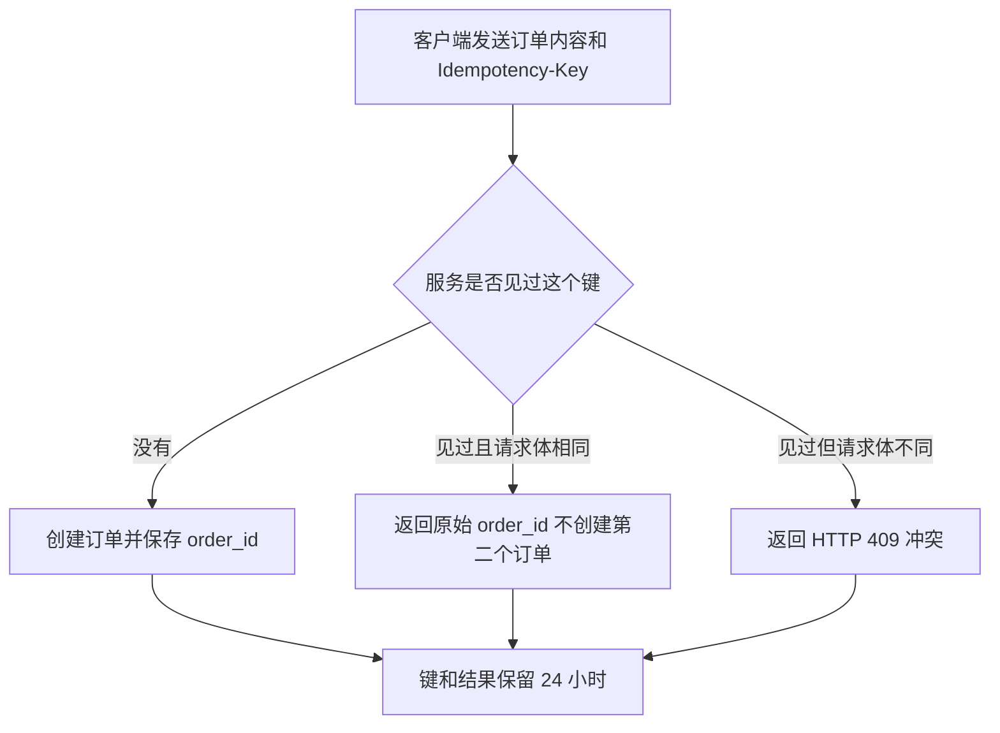

# vNext 1.1 首批候选锚点审核包

本审核包包含 12 个由 Codex 生成的候选版本；所有案例的状态都是 `candidate`，并且 `approved_by_user` 均为 `false`

请对每个案例给出接受、拒绝或修改意见；系统只有在收到你的明确判断后，才能把接受版本复制到金标区

## CANDIDATE-01

任务配置：`TRANSFORM + NONE`；类型为 `faithful_transform`

用户请求：

> 把这段状态说明改得更清楚，不增加新信息

原始材料：

本次导出包含 18 个文件。由于网络中断，上传步骤尚未开始。请保留本地压缩包，恢复网络后重新上传。

候选答案：

本次已经导出 18 个文件；网络中断导致上传尚未开始；请先保留本地压缩包，网络恢复后再重新上传

审核问题：

- 是否完整保留了 18 个文件、网络中断、尚未上传和后续动作
- 状态、原因和下一步是否按照自然顺序展开
- 是否存在你不愿意阅读的压缩或断句

## CANDIDATE-02

任务配置：`TRANSFORM + NONE`；类型为 `faithful_transform`

用户请求：

> 把条款改成普通读者能顺着读懂的中文，不增加法律结论

原始材料：

许可证在客户付清全部到期费用后生效；如果客户在到期后 30 天内仍未付款，授权自动终止，但已经产生的付款义务不受影响。

候选答案：

客户付清全部到期费用后，许可证才会生效；如果到期后 30 天仍未付款，授权会自动终止；授权终止不会免除已经产生的付款义务

审核问题：

- 是否保持了条件、期限、终止结果和付款义务之间的法律关系
- 拆句以后是否比原文更容易顺着理解
- 是否出现了原文没有授权的法律解释

## CANDIDATE-03

任务配置：`TRANSFORM + GLOSS`；类型为 `glossed_transform`

用户请求：

> 改写快速检查说明，并解释新手完成操作必须知道的术语

原始材料：

运行 `npm run check`。发现失效链接时，命令以退出码 `2` 结束，CI 会把本次检查标记为失败。

候选答案：

运行下面的命令检查项目链接

```powershell
npm run check # npm 会调用项目中已经登记的 check 检查脚本；命令结束后会返回检查结果
```

`npm` 是项目调用已登记脚本的命令行工具；如果检查发现失效链接，命令会以退出码 `2` 结束；退出码是命令返回给操作系统的数字状态，`2` 让本地脚本和 CI 持续集成流程识别本次检查失败；CI 会在代码提交后自动运行同一类检查，但这段说明没有证明当前项目已经启用 CI

审核问题：

- 新手是否能理解 npm、退出码 2 和 CI 分别是什么
- 解释是否保持了原文的失败关系，没有声称自动修复
- 代码注释是否说明了命令、原因和可观察结果

## CANDIDATE-04

任务配置：`TRANSFORM + GLOSS`；类型为 `glossed_transform`

用户请求：

> 保留接口含义，解释普通读者判断结果需要知道的术语

原始材料：

`POST /tasks` 返回 HTTP `202` 和 `task_id`。客户端随后使用 `task_id` 查询处理状态。返回 `202` 不表示任务已经处理成功。

候选答案：

客户端向 `POST /tasks` 发送创建任务请求后，服务会返回 HTTP 超文本传输协议（Hypertext Transfer Protocol）状态码 `202` 和 `task_id`；`202` 表示服务已经接收请求并开始安排处理，任务此时仍未完成；`task_id` 是服务为本次任务分配的查询标识，客户端需要用它继续查询处理状态；只有后续状态明确显示成功，才能确认任务已经处理完成

审核问题：

- HTTP、202 和 task_id 是否解释到可以判断任务状态
- 是否清楚区分请求已接收与任务最终成功
- 术语解释是否过重或仍然不足

## CANDIDATE-05

任务配置：`TRANSLATE + EXPLANATORY`；类型为 `explanatory_translation`

用户请求：

> 完整翻译，并补充零基础读者理解实验范围所需的背景

原始材料：

A two-flop synchronizer was inserted on each single-bit control signal crossing from clk_a to clk_b. The experiment did not evaluate multi-bit buses or asynchronous reset deassertion.

候选答案：

原文完整翻译如下

研究人员在每个从 `clk_a` 时钟域进入 `clk_b` 时钟域的单比特控制信号上加入了两级触发器同步器；这项实验没有评估多比特总线，也没有评估异步复位解除过程

理解这一结论需要知道：时钟域表示由同一时钟控制的一组电路；信号从一个时钟域进入另一个时钟域时，接收端可能在不稳定时刻采样信号；两级触发器同步器常用于降低单比特控制信号把这种不稳定状态继续传播的风险

这项结果的适用范围只包括原文处理的单比特控制信号；多比特数据需要考虑各位是否同时保持一致，异步复位解除还需要单独检查释放时序；这些背景用于说明原文为什么明确排除了两类对象，不表示作者已经完成相应验证

审核问题：

- 原文的方向、对象和两个未评估范围是否全部保留
- 补充背景是否帮助理解，同时没有伪装成作者结论
- 零基础读者是否仍需要解释时钟、触发器或复位

## CANDIDATE-06

任务配置：`TRANSLATE + EXPLANATORY`；类型为 `explanatory_translation`

用户请求：

> 完整翻译条款，并解释普通读者容易混淆的暂停、终止和费用关系

原始材料：

The Supplier may suspend access if an invoice remains unpaid for more than 15 days after its due date. Suspension does not terminate this Agreement or waive accrued fees. The Supplier must restore access within two business days after receiving full payment.

候选答案：

完整翻译如下

如果发票在到期日后超过 15 天仍未付款，供应商可以暂停客户访问服务；暂停访问不会终止本协议，也不会免除已经产生的费用；供应商收到全部付款后，必须在两个工作日内恢复访问

这里的暂停访问表示暂时停止使用服务，协议本身仍然有效；终止协议则表示结束协议关系，两者的法律效果不同；已经产生的费用仍需支付；两个工作日从供应商收到全部付款后开始计算，但哪些日期属于工作日需要按照合同其他条款确认

审核问题：

- 可以、必须、超过 15 天和两个工作日的强度是否保持
- 暂停、终止和已产生费用之间的关系是否更清楚
- 工作日边界是否诚实保留为需要查合同其他条款

## CANDIDATE-07

任务配置：`TRANSFORM + TEACHING`；类型为 `teaching_transform`

用户请求：

> 保留全部工程状态，把它改写成没有 FPGA 经验的人也能判断是否可以发布的说明

原始材料：

软件综合和时序分析已通过；位流已经生成；开发板尚未上电，外设和物理接口未测试；当前结果不能批准产品发布。

候选答案：

## 1. 当前已经完成什么

软件综合和时序分析已经通过；综合把硬件设计转换成 FPGA 可以实现的逻辑结构，时序分析检查这些逻辑在设定时钟约束下能否按时工作；位流也已经生成，位流是准备写入 FPGA 的配置文件

## 2. 当前还没有完成什么

开发板尚未上电；真实供电、时钟、外设和物理接口都没有经过运行测试；软件检查通过只能说明设计已经完成规定的软件处理，不能证明真实硬件环境已经正常工作


图 1. 软件结果与产品发布之间仍缺少的验证步骤

## 3. 现在能够得出什么结论

当前可以保存软件流程和位流生成结果；当前不能批准产品发布；下一步需要在真实开发板上完成上电、外设和物理接口测试，再根据测试证据决定是否发布

审核问题：

- 零基础读者是否能区分软件流程、位流和真实板卡测试
- 流程图是否帮助理解，而非重复正文
- 完成范围、未完成范围和发布结论是否保持原文强度
- 解释长度是否达到可读与充分之间的平衡

## CANDIDATE-08

任务配置：`TRANSFORM + TEACHING`；类型为 `teaching_transform`

用户请求：

> 完整保留接口规则，并从零解释幂等键怎样防止重复创建订单

原始材料：

创建订单时必须发送 `Idempotency-Key`。24 小时内，使用同一键重复发送相同请求时，服务返回原始 `order_id`，不会创建第二个订单。使用同一键发送不同请求体时，服务返回 HTTP `409`。键在 24 小时后失效。

候选答案：

## 1. 幂等键是什么

`Idempotency-Key` 幂等键是客户端为一次创建订单操作生成的唯一标识；它的用途是让服务认出重复提交仍然属于同一次业务操作，避免网络重试创建两个订单

## 2. 服务怎样处理请求



图 1. 幂等键在 24 小时窗口内的处理流程

第一次请求使用新键时，服务创建订单并返回 `order_id`；24 小时内，如果网络重试使用同一键和相同请求体，服务返回第一次创建的 `order_id`，不会创建第二个订单；如果同一键对应的请求体发生变化，服务返回 HTTP 超文本传输协议（Hypertext Transfer Protocol）状态码 `409`，表示新请求与该键已经保存的内容冲突

## 3. 使用边界

创建订单时必须发送幂等键；同一次业务操作的重试必须复用同一个键和同一份请求体；键在 24 小时后失效，原文没有保证失效后再次提交仍会返回原订单

审核问题：

- 零基础读者是否能理解键、请求体、order_id 和 409 的关系
- 流程图是否准确覆盖首次请求、相同重试和冲突分支
- 24 小时边界是否清楚且没有扩大承诺
- 说明是否过长或仍缺少实际使用细节

## CANDIDATE-09

任务配置：`EXPLAIN + TEACHING`；类型为 `image_explanation`

用户请求：

> 把图中每个影响理解的元素讲清楚，并区分可见事实、背景知识和图中没有证明的内容

原始材料：

```json
{
  "path": "evals/candidate/assets/CANDIDATE-09-clock-crossing.svg",
  "effective_elements": [
    "蓝色 clk_a 时钟域",
    "绿色 clk_b 时钟域",
    "control 圆形信号源",
    "从左向右的箭头",
    "跨时钟域标签",
    "FF1 方框",
    "FF2 方框",
    "两级触发器同步器标签",
    "图中没有展示多比特总线提示"
  ]
}
```

候选答案：

这张图展示一个名为 `control` 的单比特控制信号怎样从 `clk_a` 时钟域进入 `clk_b` 时钟域；阅读顺序从左向右

理解图片以前需要知道：时钟域是由同一时钟控制的一组电路；触发器会在时钟边沿采样输入；信号进入另一个时钟域时，接收端可能在不稳定时刻采样

图中的有效元素分别表示：

- 蓝色区域：`clk_a` 时钟域；它是 `control` 信号的起点
- 白色圆形 `control`：需要跨越时钟域的单比特控制信号
- 中间黑色箭头：信号从左向右传递，箭头上的“跨时钟域”说明它离开 `clk_a` 并进入 `clk_b`
- 灰色 `FF1`：`clk_b` 一侧的第一级触发器；它先接收跨域信号
- 灰色 `FF2`：第二级触发器；它接收 `FF1` 的输出
- 绿色区域：`clk_b` 时钟域；`FF2` 的输出在这个时钟域中继续使用
- 蓝色和绿色：只用于区分两个时钟域，图中没有赋予颜色额外的成功或风险等级
- 橙色提示：图中没有展示多比特总线，因此不能把这张图直接解释成多比特数据跨域方案

从连接关系可以直接得到：`control` 先经过 `FF1`，再经过 `FF2`；背景资料说明，这种两级触发器结构常用于降低单比特控制信号把亚稳态继续传播到后续逻辑的风险

这张图只说明结构和信号方向；它没有提供时钟频率、复位方式、仿真结果、板卡测试或故障率数据，因此不能证明电路已经验证，也不能证明风险已经完全消除

审核问题：

- 图中每个有效元素是否都有解释落点
- 可见事实、背景知识和证据边界是否分得清
- 解释是否足够让零基础读者知道从哪里开始看
- 逐项覆盖是否过长或仍有遗漏

## CANDIDATE-10

任务配置：`EXPLAIN + TEACHING`；类型为 `table_explanation`

用户请求：

> 逐列、逐行和逐格解释表格，并说明它支持和不支持什么结论

原始材料：

| 版本 | 软件检查 | 板卡测试 | 发布条件 |
| --- | --- | --- | --- |
| A | 通过 | 未运行 | 不满足 |
| B | 通过 | 通过 | 满足 |

候选答案：

| 版本 | 软件检查 | 板卡测试 | 发布条件 |
| --- | --- | --- | --- |
| A | 通过 | 未运行 | 不满足 |
| B | 通过 | 通过 | 满足 |

表 1. 版本 A 与版本 B 的验证状态和发布条件

这张表回答两个版本是否完成本案例规定的发布前检查；发布条件要求软件检查和板卡测试同时通过

四列分别表示：

- 版本：当前比较的结果对象
- 软件检查：设计是否通过规定的软件验证
- 板卡测试：真实硬件是否已经运行测试
- 发布条件：前两项是否同时通过

版本 A 的 3 个结果格分别表示：

- 软件检查为“通过”：规定的软件验证已经完成
- 板卡测试为“未运行”：这项测试尚未开始，不能解释成测试失败
- 发布条件为“不满足”：缺少板卡通过证据，因此当前不能按本案例规则进入发布

版本 B 的 3 个结果格分别表示：

- 软件检查为“通过”：规定的软件验证已经完成
- 板卡测试为“通过”：真实硬件测试已经完成并通过
- 发布条件为“满足”：两项前置检查同时通过

两行比较显示，A 与 B 的差异来自板卡测试状态；表格支持“B 满足本案例发布条件，A 不满足”的判断；它没有提供性能、可靠性或安全认证数据，也没有说明 B 已经实际发布

审核问题：

- 四列、两行和 6 个结果格是否全部解释
- 未运行是否清楚区分于失败
- 比较结论是否有数据支持且没有扩大成正式发布或性能结论
- 小表逐格解释是否显得过重

## CANDIDATE-11

任务配置：`EXPLAIN + TEACHING`；类型为 `code_explanation`

用户请求：

> 逐块解释代码，让第一次使用 PowerShell 的人知道输入、原因、结果、失败表现和副作用

原始材料：

param([string]$Path)
if (-not (Test-Path -LiteralPath $Path -PathType Leaf)) { exit 2 }
Get-FileHash -Algorithm SHA256 -LiteralPath $Path

候选答案：

这段代码使用 PowerShell 命令行与自动化环境；它接收一个文件路径，先确认路径指向真实文件，再计算该文件的 SHA-256 内容摘要；摘要可以用于比较两份文件内容是否一致，脚本不会修改原文件

```powershell
param([string]$Path) # 接收调用者提供的文件路径；string 表示这个输入按文字保存

# 先确认路径存在并且指向文件；-LiteralPath 按原样读取路径，避免把方括号等字符当成匹配符
if (-not (Test-Path -LiteralPath $Path -PathType Leaf)) {
    exit 2 # 路径不存在或不是文件时立即结束；退出码 2 让外部脚本或 CI 识别本次检查失败
}

# 读取文件内容并计算 SHA-256 摘要；成功时屏幕会显示算法、摘要值和文件路径
Get-FileHash -Algorithm SHA256 -LiteralPath $Path
```

运行时需要把 `$Path` 换成要检查的文件路径；如果路径有效，PowerShell 输出固定长度的摘要值；如果路径不存在或指向目录，脚本不会继续读取内容，并以退出码 `2` 结束

这种写法的副作用是读取目标文件，运行时间会随文件大小增加；它不会写入或删除目标文件；摘要相同可以作为内容一致的强证据，但这段代码没有校验文件来源，也不能说明文件本身安全

审核问题：

- 第一次使用 PowerShell 的读者是否知道 Path、LiteralPath、Leaf、exit 2 和 SHA-256 的作用
- 代码注释是否说明原因和可观察结果，而非逐字翻译
- 副作用和证据边界是否清楚
- 解释是否存在无必要细节

## CANDIDATE-12

任务配置：`TRANSFORM + GLOSS`；类型为 `multi_turn`

用户请求：

> 结合两轮要求生成客户状态说明，保留状态码和任务标识，不承诺完成时间

原始材料：

```json
{
  "turn_1_material": "状态码 31 表示队列已经接收任务，处理尚未开始；任务标识 JOB-204 用于查询；自动重试上限为 3 次。",
  "turn_1_request": "把状态说明写给客户",
  "turn_2_request": "客户完全不懂技术；保留状态码 31 和 JOB-204；不要承诺完成时间；增加客户下一步"
}
```

候选答案：

您的任务已经进入等待处理队列，当前状态码为 `31`；这个状态表示系统已经接收任务，但实际处理尚未开始

任务标识为 `JOB-204`；它用于查询同一个任务的后续状态，请保留该标识，无需重复提交

如果后续处理失败，系统最多会自动重试 `3` 次；重试次数表示系统再次尝试的上限，不代表任务一定成功，也不能据此确定完成时间

您现在不需要执行其他操作；需要查看进度时，请使用 `JOB-204` 查询

审核问题：

- 第二轮要求是否正确覆盖并且没有丢失第一轮事实
- 客户是否能理解状态码、任务标识、队列和重试上限
- 下一步是否可执行且没有承诺完成时间
- 最后一句是否增加了原材料没有授权的处理建议
