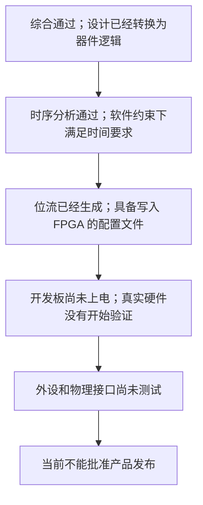
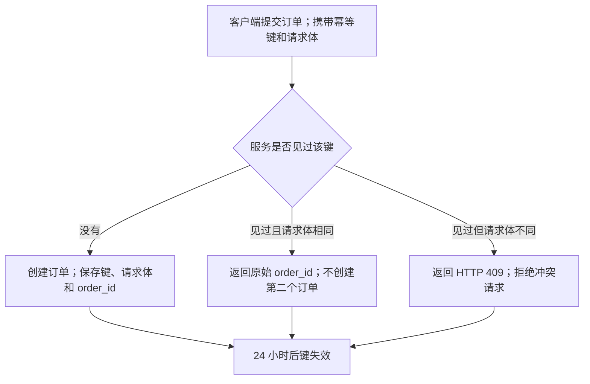
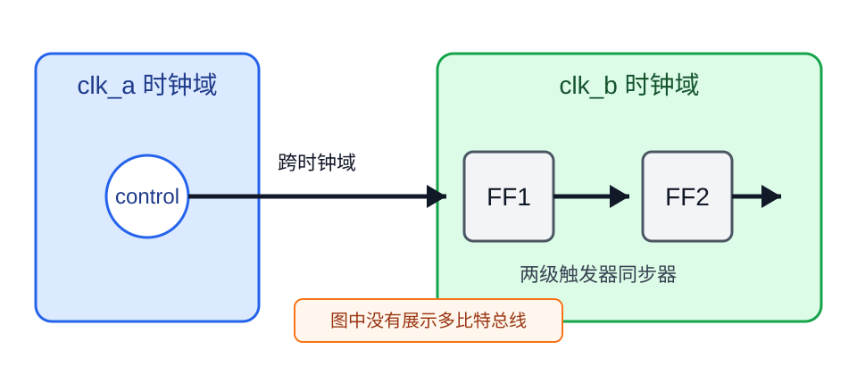

# vNext 1.1 第二轮候选审核包

本审核包包含 10 个根据首轮用户反馈修订的 R2 候选；所有案例的状态仍为 `candidate`，`approved_by_user` 仍为 `false`

自动检查只确认来源映射、结构和已登记硬规则；请逐项决定接受、拒绝或继续修改，系统收到明确判断后才能把接受版本转入金标区

## 1. CANDIDATE-03-R2

任务配置：`TRANSFORM + GLOSS`；类型为 `glossed_transform`

用户请求：

> 改写快速检查说明，并解释新手完成操作必须知道的术语

原始材料：

运行 `npm run check`。发现失效链接时，命令以退出码 `2` 结束，CI 会把本次检查标记为失败。

R2 候选答案：

运行下面的命令检查项目中的链接：

```powershell
npm run check # 调用项目已经登记的 check 脚本；命令结束后会显示检查结果
```

npm 包管理器是 Node.js 生态中用于安装、更新、管理和发布 JavaScript 或 TypeScript 软件包与依赖的命令行工具和软件仓库；这里的 `run check` 会调用当前项目已经登记为 `check` 的脚本，不会自动决定检查内容

如果检查发现失效链接，命令会以退出码 `2` 结束；退出码是命令返回给操作系统的数字状态，调用脚本可以据此识别本次检查失败

CI 持续集成（Continuous Integration）是开发者提交代码后自动执行构建、测试和检查，从而尽早发现代码集成问题的一套开发流程；CI 可以读取退出码 `2` 并把本次检查标记为失败，但现有说明没有证明当前项目已经启用 CI，需要查看项目的自动化配置才能确认

首轮拒绝原因：

- npm 与 CI 的首次解释深度不足
- 术语没有使用正式形式和自然用途说明
- 多个独立主题挤在同一段

本轮复审要点：

- 独立案例中的 known_terms 必须为空
- npm 保持官方小写并说明包管理用途
- CI 首次出现时解释提交、构建、测试和集成问题
- 独立主题换行

请给出一个明确决定：接受、拒绝，或指出需要修改的具体位置与原因

## 2. CANDIDATE-04-R2

任务配置：`TRANSFORM + GLOSS`；类型为 `glossed_transform`

用户请求：

> 保留接口含义，解释普通读者判断结果需要知道的术语

原始材料：

`POST /tasks` 返回 HTTP `202` 和 `task_id`。客户端随后使用 `task_id` 查询处理状态。返回 `202` 不表示任务已经处理成功。

R2 候选答案：

`POST /tasks` 表示向服务器的 `/tasks` 地址发送 POST 请求，用来创建并提交一个新任务

服务会借助 HTTP 超文本传输协议（Hypertext Transfer Protocol）返回状态码 `202` 和 `task_id`；HTTP 是客户端与服务器交换接口请求和响应时使用的通信协议，`task_id` 是服务为本次任务分配的查询标识

状态码 `202` 表示服务器已经接收请求，但处理尚未完成，甚至可能尚未开始；客户端需要继续使用 `task_id` 查询任务状态，因为 `202` 不能证明任务最终成功

首轮拒绝原因：

- POST /tasks 没有解释请求方法与地址的实际作用
- HTTP 的解释没有自然嵌入后续行为

本轮复审要点：

- 解释 POST /tasks 用于向 /tasks 地址提交新任务
- HTTP 首次出现时保留正式全称并用后文说明通信用途
- 202 不得扩写成任务已经开始

请给出一个明确决定：接受、拒绝，或指出需要修改的具体位置与原因

## 3. CANDIDATE-05-R2

任务配置：`TRANSLATE + EXPLANATORY`；类型为 `explanatory_translation`

用户请求：

> 完整翻译，并补充零基础读者理解实验范围所需的背景

原始材料：

A two-flop synchronizer was inserted on each single-bit control signal crossing from clk_a to clk_b. The experiment did not evaluate multi-bit buses or asynchronous reset deassertion.

R2 候选答案：

从 `clk_a` 进入 `clk_b` 的每一个单比特控制信号都加入了两级触发器同步器；本次实验没有评估多比特总线，也没有评估异步复位解除

理解这一结论需要知道：

- 时钟域表示由同一时钟控制的一组电路
- 信号从一个时钟域进入另一个时钟域时，两个时钟通常没有固定的相位关系；信号变化可能恰好落在接收端触发器的采样边沿附近，违反建立时间（Setup Time）或保持时间（Hold Time）要求，使触发器短暂进入亚稳态（Metastability），此时输出无法立即稳定为明确的 `0` 或 `1`
- 两级触发器同步器用于降低这种不稳定状态继续传播的风险
  - 第一级触发器先接收跨时钟域信号；它最可能遇到建立时间或保持时间被破坏的问题，因此即使进入亚稳态，也先把不确定性限制在第一级，并利用后续一个时钟周期争取恢复为稳定的 `0` 或 `1`
  - 第二级触发器只采样第一级经过一段恢复时间后的输出；这样可以大幅降低后续逻辑采到亚稳态的概率，从而减少误触发、错误判断或状态机异常

这项结果只适用于原文实际处理的单比特控制信号，不能直接推广到其他跨时钟域场景

对于多比特数据，除了保证每个比特能够稳定采样，还需要保证多个比特属于同一次数据变化，避免接收端组合出来自不同时刻的值；本次实验没有检查这种一致性

对于异步复位信号，即使复位可以异步进入，解除复位时仍需检查释放时序，避免不同触发器在不一致的时刻退出复位；本次实验没有完成这项检查

这些背景用于解释原文为什么排除多比特总线和异步复位解除；它们不表示作者已经针对这两类情况完成设计或验证，后续仍需分别执行多比特跨域检查和复位解除检查

首轮拒绝原因：

- 包含空洞引导句
- 冒号后的多个先验概念没有换行缩进
- 时钟域跨越、建立时间、保持时间和亚稳态解释过浅
- 不同主题没有分段

本轮复审要点：

- 删除空洞引导句
- 冒号后两个以上项目换行
- 解释两级触发器同步器的两级作用
- 多比特数据、异步复位和证据边界分别成段

请给出一个明确决定：接受、拒绝，或指出需要修改的具体位置与原因

## 4. CANDIDATE-06-R2

任务配置：`TRANSLATE + EXPLANATORY`；类型为 `explanatory_translation`

用户请求：

> 完整翻译条款，并解释普通读者容易混淆的暂停、终止和费用关系

原始材料：

The Supplier may suspend access if an invoice remains unpaid for more than 15 days after its due date. Suspension does not terminate this Agreement or waive accrued fees. The Supplier must restore access within two business days after receiving full payment.

R2 候选答案：

如果发票在到期日后超过 15 天仍未付款，供应商可以暂停客户访问服务；这里的“可以”表示供应商有权选择暂停，不表示到期后必须自动暂停

暂停访问不会终止本协议，也不会免除原协议已经产生的费用；暂停访问只是暂时停止使用服务，协议关系仍然有效，终止协议才表示结束协议关系，因此两者的法律效果不同

供应商收到全部付款后，必须在两个工作日内恢复访问；两个工作日从收到全部付款后开始计算，但哪些日期属于工作日仍需按照合同中对工作日的定义核对，当前条款本身不能确定周末和节假日是否计入

首轮拒绝原因：

- 已经产生的费用缺少明确所属主体
- 工作日计算边界需要连接合同其他条款

本轮复审要点：

- 写明原协议已经产生的费用仍需支付
- 说明两个工作日从收到全部付款后计算
- 工作日定义不明时指出核对位置

请给出一个明确决定：接受、拒绝，或指出需要修改的具体位置与原因

## 5. CANDIDATE-07-R2

任务配置：`TRANSFORM + TEACHING`；类型为 `teaching_transform`

用户请求：

> 保留全部工程状态，把它改写成没有 FPGA 经验的人也能判断是否可以发布的说明

原始材料：

软件综合和时序分析已通过；位流已经生成；开发板尚未上电，外设和物理接口未测试；当前结果不能批准产品发布。

R2 候选答案：

FPGA 现场可编程门阵列（Field-Programmable Gate Array）是一种可以通过配置文件改变内部逻辑和连线的芯片；当前设计已经完成软件侧处理，但还没有在真实开发板上验证

软件侧已经完成：

- 综合（Synthesis）已经通过；综合负责把 Verilog、VHDL 等硬件描述转换成 FPGA 内部可以实现的逻辑结构，例如查找表、触发器和存储资源
- 时序分析（Timing Analysis）已经通过；时序分析检查逻辑之间的信号传播能否满足设定的时钟频率和时序约束，确保数据在规定时间内到达并被采样
- 位流（Bitstream）已经生成；位流是写入 FPGA 后配置其内部逻辑和连线，使芯片按照当前设计运行的配置文件



图 1. 软件验证与硬件验证的先后关系

图中的前三个节点表示软件工具已经完成综合、时序分析和位流生成；后两个节点说明真实开发板尚未上电，外设和物理接口也没有测试，因此现有证据只覆盖软件流程，不能证明设计在真实供电、时钟和接口条件下正常工作

当前可以保存软件流程验证结果和已经生成的位流文件；这些材料证明设计在当前工具与约束条件下完成了软件侧流程，但不能批准产品正式发布

下一步需要把位流写入开发板，并完成上电启动、外设通信、物理接口和实际运行行为测试；取得这些硬件测试证据后，才能根据结果判断是否满足正式发布条件

首轮拒绝原因：

- FPGA、综合、时序分析和位流解释不足
- Mermaid 使用横向布局
- 图后缺少详细讲解
- 发布边界缺少形成原因、实际影响和验证动作

本轮复审要点：

- Mermaid 默认使用 TD
- 解释 FPGA 及软件侧各阶段
- 图后说明节点关系、流程结果和边界
- 写明板卡测试项目和满足发布条件的证据

请给出一个明确决定：接受、拒绝，或指出需要修改的具体位置与原因

## 6. CANDIDATE-08-R2

任务配置：`TRANSFORM + TEACHING`；类型为 `teaching_transform`

用户请求：

> 完整保留接口规则，并从零解释幂等键怎样防止重复创建订单

原始材料：

创建订单时必须发送 `Idempotency-Key`。24 小时内，使用同一键重复发送相同请求时，服务返回原始 `order_id`，不会创建第二个订单。使用同一键发送不同请求体时，服务返回 HTTP `409`。键在 24 小时后失效。

R2 候选答案：

创建订单时，客户端必须发送 `Idempotency-Key` 请求字段；它承载幂等键（Idempotency Key），也就是客户端为同一次业务操作生成并在重试时重复使用的标识，使服务器能够把网络重试识别为原操作，而不是新订单

同一次业务操作的重试需要同时保持：

- 使用同一个 `Idempotency-Key`
- 使用与第一次完全相同的请求体

在第一次请求后的 24 小时内，服务会保存该键与首次结果的对应关系；同键同请求体的重试会返回原始 `order_id`，也就是第一次创建订单时生成的订单标识，不会创建第二个订单



图 1. 幂等键在 24 小时窗口内处理首次请求与重试的方式

图中的判断节点先比较键是否已经出现，再比较请求体是否一致；同键同请求体返回原订单，同键不同请求体返回 HTTP 状态码 `409`，因为服务无法把内容不同的请求安全地视为同一次操作

键在 24 小时后失效；原文没有说明失效后的保留策略，因此不能保证再次提交仍会返回原始 `order_id`，需要查询接口的失效后行为说明，或在客户端避免超过有效期后盲目重试

首轮拒绝原因：

- 幂等键缺少正式形式、名称由来和业务作用
- 流程图没有追加解释
- 重试、请求体、24 小时失效和原订单边界挤在同一段
- order_id 没有解释

本轮复审要点：

- 解释幂等键如何让服务器识别重复业务操作
- 解释 order_id 是订单标识
- 图后说明重试关系和失效边界
- 不同规则分段

请给出一个明确决定：接受、拒绝，或指出需要修改的具体位置与原因

## 7. CANDIDATE-09-R2

任务配置：`EXPLAIN + TEACHING`；类型为 `image_explanation`

用户请求：

> 把图中每个影响理解的元素讲清楚，并区分可见事实、背景知识和图中没有证明的内容

原始材料：

```json
{
  "path": "evals/candidate/assets/CANDIDATE-09-clock-crossing.svg",
  "effective_elements": [
    "蓝色 clk_a 时钟域",
    "绿色 clk_b 时钟域",
    "control 圆形信号源",
    "从左向右的箭头",
    "跨时钟域标签",
    "FF1 方框",
    "FF2 方框",
    "两级触发器同步器标签",
    "图中没有展示多比特总线提示"
  ]
}
```

R2 候选答案：



图 1. 单比特控制信号从 `clk_a` 进入 `clk_b` 的两级同步路径

这张图展示一个名为 `control` 的单比特控制信号怎样从蓝色的 `clk_a` 时钟域进入绿色的 `clk_b` 时钟域，并依次经过 `FF1` 和 `FF2` 两个触发器

理解图片需要知道：

- 时钟域是由同一时钟控制的一组电路；蓝色与绿色区域用于区分两个时钟域，不表示电压、风险等级或测试结果
- 触发器是在时钟边沿采样输入并保存一位状态的电路元件；`FF1` 和 `FF2` 的方框表示两个先后连接的触发器

图中的有效元素分别承担以下作用：

- `control` 圆形信号源位于左侧蓝色区域，表示信号从 `clk_a` 时钟域产生
- 从左向右的箭头表示信号传播方向；信号先跨越时钟域边界进入 `FF1`，再由 `FF1` 进入 `FF2`
- `FF1` 是接收端的第一级触发器；它先承受异步到达信号可能带来的亚稳态风险，并给信号一个时钟周期恢复
- `FF2` 是第二级触发器；它采样第一级经过恢复时间后的输出，从而降低不稳定状态继续传播到后续逻辑的概率
- 底部提示写明图中没有展示多比特总线；这限制了图片能够支持的结论范围

从连接关系可以直接看出，`control` 先经过 `FF1`，再经过 `FF2`；结合背景知识可以解释这是一条常见的单比特同步路径，但图片本身没有显示波形、时序约束、仿真结果或真实板卡测量数据

因此，这张图没有证明电路已经通过仿真、板卡验证或所有跨时钟检查；缺少这些证据会影响对实际可靠性的判断，下一步应检查时序与 CDC 报告，并通过仿真或板卡测试核对实际行为

首轮拒绝原因：

- 原图必须保留在解释前
- 先验知识列表没有换行和加深
- 图中元素只解释外观而未解释功能
- 单项说明不应使用冒号
- 边界缺少证据缺口和下一步

本轮复审要点：

- 原图先于解释
- 解释有效元素的外观、功能、连接和实际作用
- 区分可见事实、背景和推断
- 边界包含缺失证据、重要性和验证方法

请给出一个明确决定：接受、拒绝，或指出需要修改的具体位置与原因

## 8. CANDIDATE-10-R2

任务配置：`EXPLAIN + TEACHING`；类型为 `table_explanation`

用户请求：

> 逐列、逐行和逐格解释表格，并说明它支持和不支持什么结论

原始材料：

| 版本 | 软件检查 | 板卡测试 | 发布条件 |
| --- | --- | --- | --- |
| A | 通过 | 未运行 | 不满足 |
| B | 通过 | 通过 | 满足 |

R2 候选答案：

| 版本 | 软件检查 | 板卡测试 | 发布条件 |
| --- | --- | --- | --- |
| A | 通过 | 未运行 | 不满足 |
| B | 通过 | 通过 | 满足 |

表 1. 版本 A 与版本 B 的发布条件比较

这张表回答版本 A 和版本 B 是否满足本案例定义的发布条件；本案例要求软件检查和板卡测试都通过，缺少其中任何一项都不能判定为满足

各列含义如下：

- “版本”列标识被比较的设计版本，本表包含 A 和 B
- “软件检查”列记录软件侧检查结果，可见值为“通过”
- “板卡测试”列记录真实硬件是否完成测试，可见值包括“未运行”和“通过”；“未运行”表示尚无测试结果，不等于测试失败
- “发布条件”列根据前两项检查给出“满足”或“不满足”

每一行代表一个完整版本；A 与 B 的软件检查都通过，真正改变结论的是板卡测试，A 尚未运行，所以发布条件不满足，B 已通过，所以按照本表规则满足发布条件

表格只支持判断两个版本是否满足本案例列出的软件检查和板卡测试条件；表格缺少性能、可靠性或安全认证数据，也没有证明版本 B 已经正式发布，下一步仍需核对项目是否还有表外发布要求，并保留对应测试证据

首轮拒绝原因：

- 小表格逐格复述过重
- 结论和证据边界不够清楚

本轮复审要点：

- 一次定义每列、每行和允许值
- 只单独解释异常值、歧义值和关键格
- 内部账本仍覆盖全部数据格
- 结论包含比较依据、影响、缺失证据和下一步

请给出一个明确决定：接受、拒绝，或指出需要修改的具体位置与原因

## 9. CANDIDATE-11-R2

任务配置：`EXPLAIN + TEACHING`；类型为 `code_explanation`

用户请求：

> 逐块解释代码，让第一次使用 PowerShell 的人知道输入、原因、结果、失败表现和副作用

原始材料：

param([string]$Path)
if (-not (Test-Path -LiteralPath $Path -PathType Leaf)) { exit 2 }
Get-FileHash -Algorithm SHA256 -LiteralPath $Path

R2 候选答案：

下面先保留原始 PowerShell 代码；PowerShell 是可用于 Windows、Linux 和 macOS 的命令行与自动化环境，本段脚本接收一个文件路径，确认目标确实是文件，再计算文件摘要

```powershell
param([string]$Path)
if (-not (Test-Path -LiteralPath $Path -PathType Leaf)) { exit 2 }
Get-FileHash -Algorithm SHA256 -LiteralPath $Path
```

下面的等价版本加入中文注释，帮助第一次使用 PowerShell 的读者理解每一步：

```powershell
param([string]$Path) # 接收 Path 参数；string 是按顺序保存字符的字符串类型，因此这里用它接收文件路径
if (-not (Test-Path -LiteralPath $Path -PathType Leaf)) { exit 2 } # 按原样检查路径且要求目标是文件；不满足时返回退出码 2，让调用方识别失败
Get-FileHash -Algorithm SHA256 -LiteralPath $Path # 读取文件内容并计算 SHA-256 摘要；成功后显示算法、摘要值和文件路径
```

运行方法：

```powershell
.\Get-CheckedFileHash.ps1 -Path .\example.bin # 把 example.bin 的相对路径传给脚本；文件存在时输出摘要，不存在时以退出码 2 结束
```

关键语法和命令分别承担以下作用：

- `param([string]$Path)` 声明输入参数；`string` 是按顺序保存字符的字符串类型，`$Path` 使用这种类型保存调用者提供的路径
- `Test-Path` 检查路径是否存在；`-LiteralPath` 让 PowerShell 按原样解释路径，避免把方括号等字符当成通配符；`-PathType Leaf` 要求目标是文件而不是目录
- `-not` 把检查结果取反；路径不存在或目标不是文件时，`exit 2` 立即结束脚本，并把数字状态 `2` 返回给调用方
- `Get-FileHash` 读取文件并计算摘要；SHA-256 安全散列算法（Secure Hash Algorithm 256-bit）会把任意长度的内容映射成固定长度摘要，适合比较两个文件的内容是否一致

脚本只读取指定文件，不会修改文件；原因是代码中没有写入或删除命令，可以通过运行前后比较文件摘要与修改时间进一步核对

相同 SHA-256 摘要可以为内容一致提供很强的校验证据，但不能证明文件来源可信或业务内容正确；确认来源还需要数字签名、可信下载渠道或发布方提供的正式摘要

首轮拒绝原因：

- PowerShell 没有解释为命令行与自动化环境
- string 被不准确地解释为文字
- SHA-256 缺少正式名称和用途说明
- 不会修改与不能证明的边界缺少原因、证据缺口和核对方法

本轮复审要点：

- 解释 PowerShell、string 和 SHA-256
- 保留原始代码
- 说明查询或执行方法
- 每个否定边界继续说明原因、缺失证据和核对方法

请给出一个明确决定：接受、拒绝，或指出需要修改的具体位置与原因

## 10. CANDIDATE-12-R2

任务配置：`TRANSFORM + GLOSS`；类型为 `multi_turn`

用户请求：

> 结合两轮要求生成客户状态说明，保留状态码和任务标识，不承诺完成时间

原始材料：

```json
{
  "turn_1_material": "状态码 31 表示队列已经接收任务，处理尚未开始；任务标识 JOB-204 用于查询；自动重试上限为 3 次。",
  "turn_1_request": "把状态说明写给客户",
  "turn_2_request": "客户完全不懂技术；保留状态码 31 和 JOB-204；不要承诺完成时间；增加客户下一步"
}
```

R2 候选答案：

原始状态材料：

> 状态码 31 表示队列已经接收任务，处理尚未开始；任务标识 JOB-204 用于查询；自动重试上限为 3 次。

当前状态码为 `31`，表示系统队列已经接收任务，但处理尚未开始；队列用于按照系统安排保存等待处理的任务，因此“已经接收”不能理解为“正在处理”或“已经完成”

任务标识是 `JOB-204`；它用于区分并查询这一次任务，后续联系服务方或使用项目提供的状态查询入口时都应保留这个标识

如果处理失败，系统最多可以自动重试 `3` 次；重试表示系统再次尝试处理，但次数上限不能保证任务最终成功

现有材料没有提供查询命令、接口地址或预计完成时间；下一步应携带 `JOB-204` 到该服务的状态查询入口核对，若项目没有提供入口，则把这个标识交给服务支持人员查询，当前不能承诺具体完成时间

首轮拒绝原因：

- 原始材料属于代码或结构化技术证据时必须保留在答案中
- 缺少如何使用任务标识查询的说明

本轮复审要点：

- 保留原始参考材料
- 在来源支持时说明查询入口或方法
- 来源没有查询方式时明确证据缺口

请给出一个明确决定：接受、拒绝，或指出需要修改的具体位置与原因
