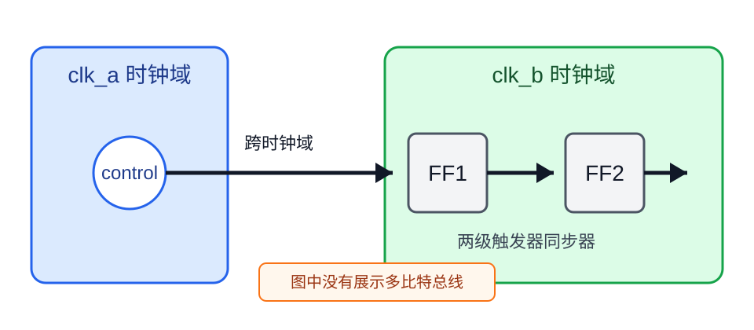
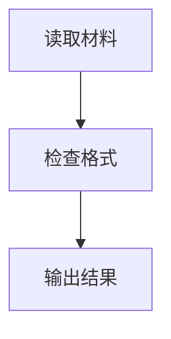

# 顶层格式规则案例

这些手写片段只演示所登记条款，未由干净助手生成，不是完整文档或行为通过证据，也不代表用户接受

条款登记覆盖只证明编号存在，完整任务结果须看独立模型测试

## 1. FMT-CASE-001 短段落的中文句号与句末标点

覆盖规则：`FMT-009`、`FMT-011`、`FMT-015`、`FMT-017`、`FMT-018`、`FMT-019`

### 请求

把短说明改成符合顶层格式的正文

### 原始输入

配置文件缺失。加载因此无法完成。要重新提供文件吗？

### 条款示意片段

配置文件缺失；加载因此无法完成

要重新提供文件吗？

## 2. FMT-CASE-002 长段落直接换行

覆盖规则：`FMT-010`、`FMT-012`、`FMT-016`、`FMT-023`

### 请求

保留长说明的全部信息，并把过长句群改成可读区块

### 原始输入

系统先读取配置并确认运行环境。随后按照配置选择数据源、检查字段、记录缺失值、保留原始顺序、识别冲突条件、核对时间范围和数值单位。完成这些检查后，系统才生成结果。

### 条款示意片段

系统依次完成以下操作

1. 读取配置
2. 确认运行环境
3. 按照配置选择数据源
4. 检查字段
5. 记录缺失值
6. 保留原始顺序
7. 识别冲突条件
8. 核对时间范围
9. 核对数值单位

完成这些检查后，系统才生成结果

## 3. FMT-CASE-003 没有冒号的独立并列项目

覆盖规则：`FMT-020`、`FMT-036`、`FMT-037`、`FMT-038`、`FMT-042`、`FMT-043`

### 请求

把并列动作改为分行结构

### 原始输入

检查输入，保存原文，标记冲突，生成报告

### 条款示意片段

本次处理包含以下动作

- 检查输入
- 保存原文
- 标记冲突
- 生成报告

## 4. FMT-CASE-004 有冒号的嵌套步骤

覆盖规则：`FMT-021`、`FMT-036`、`FMT-039`、`FMT-040`、`FMT-041`、`FMT-043`

### 请求

把带有子步骤的操作说明按语义层级排版

### 原始输入

请按顺序完成：准备环境，安装依赖并检查版本，运行检查并记录失败项

### 条款示意片段

请按顺序完成：

1. 准备环境
2. 安装依赖
   - 检查版本
3. 运行检查
   - 记录失败项

## 5. FMT-CASE-005 冒号伪标题改为 Markdown 标题

覆盖规则：`FMT-026`、`FMT-027`、`FMT-029`、`FMT-030`、`FMT-035`

### 请求

把多个内容区块整理成真正的标题层级

### 原始输入

操作：先备份文件
术语：工作树是当前文件目录
证据边界：只使用已读取的记录

### 条款示意片段

## 操作

先备份文件

## 术语

工作树是当前文件目录

## 证据范围

只使用已读取的记录

## 6. FMT-CASE-006 单块省略标题与多区块对称标题

覆盖规则：`FMT-026`、`FMT-031`、`FMT-032`、`FMT-033`、`FMT-034`

### 请求

单个连续语义块不强制标题，多项独立内容都使用同级标题，并沿用无编号标题体系

### 原始输入

短内容：文件已保存

多主题内容：已完成读取与校验，远端状态未确认，下一步读取远端提交并复核差异

### 条款示意片段

文件已保存

## 当前状态

已完成读取与校验

## 风险

仍需确认远端状态

## 下一步

读取远端提交并复核差异

## 7. FMT-CASE-007 主题分段与列表空白

覆盖规则：`FMT-023`、`FMT-024`、`FMT-025`、`FMT-028`

### 请求

分开无关主题，并删除列表内部的空白

### 原始输入

状态：已完成读取

步骤：
- 读取配置

- 检查文件

风险：远端结果未确认

### 条款示意片段

## 状态

已完成读取

## 步骤

- 读取配置
- 检查文件

## 风险

远端结果未确认

## 8. FMT-CASE-008 中英文混排与可读空格

覆盖规则：`FMT-044`、`FMT-045`、`FMT-046`、`FMT-047`、`FMT-049`

### 请求

修正独立英文和中英文之间的间距

### 原始输入

使用 API 连接Dashboard，再检查JSON文件

### 条款示意片段

使用 API 应用程序接口（Application Programming Interface）连接控制面板（Dashboard），再检查 JSON JavaScript 对象表示法（JavaScript Object Notation）文件

## 9. FMT-CASE-009 普通英文大小写与官方名称

覆盖规则：`FMT-048`、`FMT-050`、`FMT-062`、`FMT-063`、`FMT-064`、`FMT-065`、`FMT-066`

### 请求

修正普通英文名称的大小写，但保留官方专名

### 原始输入

使用 cloud storage 和 github Actions，连接 PostgreSQL

### 条款示意片段

使用云存储（Cloud Storage）和 GitHub 自动化工作流（GitHub Actions），连接数据库系统（PostgreSQL）

## 10. FMT-CASE-010 专业术语首次定义

覆盖规则：`FMT-052`、`FMT-054`、`FMT-055`、`FMT-056`、`FMT-057`、`FMT-059`

### 请求

按完整术语定义合同说明首次出现的专业概念

### 原始输入

材料说明：队列英文为 Queue，保存待处理项目，从一端加入，从另一端取出；本例先到先处理，不按重要性插队

### 条款示意片段

- 队列（Queue）：它是保存等待处理项目的一种排列，作用是让项目按到达顺序等候；加入时把新项目放在末尾，处理时取出最前面的项目，例如先放入甲再放入乙，就先处理甲；它适用于本例中先到先处理的安排，不表示紧急项目可以自动插队

## 11. FMT-CASE-011 带缩写术语与定义内部术语

覆盖规则：`FMT-053`、`FMT-055`、`FMT-056`、`FMT-058`、`FMT-060`

### 请求

按缩写格式定义一个首次出现的专业协议，并在定义内部保持术语全称

### 原始输入

材料说明：FIFO 的全称是 First In First Out，中文为先进先出，它是一种先加入先取出的处理顺序；例子为先放入甲再放入乙，先取出甲，不按紧急程度排序

### 条款示意片段

- FIFO 先进先出（First In First Out）：它是一种先加入的项目先取出的处理顺序，用于让等待项目按到达次序得到处理；处理时从最早加入的项目开始，例如甲先加入、乙后加入，就先取出甲；它适用于按先后顺序处理的场景，不等于按紧急程度决定谁先处理

## 12. FMT-CASE-012 英文不能单独出现在普通正文

覆盖规则：`FMT-044`、`FMT-045`、`FMT-046`、`FMT-048`、`FMT-051`、`FMT-061`

### 请求

把普通正文中的独立英文改成中文与英文配对形式

### 原始输入

Agent 读取 README 后调用 API，并把结果写入 Dashboard

### 条款示意片段

智能代理（Agent）读取项目说明文件（README），调用 API 应用程序接口（Application Programming Interface），并把结果写入控制面板（Dashboard）

未确认官方英文名的术语只保留自然中文，不自行创造英文形式

## 13. FMT-CASE-013 LaTeX 公式的由浅入深解释

覆盖规则：`FMT-067`、`FMT-068`、`FMT-069`、`FMT-070`、`FMT-071`

### 请求

保留公式，用相对大标题和一致的小标题解释符号、组分、算例、结果、边界与正式定义

### 原始输入

准确率为\(A = \frac{c}{n}\)。其中 c 是正确数量，n 是总数量

### 条款示意片段

## 准确率公式

这条公式回答的是全部结果中有多少比例判断正确，例如检查 20 项并通过 18 项，准确率就是九成

$$
A = \frac{c}{n}
$$

### 每个符号代表什么

- `$A$` 表示准确率，是最终得到的比例，通常写成 0 到 1 之间的小数或换算成百分比
- `$c$` 表示判断正确的数量，是分子，必须来自同一批被检查项目
- `$n$` 表示全部被检查项目的数量，是分母，并且必须大于零

### 公式组分怎样理解

- `$c / n$` 表示用正确数量除以总数量，把绝对数量换算成可比较的正确比例

### 代入一个具体例子

若正确数量为 18，总数量为 20，则 `$A = 18 / 20 = 0.9$`，换算成百分比是 90%

### 结果怎样理解

结果越接近 1，表示这批项目中判断正确的比例越高；它只描述所选样本的正确比例，不能单独证明系统在所有场景中同样准确

### 正式定义

准确率是同一评估范围内正确判断数量与全部判断数量的比值，定义域要求总数量大于零

## 14. FMT-CASE-014 块级代码头行注释

覆盖规则：`FMT-003`、`FMT-072`、`FMT-079`、`FMT-082`

### 请求

为一个代码块添加块级说明，并保持可执行代码不变

### 原始输入

保留下面的 Python 代码，只增加块级说明

### 条款示意片段

原始代码

```python
config = load_config(path)
print(config.enabled_items)
```

注释副本

```python
# 读取配置并输出启用的项目
config = load_config(path)
print(config.enabled_items)
```

## 15. FMT-CASE-015 同行注释按代码块独立对齐

覆盖规则：`FMT-073`、`FMT-074`、`FMT-075`、`FMT-076`、`FMT-077`、`FMT-078`、`FMT-079`

### 请求

为每个可注释语句添加同行说明，纯闭合符不添加机械注释

### 原始输入

给下面的代码添加同行注释，并保持注释列一致

### 条款示意片段

```python
records = load_records(path)   # 读取记录
for record in records:         # 逐条处理
    result = normalize(record) # 规范化记录
    save(result)               # 保存结果
```

## 16. FMT-CASE-016 JSON 使用逐行解释回退

覆盖规则：`FMT-080`、`FMT-081`、`FMT-082`

### 请求

不要向 JSON 添加非法注释，改为逐行说明

### 原始输入

解释下面的 JSON，并保持 JSON 原文合法

### 条款示意片段

```json
{
  "name": "demo",
  "enabled": true
}
```

逐行说明

- `{`：对象开始
- `"name": "demo"`：名称为 demo
- `"enabled": true`：启用状态为 true
- `}`：对象结束

## 17. FMT-CASE-017 图片对象、替代文本与题注

覆盖规则：`FMT-013`、`FMT-083`、`FMT-084`、`FMT-085`、`FMT-086`、`FMT-087`、`FMT-088`、`FMT-111`、`FMT-112`、`FMT-114`、`FMT-120`

### 请求

先保留图片，再补充可观察的图片说明和限制

### 原始输入

解释这张流程图，不要凭空推断图中没有显示的机制

### 条款示意片段

<div align="center">



*图 1：图中可见的流程节点与连接关系*

</div>

图中可以确认节点之间存在连接，并能看到流程的方向；无法从图片本身确认每个节点背后的实现机制，也无法仅凭图片确认运行结果

## 18. FMT-CASE-018 表格数据保留与表格外说明

覆盖规则：`FMT-089`、`FMT-090`、`FMT-091`、`FMT-092`、`FMT-093`、`FMT-094`、`FMT-115`、`FMT-116`、`FMT-117`、`FMT-118`、`FMT-119`、`FMT-120`

### 请求

保留原表数据，并把用途、字段和限制放在表格外

### 原始输入

解释下面的比较表，不新增列，不改数字

### 条款示意片段

<div align="center">

<div style="max-width: 100%; overflow-x: auto;">

| 方案 | 延迟 | 状态 |
|---|---:|---|
| A | 10 ms | 可用 |
| B | 25 ms | 待核对 |

</div>

*表 1：两种方案的原始比较数据*

</div>

这张表用于比较两个方案的延迟和状态

- 方案：比较对象名称
- 延迟：以 ms 毫秒（millisecond）为单位的测量值
- 状态：原始记录中的可用性标记

`B` 的状态仍需核对，表格没有说明造成差异的原因

## 19. FMT-CASE-019 逐字引用与日志原样保留

覆盖规则：`FMT-003`、`FMT-014`、`FMT-095`、`FMT-096`、`FMT-097`、`FMT-098`、`FMT-099`

### 请求

保留引用和日志原文，并把解释放在对象外

### 原始输入

引用和日志中的句号都不能改写

### 条款示意片段

> 原文：系统在 09:00 完成检查。

```text
2026-09-07T09:00:00Z check completed.
```

引用保留了原始中文句号，日志保留了原始英文句号；这些字符属于原样材料，不适用普通正文的标点替换

## 20. FMT-CASE-020 Mermaid 与混合媒介的区块顺序

覆盖规则：`FMT-001`、`FMT-002`、`FMT-004`、`FMT-005`、`FMT-006`、`FMT-007`、`FMT-008`、`FMT-022`、`FMT-100`、`FMT-101`、`FMT-102`、`FMT-103`、`FMT-104`、`FMT-105`、`FMT-106`、`FMT-107`、`FMT-108`、`FMT-109`、`FMT-110`

### 请求

对混合媒介结果执行局部复核，保持原始对象并说明无法修复时的处理

### 原始输入

保留流程图、公式和代码，修正说明中的格式错误，不要整段重写

### 条款示意片段

## 处理流程



流程图默认从上到下展示读取、检查和输出三个节点；节点和连接关系保持原样

## 计算关系

结果满足 $R = A / N$，其中

- `$R$` 表示通过比例，是最终结果
- `$A$` 表示通过检查的项目数，是分子
- `$N$` 表示全部项目数，是分母，并且必须大于零
- `$A / N$` 表示用通过数量除以全部数量，把项目数换算成比例

## 代码说明

```python
# 输出检查结果
print(result)
```

如果局部格式在两轮修复后仍无法安全调整，保留原始对象并继续输出，不重写其他区块

## 21. FMT-CASE-021 多图表格的图片单元格居中

覆盖规则：`FMT-113`、`FMT-115`、`FMT-116`、`FMT-117`、`FMT-118`

### 请求

生成一个包含两张图片的对照表，每个图片单元格居中，宽表只在自身容器内滚动

### 原始输入

左图是处理前状态，右图是处理后状态

### 条款示意片段

<div align="center">

<div style="max-width: 100%; overflow-x: auto;">

| 处理前 | 处理后 |
|:---:|:---:|
|  |  |

</div>

*表 1：处理前后的图片对照*

</div>
