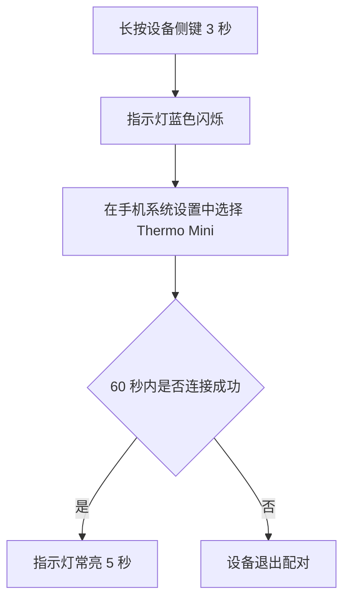
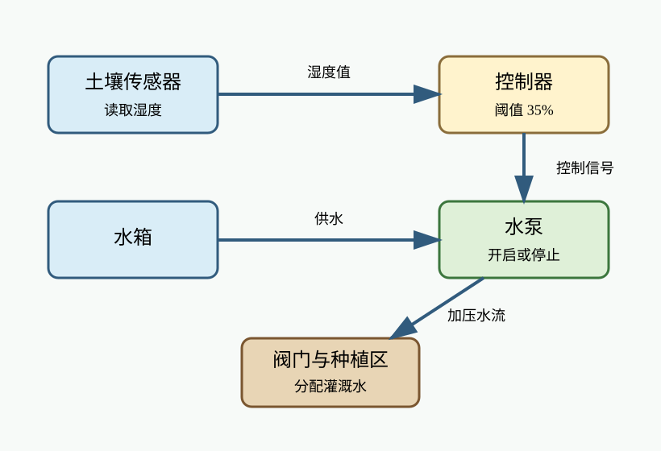
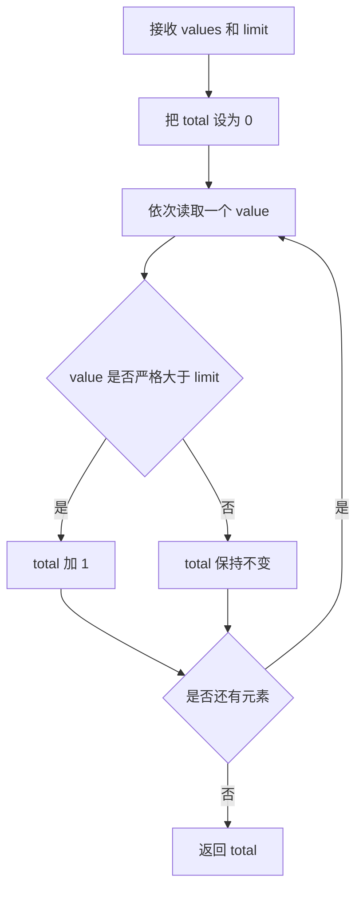
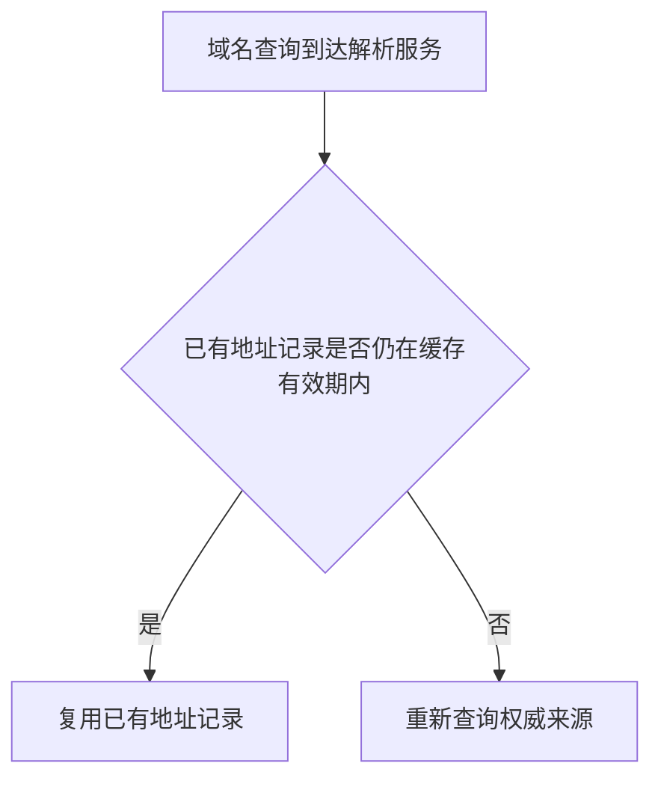
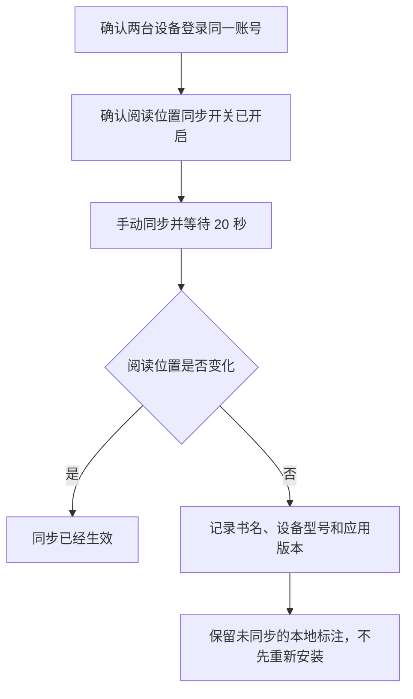
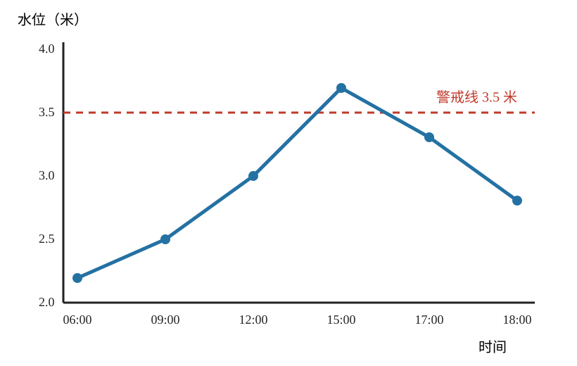

# vNext 1.1 第一轮未见前向审核包

这 20 个答案由隔离生成 Agent 各生成一次；生成前没有提供预期答案、怀疑问题或评分依据，当前全部处于 `pending_user_review`

请逐项给出接受或拒绝；拒绝时指出事实、遗漏、来源、结构或表达问题；第一轮至少接受 18/20 且事实硬错误为 0，才会生成第二轮

当前确定性结果为 `FAIL`；FWD-R1-012、FWD-R1-017 和 FWD-R1-018 各出现 1 个中文句号，首次答案保持原样作为失败证据，第二轮生成已经停止

## 1. FWD-R1-001

配置：`TRANSFORM + NONE`；组件为 `TEXT`

用户请求：

> 把状态说明改得清楚自然，不增加任何新事实

原始材料：

本次同步发现 7 个文件。由于目标目录没有写入权限，复制尚未开始。请保留源文件，管理员修复权限后再执行同步。

首次生成答案：

本次同步发现 7 个文件，但复制尚未开始，因为目标目录没有写入权限

请保留源文件，待管理员修复权限后再执行同步

确定性检查：通过；没有发现已登记的机械格式问题

审核决定：接受或拒绝；拒绝时请说明具体位置和原因

## 2. FWD-R1-002

配置：`TRANSLATE + GLOSS`；组件为 `TEXT`

用户请求：

> 翻译成零基础读者能直接执行的中文，并就近解释陌生术语

原始材料：

Disconnect the appliance from mains power before removing the rear panel. The capacitor may retain a hazardous charge for five minutes after disconnection.

首次生成答案：

拆下后面板前，先断开设备与市电的连接；市电是建筑供电线路提供的电源

断电后 5 分钟内不要拆下后面板，电容器可能仍保留危险电荷；电容器是能暂时储存电荷的部件

确定性检查：通过；没有发现已登记的机械格式问题

审核决定：接受或拒绝；拒绝时请说明具体位置和原因

## 3. FWD-R1-003

配置：`COMPRESS + NONE`；组件为 `TEXT`

用户请求：

> 压缩成一段项目进展，保留每个数字、未完成项和下一步

原始材料：

团队检查了 42 个页面，其中 39 个页面显示正常，3 个页面的移动端导航遮挡正文。桌面端没有发现遮挡。修复尚未部署。下一步是在 360 像素和 390 像素宽度下复测这 3 个页面。

首次生成答案：

团队共检查 42 个页面，其中 39 个显示正常，另有 3 个页面的移动端导航会遮挡正文，桌面端未发现遮挡；修复尚未部署，下一步是在 360 像素和 390 像素宽度下复测这 3 个页面

确定性检查：通过；没有发现已登记的机械格式问题

审核决定：接受或拒绝；拒绝时请说明具体位置和原因

## 4. FWD-R1-004

配置：`EXPLAIN + TEACHING`；组件为 `TEXT`

用户请求：

> 从零开始解释为什么保温杯不能让热水永远保持原温，并说明三种热量传递方式

原始材料：

保温杯通过真空夹层减少传导和对流，通过反射层减少辐射；杯盖、杯口和密封结构仍会让热量逐渐散失。

首次生成答案：

# 保温杯为什么不能让热水永远保持原温

热量可以通过 3 种方式传递：

- 热传导，能量通过物质内部的接触传递
- 对流，能量依靠流体运动传递
- 热辐射，能量以电磁波形式传递

保温杯的真空夹层会减少热传导和对流，反射层会减少热辐射；这些结构减少了热量传递，但杯盖、杯口和密封结构仍会让热量逐渐散失，所以热水不能永远保持原来的温度

确定性检查：通过；没有发现已登记的机械格式问题

审核决定：接受或拒绝；拒绝时请说明具体位置和原因

## 5. FWD-R1-005

配置：`GENERATE + GLOSS`；组件为 `TEXT`

用户请求：

> 根据给定事实写一份蓝牙温度计首次配对说明，读者没有使用经验

原始材料：

本案例没有原始正文，只能使用已给事实生成说明

首次生成答案：

# Thermo Mini 首次配对

下面的流程同时显示成功和超时两种结果



图 1 首次配对流程

第一步，长按设备侧键 3 秒，看到指示灯蓝色闪烁后，设备已经进入配对状态

第二步，在手机的系统设置中选择 `Thermo Mini`

第三步，查看指示灯；连接成功时，指示灯会常亮 5 秒，如果 60 秒内没有连接，设备会退出配对，需要重新从第一步开始

确定性检查：通过；没有发现已登记的机械格式问题

审核决定：接受或拒绝；拒绝时请说明具体位置和原因

## 6. FWD-R1-006

配置：`FORMAT_ONLY + NONE`；组件为 `TEXT`

用户请求：

> 只整理层级和版式，不改变任何文字、日期或负责人

原始材料：

设备维护 9月2日 清洁滤网 负责人林青 9月4日 检查皮带 负责人周川 9月6日 记录噪声 负责人林青 注意 停机后才能打开护罩

首次生成答案：

# 设备维护

## 9月2日

清洁滤网

负责人林青

## 9月4日

检查皮带

负责人周川

## 9月6日

记录噪声

负责人林青

## 注意

停机后才能打开护罩

确定性检查：通过；没有发现已登记的机械格式问题

审核决定：接受或拒绝；拒绝时请说明具体位置和原因

## 7. FWD-R1-007

配置：`EXPLAIN + EXPLANATORY`；组件为 `IMAGE, TEXT`

用户请求：

> 保留原图，从零解释图中每个有效元素、连接方向、控制结果和图中不能证明的内容

原始材料：



首次生成答案：

<div align="center">


图 1 温室灌溉控制图

</div>

## 1. 图中元素

图中 5 个圆角框分别表示土壤传感器、控制器、水泵、水箱以及阀门与种植区；土壤传感器和水箱使用蓝色，控制器使用黄色，水泵使用绿色，阀门与种植区使用棕色，这些颜色用于区分对象，图中没有提供颜色图例来赋予它们其他含义

土壤传感器负责读取湿度；控制器标有 35% 阈值，这个数值是控制器比较土壤湿度时使用的标准；水泵的控制结果是开启或停止；水箱提供水，阀门与种植区负责分配灌溉水

## 2. 连接方向和控制结果

箭头从土壤传感器指向控制器，传递湿度值；箭头再从控制器指向水泵，传递控制信号；供水箭头从水箱指向水泵，水泵产生的加压水流再流向阀门与种植区

这条连接说明湿度值会进入控制器，控制器据此让水泵开启或停止，水泵开启时把水箱中的水送往阀门与种植区；图中没有说明湿度高于或低于 35% 时分别执行哪种动作，因此不能仅凭这张图确定具体判断规则

## 3. 证据边界

图中没有传感器误差、水泵流量或实际种植结果，因此不能判断湿度读数有多准确、实际供水量是多少，也不能证明这种控制带来了怎样的种植结果；下一步需要分别核对传感器误差记录、水泵流量记录和实际种植结果

确定性检查：通过；没有发现已登记的机械格式问题

审核决定：接受或拒绝；拒绝时请说明具体位置和原因

## 8. FWD-R1-008

配置：`EXPLAIN + GLOSS`；组件为 `TABLE, TEXT`

用户请求：

> 保留原表，先解释列和值，再说明比较结论、缺失证据和下一步

原始材料：

| 模式 | 每次保存内容 | 恢复速度 | 额外存储 |
|---|---|---|---|
| 完整备份 | 全部文件 | 快 | 高 |
| 增量备份 | 上次任意备份后变化的文件 | 较慢 | 低 |
| 差异备份 | 上次完整备份后变化的文件 | 中等 | 中等 |

首次生成答案：

| 模式 | 每次保存内容 | 恢复速度 | 额外存储 |
|---|---|---|---|
| 完整备份 | 全部文件 | 快 | 高 |
| 增量备份 | 上次任意备份后变化的文件 | 较慢 | 低 |
| 差异备份 | 上次完整备份后变化的文件 | 中等 | 中等 |

表 1 备份模式比较

## 1. 列和值怎样阅读

“模式”列列出完整备份、增量备份和差异备份 3 种方式；“每次保存内容”说明每次备份覆盖哪些文件；“恢复速度”用快、中等和较慢进行相对比较，没有给出具体时长；“额外存储”用高、中等和低表示相对需求，没有给出具体容量

## 2. 每种模式和比较结论

- 完整备份每次保存全部文件，恢复速度快，额外存储需求高
- 增量备份只保存上次任意备份后发生变化的文件，额外存储需求低，但恢复速度较慢
- 差异备份保存上次完整备份后发生变化的文件，恢复速度和额外存储需求都处于中等水平

表格支持的比较是相对取舍：完整备份偏向较快恢复，增量备份偏向较低额外存储，差异备份位于两者之间

## 3. 缺失证据和下一步

表格没有文件数量、设备速度、保存周期或故障恢复实测数据，因此不能据此计算实际存储量、备份耗时或恢复耗时，也不能确认真实故障中的恢复表现；下一步应记录这些条件，并在同一环境中分别进行恢复测试

确定性检查：通过；没有发现已登记的机械格式问题

审核决定：接受或拒绝；拒绝时请说明具体位置和原因

## 9. FWD-R1-009

配置：`EXPLAIN + TEACHING`；组件为 `CODE, TEXT`

用户请求：

> 保留原始 Python 代码，逐步解释输入、循环、条件、输出、运行方法和证据边界

原始材料：

```text
def count_large(values, limit):
    total = 0
    for value in values:
        if value > limit:
            total += 1
    return total
```

首次生成答案：

```python
def count_large(values, limit):
    total = 0
    for value in values:
        if value > limit:
            total += 1
    return total
```

## 1. 目标、输入和输出

`count_large` 是一个 Python 函数，用来统计数值集合 `values` 中严格大于阈值 `limit` 的元素数量；等于 `limit` 的元素不计入，函数最后通过 `return` 返回数量

`values` 应当是可以逐项读取的数值集合，`limit` 是每个元素都要与之比较的阈值

## 2. 执行过程



图 1 函数执行流程

`total = 0` 创建计数器并从 0 开始；`for value in values` 依次读取集合中的每个数值；`if value > limit` 检查当前数值是否严格大于阈值，满足条件时，`total += 1` 把计数加 1；全部元素处理完后，`return total` 把最终数量交给调用方

## 3. 运行方法和边界

在 Python 环境中先执行原始代码以定义函数，再用 `count_large(values, limit)` 传入数值集合和阈值；函数返回统计结果，但原始代码没有负责显示结果的语句

这段代码只展示了计数逻辑，没有给出实际输入、运行结果或不合格输入的处理方式；从代码可见，它只更新函数内部的计数变量并返回数量，没有读写文件、访问网络或修改外部数据

确定性检查：通过；没有发现已登记的机械格式问题

审核决定：接受或拒绝；拒绝时请说明具体位置和原因

## 10. FWD-R1-010

配置：`TRANSFORM + GLOSS`；组件为 `TEXT`

用户请求：

> 合并追加要求，写成一份连续说明；后来的要求覆盖冲突的旧要求

原始材料：

- 第一轮：校准前让探头在室温下静置 10 分钟，每次记录 3 个读数
- 追加：静置时间改为 15 分钟
- 追加：如果 3 个读数的最大差值超过 0.4 摄氏度，就重新连接探头并再次测量

首次生成答案：

# 校准说明

校准前，让探头在室温下静置 15 分钟；原先的 10 分钟要求已由追加要求替换

每次记录 3 个读数，如果 3 个读数的最大差值超过 0.4 摄氏度，重新连接探头并再次测量

确定性检查：通过；没有发现已登记的机械格式问题

审核决定：接受或拒绝；拒绝时请说明具体位置和原因

## 11. FWD-R1-011

配置：`TRANSFORM + EXPLANATORY`；组件为 `TEXT`

用户请求：

> 改写成普通员工能理解的访问规则，完整保留条件、例外和期限

原始材料：

访客通行证仅在接待人员在场时有效。临时离开楼层不需要归还，但超过 30 分钟必须重新登记。消防疏散期间不执行重新登记要求。

首次生成答案：

访客通行证只有在接待人员在场时才有效

临时离开楼层时，不需要归还通行证；离开超过 30 分钟，必须重新登记

消防疏散期间属于例外，不执行重新登记要求

确定性检查：通过；没有发现已登记的机械格式问题

审核决定：接受或拒绝；拒绝时请说明具体位置和原因

## 12. FWD-R1-012

配置：`TRANSLATE + EXPLANATORY`；组件为 `TEXT`

用户请求：

> 完整翻译并补充理解这一地质过程所需的背景，明确区分原文结论和补充解释

原始材料：

The dated ash layer lies above the fossil bed. It therefore sets a minimum age for the burial event, but it does not establish how long the organisms lived before burial.

首次生成答案：

# 原文结论

已经测定年代的火山灰层位于化石层上方，因此，这个年代为埋藏事件确定了最低年龄；不过，它不能说明这些生物在被埋藏前生活了多长时间

# 补充说明

在地层中，位置较高的沉积层通常形成得更晚；火山灰层可以用适当的同位素方法测年。上覆火山灰层的年龄只能限制埋藏事件不能晚于该层的形成时间，这就是原文所说的“最低年龄”；这个测年对象不是生物本身，所以原文没有据此判断生物在埋藏前的存活时长

确定性检查：失败；背景解释在‘同位素方法测年’后使用中文句号

审核决定：接受或拒绝；拒绝时请说明具体位置和原因

## 13. FWD-R1-013

配置：`EXPLAIN + TEACHING`；组件为 `TEXT`

用户请求：

> 从零解释域名查询中的缓存有效期为什么会影响修改生效速度

原始材料：

解析服务会在缓存有效期内复用已有地址记录。记录到期后，解析服务才需要重新查询权威来源。不同解析服务的缓存开始时间可能不同。

首次生成答案：

# 缓存有效期怎样影响修改生效

缓存有效期常用 `TTL` 表示，它规定一条地址记录可以被解析服务复用多长时间



图 1 地址记录的复用和重新查询

域名记录修改后，仍在有效期内的旧记录会继续被复用；记录到期以后，解析服务才需要重新查询权威来源，因此修改不会同时在所有查询中生效

不同解析服务开始缓存同一记录的时间可能不同，它们的记录也会在不同时间到期；`TTL` 规定记录可以复用多久，但不承诺所有缓存同时到期，所以不同用户看到修改结果的时间可能不同

确定性检查：通过；没有发现已登记的机械格式问题

审核决定：接受或拒绝；拒绝时请说明具体位置和原因

## 14. FWD-R1-014

配置：`COMPRESS + GLOSS`；组件为 `TEXT`

用户请求：

> 压缩成易读的隐私说明，保留收集内容、用途、保存期限和删除例外

原始材料：

应用收集崩溃时间、设备型号和软件版本，用于定位稳定性问题。记录保存 30 天后自动清除。若记录已经进入正在进行的安全调查，保存期限延长到调查结束后 7 天。应用不收集文档正文。

首次生成答案：

应用会收集崩溃时间、设备型号和软件版本，用于定位稳定性问题，但不收集文档正文

这些记录通常在保存 30 天后自动清除；如果记录已经进入正在进行的安全调查，保存期限会延长到调查结束后 7 天

确定性检查：通过；没有发现已登记的机械格式问题

审核决定：接受或拒绝；拒绝时请说明具体位置和原因

## 15. FWD-R1-015

配置：`GENERATE + EXPLANATORY`；组件为 `TEXT`

用户请求：

> 根据事实写一份电子书无法同步阅读位置时的排查说明，解释每一步为什么做和会看到什么

原始材料：

本案例没有原始正文，只能使用已给事实生成说明

首次生成答案：

# 阅读位置无法同步时的排查步骤

下面的流程按照检查顺序展开，重新安装不在首选步骤中



图 1 阅读位置同步排查流程

第一步，查看两台设备当前登录的账号是否相同；这一步用于确认两台设备使用的是同一账号，检查结果会直接显示相同或不同

第二步，确认两台设备的阅读位置同步开关已经开启；如果开关关闭，当前可见结果就是同步功能没有开启

第三步，手动执行同步并等待 20 秒；等待后查看阅读位置是否发生变化，有变化表示同步已经生效，没有变化则继续记录问题信息

第四步，如果仍无变化，记录书名、设备型号和应用版本；这 3 项分别标明出现问题的内容、设备和应用环境

不要把重新安装作为首选步骤，因为重新安装会删除尚未同步的本地标注

确定性检查：通过；没有发现已登记的机械格式问题

审核决定：接受或拒绝；拒绝时请说明具体位置和原因

## 16. FWD-R1-016

配置：`FORMAT_ONLY + NONE`；组件为 `TEXT`

用户请求：

> 只整理标题、分组和缩进；禁止改写结论或补充缺失负责人

原始材料：

评审记录 结论 保留旧接口到10月15日 新接口10月1日开放 兼容性 安卓12已验证 安卓11未验证 后续 安卓11测试负责人未确定 文档由陈澄9月28日前更新

首次生成答案：

# 评审记录

## 结论

- 保留旧接口到10月15日
- 新接口10月1日开放

## 兼容性

- 安卓12已验证
- 安卓11未验证

## 后续

- 安卓11测试负责人未确定
- 文档由陈澄9月28日前更新

确定性检查：通过；没有发现已登记的机械格式问题

审核决定：接受或拒绝；拒绝时请说明具体位置和原因

## 17. FWD-R1-017

配置：`EXPLAIN + EXPLANATORY`；组件为 `IMAGE, TEXT`

用户请求：

> 保留原图，解释坐标、警戒线、每个数据点、趋势、异常、实际影响和证据边界

原始材料：



首次生成答案：

<div align="center">


图 1 河流水位变化图

</div>

## 1. 坐标和警戒线

横轴表示时间，依次标出 06:00、09:00、12:00、15:00、17:00 和 18:00；纵轴表示水位，单位是米，标尺从 2.0 米到 4.0 米

红色虚线是 3.5 米警戒线；它表示需要加强监测的阈值，不等于水位达到或超过这条线时必然发生洪水

## 2. 数据点和趋势

按图中位置读取，6 个蓝色数据点分别表示：

- 06:00，水位约 2.2 米
- 09:00，水位 2.5 米
- 12:00，水位约 3.0 米
- 15:00，水位达到 3.8 米
- 17:00，水位约 3.3 米
- 18:00，水位约 2.8 米

水位从 06:00 到 15:00 持续上升，在 15:00 达到最高点 3.8 米，比警戒线高 0.3 米；随后水位回落，17:00 和 18:00 的数据点都位于警戒线下方。图中的突出异常是 15:00 这一点超过警戒线，实际影响是该时段需要加强监测，不能直接据此认定发生洪水

## 3. 证据边界

图中没有降雨量、流速、堤防状态或预测模型，因此不能判断水位变化的原因、堤防能否承受，也不能据此预测洪水是否会发生；下一步需要核对同期降雨量、流速、堤防状态和所用预测模型

确定性检查：失败；水位趋势说明在‘警戒线下方’后使用中文句号

审核决定：接受或拒绝；拒绝时请说明具体位置和原因

## 18. FWD-R1-018

配置：`EXPLAIN + GLOSS`；组件为 `TABLE, TEXT`

用户请求：

> 保留原表，解释列、行、缺失值和变化趋势，不逐格机械复述

原始材料：

| 样品 | 20 分钟 | 40 分钟 | 60 分钟 |
|---|---:|---:|---:|
| A | 22.1°C | 24.8°C | 26.0°C |
| B | 22.0°C | — | 25.1°C |
| C | 22.2°C | 23.0°C | 23.4°C |

首次生成答案：

| 样品 | 20 分钟 | 40 分钟 | 60 分钟 |
|---|---:|---:|---:|
| A | 22.1°C | 24.8°C | 26.0°C |
| B | 22.0°C | — | 25.1°C |
| C | 22.2°C | 23.0°C | 23.4°C |

表 1 样品温度随时间变化

## 1. 列、行和缺失值

第一列列出样品 A、B、C，后 3 列分别记录 20 分钟、40 分钟和 60 分钟时的温度，单位是 °C；每一行表示同一样品在不同时间的记录

样品 B 在 40 分钟处的破折号表示该时间点没有记录，不表示温度为 0，因此不能用这个位置判断 B 在 20 至 60 分钟之间的具体变化过程

## 2. 变化趋势

3 个样品在 60 分钟时的温度都高于 20 分钟时；A 从 22.1°C 升到 26.0°C，总变化为 3.9°C，B 从 22.0°C 升到 25.1°C，总变化为 3.1°C，但缺少 40 分钟记录，C 从 22.2°C 升到 23.4°C，总变化为 1.2°C

在有完整记录的 A 和 C 中，温度都随时间上升；A 的升幅大于 C，60 分钟时 A 的温度最高。B 的起点最低，60 分钟时位于 A 与 C 之间，但缺失值使中间趋势无法确认

## 3. 证据边界

表格没有加热功率、环境温度误差或重复实验次数，因此这些数据不能解释温度差异的原因，也不能证明同样趋势会稳定重复；下一步需要补充这些条件并进行重复实验

确定性检查：失败；温度比较说明在‘A 的温度最高’后使用中文句号

审核决定：接受或拒绝；拒绝时请说明具体位置和原因

## 19. FWD-R1-019

配置：`EXPLAIN + TEACHING`；组件为 `CODE, TEXT`

用户请求：

> 保留原始 SQL，解释查询目标、每一行、筛选条件、排序结果、执行方式和副作用

原始材料：

```text
SELECT title, due_date
FROM loans
WHERE returned_at IS NULL
ORDER BY due_date ASC;
```

首次生成答案：

```sql
SELECT title, due_date
FROM loans
WHERE returned_at IS NULL
ORDER BY due_date ASC;
```

## 1. 查询目标

这条 SQL 查询从保存借阅记录的 `loans` 表中，找出尚未归还的记录，只读取每条记录的 `title` 和 `due_date`，并按照到期日期升序排列

## 2. 每一行的作用

- `SELECT title, due_date` 指定结果只包含标题和到期日期两列
- `FROM loans` 指定数据来自 `loans` 表
- `WHERE returned_at IS NULL` 只保留 `returned_at` 为空的记录，这表示记录尚未归还
- `ORDER BY due_date ASC` 按 `due_date` 从早到晚排列结果

## 3. 执行方式、结果和副作用

在能够连接目标数据库并执行 SQL 的环境中运行原始查询；执行后会得到尚未归还记录的标题和到期日期，较早的到期日期排在前面

这条查询只读取数据，不包含新增、修改或删除语句，因此不会修改 `loans` 表；原始材料没有提供表内数据、数据库权限或实际执行结果，所以不能据此确定会返回多少行，也不能证明查询已经成功运行

确定性检查：通过；没有发现已登记的机械格式问题

审核决定：接受或拒绝；拒绝时请说明具体位置和原因

## 20. FWD-R1-020

配置：`TRANSFORM + GLOSS`；组件为 `TEXT`

用户请求：

> 合并三轮信息，按时间顺序写成展柜维护安排，并明确撤销的旧要求

原始材料：

- 第一轮：周二闭馆后更换 2 号展柜照明，完成后拍照
- 追加：更换改到周三开馆前，照片仍然需要
- 撤销：本周不更换照明，只在周三开馆前检查亮度并记录读数

首次生成答案：

# 展柜维护安排

## 1. 初始安排

周二闭馆后更换 2 号展柜照明，完成后拍照

## 2. 后续调整

更换时间改到周三开馆前，照片仍然需要

## 3. 最终安排

以上更换照明和拍照要求均已撤销；本周不更换照明，只在周三开馆前检查 2 号展柜的亮度并记录读数

确定性检查：通过；没有发现已登记的机械格式问题

审核决定：接受或拒绝；拒绝时请说明具体位置和原因
