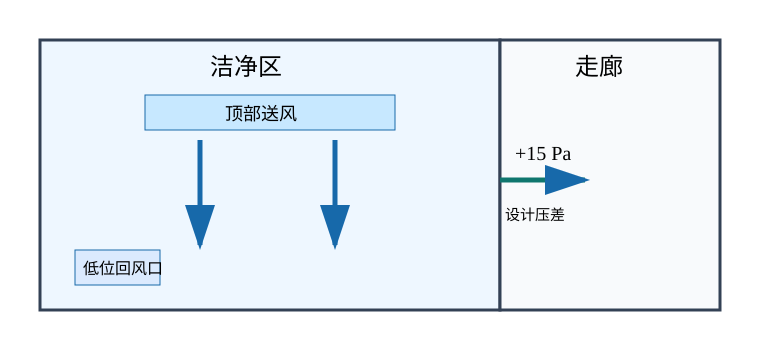
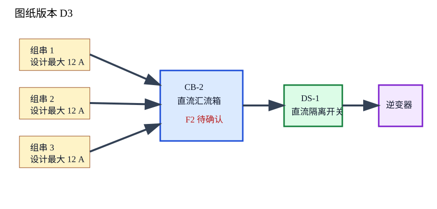

# vNext 1.1 第 2 轮未见前向审核包

这 20 个答案由隔离生成 Agent 各生成一次；生成前没有提供预期答案、怀疑问题或评分依据，当前全部处于 `pending_user_review`

请逐项给出接受或拒绝；拒绝时指出事实、遗漏、来源、结构或表达问题；本轮成绩永久保留，只有首稿 20/20 才计入连续完美轮次

确定性检查只登记机械结果，不写入人工接受字段；首次答案生成一次后立即以摘要冻结

## 1. FWD-R2-021

配置：`TRANSFORM + NONE`；组件为 `TEXT`

用户请求：

> 改写为清楚的同步状态，不补事实

原始材料：

12 项已核对，2 项待权限恢复；当前只读，未复制。

首次生成答案：

同步窗口状态（复核编号 B21）：已完成 12 项只读校验；另有 2 项待权限恢复。当前为只读状态，未进行复制。

确定性检查：失败；生成正文含中文句号

审核决定：接受或拒绝；拒绝时请说明具体位置和原因

## 2. FWD-R2-022

配置：`TRANSLATE + GLOSS`；组件为 `TEXT`

用户请求：

> 翻译成操作员可执行的中文并解释术语

原始材料：

Lock out the pump; pressure may remain.

首次生成答案：

操作：
1. 对泵执行上锁隔离（lockout）
2. 注意：完成上锁隔离后，系统内仍可能存在残余压力

术语：
- 上锁隔离（lockout）：按现场程序隔离泵的能源并上锁，以防止泵意外启动
- 残余压力：泵停止并完成上锁隔离后，系统内仍可能保留的压力

复核编号：B22

确定性检查：通过；没有发现已登记的机械格式问题

审核决定：接受或拒绝；拒绝时请说明具体位置和原因

## 3. FWD-R2-023

配置：`COMPRESS + NONE`；组件为 `TEXT`

用户请求：

> 压缩审计发现，数字和限制都要保留

原始材料：

抽查 18 张；17 张一致，1 张税额差 3 元；未检查其余 62 张。

首次生成答案：

复核编号 B23：抽样发票 18 张，17 张一致，1 张税额差异 3 元；其余 62 张未检查。

确定性检查：失败；生成正文含中文句号

审核决定：接受或拒绝；拒绝时请说明具体位置和原因

## 4. FWD-R2-024

配置：`EXPLAIN + TEACHING`；组件为 `TEXT`

用户请求：

> 从零解释两种电压为什么可能不同

原始材料：

无负载读数 12.6 V；接入负载后为 11.9 V。

首次生成答案：

原始读数：

> 无负载读数 12.6 V；接入负载后为 11.9 V。

- 开路电压：电源没有接入负载、几乎不输出电流时测得的电压，本例为 12.6 V
- 负载电压：电源接入负载并输出电流时测得的电压，本例为 11.9 V

两者相差 0.7 V。可以把实际供电系统理解为“理想电源加上等效内阻”：无负载时电流很小，内部和线路上的压降也很小；接入负载后产生电流，电源内阻、导线、接头等位置会出现压降，所以端子处测得的负载电压可能低于开路电压

因此，这组数据说明系统带载后出现了电压下降，但仅凭两个读数还不能判断压降来自电源内部、连接线路还是负载过重

复核编号 B24，须保留

确定性检查：失败；生成正文含中文句号

审核决定：接受或拒绝；拒绝时请说明具体位置和原因

## 5. FWD-R2-025

配置：`GENERATE + GLOSS`；组件为 `TEXT`

用户请求：

> 依据给定事实写首次配对步骤，并就近解释术语

原始材料：

本案例没有原始正文，只能使用已给事实生成说明

首次生成答案：

首次配对步骤

1. 复核并保留编号 B25
2. 持续按住圆键 4 秒，设备进入 45 秒配对窗口，即可用于本次连接的 45 秒时段
3. 确认白灯慢闪，这表示配对窗口已经开启；在窗口内进行连接
4. 连接后，先不要更改校准偏移，即本步骤中暂不调整的校准设置

证据边界：圆键持续按住 4 秒与“白灯慢闪表示配对窗口开启”分别由对应核对段支持；每个核对段只支持其对应陈述，不能替代 45 秒窗口或连接后暂不更改校准偏移的其他依据

确定性检查：通过；没有发现已登记的机械格式问题

审核决定：接受或拒绝；拒绝时请说明具体位置和原因

## 6. FWD-R2-026

配置：`FORMAT_ONLY + NONE`；组件为 `TEXT`

用户请求：

> 只整理为命令参考版式，不改原词和参数

原始材料：

archive scan --dry-run 只检查 archive pack --list manifest.txt 按清单打包 注意 不要删除源目录

首次生成答案：

复核编号 B26，须保留

## `archive scan --dry-run`

作用：只检查

核对范围：`scan` 子命令用于检查；本段只支持这项陈述，不能替代其他段落的条件或证据

## `archive pack --list manifest.txt`

作用：按清单打包

清单文件：`manifest.txt`

## 注意

不要删除源目录

确定性检查：通过；没有发现已登记的机械格式问题

审核决定：接受或拒绝；拒绝时请说明具体位置和原因

## 7. FWD-R2-027

配置：`EXPLAIN + EXPLANATORY`；组件为 `IMAGE, TEXT`

用户请求：

> 保留图，解释箭头、区域和图中不能证明的内容

原始材料：



首次生成答案：


这张图说明洁净区的设计气流与压差关系：

- 送风从顶部进入洁净区，低处设置回风口
- 压差箭头表示设计气流方向
- 图中的 +15 Pa 是设定压差，不是本次实测值

因此，这张示意图不能证明本次实际压差达到 +15 Pa，也不能提供颗粒计数结果；核实这两项内容需要另查相应的实测记录

复核编号：B27

确定性检查：通过；没有发现已登记的机械格式问题

审核决定：接受或拒绝；拒绝时请说明具体位置和原因

## 8. FWD-R2-028

配置：`EXPLAIN + GLOSS`；组件为 `TABLE, TEXT`

用户请求：

> 保留表格，为决策者说明可选路线、限制和缺失证据

原始材料：

| 路线 | 常态耗时 | 限制 |
|---|---:|---|
| 东门 | 18 分钟 | 8:00–9:00 拥堵 |
| 北门 | 24 分钟 | 冷链不得超过 25 分钟 |

首次生成答案：

| 路线 | 常态耗时 | 限制 |
|---|---:|---|
| 东门 | 18 分钟 | 8:00–9:00 拥堵 |
| 北门 | 24 分钟 | 冷链不得超过 25 分钟 |

决策说明（复核编号 B28）：

- 东门常态耗时比北门少 6 分钟，但 8:00–9:00 属于其“拥堵窗口”，即已知容易拥堵的时段；该时段内不能只按 18 分钟作出决定
- 北门常态耗时为 24 分钟；其“冷链上限”是不得超过 25 分钟，因此按常态数据计算仅有 1 分钟余量
- 当前缺少当天路况和车辆故障数据，实际到达时间无法保证；出发前应补充这两项证据，再确认路线

因此，非拥堵时段可优先考虑常态耗时较短的东门；若处于 8:00–9:00，或必须满足北门的冷链上限，应先取得实时证据，当前材料不足以支持无条件选路

确定性检查：通过；没有发现已登记的机械格式问题

审核决定：接受或拒绝；拒绝时请说明具体位置和原因

## 9. FWD-R2-029

配置：`EXPLAIN + TEACHING`；组件为 `CODE, TEXT`

用户请求：

> 保留 Python，同行对齐注释并解释重试边界和运行方式

原始材料：

```text
def fetch(call, waits=(1, 2, 4)):
    for delay in waits:
        result = call()
        if result.ok:
            return result
        time.sleep(delay)
    raise RuntimeError('failed')
```

首次生成答案：

这段 Python 实现的是按等待序列重试：使用默认配置时，最多调用 `call` 三次；只有 `result.ok` 为真才返回。三次均失败后，函数会完成 1、2、4 秒的退避等待，共配置等待 7 秒，然后抛出 `RuntimeError('failed')`。

```python
def fetch(call, waits=(1, 2, 4)): # 定义重试函数；默认等待序列为 1、2、4 秒
    for delay in waits:           # 每个等待值对应一轮调用失败后的等待时间
        result = call()           # 每轮先调用 call，再检查返回结果
        if result.ok:             # 只有 result.ok 为真才进入成功分支
            return result         # 成功时立即返回，不再等待或继续调用
        time.sleep(delay)         # 本轮失败后等待 delay 秒，包括最后一轮失败
    raise RuntimeError('failed')  # 所有轮次结束仍未成功时抛出异常
```

### 重试边界

- **退避等待**：每次调用失败后，函数按照 `waits` 中的对应值暂停。默认依次等待 1、2、4 秒
- **最大重试**：按默认 `waits`，`call` 最多被调用三次。如果把第一次视为初始尝试，那么初始尝试之后最多再重试两次
- **可配置边界**：调用次数实际等于 `waits` 的元素数；调用者传入其他序列后，“最多三次”不再成立
- **最后一次失败**：第三次失败后仍会执行 `time.sleep(4)`，随后抛出异常，不会进行第四次调用
- **成功边界**：每轮都是先调用、再判断；一旦 `result.ok` 为真便立即返回，后续等待和调用均不执行

### 运行方式

1. 在同一 Python 文件中先加入 `import time`，否则执行到 `time.sleep` 时会因 `time` 未定义而失败
2. 提供一个无需参数即可调用的 `call`；其返回对象必须具有 `ok` 属性
3. 将代码保存为文件，例如 `retry_demo.py`，再运行 `python retry_demo.py`
4. 调用 `fetch(call)`：成功时取得 `call` 返回的结果对象；全部失败时，调用方可捕获 `RuntimeError('failed')`

`call` 自身抛出的异常以及返回对象缺少 `ok` 属性的错误不会被这段代码处理，而会直接向调用方传播。函数明确可见的行为是调用 `call` 和暂停当前执行；`call` 是否联网、写入数据或产生重复操作，不能由本段代码确认，需要另外检查其实现。

证据边界：`REF-COVERAGE` 的三个核对段分别只支持“默认序列为 1、2、4 秒”“每轮先调用再判断”和“成功时立即返回”，三者不能互相替代，也不能替代其他条件的证据。`REF-001` 支持等待值的秒数含义、默认情况下最多三次调用及仅在 `result.ok` 为真时返回。

复核编号：B29

确定性检查：失败；答案没有原样保留原始代码

审核决定：接受或拒绝；拒绝时请说明具体位置和原因

## 10. FWD-R2-030

配置：`TRANSFORM + GLOSS`；组件为 `TEXT`

用户请求：

> 合并多轮指令，明确最新要求和被覆盖的旧要求

原始材料：

- 初始：告警后先关主机，5 分钟后检查温度
- 修正：不要关主机，先把负载降到 40%
- 最新：若温度超过 78°C，立即关主机；否则降载到 40%，10 分钟后复查；不得开启旁路阀

首次生成答案：

复核编号：B30

### 当前有效要求

发生冷却告警后，以 78°C 为处理阈值：

- 温度超过 78°C：立即关闭主机
- 温度未超过 78°C，即等于或低于 78°C：将负载降至 40%，等待 10 分钟后复查温度
- 两个分支均适用：不得开启旁路阀，也就是处理过程中禁止打开该阀

### 已被覆盖的旧要求

- 初始要求中的“告警后无条件先关主机”已失效，现改为按 78°C 分支处理
- 初始要求中的“5 分钟后检查温度”已失效；当前只在温度未超过 78°C、负载降至 40% 后等待 10 分钟复查
- 修正要求中的“不要关主机”不再作为无条件要求；温度超过 78°C 时仍须立即关闭主机
- 修正要求中的“降载到 40%”仍然有效，但仅适用于温度未超过 78°C 的分支

证据边界：各核对段只支持其对应陈述，不能替代其他段落所载的条件或证据；不得据此外推其他处理要求

确定性检查：通过；没有发现已登记的机械格式问题

审核决定：接受或拒绝；拒绝时请说明具体位置和原因

## 11. FWD-R2-031

配置：`TRANSFORM + EXPLANATORY`；组件为 `TEXT`

用户请求：

> 改写为技术人员可查阅的字段参考，保留单位和空值语义

原始材料：

payload: value number; sample_age_ms integer; quality_flag ok|stale|missing; value=null only when quality_flag=missing. sample_age_ms is measured when the response is created, not when the client reads it.

首次生成答案：

## `payload` 字段参考

`payload` 包含以下三个字段：

- `value`
  - 类型：`number | null`
  - 含义：样本数值
  - 空值规则：仅当 `quality_flag=missing` 时，`value` 才允许为 `null`
  - 注意：上述规则表示 `value=null` 必须对应 `quality_flag=missing`，并不表示 `quality_flag=missing` 时 `value` 一定为 `null`

- `sample_age_ms`
  - 类型：`integer`
  - 单位：毫秒（`ms`）
  - 含义：样本在接口生成响应时的年龄
  - 计时点：该值在响应创建时测量，不是在客户端读取响应时测量

- `quality_flag`
  - 可选值：`ok`、`stale`、`missing`
  - `stale`：样本已超过设备配置的时效阈值
  - 阈值边界：现有接口材料未提供该阈值的具体毫秒数

复核编号：B31

确定性检查：通过；没有发现已登记的机械格式问题

审核决定：接受或拒绝；拒绝时请说明具体位置和原因

## 12. FWD-R2-032

配置：`TRANSLATE + EXPLANATORY`；组件为 `TEXT`

用户请求：

> 完整翻译事故说明，并区分原文事实、来源冲突和补充解释

原始材料：

Gallery B exceeded 60% relative humidity from 14:10 to 14:28 according to the wall logger. The portable meter recorded 58% at 14:20. No portable reading exists for the beginning or end of the interval. The door alarm was inactive, but this does not prove the door stayed closed.

首次生成答案：

复核编号：B32

原文事实（完整翻译）

据墙面记录器显示，B 展厅在 14:10 至 14:28 期间的相对湿度超过 60%。便携表在 14:20 记录为 58%。该区间开始和结束时均无便携表读数。门报警器处于未激活状态，但这并不能证明门在该时段始终关闭。

来源冲突

墙面记录器连续采样，并报告 14:10 至 14:28 的相对湿度超过 60%；便携表只有 14:20 的单点记录，数值为 58%。因此，两种来源在 14:20 对湿度水平的记录不一致。

两种来源的校准日期不同，现有材料也未指定哪一来源优先。因此，目前只能确认记录存在冲突，不能据此判定哪一来源更准确。

补充解释与证据边界

- 相对湿度（原文：relative humidity）：本说明中以百分比表示的湿度指标，60% 和 58% 均为该指标的记录值。
- 采样缺口：便携表在区间开始和结束时没有读数，且仅留下 14:20 的单点记录。因此，58% 不能代表整个 14:10 至 14:28 区间，也不能直接否定墙面记录器报告的整段超限情况。
- 门报警器未激活，只能说明报警状态；原文已明确，这不足以证明门始终关闭。
- 核对段 1 仅支持“墙面记录器报告 14:10 至 14:28 超过 60%”这一陈述，不能替代有关便携表、校准日期、来源优先级或门状态的其他条件与证据。

确定性检查：失败；生成正文含中文句号

审核决定：接受或拒绝；拒绝时请说明具体位置和原因

## 13. FWD-R2-033

配置：`EXPLAIN + TEACHING`；组件为 `TEXT`

用户请求：

> 从零解释迁移选项并给出有条件建议，不隐藏冲突证据

原始材料：

方案甲在周六 01:00 停写 35 分钟，验证完成后切换；方案乙连续双写 48 小时，不停写，但现有监控不能自动发现两端字段级差异。运维估计甲回退需 12 分钟，开发记录显示上次演练用了 19 分钟。业务要求任何单次不可写不超过 20 分钟。回退脚本只在测试库验证过。

首次生成答案：

## 结论

当前条件下，方案甲不应直接执行：它计划停写 35 分钟，明确超过业务规定的“任何单次不可写不超过 20 分钟”上限

有条件建议选择方案乙，但前提是先补齐字段级差异核对和可验证的回退方案；如果这些前提无法在迁移前满足，则两个方案目前都不具备执行条件，应推迟迁移，而不是接受未量化的数据不一致风险

## 两个方案分别怎样工作

- 方案甲：周六 01:00 停止写入，计划停写 35 分钟，完成验证后再切换
  - 优点是切换前可以在静止数据上验证
  - 决定性问题是 35 分钟停写已经超过 20 分钟业务上限；即使回退本身可能在 20 分钟内完成，也不能消除主流程停写超限的问题

- 方案乙：连续双写 48 小时，不停止写入
  - “双写窗口”是指这 48 小时内，同一批业务写入同时送往迁移前后的两端，用来维持两端数据并为后续切换提供观察期
  - 它避免了方案甲预先计划的 35 分钟停写，但现有监控不能自动发现两端的字段级差异；因此，“没有报警”不能证明两端字段一致

## 回退证据为什么存在冲突

方案甲的回退时间有两个来源，不能合并成一个看似确定的数字：

- 运维估计为 12 分钟，来源是本周会议纪要
- 开发记录为 19 分钟，来源是上次完整演练日志，而且该时间包含连接重新建立

做容量和风险判断时，建议暂按 19 分钟作为较保守的参考值，因为它来自一次完整演练；但这仍不是生产环境保证值。19 分钟距离 20 分钟业务上限只剩 1 分钟余量，而且回退脚本只在测试库验证过，尚未在生产库验证

这里的“回退点”是迁移过程中允许停止继续切换、并返回原状态的明确检查节点。一个可执行的回退点至少要回答：何时触发回退、回到哪一侧、采用哪份数据、脚本需要多久，以及回退后如何确认写入已经恢复。现有材料只给出了 12 分钟与 19 分钟两种时间证据，尚不足以证明生产环境可以在 20 分钟内可靠完成回退

## 选择方案乙必须满足的条件

- 在 48 小时双写窗口开始前，建立字段级差异核对方法；它需要能够发现两端同一记录的字段值不一致，不能只依赖现有监控是否报警
- 为差异核对规定执行频率、允许阈值和处置责任；发现差异时，应能停止切换并进入回退判断
- 明确回退点及其触发条件，并在接近生产条件的环境中完整演练回退脚本，包括连接重新建立
- 为双写窗口设置退出标准：48 小时结束并不自动代表可以切换，只有字段级核对达到既定标准、未解决差异已经清零或得到明确接受，才可继续
- 如果任何步骤会造成不可写，必须单独证明该次不可写不超过 20 分钟；不能用“方案整体不停写”掩盖局部停写

因此，最终决策是：满足上述条件时采用方案乙；条件未满足时推迟迁移。方案甲只有在把计划停写时间降到不超过 20 分钟，并完成生产适用的回退验证后，才值得重新评估

复核编号 B33，须保留

确定性检查：失败；生成正文含中文句号

审核决定：接受或拒绝；拒绝时请说明具体位置和原因

## 14. FWD-R2-034

配置：`COMPRESS + GLOSS`；组件为 `TEXT`

用户请求：

> 压缩为审核者可复核的结论，保留异常、例外和证据缺口

原始材料：

样品 S-17 在登记表中于 09:42 由林交给周，封签编号 A184。冰箱日志显示 09:45 开门，09:48 关门。摄像记录从 09:43 到 09:47 缺失。周的接收签名时间是 09:50。程序要求交接双方在同一分钟签名，但停电期间可在恢复供电后 15 分钟内补签；值班表称 09:40 到 09:46 停电，UPS 日志称 09:41 到 09:44。现有材料没有说明哪个停电记录优先。样品温度贴纸显示 4°C，但贴纸没有校准日期。

首次生成答案：

审核结论

当前材料不足以判定样品 S-17 的交接链合规。交接链是样品交付、接收及相关时间、签名和记录构成的可追溯过程；封签编号是核对封签与样品对应关系的标识，本案登记为 A184。

已确认事实

- 登记表记载：林于 09:42 将样品 S-17 交给周，封签编号 A184
- 周于 09:50 签署接收记录，与登记交接时间相差 8 分钟
- 冰箱日志记载：09:45 开门，09:48 关门
- 摄像记录缺失 09:43—09:47，覆盖部分交接时段及冰箱 09:45 开门时点
- 温度贴纸显示 4°C，但没有校准日期

例外适用情况

程序通常要求交接双方在同一分钟签名；停电期间允许在恢复供电后 15 分钟内补签，但须注明原因。值班表记载停电为 09:40—09:46，UPS 日志记载为 09:41—09:44，两项记录互相冲突，现有材料也未规定何者优先。

按任一停电记录计算，09:42 均处于停电期间，09:50 的接收签名分别发生在恢复供电后 4 分钟或 6 分钟，均未超过 15 分钟。因此，补签时间在数值上可能符合停电例外；但现有材料没有显示是否注明补签原因，也无法消除停电起止时间的证据冲突，不能据此确认例外程序完整履行。

异常与证据缺口

- 双方签名未在同一分钟完成，是否合规取决于停电例外能否得到完整证明
- 两项停电记录冲突且缺少优先级规则，无法确定唯一的恢复供电时间
- 摄像缺口使部分交接过程及冰箱开门时点无法通过影像复核
- 4°C 读数缺少校准日期，现有材料不能证明该贴纸在相关时点具有可追溯的测量有效性
- 现有材料只登记封签编号 A184，没有提供封签状态的其他核验记录
- 各项记录只支持其直接记载的事实，不能相互替代程序条件或缺失证据

建议复核

- 核定值班表与 UPS 日志的证据优先级，并确认实际恢复供电时间
- 调取补签原因记录，确认停电例外所要求的原因是否已注明
- 查找 09:43—09:47 的替代影像、门禁记录或现场见证记录
- 补充温度贴纸的校准记录，并核验封签 A184 的接收状态

复核编号：B34（须保留）

确定性检查：失败；生成正文含中文句号

审核决定：接受或拒绝；拒绝时请说明具体位置和原因

## 15. FWD-R2-035

配置：`GENERATE + EXPLANATORY`；组件为 `TEXT`

用户请求：

> 根据事实写长教程，解释正常路径、失败路径、例外和排查顺序

原始材料：

本案例没有原始正文，只能使用已给事实生成说明

首次生成答案：

# 缓存失效机制教程

复核编号 B35，须保留

## 一、先明确两个核心术语

在本文所述系统中：

- **缓存键**：边缘节点用来定位缓存副本的标识。节点收到失效通知后，按缓存键删除对应副本；现有材料没有说明缓存键的具体格式、组成字段或租户隔离方式
- **失效广播**：写入服务在数据库提交后发布的通知，用来要求边缘节点删除指定缓存键对应的副本；它不是数据库提交本身，也不能代替数据库提交

审计时必须固定因果顺序：先提交数据库，再发布失效广播。不能把两步写成同时发生，也不能把广播成功当作数据库已经提交的唯一证据

## 二、正常路径

正常路径按以下顺序理解：

1. 写入服务提交数据库
2. 数据库提交完成后，写入服务发布失效广播
3. 在线边缘节点接收广播
4. 成功接收广播的节点按缓存键删除本地副本
5. 监控统计成功接收广播的在线节点

这条路径能够说明数据写入与缓存删除的先后关系，但不能据此推断所有在线节点都一定成功接收，也不能推断离线节点已完成失效。监控数字只覆盖“在线且成功接收”的节点，不覆盖离线节点

## 三、广播失败与重试路径

广播未成功送达时，系统最多重试 3 次，每次重试间隔 5 秒。排查时应分别核对重试次数与时间间隔，不能只看到一次后续发送就认定完整重试策略已经执行

现有材料没有说明：

- “最多重试 3 次”是否之外还存在一次初始发送，因此不能仅凭该数字推导总发送次数
- 什么条件触发重试
- 每次重试面向全部节点还是部分节点
- 重试结束后是否还有其他补偿机制

因此，审计结论应限制为：已知广播最多重试 3 次，且每次间隔 5 秒；不能扩写为广播最终一定送达，也不能把重试次数直接换算成确定的整体恢复时长

## 四、节点离线时的失败路径

边缘节点离线时可能错过失效广播。这里的“可能”必须保留，它说明存在风险，不等于每个离线节点必然错过，也不表示离线节点会被监控计入失败

即使节点错过广播，缓存仍有最长 10 分钟的自动过期限制。这提供了一条独立于广播接收结果的过期边界，但不能把它解释成节点已经收到广播，也不能直接断言数据库提交后整整 10 分钟缓存才过期，因为材料没有给出缓存过期计时的起点和剩余时长

排查离线节点时，应区分两个问题：

- 广播路径：节点是否在线并成功接收失效广播
- 自动过期路径：对应缓存是否已经到达最长 10 分钟的过期边界

监控只统计成功接收广播的在线节点，所以它不能证明离线节点是否错过广播，也不能单独证明离线节点上的缓存是否已经自动过期

## 五、人工清除的例外边界

管理员可以按租户清除缓存，但不能按单个用户清除。这是清除粒度的明确限制

因此，在问题只涉及一个用户时，不能把“按单个用户清除”写成可用操作。现有人工清除能力只能以租户为粒度；执行前需要认识到它覆盖的范围大于单个用户。材料没有提供更细粒度的替代方法，也没有说明按租户清除的接口、权限流程或执行结果监控方式

## 六、建议的排查顺序

### 1. 先核对数据库提交

确认数据库提交是否发生。由于事实顺序是“提交在广播之前”，如果提交证据不存在，就不能从广播或缓存状态反推数据库一定已经提交

### 2. 再核对广播发布

确认写入服务是否在数据库提交后发布失效广播。这里要分别保留数据库提交证据和广播发布证据，不能用其中一项替代另一项

### 3. 核对重试边界

如果广播没有按预期送达，检查是否发生重试，并核对：

- 重试次数是否超过“最多 3 次”的范围
- 相邻重试是否符合“每次间隔 5 秒”的条件

材料没有规定具体日志字段或查询命令；缺少相应记录时，应把结果标为未知，而不是推定重试已经完成

### 4. 核对节点状态与监控口径

确认被检查节点在广播期间是否在线，以及监控中是否存在该节点成功接收广播的证据。需要注意：监控没有覆盖离线节点，所以“监控中没有成功记录”不能单独区分节点离线、广播未送达或其他未说明情况

### 5. 核对缓存键删除结果

对成功接收广播的节点，核对其是否按缓存键删除对应副本。材料只支持按缓存键失效，不支持按用户标识直接失效

### 6. 核对自动过期边界

对于可能错过广播的离线节点，检查对应缓存是否仍处于最长 10 分钟的有效边界内。审计记录应保留实际观察时间与缓存计时证据；如果计时起点不可得，就不能声称已经精确验证“提交后 10 分钟”这一时间关系

### 7. 最后评估人工清除

需要立即扩大处理范围时，可以评估按租户清除；不能尝试或声称按单个用户清除。材料没有规定何时必须执行人工清除，因此是否执行仍需结合现场证据决定

## 七、成功、失败与未知状态的判定

可以确认的状态包括：

- 数据库提交发生在广播之前
- 边缘节点按缓存键删除副本
- 广播最多重试 3 次
- 每次重试间隔 5 秒
- 离线节点可能错过广播
- 缓存最长 10 分钟自动过期
- 人工清除以租户为粒度，不能以单个用户为粒度
- 监控只统计成功接收广播的在线节点

不能仅凭现有材料确认的内容包括：

- 所有节点都收到广播
- 离线节点被监控统计
- 重试后广播最终一定成功
- 总发送次数及完整恢复时间
- 自动过期的具体计时起点
- 按单个用户清除缓存

## 八、审计覆盖记录

基础事实单元如下：

- SRCU-001：数据库提交发生在失效广播之前
- SRCU-002：边缘节点按缓存键删除副本
- SRCU-003：广播最多重试 3 次
- SRCU-004：每次重试间隔 5 秒
- SRCU-005：离线节点可能错过广播
- SRCU-006：缓存最长 10 分钟自动过期
- SRCU-007：管理员可以按租户清除，但不能按单个用户清除
- SRCU-008：监控只统计成功接收广播的在线节点
- SRCU-009：复核编号 B35，须保留

覆盖核对段必须独立使用，不能互相替代条件或证据：

- 核对段 1（SRCU-010）：只支持数据库提交发生在广播之前
- 核对段 2（SRCU-011）：只支持边缘节点按缓存键失效
- 核对段 3（SRCU-012）：只支持广播最多重试 3 次
- 核对段 4（SRCU-013）：只支持每次重试间隔 5 秒
- 核对段 5（SRCU-014）：只支持离线节点可能错过广播
- 核对段 6（SRCU-015）：只支持缓存最长 10 分钟自动过期
- 核对段 7（SRCU-016）：只支持人工清除粒度是租户而不是用户
- 核对段 8（SRCU-017）：只支持监控统计不覆盖离线节点
- 核对段 9（SRCU-018）：只支持数据库提交发生在广播之前
- 核对段 10（SRCU-019）：只支持边缘节点按缓存键失效
- 核对段 11（SRCU-020）：只支持广播最多重试 3 次
- 核对段 12（SRCU-021）：只支持每次重试间隔 5 秒
- 核对段 13（SRCU-022）：只支持离线节点可能错过广播
- 核对段 14（SRCU-023）：只支持缓存最长 10 分钟自动过期
- 核对段 15（SRCU-024）：只支持人工清除粒度是租户而不是用户
- 核对段 16（SRCU-025）：只支持监控统计不覆盖离线节点

上述每个核对段都只有其列明的支持范围，不能用某一段替代其他段落的条件或证据。最终审计应分别保存数据库提交、广播发布、重试、节点接收、缓存键删除、自动过期和人工清除的证据；缺少哪一项，就把对应结论标为未知或未验证

确定性检查：失败；生成正文含中文句号

审核决定：接受或拒绝；拒绝时请说明具体位置和原因

## 16. FWD-R2-036

配置：`FORMAT_ONLY + NONE`；组件为 `TEXT`

用户请求：

> 只整理为发布状态页，保留原句、负责人空缺和条件关系

原始材料：

发布候选 4.8.0  构建 218  时间 16:20  已完成 单元测试 684/684  数据迁移演练 2/2  条件通过 Android 14 冒烟 12/12 但仅覆盖 Pixel 设备  阻断项 支付回调重放测试未完成 负责人未定  风险 客服脚本仍写旧退款时限 48 小时 实际新规则 72 小时  决定 未解决阻断项不得发布  紧急说明 市场活动明早 9:00 开始 这不是跳过门禁的例外

首次生成答案：

# 发布状态

## 当前决定

- 未解决阻断项不得发布

## 阻断项

- 支付回调重放测试未完成
- 负责人未定

## 条件通过

- Android 14 冒烟 12/12
  - 但仅覆盖 Pixel 设备

## 已完成

- 单元测试 684/684
- 数据迁移演练 2/2

## 风险

- 客服脚本仍写旧退款时限 48 小时
- 实际新规则 72 小时

## 紧急说明

- 市场活动明早 9:00 开始
- 这不是跳过门禁的例外

## 候选版本

- 发布候选 4.8.0
- 构建 218
- 时间 16:20
- 复核编号 B36，须保留

确定性检查：通过；没有发现已登记的机械格式问题

审核决定：接受或拒绝；拒绝时请说明具体位置和原因

## 17. FWD-R2-037

配置：`EXPLAIN + EXPLANATORY`；组件为 `IMAGE, TEXT`

用户请求：

> 保留图并写成技术参考，逐项绑定标注、条件、异常和证据边界

原始材料：



首次生成答案：

## 技术参考｜复核编号 B37


图纸版本：D3  
图源摘要（SHA-256）：`2efa7126aa4366a4c5ab1c3d664ad17a6aac5af5c055516615b26ab0e3a6e81e`

### 读图路径

三路光伏组串分别进入 CB-2 汇流箱，汇流后经过 DS-1 直流隔离开关，再连接至逆变器。操作人员可按“组串 → CB-2 → DS-1 → 逆变器”的方向核对连接关系。

- CB-2 汇流箱：本图中的三路组串汇入点；图纸只说明汇入关系，不证明箱内器件或现场接线当前正常。
- DS-1 直流隔离开关：位于 CB-2 与逆变器之间；它也是允许打开汇流箱前必须确认已断开的设备。

### 标注、条件与异常

| 对象或标注 | 图示含义 | 操作判断 | 证据边界与下一项核对 |
| --- | --- | --- | --- |
| 三路组串 | 三路均汇入 CB-2 | 可据此核对设计连接关系 | 不能据此确认现场实际接线、运行状态或各路电流 |
| 每路 `12 A` | 每路组串的设计最大电流 | 不得把 `12 A` 当作现场读数 | 如需判断当前电流，必须另取现场测量记录或进行合规测量 |
| F2 标红 | 图纸修订时的待确认标记 | 标红不等于 F2 保险已经熔断 | 应核对图纸修订确认记录；如需确认实物状态，须先满足开箱条件再现场检查 |
| DS-1 | CB-2 与逆变器之间的直流隔离开关 | 打开汇流箱前必须确认 DS-1 已断开 | 仅凭图纸位置或开关标签，不能代替断开状态确认 |
| 验电结果 | 开箱前的第二项必要条件 | 必须验电并确认结果为零 | DS-1 已断开不能代替验电为零，验电为零也不能代替 DS-1 已断开 |

### 开箱条件

只有以下两项同时满足，才允许打开 CB-2 汇流箱：

1. DS-1 已断开。
2. 验电结果为零。

紧急消防处置不沿用本参考作为操作程序，应另按现场消防程序执行。

### 证据边界

本参考依据 D3 版图纸整理，但材料未附以下证据：

- 电缆长度：不能据此确认各段电缆的实际长度。
- 压降计算：不能据此确认线路压降是否满足设计要求。
- 设备序列号：不能据此把图中的设备标识绑定到某一台现场实物。
- 现场照片：不能据此确认现场安装、开关位置、F2 状态或其他实时情况。

后续复核应分别取得电缆长度记录、压降计算文件、设备序列号记录和现场照片；涉及当前电气状态时，还需使用对应的现场检查或测量证据。

### 证据使用原则

各项结论必须使用与其直接对应的证据：三路汇入关系、DS-1 位置、`12 A` 的数值性质、F2 标红含义、开箱条件、消防程序边界、图纸版本和缺失资料均为独立核对项。一项证据不能替代另一项条件，也不能据某一项已经确认而外推其余项目已经确认。

依据：`REF-DESIGN`；逐项证据边界：`REF-COVERAGE`；复核编号：`REF-RESTART`。

确定性检查：失败；生成正文含中文句号

审核决定：接受或拒绝；拒绝时请说明具体位置和原因

## 18. FWD-R2-038

配置：`EXPLAIN + GLOSS`；组件为 `TABLE, TEXT`

用户请求：

> 保留长表，解释分组、异常值、缺失项、来源冲突和可下结论的范围

原始材料：

| 批次 | 温度 | 24h pH | 48h pH | 终点酸度 | 备注 |
|---|---:|---:|---:|---:|---|
| A1 | 30°C | 5.2 | 4.6 | 0.71% | 正常 |
| A2 | 30°C | 5.1 | 4.5 | 0.74% | 正常 |
| B1 | 34°C | 5.0 | — | 0.82% | 记录器离线 |
| B2 | 34°C | 5.0 | 4.2 | 0.80% | 取样晚 18 分钟 |

首次生成答案：

复核编号：B38

| 批次 | 温度 | 24h pH | 48h pH | 终点酸度 | 备注 |
|---|---:|---:|---:|---:|---|
| A1 | 30°C | 5.2 | 4.6 | 0.71% | 正常 |
| A2 | 30°C | 5.1 | 4.5 | 0.74% | 正常 |
| B1 | 34°C | 5.0 | — | 0.82% | 记录器离线 |
| B2 | 34°C | 5.0 | 4.2 | 0.80% | 取样晚 18 分钟 |

### 表格怎么读

每行代表一个实验批次。各列的作用如下：

- “批次”用于识别 A1、A2、B1、B2 四个样本
- “温度”是分组变量：A1、A2 属于 30°C 组；B1、B2 属于 34°C 组
- “24h pH”和“48h pH”分别是培养 24 小时、48 小时的 pH 读数
- “终点酸度”以百分比记录，是方案预先指定用于比较两组平均值的指标；该指标由另一台仪器测得，该仪器在试验前 6 天完成校准
- “备注”记录数据状态或操作偏差；“正常”仅表示表中未注明异常，“记录器离线”和“取样晚 18 分钟”则标明具体例外

本文中的“接种批次”是指样本所用接种母液的来源批次，它决定不同样本是否具有一致的接种来源。本文中的“终点酸度”是实验结束时记录的酸度百分比，也是本方案预先定义的组间比较指标；它与 pH 是不同的数据列，不能用其中一项替代另一项。

### 分组及数据对应关系

30°C 组包含 A1 和 A2：

- A1 的 pH 从 24 小时的 5.2 降至 48 小时的 4.6，终点酸度为 0.71%，备注为正常
- A2 的 pH 从 5.1 降至 4.5，终点酸度为 0.74%，备注为正常

34°C 组包含 B1 和 B2：

- B1 的 24 小时 pH 为 5.0，48 小时 pH 缺失，终点酸度为 0.82%；备注给出的缺失背景是记录器离线
- B2 的 24 小时 pH 为 5.0，48 小时 pH 为 4.2，终点酸度为 0.80%；该批次取样晚了 18 分钟

表中的破折号表示没有取得 48 小时读数，不表示 pH 为零。因此，B1 可以纳入终点酸度的描述和预定平均值计算，但不能用于完整的 48 小时 pH 组间比较。

### 异常项与来源冲突

现有材料没有给出判定统计异常值的规则，也没有预先规定排除 B2。因此，不能仅凭表中数值把 B1 或 B2 判为应删除的“异常值”。需要单独标记的是数据完整性、操作偏差和来源冲突：

- B1 缺少 48 小时 pH，但终点酸度 0.82% 并未缺失
- B2 取样晚 18 分钟，这是一项操作时点偏差，不等同于其终点酸度 0.80% 已被证明无效
- 实验记录称所有批次使用同一接种母液，库存系统却把 B2 记为下一接种批次；两项记录相互冲突
- 负责人尚未签署更正，因此 B2 的接种来源目前仍未正式解决

这些核对材料各自只支持其明确陈述的事实，不能用某一段的确认替代其他条件或证据。例如，仪器校准时间不能解决 B2 的接种来源冲突，B2 的取样偏差也不能自动证明其终点酸度应被排除。

### 数据能够支持什么结论

按照预先定义的比较，可直接计算两组的平均终点酸度：

- 30°C 组平均值为 `(0.71% + 0.74%) ÷ 2 = 0.725%`
- 34°C 组平均值为 `(0.82% + 0.80%) ÷ 2 = 0.810%`
- 本次四个样本中，34°C 组比 30°C 组高 0.085 个百分点

因此，严格的表述应是：在本次记录的四个样本中，34°C 组的平均终点酸度高于 30°C 组。这个结果属于样本内的描述性比较，不能直接证明温度造成了差异，原因包括：

- 每组只有两个样本，样本量不足以代表全部生产批次
- B2 存在未解决的接种批次来源冲突
- B2 存在取样晚 18 分钟的操作偏差
- 方案没有预先定义排除 B2，事后直接删除会偏离原定分析范围

pH 数据只能作有限描述：30°C 组两个批次均有完整的 24 小时和48 小时读数，34°C 组则缺少 B1 的 48 小时读数。由于方案预先定义的是两组平均终点酸度比较，而不是 pH 比较，不能把表中可见的 pH 变化扩展成预先设定的验证结论。

最终结论不得外推到全部生产。进一步复核时，应先取得负责人签署的 B2 来源更正或其他可核验记录，确认 B2 实际属于哪个接种批次；同时保留 B2 的取样时间偏差，并将“包含 B2 的预定分析”与任何补充的敏感性分析明确分开。

确定性检查：失败；生成正文含中文句号

审核决定：接受或拒绝；拒绝时请说明具体位置和原因

## 19. FWD-R2-039

配置：`EXPLAIN + TEACHING`；组件为 `CODE, TEXT`

用户请求：

> 保留代码并同行对齐注释，为决策者解释行为、边界、风险和可选修改

原始材料：

```text
def permit(used, soft_limit, burst, is_admin):
    ceiling = soft_limit + burst
    if used < soft_limit:
        return True, 'normal'
    if is_admin and used < ceiling:
        return True, 'burst'
    return False, 'blocked'
```

首次生成答案：

决策建议：保留“普通用户只能使用软配额、管理员可临时使用突发额度”的现有分配规则，但把输入合法性、租户身份和管理员权限校验列为上线前置条件，并同步修订旧产品文档。新版变更单明确将突发额度限定为管理员，应优先于旧版“所有用户可用”的表述。

复核编号：B39

以下保留全部有效语句，并加入经机械校验、统一从第 48 列开始的同行注释：

```python
def permit(used, soft_limit, burst, is_admin): # 定义配额判断函数，接收已用量、软配额、突发额度和管理员标志
    ceiling = soft_limit + burst               # 计算管理员可用的总上限，即软配额加突发额度
    if used < soft_limit:                      # 普通路径只在已用量严格小于软配额时放行
        return True, 'normal'                  # 返回放行结果，并标记为 normal
    if is_admin and used < ceiling:            # 只有管理员且已用量严格小于总上限时进入突发路径
        return True, 'burst'                   # 返回放行结果，并标记为 burst
    return False, 'blocked'                    # 其余情况拒绝，并标记为 blocked
```

行为与边界

- 软配额 `soft_limit` 是租户的常规额度；突发额度 `burst` 是仅供管理员请求临时使用的附加额度；总上限 `ceiling = soft_limit + burst`
- 当 `used < soft_limit` 时，任何请求都返回 `(True, 'normal')`
- 当普通路径未放行、`is_admin` 为真且 `used < ceiling` 时，管理员请求返回 `(True, 'burst')`；因此在合法输入前提下，突发区间实际是 `soft_limit <= used < ceiling`
- 当 `used == soft_limit` 时，严格小于条件不成立；普通请求返回 `(False, 'blocked')`，管理员只有在仍满足 `used < ceiling` 时才能以 `burst` 放行
- 当 `used == ceiling` 时，管理员突发路径的严格小于条件也不成立，请求返回 `(False, 'blocked')`
- 其他未命中路径均返回 `(False, 'blocked')`；这里的“失败”是业务拒绝结果，不是异常

输入、结果与副作用

- `permit` 是一个 Python 函数，由调用方传入 `used`、`soft_limit`、`burst` 和 `is_admin`；材料没有规定这些参数的具体数据类型或 Python 版本
- 返回值是二元组：第一个元素表示是否放行，第二个元素是 `normal`、`burst` 或 `blocked` 标签
- 可见函数体只进行加法、比较和返回，没有读写文件、联网或修改外部对象
- 单独这段函数不能直接作为完整程序运行，也不能证明上游调用方已经完成身份、类型和数值校验

主要风险

- 输入风险：代码没有检查负数或整数溢出，调用方必须负责；如果调用方漏检，额度顺序和边界行为可能偏离产品规则
- 权限风险：代码不接收或识别租户身份，只信任调用方提供的 `is_admin`；因此它不能独立证明请求属于正确租户，也不能证明管理员身份真实有效
- 文档风险：旧版产品文档称所有用户都能使用突发额度，与新版变更单冲突；若不修订，实施、客服和用户预期可能继续分叉
- 可观测性风险：监控只按 `normal`、`burst`、`blocked` 标签计数，不记录输入值；它能显示结果数量，但不能仅凭现有记录还原某次判断使用了什么额度、用量或身份标志

可选修改

1. 保留算法，强化调用边界——推荐
   - 在调用 `permit` 前校验负数、整数溢出、租户身份和管理员权限
   - 确保 `is_admin` 来自可信的鉴权结果，而不是请求方可自行填写的值
   - 修订旧产品文档，并为三个返回标签建立边界测试
   - 优点是保持现有配额语义和返回标签；代价是正确性仍依赖所有调用入口一致执行校验

2. 把防护移入配额函数
   - 扩展函数接口，使其能够验证输入合法性，并接收可信的租户与权限上下文
   - 对非法输入采用明确的异常或错误结果，避免与正常的 `blocked` 混为一类
   - 优点是约束集中；代价是需要修改接口、调用方、测试和可能依赖现有返回格式的监控

3. 修改产品政策或边界
   - 若要恢复“所有用户均可使用突发额度”，必须明确撤销新版变更单并修改管理员条件
   - 若要让等于边界时仍可放行，必须把相应的 `<` 改为 `<=`，同时更新政策、测试和容量评估
   - 这两类修改都会改变当前已给定的政策，不应作为纯代码修复直接实施

批准前应验证两项证据：审计所有调用入口是否确实完成负数、整数溢出和租户校验；追踪 `is_admin` 的产生路径，确认它来自可信鉴权。现有代码和监控标签本身不能证明这两项已经满足。

确定性检查：失败；答案没有原样保留原始代码

审核决定：接受或拒绝；拒绝时请说明具体位置和原因

## 20. FWD-R2-040

配置：`TRANSFORM + GLOSS`；组件为 `TEXT`

用户请求：

> 合并多轮政策材料，形成可审计说明；指出失效旧要求、冲突来源和证据缺口

原始材料：

- 初版：普通导出文件保留 30 天，之后进入删除队列；法律保留对象不删除。
- 修订一：普通导出改为 14 天；已经创建的文件仍按 30 天。
- 修订二：安全事件导出保留 90 天；若同时属于法律保留，以法律保留为准。
- 最新澄清：14 天规则从 2026-10-01 00:00 UTC 创建的文件开始；删除队列每 6 小时执行，进入队列不代表已经物理删除。

首次生成答案：

审计结论

政策规则已经完成修订，但生产配置是否按计划切换仍缺少证据。普通导出的有效规则是：2026-10-01 00:00 UTC 以前创建的文件保留 30 天，自该时间起创建的文件保留 14 天；安全事件导出保留 90 天；任何文件一旦属于法律保留对象，均不得删除。保留期届满只表示文件可以进入删除队列，不能据此认定文件已经物理删除。

一、当前有效要求

- 普通导出：
  - 2026-10-01 00:00 UTC 以前创建的文件继续保留 30 天
  - 2026-10-01 00:00 UTC 起创建的文件保留 14 天
- 安全事件导出保留 90 天
- 法律保留优先于普通导出和安全事件导出的保留期限；“法律保留”在本政策中是阻止文件按常规期限删除的覆盖条件，适用后文件不得删除
- 文件达到适用的保留期限后进入删除队列；“删除队列”是等待删除处理的调度环节，每 6 小时执行一次，但入队不等于物理删除已经完成

二、失效或被限定的旧要求

- 初版“普通导出文件保留 30 天”的无条件表述已经失效。30 天不再适用于所有普通导出，只继续适用于 2026-10-01 00:00 UTC 以前创建的既有文件
- 修订一中未注明生效边界的“普通导出改为 14 天”已被最新澄清限定。14 天规则不能追溯适用于此前创建的文件
- 初版关于保留期届满后进入删除队列的处理路径仍然有效，但必须与“删除队列每 6 小时执行”和“入队不等于物理删除”一并理解
- 初版关于法律保留对象不删除的要求仍然有效，并由修订二进一步明确为优先规则

三、来源冲突与状态判断

政策材料规定普通导出新规则为 14 天；生产配置快照却仍显示 `default_days=30`，同时显示 `security_days=90`，快照时间为 2026-09-30 22:00 UTC [REF-CONFIG]。部署工单计划在 2026-10-01 00:00 UTC 把 `default_days` 改为 14，但目前没有部署完成日志 [REF-TICKET]。

这不是能够直接认定的同一时点配置冲突：配置快照比计划切换时间早 2 小时，因此快照中的 30 天与切换前规则一致。不过，现有证据只能证明切换前的配置状态和部署计划，不能证明计划切换实际完成，也不能声称生产环境中的 14 天配置已经生效。`security_days=90` 与安全事件导出保留 90 天的政策一致，但该快照不能证明法律保留覆盖、删除队列执行周期或物理删除状态。

覆盖核对材料也分别确认了新旧期限、生效边界、安全事件例外、法律保留优先、删除队列周期、入队与物理删除的区别，以及部署证据缺口；各核对段只支持其对应的单项陈述，不能替代其他条件或证据 [REF-COVERAGE]。

四、证据缺口与复核要求

当前仍需取得以下证据：

- 2026-10-01 00:00 UTC 以后生成的部署完成日志，用于确认 `default_days` 是否已从 30 改为 14
- 切换后的生产配置快照或运行时配置查询结果，用于确认实际生效值及其生效时间
- 删除队列的调度配置和执行日志，用于验证每 6 小时执行一次，而不是仅依据政策文本认定运行状态
- 文件状态或删除执行记录，用于区分“已入队”“删除处理中”和“已物理删除”
- 法律保留对象的命中与排除记录，用于验证受法律保留约束的文件确实未进入实际删除流程

在上述证据补齐前，可审计结论应写为：“14 天规则已经形成明确政策要求，计划自 2026-10-01 00:00 UTC 起适用于新创建的普通导出文件；现有生产快照早于计划切换时间，且缺少部署完成日志，因此实际配置切换状态尚不能确认。”复核编号 B40 须保留 [REF-RESTART]。

确定性检查：失败；生成正文含中文句号

审核决定：接受或拒绝；拒绝时请说明具体位置和原因
