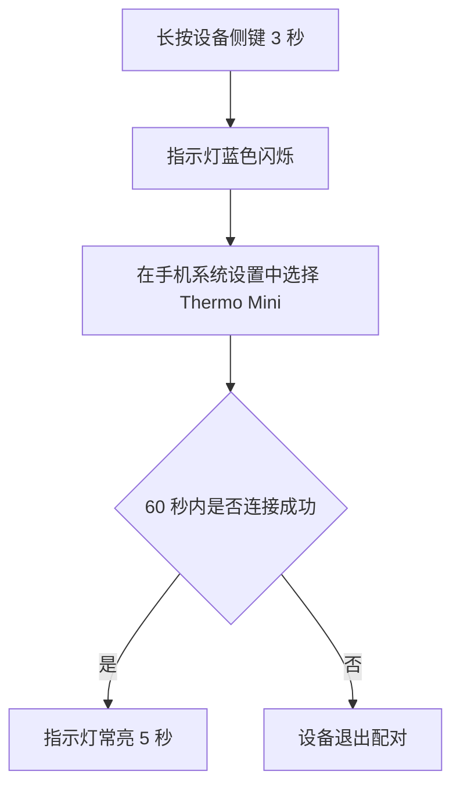
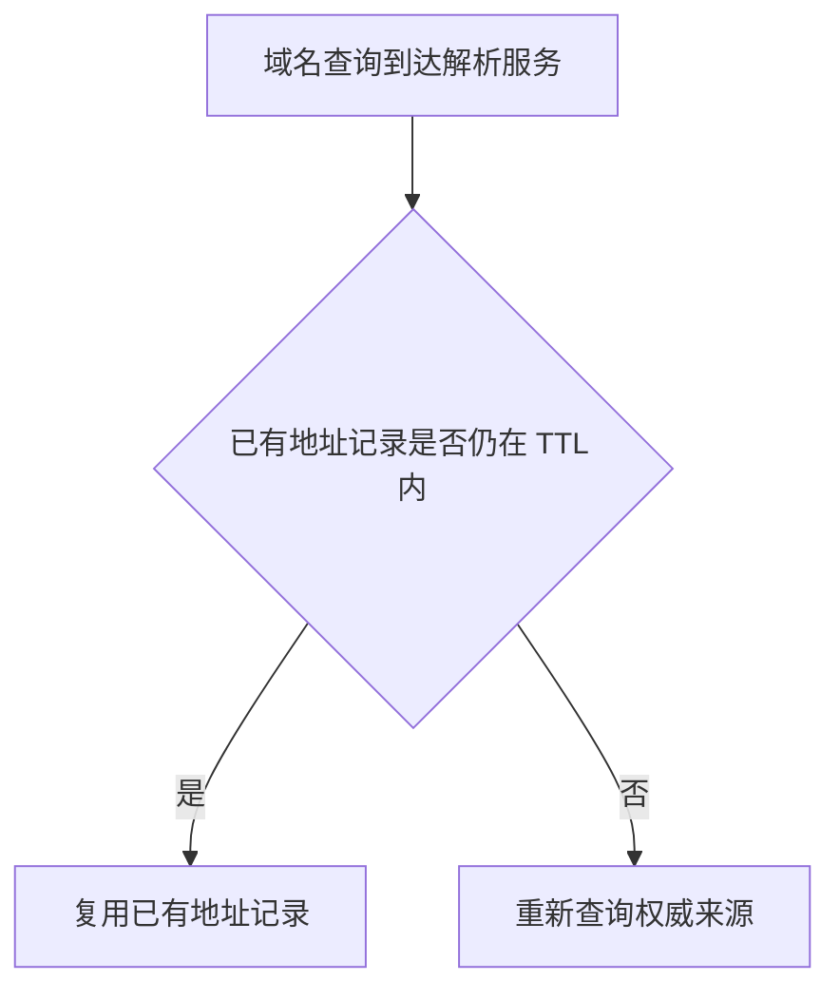
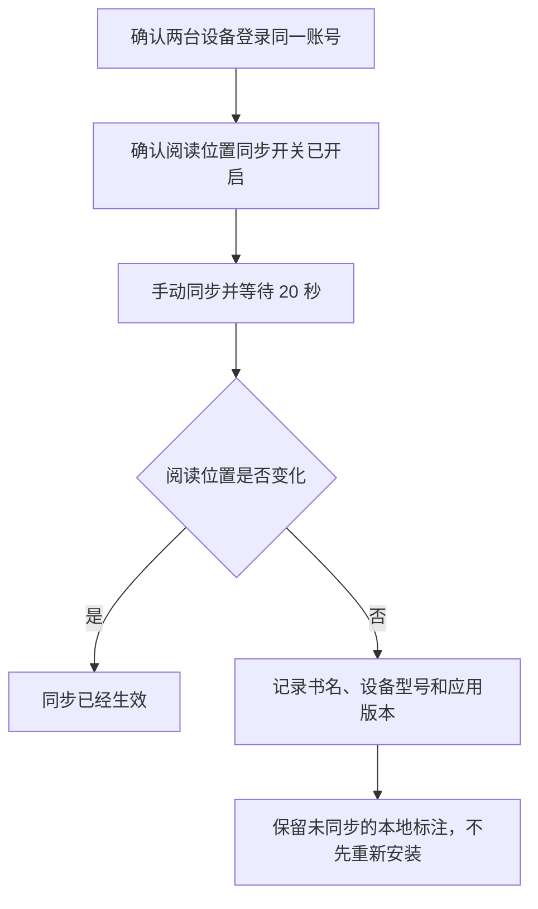

# vNext 1.1 第三轮修订候选审核包

本审核包包含 1 个锚点修订版和 12 个第一轮前向修订版；全部答案仍为 Candidate，只有用户明确接受后才能转为 Gold

第一轮前向测试的原始成绩永久保持为 8/20；本包只验证修订是否解决已发现问题，不改变第一次未见测试结果

## 1. CANDIDATE-03-R5

用户请求：

> 改写快速检查说明，并解释新手完成操作必须知道的术语

原始材料：

> 运行 `npm run check`。发现失效链接时，命令以退出码 `2` 结束，CI 会把本次检查标记为失败。

修订答案：

用户可以运行下面的命令，让系统检查项目中的链接：

```powershell
npm run check # npm 调用项目已登记的 check 脚本；系统在命令结束后显示检查结果
```

npm 是 Node.js 生态使用的包管理客户端和软件包仓库；开发者可以用它安装、更新、管理和发布 JavaScript 或 TypeScript 软件包与项目依赖；这里的 `run check` 会让 npm 调用当前项目登记为 `check` 的脚本，脚本的实际检查内容由项目配置决定

如果系统发现失效链接，检查命令会以退出码 `2` 结束；退出码是命令返回给操作系统的数字状态，调用脚本可以据此判断本次检查失败

CI 持续集成（Continuous Integration）是开发者提交代码后自动执行构建、测试和检查，从而尽早发现代码集成问题的一套开发流程；CI 可以读取退出码 `2` 并把本次检查标记为失败，但现有说明没有证明当前项目已经启用 CI，需要查看项目的自动化配置才能确认

审核要求：确认 npm 说明是否自然且符合官方事实，并确认命令主体、退出码、CI 与证据边界是否清楚

## 2. CANDIDATE-FWD-R1-002-R2

用户请求：

> 翻译成零基础读者能直接执行的中文，并就近解释陌生术语

原始材料：

Disconnect the appliance from mains power before removing the rear panel. The capacitor may retain a hazardous charge for five minutes after disconnection.

修订答案：

拆下设备后面板以前，先断开设备与市电（Mains Power）的连接；市电是市政电网通过建筑供电线路引入的交流电源，这个名称强调设备使用的是建筑外部电网提供的电力

断开电源后的 5 分钟内不要拆下后面板；电容器（Capacitor）是能够暂时储存电荷的电子部件，它在设备断电后仍可能保留危险电荷，因此等待 5 分钟是为了让残留电荷有时间释放

本次修订依据：

* 翻译任务中的专业名词需要保留官方英文名称
* 市电需要说明来自市政电网，电容器需要说明能够暂时储存电荷

审核决定：接受或拒绝；拒绝时请指出具体位置和原因

## 3. CANDIDATE-FWD-R1-003-R2

用户请求：

> 压缩成一段项目进展，保留每个数字、未完成项和下一步

原始材料：

团队检查了 42 个页面，其中 39 个页面显示正常，3 个页面的移动端导航遮挡正文。桌面端没有发现遮挡。修复尚未部署。下一步是在 360 像素和 390 像素宽度下复测这 3 个页面。

修订答案：

团队共检查 42 个页面，其中 39 个显示正常，另有 3 个页面的移动端导航会遮挡正文，桌面端未发现遮挡

修复尚未部署，下一步是在 360 像素和 390 像素宽度下复测这 3 个页面

本次修订依据：

* 压缩减少重复文字，不应删除主题之间的必要换行

审核决定：接受或拒绝；拒绝时请指出具体位置和原因

## 4. CANDIDATE-FWD-R1-004-R2

用户请求：

> 从零开始解释为什么保温杯不能让热水永远保持原温，并说明三种热量传递方式

原始材料：

保温杯通过真空夹层减少传导和对流，通过反射层减少辐射；杯盖、杯口和密封结构仍会让热量逐渐散失。

修订答案：

# 保温杯为什么不能让热水永远保持原温

热量会通过 3 种方式传递：

* 热传导（Thermal Conduction）：能量通过物质内部相邻粒子的接触传递；名称中的传导表示热量沿着直接接触的材料向外传递
* 对流（Convection）：能量随着液体或气体的流动传递；这个名称表示流体在循环运动中把热量带到其他位置
* 热辐射（Thermal Radiation）：能量以电磁波形式传递；它不要求物体直接接触，因此真空中仍然会发生

保温杯的真空夹层会减少热传导和对流，反射层会减少热辐射；这些结构只能减慢热量传递，杯盖、杯口和密封结构仍会让热量逐渐散失，因此热水不能永远保持原来的温度

本次修订依据：

* 单行术语定义统一使用术语、英文名称和冒号解释结构

审核决定：接受或拒绝；拒绝时请指出具体位置和原因

## 5. CANDIDATE-FWD-R1-005-R2

用户请求：

> 根据给定事实写一份蓝牙温度计首次配对说明，读者没有使用经验

原始材料：

本案例没有原始正文，只使用请求中明确提供的事实

修订答案：

# Thermo Mini 首次配对

下面的流程分别显示配对成功和超时退出两种结果



<p align="center">图 1. Thermo Mini 首次配对流程</p>

图中的流程从长按设备侧键开始；蓝色闪烁表示设备已经进入可配对状态，手机随后需要在系统设置中选择 `Thermo Mini`；连接成功时，指示灯会常亮 5 秒，60 秒内没有连接时，设备会退出配对并返回开始步骤

1. 长按设备侧键 3 秒
   - 看到指示灯蓝色闪烁后再继续；这个现象表示设备已经进入配对状态
2. 在手机系统设置中选择 `Thermo Mini`
   - 这一步让手机向当前设备发起连接
3. 查看指示灯
   - 指示灯常亮 5 秒表示连接成功
   - 60 秒内没有连接表示本次配对超时；设备退出配对后，需要从第一步重新开始

本次修订依据：

* 步骤保持缩进编号列表
* GitHub 中的图题必须经过实际渲染确认居中

审核决定：接受或拒绝；拒绝时请指出具体位置和原因

## 6. CANDIDATE-FWD-R1-008-R2

用户请求：

> 保留原表，先解释列和值，再说明比较结论、缺失证据和下一步

原始材料：

| 模式 | 每次保存内容 | 恢复速度 | 额外存储 |
|---|---|---|---|
| 完整备份 | 全部文件 | 快 | 高 |
| 增量备份 | 上次任意备份后变化的文件 | 较慢 | 低 |
| 差异备份 | 上次完整备份后变化的文件 | 中等 | 中等 |

修订答案：

<div align="center">
<table>
<thead><tr><th>模式</th><th>每次保存内容</th><th>恢复速度</th><th>额外存储</th></tr></thead>
<tbody>
<tr><td>完整备份</td><td>全部文件</td><td>快</td><td>高</td></tr>
<tr><td>增量备份</td><td>上次任意备份后变化的文件</td><td>较慢</td><td>低</td></tr>
<tr><td>差异备份</td><td>上次完整备份后变化的文件</td><td>中等</td><td>中等</td></tr>
</tbody>
</table>
<p>表 1. 备份模式比较</p>
</div>

这张表比较 3 种备份方式在保存范围、恢复速度和额外存储需求上的差异

各列的含义如下：

* 模式：列出完整备份、增量备份和差异备份 3 种方式
* 每次保存内容：说明每次备份覆盖哪些文件
* 恢复速度：使用快、中等和较慢进行相对比较；表格没有给出具体时长
* 额外存储：使用高、中等和低表示相对需求；表格没有给出具体容量

各模式的主要区别如下：

* 完整备份：每次保存全部文件，恢复速度快，额外存储需求高
* 增量备份：只保存上次任意备份后发生变化的文件，额外存储需求低，恢复速度较慢
* 差异备份：保存上次完整备份后发生变化的文件，恢复速度和额外存储需求都处于中等水平

表格支持的结论是一组相对取舍；完整备份偏向较快恢复，增量备份偏向较低额外存储，差异备份位于两者之间

表格没有文件数量、设备速度、保存周期或故障恢复实测数据，因此不能据此计算实际存储量、备份耗时或恢复耗时；下一步需要在同一环境中记录这些条件，并分别执行恢复测试

本次修订依据：

* 表题必须经过 GitHub 实际渲染确认居中
* 并列的列定义必须换行并缩进

审核决定：接受或拒绝；拒绝时请指出具体位置和原因

## 7. CANDIDATE-FWD-R1-009-R2

用户请求：

> 保留原始 Python 代码，逐步解释输入、循环、条件、输出、运行方法和证据边界

原始材料：

```text
def count_large(values, limit):
    total = 0
    for value in values:
        if value > limit:
            total += 1
    return total
```

修订答案：

原始 Python 代码如下；Python 是一种编程语言，这段函数用于统计严格大于指定阈值的元素数量

```python
def count_large(values, limit):
    total = 0
    for value in values:
        if value > limit:
            total += 1
    return total
```

下面保留同一段代码并加入注释；注释说明每个有效语句的作用和执行结果，不改变原始逻辑

```python
def count_large(values, limit):  # 定义函数；values 提供待检查数值，limit 提供比较阈值
    total = 0  # 创建计数器并从 0 开始；它只记录满足条件的元素数量
    for value in values:  # 依次读取 values 中的每个元素，直到全部元素处理完成
        if value > limit:  # 只在当前元素严格大于 limit 时进入下一行；等于 limit 时不计数
            total += 1  # 把计数器增加 1；结果表示又发现一个满足条件的元素
    return total  # 返回最终计数，让调用方取得结果；这行本身不会把结果显示在屏幕上
```

`values` 需要提供可以逐项读取的数值集合，`limit` 是每个元素都要比较的阈值；在 Python 环境中先执行代码定义函数，再调用 `count_large(values, limit)` 取得返回值

原始材料没有给出实际输入，因此无法计算一个具体结果；代码也没有定义不合格输入的处理方式，需要通过额外测试确认字符串、空值或不可比较对象进入函数时会发生什么

本次修订依据：

* 代码说明必须加入合法注释，或者逐行映射每个有效语句

审核决定：接受或拒绝；拒绝时请指出具体位置和原因

## 8. CANDIDATE-FWD-R1-010-R2

用户请求：

> 合并追加要求，写成一份连续说明；后来的要求覆盖冲突的旧要求

原始材料：

* 第一轮：校准前让探头在室温下静置 10 分钟，每次记录 3 个读数
* 追加：静置时间改为 15 分钟
* 追加：如果 3 个读数的最大差值超过 0.4 摄氏度，就重新连接探头并再次测量

修订答案：

# 校准说明

校准前，让探头在室温下静置 15 分钟

每次记录 3 个读数；如果 3 个读数中的最大值与最小值相差超过 0.4 摄氏度，重新连接探头并再次测量

本次修订依据：

* 已经被追加要求替换的旧要求不得继续出现在最终答案

审核决定：接受或拒绝；拒绝时请指出具体位置和原因

## 9. CANDIDATE-FWD-R1-012-R2

用户请求：

> 完整翻译并补充理解这一地质过程所需的背景，明确区分原文结论和补充解释

原始材料：

The dated ash layer lies above the fossil bed. It therefore sets a minimum age for the burial event, but it does not establish how long the organisms lived before burial.

修订答案：

# 原文结论

已经测定年代的火山灰层位于化石层上方，因此这个年代为埋藏事件确定了最低年龄；不过，这个年代不能说明这些生物在被埋藏以前生活了多长时间

# 理解结论需要的背景

* 地层（Stratum）：地质过程中逐层形成的岩石或沉积物；这里的位置关系用于判断不同层形成的先后顺序
* 火山灰层（Volcanic Ash Layer）：火山喷发后沉积形成的灰层；它可以通过合适的同位素方法测定形成年代
* 化石层（Fossil Bed）：包含化石的地层；这个名称表示化石集中保存在这一层中
* 最低年龄（Minimum Age）：事件至少已经发生了这么久；上覆火山灰层形成在埋藏事件之后，因此它限制了埋藏事件不能晚于该层的形成时间

测年的对象是化石层上方的火山灰层，不是生物本身；这些信息只能限制埋藏事件的时间，不能据此推断生物在埋藏以前存活了多久

本次修订依据：

* 删除中文句号
* 降低单段信息密度
* 解释专业名词及其名称含义

审核决定：接受或拒绝；拒绝时请指出具体位置和原因

## 10. CANDIDATE-FWD-R1-013-R2

用户请求：

> 从零解释域名查询中的缓存有效期为什么会影响修改生效速度

原始材料：

解析服务会在缓存有效期内复用已有地址记录。记录到期后，解析服务才需要重新查询权威来源。不同解析服务的缓存开始时间可能不同。

修订答案：

# 缓存有效期怎样影响修改生效

`TTL` 生存时间（Time to Live）表示一条地址记录可以在缓存中继续使用多长时间；这个名称强调记录只在指定时间内有效，时间结束后，解析服务需要重新查询权威来源



<p align="center">图 1. 地址记录的复用和重新查询</p>

查询到达解析服务后，服务会先检查已有地址记录是否仍在 `TTL` 内；记录仍然有效时，服务继续使用旧记录，记录到期时，服务重新查询权威来源

域名记录修改后，仍在有效期内的旧记录会继续被使用，因此修改不会同时在所有查询中生效；不同解析服务开始缓存同一记录的时间可能不同，它们也会在不同时间到期，所以不同用户看到修改结果的时间可能不同

`TTL` 只规定记录可以缓存多久，不保证所有解析服务同时刷新；要确认实际生效范围，还需要从不同解析服务和网络位置重复查询

本次修订依据：

* 行内代码中的 TTL 仍需按照专业缩写解释
* 图题必须经过实际渲染确认居中

审核决定：接受或拒绝；拒绝时请指出具体位置和原因

## 11. CANDIDATE-FWD-R1-015-R2

用户请求：

> 根据事实写一份电子书无法同步阅读位置时的排查说明，解释每一步为什么做和会看到什么

原始材料：

本案例没有原始正文，只使用请求中明确提供的事实

修订答案：

# 阅读位置无法同步时的排查步骤



<p align="center">图 1. 阅读位置同步排查流程</p>

流程先确认账号和同步开关，再执行一次可观察的同步测试；如果阅读位置仍然没有变化，系统需要保留问题环境和本地标注，避免重新安装造成数据丢失

1. 确认两台设备登录同一账号
   - 这一步用于排除账号不同造成的数据隔离；界面应当显示相同账号
2. 确认两台设备的阅读位置同步开关已经开启
   - 开关关闭时，系统不会同步阅读位置；界面会显示同步功能没有开启
3. 手动同步并等待 20 秒
   - 等待后查看阅读位置是否变化；发生变化表示同步已经生效
4. 阅读位置仍然没有变化时，记录以下信息：
   - 书名：标明出现问题的内容
   - 设备型号：标明出现问题的硬件环境
   - 应用版本：标明出现问题的软件环境
5. 保留未同步的本地标注，不先重新安装
   - 重新安装可能删除尚未同步的本地标注，因此它不能作为首选步骤

本次修订依据：

* 流程图和图题需要实际居中
* 并列步骤必须使用缩进列表

审核决定：接受或拒绝；拒绝时请指出具体位置和原因

## 12. CANDIDATE-FWD-R1-017-R2

用户请求：

> 保留原图，解释坐标、警戒线、每个数据点、趋势、异常、实际影响和证据边界

原始材料：


修订答案：

<div align="center">

<p>图 1. 河道水位变化图</p>
</div>

## 1. 坐标和警戒线

横轴表示时间，依次标出 06:00、09:00、12:00、15:00、17:00 和 18:00；纵轴表示水位，单位为米，范围从 2.0 米到 4.0 米

红色虚线是 3.5 米警戒线，用于标出需要加强监测的阈值；水位达到或超过这条线时需要继续核对现场情况，但图中没有规定自动认定洪水

## 2. 数据点和趋势

图中的 6 个数据点如下：

* 06:00：水位约 2.2 米
* 09:00：水位 2.5 米
* 12:00：水位约 3.0 米
* 15:00：水位达到 3.8 米
* 17:00：水位约 3.3 米
* 18:00：水位约 2.8 米

水位从 06:00 到 15:00 持续上升，并在 15:00 达到最高点 3.8 米，比警戒线高 0.3 米；随后水位回落，17:00 和 18:00 的数据点都位于警戒线下方

本图中的异常点是 15:00；该点超过警戒线，因此需要加强监测，但图中信息不足以单独证明已经发生洪水

## 3. 证据边界

图中没有降雨量、流速、堤防状态或预测模型，因此不能判断水位变化的原因、堤防是否能够承受，也不能预测洪水是否会发生；下一步需要核对同期降雨量、流速、堤防状态和洪水预测模型

本次修订依据：

* 删除中文句号
* 数据点和趋势属于自然联合标题，可以保留

审核决定：接受或拒绝；拒绝时请指出具体位置和原因

## 13. CANDIDATE-FWD-R1-018-R2

用户请求：

> 保留原表，解释列、行、缺失值和变化趋势，不逐格机械复述

原始材料：

| 样品 | 20 分钟 | 40 分钟 | 60 分钟 |
|---|---:|---:|---:|
| A | 22.1°C | 24.8°C | 26.0°C |
| B | 22.0°C | — | 25.1°C |
| C | 22.2°C | 23.0°C | 23.4°C |

修订答案：

<div align="center">
<table>
<thead><tr><th>样品</th><th>20 分钟</th><th>40 分钟</th><th>60 分钟</th></tr></thead>
<tbody>
<tr><td>A</td><td>22.1°C</td><td>24.8°C</td><td>26.0°C</td></tr>
<tr><td>B</td><td>22.0°C</td><td>—</td><td>25.1°C</td></tr>
<tr><td>C</td><td>22.2°C</td><td>23.0°C</td><td>23.4°C</td></tr>
</tbody>
</table>
<p>表 1. 样品温度随时间变化</p>
</div>

第一列列出样品 A、B 和 C；其余 3 列分别记录 20 分钟、40 分钟和 60 分钟时的温度，单位为摄氏度；每一行表示同一样品在不同时间的记录

样品 B 在 40 分钟位置的破折号表示该时间点没有记录，不表示温度为 0；由于中间数据缺失，不能判断 B 在 20 分钟到 60 分钟之间的具体变化过程

各样品的变化如下：

* A：从 22.1°C 升到 26.0°C，总变化为 3.9°C
* B：从 22.0°C 升到 25.1°C，总变化为 3.1°C，但缺少 40 分钟记录
* C：从 22.2°C 升到 23.4°C，总变化为 1.2°C

现有记录显示 A 和 C 的温度随时间上升，其中 A 的增幅大于 C；B 的起点最低，60 分钟时的温度位于 A 与 C 之间，但缺失值使中间趋势无法确认

表格没有加热功率、环境温度或重复实验结果，因此不能解释样品温度差异的原因，也不能证明相同趋势能够稳定重复；下一步需要补充这些条件并进行重复实验

本次修订依据：

* 表题必须居中
* A、B、C 三组平行数据必须换行
* 删除中文句号

审核决定：接受或拒绝；拒绝时请指出具体位置和原因
