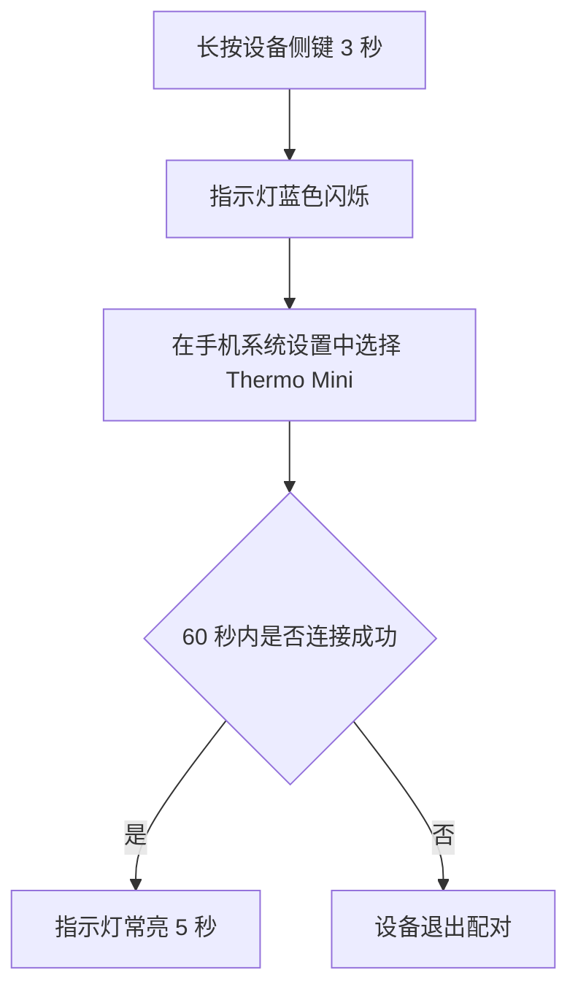
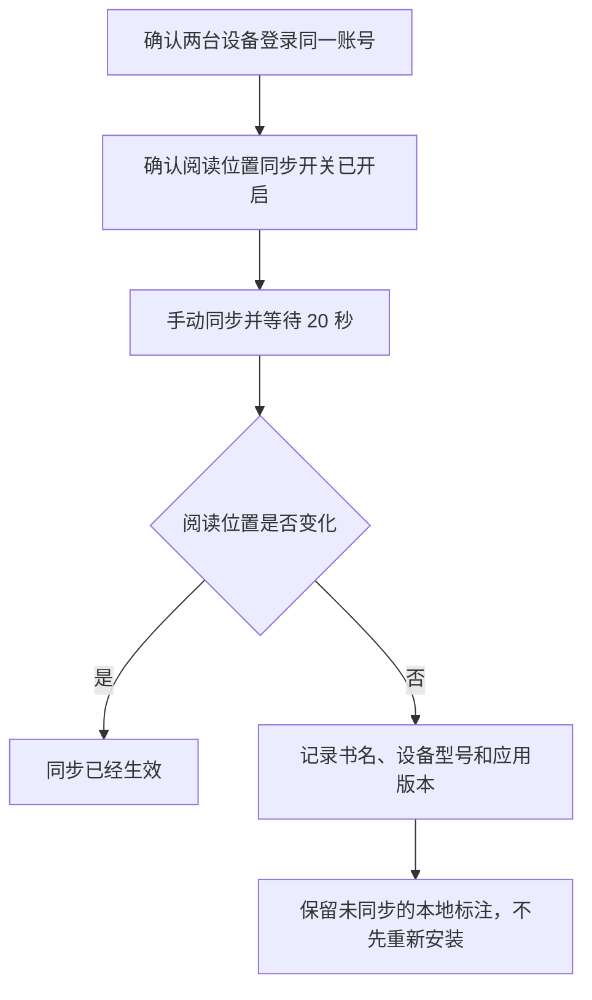

# vNext 1.1 第五轮修订候选审核包

本审核包只包含第四轮明确拒绝后生成的 5 个新 Candidate；自动检查通过不能把任何答案转为 Gold

第一轮首次未见成绩永久保持为 8/20；第四轮人工结果为接受 8、拒绝 5，本包不改写这些历史成绩

请逐项回复接受或拒绝；拒绝时指出具体位置和原因，系统会保留当前版本并生成下一修订版

## 1. CANDIDATE-03-R6

用户请求：

> 改写快速检查说明，并解释新手完成操作必须知道的术语

原始材料：

> 运行 `npm run check`。发现失效链接时，命令以退出码 `2` 结束，CI 会把本次检查标记为失败。

修订答案：

用户可以运行下面的命令，让系统检查项目中的链接：

```powershell
npm run check # npm 调用项目已登记的 check 脚本；系统在命令结束后显示检查结果
```

npm 是官方名称，不是 `Node Package Manager` 的首字母缩写；它是 Node.js 生态使用的包管理客户端和软件包仓库；开发者可以用它安装、更新、管理和发布 JavaScript 或 TypeScript 软件包与项目依赖；这里的 `run check` 会让 npm 调用当前项目登记为 `check` 的脚本，脚本的实际检查内容由项目配置决定

如果系统发现失效链接，检查命令会以退出码 `2` 结束；退出码是命令返回给操作系统的数字状态，调用脚本可以据此判断本次检查失败

CI 持续集成（Continuous Integration）是开发者提交代码后自动执行构建、测试和检查，从而尽早发现代码集成问题的一套开发流程；CI 可以读取退出码 `2` 并把本次检查标记为失败，但现有说明没有证明当前项目已经启用 CI，需要查看项目的自动化配置才能确认

本次修订依据：

* npm 保持官方小写
* 自然说明 npm 是官方名称，不是 Node Package Manager 的首字母缩写
* 保留客户端、软件包仓库、命令主体、退出码、CI 和证据边界

审核决定：接受或拒绝；拒绝时请指出具体位置和原因

## 2. CANDIDATE-FWD-R1-005-R3

用户请求：

> 根据给定事实写一份蓝牙温度计首次配对说明，读者没有使用经验

原始材料：

本案例没有原始正文，只使用请求中明确提供的事实

修订答案：

# Thermo Mini 首次配对

下面的流程分别显示配对成功和超时退出两种结果



<p align="center">图 1. Thermo Mini 首次配对流程</p>

图中的流程从长按设备侧键开始；蓝色闪烁表示设备已经进入可配对状态，手机随后需要在系统设置中选择 `Thermo Mini`；连接成功时，指示灯会常亮 5 秒，60 秒内没有连接时，设备会退出配对并返回开始步骤

1. 长按设备侧键 3 秒，看到指示灯蓝色闪烁后再继续；这个现象表示设备已经进入配对状态
2. 在手机系统设置中选择 `Thermo Mini`，这一步让手机向当前设备发起连接
3. 查看指示灯
   - 指示灯常亮 5 秒表示连接成功
   - 60 秒内没有连接表示本次配对超时；设备退出配对后，需要从第一步重新开始

本次修订依据：

* 编号项只有一条紧随说明时保持同行
* 一个编号项包含多个真实子项时才使用嵌套列表

审核决定：接受或拒绝；拒绝时请指出具体位置和原因

## 3. CANDIDATE-FWD-R1-009-R3

用户请求：

> 保留原始 Python 代码，逐步解释输入、循环、条件、输出、运行方法和证据边界

原始材料：

```text
def count_large(values, limit):
    total = 0
    for value in values:
        if value > limit:
            total += 1
    return total
```

修订答案：

原始 Python 代码如下

```python
def count_large(values, limit):
    total = 0
    for value in values:
        if value > limit:
            total += 1
    return total
```

下面保留同一段代码并加入同行注释；每个注释都从最长代码行之后的同一列开始，代码逻辑没有改变

```python
def count_large(values, limit): # 定义函数；values 提供待检查数值，limit 提供比较阈值
    total = 0                   # 创建计数器并从 0 开始，只记录满足条件的元素数量
    for value in values:        # 依次读取 values 中的每个元素，直到全部处理完成
        if value > limit:       # 只在当前元素严格大于 limit 时进入下一行，等于时不计数
            total += 1          # 把计数器增加 1，表示又发现一个满足条件的元素
    return total                # 返回最终计数，这行本身不会把结果显示在屏幕上
```

在 Python 环境中先执行代码定义函数，再调用 `count_large(values, limit)`

原始材料没有给出实际输入，因此无法计算具体结果；代码也没有规定不合格输入的处理方式，需要用字符串、空值或不可比较对象补充测试才能确认失败表现

本次修订依据：

* 所有可注释语句的同行注释从最长代码行之后的同一列开始
* 代码注释已经说明的逐行内容不得在正文重复

审核决定：接受或拒绝；拒绝时请指出具体位置和原因

## 4. CANDIDATE-FWD-R1-012-R3

用户请求：

> 完整翻译并补充理解这一地质过程所需的背景，明确区分原文结论和补充解释

原始材料：

The dated ash layer lies above the fossil bed. It therefore sets a minimum age for the burial event, but it does not establish how long the organisms lived before burial.

修订答案：

# 原文结论

已经测定年代的火山灰层位于化石层上方，因此这个年代为埋藏事件确定了最低年龄；不过，这个年代不能说明这些生物在被埋藏以前生活了多长时间

# 不需要地质学知识的理解方式

可以把这些地层想成先后叠放的几层材料；化石层在下面，火山灰层后来覆盖在上面，因此下面的埋藏事件一定发生得更早

测得上方火山灰层的年代以后，只能确认埋藏事件至少已经发生了这么久；埋藏也可能更早，所以这个结果叫作最低年龄

# 补充背景

* 地层（Stratum）：地质过程中逐层形成的岩石或沉积物；上下位置可以帮助判断形成先后
* 火山灰层（Volcanic Ash Layer）：火山喷发后沉积形成的灰层；合适的同位素方法可以测定它的形成年代
* 化石层（Fossil Bed）：包含化石的地层；这里记录了生物被埋藏的位置
* 最低年龄（Minimum Age）：事件至少已经发生了这么久，但实际时间可以更早

测年的对象是化石层上方的火山灰层，不是生物本身；这些信息只能限制埋藏事件的时间，不能据此推断生物在埋藏以前存活了多久

本次修订依据：

* 增加不需要地质学知识也能理解的普通解释
* 继续区分原文结论和补充背景

审核决定：接受或拒绝；拒绝时请指出具体位置和原因

## 5. CANDIDATE-FWD-R1-015-R3

用户请求：

> 根据事实写一份电子书无法同步阅读位置时的排查说明，解释每一步为什么做和会看到什么

原始材料：

本案例没有原始正文，只使用请求中明确提供的事实

修订答案：

# 阅读位置无法同步时的排查步骤



<p align="center">图 1. 阅读位置同步排查流程</p>

流程先确认账号和同步开关，再执行一次可观察的同步测试；如果阅读位置仍然没有变化，需要保留问题环境和本地标注，避免重新安装造成数据丢失

1. 确认两台设备登录同一账号，这一步用于排除账号不同造成的数据隔离；界面应当显示相同账号
2. 确认两台设备的阅读位置同步开关已经开启，开关关闭时系统不会同步；界面会显示同步功能没有开启
3. 手动同步并等待 20 秒，等待后查看阅读位置是否变化；发生变化表示同步已经生效
4. 阅读位置仍然没有变化时，记录以下信息：
   - 书名：标明出现问题的内容
   - 设备型号：标明出现问题的硬件环境
   - 应用版本：标明出现问题的软件环境
5. 保留未同步的本地标注，不先重新安装；重新安装会删除尚未同步的本地标注，因此它不能作为首选步骤

本次修订依据：

* 编号项只有一条紧随说明时保持同行
* 书名、设备型号和应用版本属于真实多项，继续使用嵌套列表

审核决定：接受或拒绝；拒绝时请指出具体位置和原因
