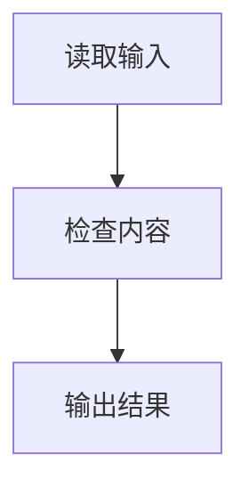

# 中文技术内容详细规范

## 1 目录

- 因果顺序
- 中文语序
- 动词与句子节奏
- 结论与范围
- 文档编号
- 操作步骤
- 换行密度
- 列表
- 分支
- 流程图
- 图表
- 引用
- 解释单位
- 术语层级
- 术语格式
- 数学排版
- 解释层次
- 括号控制
- 引号
- 引出标点
- 行尾标点
- 标题
- 报告顺序
- 内容类型
- 交付检查

## 2 因果顺序

判断、风险结论、限制条件和行动建议使用以下顺序

1. 具体事实或形成原因
2. 对读者产生的实际后果
3. 判断、限制或行动

错误

`目前有明显风险，需要今天介入`

正确

`每100笔订单约有9笔没有按时足量交付，还有180笔订单尚未处理；继续积压会增加逾期量和客户投诉，因此今天需要介入`

错误

`仅凭三个数字还不能判断为重大异常`

正确

`报告没有提供目标值、过去四周的变化、每天能够处理的订单数量和最早订单的等待时间；缺少这些比较依据，因此目前只能确认风险已经出现，还不能判断是否达到重大异常`

禁止先写抽象否定关系，再在后半句补充事实

错误

`两个指标不能直接相加，因为同一订单可能同时进入两个统计结果`

更自然

`同一订单可能同时进入两个统计结果，相加会把同一笔业务重复计算，因此两个指标不能直接相加`

双重否定会迫使读者先撤销一次否定，再判断剩余含义，所以改成直接肯定或单一否定

错误

`这个问题不能不处理`

正确

`这个问题必须处理`

错误

`目前并非没有风险`

正确

`目前仍有风险`

直接回答是否完成、是否批准或是否安全时，可以先给结果；随后立即给出依据和未证明的边界

紧急安全指令可以先写行动；随后立即说明延误会造成什么

删除“先说结论、简单来说、换句话说、需要注意的是、值得一提的是、可以确定的是”等写作套话

## 3 中文语序

普通陈述采用“主体 → 动作或状态 → 结果”

主体、因果关系和证据边界在段落层面完整即可

同一段落连续讨论一个明确主体时，后面的句子可以省略已经清楚的主体

前文出现多个对象、主体发生切换或责任可能混淆时，必须重新写明准确主体

前文存在多个可能对象时，直接重复准确名称，因为“它、其、该对象、该系统”等代词会让读者无法确定实际指向

错误

`服务器和监督器都在运行，它完成后会生成报告`

正确

`服务器继续运行任务；监督器在九条任务全部完成后生成报告`

前后句更换主体时，在发生切换的句子中重新写明新主体

错误

`持续集成检查完成后就会发布`

正确

`持续集成检查通过后，GitHub Actions 自动任务会发布测试结果`

第一种写法没有说明谁负责发布，读者无法判断发布动作来自检查器、仓库平台还是维护者

错误

`已经完成的是芯片实现流程的本轮验证`

正确

`芯片本轮实现验证已经完成`

以下延迟主语结构只在确实存在对比时使用

- `已经完成的是`
- `需要关注的是`
- `可以确定的是`
- `值得注意的是`
- `真正重要的是`

连续出现多个“的”时，恢复动词、删除重复修饰或拆句

错误

`芯片本轮的实现流程的验证已经完成`

正确

`芯片本轮实现验证已经完成`

否定先行的转折结构会迫使读者先处理一个抽象的错误方向，再等待后半句获得真正结论

错误

`阻塞产品发布的不是本轮实现结果，而是真实硬件验证尚未完成`

正确

`真实硬件验证尚未完成，因此产品仍不能发布`

先写决定结果的事实，读者可以顺着原因直接得到结论

大型任务需要先逐节检查，再扫描拼接后的全文

检查范围包括同一行、跨行和跨段出现的否定先行转折

检查器发现一处后仍要继续扫描，因为相隔较远的章节可能重复出现同一问题

逐字引用、原始日志和用户提供的原句可以原样保留；这类内容使用引用块或代码格式与正文区分

版本、状态、限制、期限和结果需要写明所属对象

错误

`项目冻结版本为：2024.1`

正确

`项目 Vivado 冻结版本为：2024.1`

后一个句子明确说明 `2024.1` 是芯片设计工具版本，不会被误解成项目文件版本或产品版本

### 3.1 动词选择

`进行`、`完成` 和 `执行` 本身没有错误，机械感来自这些词代替了本来可以直接使用的动作

错误

`维护人员进行日志检查，并完成对报警原因的分析`

正确

`维护人员检查日志，再分析报警原因`

错误

`测试团队执行接口验证`

正确

`测试团队验证接口`

下面两类用法保留：

- `操作人员执行恢复命令`
- `备份任务已经完成`

第一句描述真实的命令操作，第二句描述任务结果；替换这两个词反而会降低准确性

### 3.2 句子节奏

一个句子主要承载一个动作或一条因果关系

错误

`三项检查都留下记录，所以软件流程已经跑通；强制门禁包含全部检查，任一失败都会阻止交付；真实设备尚未测试，所以现有结果不能证明产品可以发布`

正确

`三项检查都留下通过记录，因此软件流程已经跑通`

`强制门禁会拦截任何失败结果`

`现有证据只覆盖软件流程；产品发布仍需真实设备测试`

固定二十五字上限会拆碎术语全称、数值来源和必要条件，所以不用字数单独决定是否拆句

检查器只把下面情况列为可能的嵌套长句：

- 正文单行超过五十五个中文字符
- 同一行至少出现两次逗号或分号转折

这个阈值用于发现候选问题，最终仍要判断句子是否同时承担证据、后果和范围

相邻句子必须带来信息增量，可以增加新证据、新后果、新行动或新结论

同一主体连续承担多个动作时，使用主体引导句和行动列表

正确

质量负责人负责以下工作：

- 复核测量记录
- 批准货物放行
- 保存处置证据

多个主体同时出现时，继续写明每个主体，不能为了避免重复而改用模糊代词

明确主体用于消除歧义，不能把规则机械套到每一句

一段文字已经明确由质量负责人处理时，列表中的每项行动不再重复“质量负责人”

### 3.3 结论位置

结论位置取决于读者任务

直接询问项目是否完成时，可以先写结果：

`本轮软件流程已经跑通`

随后立即补充通过记录和证据范围

普通风险分析仍然按照原因到结果书写：

`每天新增订单多于完成订单，积压会继续扩大，因此处理能力需要增加`

全文强制结论先行会让普通分析重新变成抽象结果在前、具体原因在后的倒序结构

### 3.4 证据范围

自然表达不能靠补写事实实现

用户只提供“检查日志、验证请求、调整限流配置”时，正文只能确认这些处理动作

调整后的错误率、客户恢复情况和故障根因没有来源时，正文把它们列为待核对结果，不能写成已经发生的事实

边界说明优先使用正向范围

机械写法

`软件流程通过不代表板卡通过，这也不代表产品可以发布，内部测试完成也不代表客户已经验收`

自然写法

`现有证据只覆盖软件流程`

`板卡行为仍需实物测试，产品发布仍需客户验收`

同一解释单元只完整说明一次证据范围或发布边界

下面三种内容可以重复必要边界：

- 安全提示
- 医疗或法律结论
- 可能脱离正文单独传播的表格、摘要或章节

这些内容需要独立成立；删除边界可能让单独阅读者采取错误行动

## 4 数值来源

每个业务数值、测量结果、比较结果、阈值、配置值、预测值和经验值都要说明来源

来源可以是下面几类：

- 外部文献、标准或公开数据，并使用顺序引用编号
- 用户本次提供的原始数据
- 软件界面、日志、配置文件、监测系统、仪器或业务记录
- 写明输入数值和公式的计算结果
- 明确标记适用条件和不确定范围的经验估计

同一来源覆盖一组连续数值时，在这组数值前统一说明来源，后续项目不需要机械重复

错误

`磁盘只剩 8 GB，继续运行可能耗尽空间`

正确

`服务器监测系统显示，数据盘剩余 8 GB；继续运行可能耗尽空间`

错误

`积压每天净增 7 笔`

正确

`根据订单系统记录的每天新增 62 笔和完成 55 笔计算，积压每天净增 $62-55=7$ 笔`

错误

`迁移至少预留 30 分钟`

正确

`根据运维团队最近十次同规模迁移的经验，迁移时间通常为二十五到三十分钟；本次预留 30 分钟属于经验估计，网络负载增加时仍可能超时`

来源无法确认时，直接标记为“来源待核对”，不能把数值写成已经证实的事实

章节编号、步骤编号、引用编号、版本标识和程序内部标识只用于定位或识别，不属于业务数值，因此不要求额外来源

## 5 文档编号

内容确实需要分成多个部分时，使用十进制层级编号

- 二级标题使用 `1`、`2`、`3`
- 三级标题使用 `1.1`、`1.2`、`2.1`
- 四级标题使用 `1.1.1`、`1.1.2`

编号从 `1` 开始，不使用 `0` 作为第一节

文档主标题不编号

标题编号需要与标题层级一致，不能从 `1.1` 直接跳到 `1.1.1.1`

只有一个短主题时不为了编号制造章节

## 6 操作步骤

需要读者按照先后顺序执行时，使用项目符号和中文步骤词

正确

`- 第一步，安装依赖`

`- 第二步，运行检查`

相邻步骤之间保留一个空行，让读者能够立即看出步骤边界

单个行动使用逗号

步骤下方需要列出多个对象或子动作时使用冒号，并把子项继续缩进一级

步骤内部存在多个独立动作时，再使用项目符号拆分

概念分类、证据清单和结果矩阵不是操作过程，不使用“第一步”“第二步”

## 7 换行密度

换行服务于逻辑边界，不服务于机械整齐

两个以上能够分别核对的事实、原因、对象或行动换行

同一逻辑框架中的简短标签和值保留在同一行

错误

`项目 Vivado 冻结版本为：`

`2024.1`

正确

`项目 Vivado 冻结版本为：2024.1`

错误

`目标器件冻结为：`

`xcvu19p-fsva3824-1-e`

正确

目标器件冻结为：`xcvu19p-fsva3824-1-e`

紧密组成同一工作链的短动作可以保留在同一句中

`Vivado 芯片设计套件（Vivado Design Suite）负责综合、布局、布线和时序检查`

如果这些动作需要分别核对结果、负责人或失败原因，再拆成列表

## 8 列表

出现“以下、包括、分为、分别、三项、四类”等信号时，后续项目换行

两个以上能够分别理解的事实、原因、对象、步骤或行动必须换行

以下内容都属于需要换行的并列结构

- 多个可能原因
- 多项独立证据
- 多个检查对象
- 多个处理步骤
- 多条行动建议

只有无法独立承担信息的固定组合可以留在句内，例如“时间和地点”

列表用于证明判断、划分风险或引出行动时使用三段结构

1. 引导句说明为什么列出
2. 列表逐项展示对象
3. 承接段说明共同结论和下一步

错误

`优先找出四类订单：已经逾期的、今天即将逾期的、重要客户的、因缺货而无法处理的`

正确

`继续积压会扩大客户损失，所以先找出以下订单：`

- 已经逾期的订单
- 今天即将逾期的订单
- 重要客户的订单
- 因缺货而无法继续处理的订单

`这些订单最接近造成实际损失；先指定负责人和完成时间，再判断需要增加哪类资源`

简单文件名清单、购物清单等不承担推理作用的列表可以省略承接段

两个独立事实也要拆开

错误

`按时足量交付率为91%；180笔订单尚未处理；`

正确

- `按时足量交付率为91%`
- `180笔订单尚未处理`

两项证据分行后，再用承接段说明它们共同造成的影响

## 9 分支

把“如果、否则、是……还是……”等条件分支换行展示

一个条件只有一个结果时，把条件和结果写在同一项目中，不额外创建缩进层级

正确

- `如果切换手机流量后能够打开，当前无线网络更可能有问题`
- `如果只有一个网站打不开，该网站自身更可能暂时故障`

一个条件对应多个行动或后果时，条件单独成项，后续内容换行缩进

错误

`核对数字来自过去结果还是未来预测；如果是预测，要检查收入和成本是否乐观`

正确

`数据来源会影响计算结果的可信度，所以先确认数字来自哪里：`

- 如果来自过去的实际结果
  - 核对银行流水
  - 核对纳税记录
  - 核对财务记录

- 如果来自未来的预测
  - 核对收入是否过于乐观
  - 核对成本是否漏算
  - 核对回款时间是否过早

`过去结果能够证明已经发生的经营情况，未来预测只能说明可能发生的情况；两类数据不能按照相同的可信程度使用`

多个条件不得写成连续的顶格段落

只有一个结果时，项目符号内直接写完条件和结果

有多个结果时，项目符号表示条件，缩进内容表示该条件对应的行动

## 10 流程图

流程关系能够通过节点和连线说明时，优先使用文本流程图（Mermaid）

默认使用 `flowchart TD`，让节点从上到下排列

竖向排列通常更符合流程的执行顺序，也更适合逐步阅读

只有下面两种情况适合改用横向排列：

- 图的主要目的是比较并列对象
- 竖向排列会让页面过长，明显妨碍整体理解

图前先说明为什么需要这张图

图后补充共同结论或下一步，不能让图本身承担全部解释

节点使用普通中文说明动作或状态

原文已经使用的内部名称需要保留，并在节点中补充普通中文含义

流程图和图题默认共同居中

支持网页标签的 Markdown 轻量标记语言（Markdown）文档使用页面居中容器

容器标签和流程图之间需要保留空行

缺少空行时，阅读器可能把流程图源代码当成普通文字

<div align="center">

正确



图 10.1 内容处理顺序

</div>

## 11 图表

IEEE 电气电子工程师学会（Institute of Electrical and Electronics Engineers）正式稿件把表题放在表格上方，把图题放在图形下方 [1]

图表只有在能够降低理解成本时才使用，不能为了装饰增加阅读负担 [2]

文档存在编号章节时，图表编号使用“所属一级章节号.本章序号”

第 1 章的前两个图依次写成“图 1.1”“图 1.2”

第 2 章的第一个表写成“表 2.1”

图形和表格在每个一级章节中分别从 `1` 开始计数，进入新章节后重新计数

文档没有编号章节时，图形和表格分别使用“图 1”“表 1”这种单一连续编号

编号不得使用 `0`，也不能从上一章继续累计

错误

- 第 1 章使用“图 0.1”
- 第 2 章的第一张图使用“图 1.3”
- 第 2 章的第一张表使用“表 2.4”

正确

- 第 1 章的第一张图使用“图 1.1”
- 第 2 章的第一张图使用“图 2.1”
- 第 2 章的第一张表使用“表 2.1”

全部文档使用下面的题注位置：

- 表题放在表格上方，编号章节中的写法为“表 1.1 候选结果”
- 图题放在图片或流程图下方，编号章节中的写法为“图 1.1 验证流程”
- 补充说明放在图表下方，使用“注：”

表格、图片、流程图和对应题注默认在页面中共同居中

不同交付格式使用下面的居中方式：

- 支持网页标签的 Markdown 轻量标记语言（Markdown）文档使用 `<div align="center">` 包住对象和题注
- Word 文字处理文档（Microsoft Word）、PDF 便携式文档格式（Portable Document Format）、幻灯片和网页使用目标格式的原生居中设置
- 纯轻量标记语言阅读器忽略网页标签时，明确说明版式限制并保留图表内容和题注

连续空格、全角空格和空白列会随着窗口宽度变化，不能用于模拟页面居中

表格示例：

<div align="center">

表 11.1 候选结果

| 候选 | 结果 |
|---|---|
| 第一轮 | 通过 |
| 第二轮 | 失败 |

</div>

注：失败表示本轮结果不能交付，不代表工具本身失效

图表由其他来源改编或转载时，在题注或注释中给出引用编号

## 12 引用

IEEE 电气电子工程师学会（Institute of Electrical and Electronics Engineers）引用采用顺序编码格式

正文中的来源按照首次引用顺序写成 `[1]`、`[2]`

同一来源再次出现时沿用原编号

文末参考文献按照编号顺序列出，每个正文编号都需要对应条目

不使用作者年份式引用

错误

`图题应该放在图形下方（Smith, 2024）`

正确

`图题应该放在图形下方 [1]`

网页参考文献至少提供机构或作者、页面标题、年份、在线标记和地址

## 13 解释单位

解释范围默认是一份连续文档

原文已经使用的正式术语、英文缩写和内部名称必须保留，因为原名称仍用于搜索日志、核对配置、查找标准和与专业人员沟通

术语和解释需要同时存在：

- 术语提供能够追踪原始证据的准确名称
- 解释提供第一次阅读所需的含义、重要性和后果

每个技术词汇在整份连续文档首次出现时完整说明

完成首次解释后，各章节可以使用中文名称；证据索引和需要精确核对的位置继续保留原始术语

表格、图题、摘要、常见问题和能够脱离正文单独传播的章节属于独立阅读单元，可以补充一句简短解释

检查器无法可靠判断一段内容是否会被独立摘录，因此英文术语启发式结果属于人工提醒

提醒用于人工复核，不能为了清零而在每个章节重复定义同一工具

## 14 术语层级

### 14.1 决定结论的术语

这类词决定完成、失败、关闭或发布

首次出现时用自然短句说明它表示什么，以及会造成什么后果

示例

`规定的验证流程已经跑通，因此可以结束流程验证；原始记录中的 FLOW_VALIDATED 只证明流程完成，不代表真实板卡或产品已经获准发布`

### 14.2 普通过程术语

这类词用于说明执行过程，但不会单独改变最终结论

首次出现时简要说明用途，后续使用中文名称

示例

`DRC 设计规则检查（Design Rule Check）会检查芯片内部连接和布局是否违反器件规则；发现违规时，本轮结果不能通过`

后续写“设计规则检查”，不再重复英文全称

### 14.3 原始证据名称

文件名、脚本名、命令和路径集中放进证据清单

每个独特名称解释一次，后续直接引用

## 15 术语格式

### 15.1 英文缩写

`缩写 中文全称（English Full Name）`

随后使用普通短句说明当前用途和影响；不要在正常正文中显示“作用解释：”字段

缩写、中文全称、英文全称和用途必须连续出现；表格也不得拆到不同单元格

术语解释必须出现在第一次使用的位置；不得先引用术语数值或结论，最后才补充术语是什么

错误

第一列写“按时足量交付率”，第二列写 `OTIF（On Time In Full，按约定完成交付）`

正确

在一个单元格内写 `OTIF 按时足量交付率（On Time In Full）`；随后写“这个指标统计订单是否按时并且数量完整地交付；数值下降说明未满足交付承诺的订单增多”

### 15.2 普通英文名词

`中文全称（English Name）`

错误

`backlog 待处理订单积压`

正确

`待处理订单积压（backlog）表示已经收到但尚未完成处理的订单；数量持续增加会推高逾期风险`

### 15.3 中英混合名称

不要把缩写和英文限定词整串复制到中文前

正文括号外不得保留小写英文词；把这一条视为硬限制

错误

`SLA breach 服务水平协议违约率`

正确

`SLA 服务水平协议（Service Level Agreement）规定必须达到的服务标准；违约率表示没有满足这些标准的事项占比`

这里把 `breach` 直接译为“违约”，不再保留一个没有解释的英文词

以下写法仍然错误

`SLA 是服务级别协议，breach 是未达到承诺`

`backlog 指已经进入流程但尚未完成的订单`

它们虽然随后给出中文意思，仍要求读者先跨过英文词；正确做法是先保留正式原名，再紧跟中文名称和自然解释

### 15.4 内部名称

原始名称放在名称映射或证据中；正文结论先写中文后果

不要使用类型、含义或影响等字段标签拼接括号定义

错误结论

`FLOW_VALIDATED，strict ImplementationGate 已通过`

正确结论

`芯片实现阶段规定的全部强制检查已经通过，因此流程验证可以结束；这不代表真实板卡已经获准发布`

随后在证据中映射原始名称

`证据文件把这个结果记录为 FLOW_VALIDATED；这个名称只表示规定流程已经跑通，不代表板级发布`

### 15.5 计量单位缩写

计量单位也按首次缩写规则处理

`U/L 每升单位（Units per Liter）表示每升样本中的酶活性单位数`

错误

`单位每升（U/L）`

所有缩写都必须保持“缩写 中文全称（英文全称）”的连续顺序

英文全称优先采用官方写法

没有明确官方写法时，多词技术名称默认使用主要单词首字母大写

计量单位、数学符号、程序标识和有固定小写惯例的名称保留原样

过程能力指数的规范数学记号是 `$C_{pk}$`

下标 `$pk$` 表示同时考虑生产结果是否偏离目标中心，以及是否接近上下规格边界

`$C_{pk}$` 属于数学符号，不能按照普通英文缩写全部大写

统计符号的名称和用途必须在第一次出现时解释，不能先讨论数值，最后才补充定义

## 16 数学排版

数学公式排版语法（LaTeX）使用标准结构显示数学内容

公式、变量、上下标、上标、希腊字母、分数、不等式和统计符号优先使用这种格式

行内数学内容使用 `$...$`

独立公式使用：

$$
y = ax + b
$$

正确

`$C_{pk}$ 过程能力指数（Process Capability Index）用于比较生产波动和允许范围`

`当 $x \geq 3$ 时，执行下一步`

错误

`Cpk 过程能力指数用于比较生产波动和允许范围`

`Cₚₖ 过程能力指数用于比较生产波动和允许范围`

`当 x>=3 时，执行下一步`

代码、命令、网址、界面原文和逐字证据保持原样；不得为了统一数学排版而修改真实证据

### 16.1 中文技术词汇

技术词汇需要用自然短句解释它是什么、为什么需要以及失败会造成什么

正文可以写成“交叉违约条款，也就是另一笔贷款出问题时是否会连带触发本合同的限制”

不得使用“解释：”“类型：”“含义：”“影响：”等字段标签拼接括号定义

术语检查必须覆盖行动清单

错误

`进行压力测算，检查主观加回项目和优先债权`

正确

`假设收入下降或利率上升后重新计算企业还能不能按时还款；再检查计算还款能力时被加回利润的特殊费用，以及处置抵押物时比本贷款更早受偿的债务`

医疗行动也使用同一原则；不要只写“口服葡萄糖耐量试验”，应补充“也就是喝下定量葡萄糖后多次验血，观察身体处理糖分的能力”

## 17 解释层次

正文、按需解释和证据分层

### 17.1 正文

保留理解当前结论所必需的中文名称、原因和后果

### 17.2 按需解释

交互式页面通过悬停、键盘聚焦或点击显示

- 英文全称
- 名称由来
- 组成词含义
- 核心作用
- 本文影响
- 来源

名称由来只用于不透明缩写、容易误解的组合词或组成部分会影响判断的名称

### 17.3 证据

提供原始日志、配置、公式、文件和标准

聊天和静态文档把最低必要解释留在正文；较长补充放入脚注、文末说明或术语索引

静态导出必须把交互注释转换为脚注、文末说明或术语索引

决定结论是否成立的原因和后果不得藏在悬停注释、脚注或术语表中

## 18 括号控制

- 一句话最多放一个较长解释括号
- 需要解释两个以上词时拆成多句话
- 不把完整定义复制到同一章节的每一次引用
- 技术词汇过多时使用术语表格，但正文中的首次出现仍要简短解释
- 不在正常正文中重复“作用解释：、类型：、含义：、影响：”等字段标签

### 18.1 空洞引导句

删去后不会改变事实、范围、行动或推理关系的引导句没有信息价值，应当直接删除

“本项目的准确表述如下”和“以下是对当前情况的具体说明”都属于空洞引导句

“发布前需要核对以下证据”说明了列表用途，因此应当保留

“如下”本身不属于禁用词；引导句说明列表用途或判断范围时应当保留

## 19 引号

普通解释、通俗改写、比喻和强调不使用装饰性引号

错误

`更像是“查地址的服务”暂时失灵`

正确

`手机暂时无法把网站名称转换成网络地址，所以网页打不开`

只有以下内容使用引号

- 逐字引用
- 界面文字
- 原始状态名称
- 确实需要定义并复用的名称
- 明确的反讽

## 20 引出标点

冒号用于说明前一句正在引出后文

以下引导语后面使用冒号

- 如下
- 可以这样写
- 包括以下内容
- 分为以下情况
- 先检查以下项目
- 证据如下

错误

`面向普通读者的正文可以这样写；`

正确

`面向普通读者的正文可以这样写：`

分号用于结束一项陈述，不能代替引出后文的冒号

## 21 行尾标点

普通正文、列表项目和标题的行尾不使用中文分号或中文句号

正确

`当前无线网络更可能有问题`

- `确认当前任务每分钟增加多少磁盘占用`
- `确认现有任务完成前需要的最大剩余空间`

错误

`当前无线网络更可能有问题；`

`当前无线网络更可能有问题，末尾使用了 U+3002`

行内仍可按语义使用逗号、分号和冒号

冒号、问号、感叹号和省略号可以保留在行尾

## 22 标题

标题默认使用陈述式主题，因为标题需要帮助读者定位内容，不需要迫使读者先处理一个问题句

错误

- 为什么本项目禁止形式化验证
- 历史证据怎样独立保存
- 本项目是否允许发布？

正确

- 本项目禁止形式化验证的原因
- 历史证据的独立保存方式
- 本项目的发布条件

常见问题、访谈记录、问答页面或用户明确要求保留问题时，可以使用疑问句标题

下面这些疑问句标题只适用于已经明确采用问答结构的内容：

- 为什么无法登录？
- 如何恢复历史版本？

错误标题

- 结果与风险
- 测试和发布
- `A/B`
- 环境、输入及工具

正确拆分

- 测试结果
- 剩余风险
- 测试范围
- 发布范围
- 环境
- 输入
- 工具

## 23 报告顺序

### 23.1 一句话结论

回答是否完成、结果如何、是否允许发布

优先写普通中文事实和后果；不要要求读者先看术语表才能理解这一段

优先采用“依据或原因 → 结果 → 发布边界”；用户直接询问是否完成时可以先给结果，随后立即提供依据

### 23.2 五句话概览

说明工作、成功、失败、证明范围和非证明范围

### 23.3 人话过程

按时间顺序说明每一步为什么存在

### 23.4 失败

说明失败原因、影响范围和处理结果

### 23.5 证据

最后提供原始状态、文件、脚本、命令、日志和文件摘要

## 24 内容类型

### 24.1 短状态

只解释决定当前结果的状态，不建立完整术语表

### 24.2 表格

使用中文结果，并增加一次性解释列

术语首次映射放在同一单元格；不要让读者跨列拼接缩写、中文名称和用途

表题统一放在表格上方，编号章节中的写法为“表 1.1 标题”

多个表格在所属一级章节中按照首次出现顺序递增编号，进入新章节后从 `1` 重新计数

表格存在范围、口径或来源限制时，在表格下方增加“注：”

### 24.3 代码说明

所有面向用户展示的代码只能采用下面两种注释结构

#### 24.3.1 列表式代码

命令、配置项、键值项和彼此独立的语句可以逐行理解，所以每个有独立作用的代码行都要使用该语言允许的同行注释

不得只给看起来重要的行添加注释

不得使用一条总注释代替多条能够独立执行或独立配置的代码行

```powershell
Get-Process # 查看当前运行的程序
Get-Service # 查看系统服务及其状态
```

同行注释只说明当前行的目的，不重复命令名称

#### 24.3.2 段落式代码

函数、类、条件、循环、查询和界面组件需要作为逻辑段理解，所以每个逻辑段开头都要使用该语言允许的独立注释

连续逻辑段需要共享输入、控制关系或输出

多条能够分别执行的赋值、命令或配置项仍然属于列表式代码，不能为了减少注释而错误归类成一个段落

```csharp
// 先处理资料缺失情况，避免后续读取空值
if (user.Profile is null)
{
    return ProfileResult.Missing();
}

// 资料存在后再读取城市并返回正常结果
return ProfileResult.Found(user.Profile.City);
```

独立注释说明这一段为什么存在和会产生什么结果，不要求在括号或纯结构行后机械重复

#### 24.3.3 无法合法加入注释的格式

JSON 数据交换格式（JavaScript Object Notation）使用固定语法交换结构化数据

这种严格数据格式不允许注释；强行加入注释会让文件失效

需要解释这类内容时：

- 可执行或可导入的原文件通过文件链接交付
- 对话中使用允许注释的 JSONC 带注释 JavaScript 对象表示法（JSON With Comments）

带注释版本只用于解释结构，不能作为严格数据文件直接导入

```jsonc
// 这个配置限制请求等待时间，避免程序无限等待
{
  "timeoutSeconds": 30
}
```

逐字证据、日志和必须原样复制的代码也不能擅自改写；无法加入合法注释时，改用正文解释或文件链接，不展示无注释代码块

### 24.4 证据清单

先建立名称映射，后续只列证据值

### 24.5 普通回答

没有技术词汇时不增加任何解释

## 25 编辑过程元叙述

编辑过程元叙述向读者汇报作者正在怎样写文档，却没有提供文档对象本身的事实、证据或结论

错误：

`文档状态：第一部分已经形成真实截图、命令输出和智能体连接记录，后续章节将在同一时间线上继续补充`

这句话只说明文档已经写到哪里，并承诺以后继续编写；读者仍然不知道当前材料能够证明什么，也不知道缺少哪些证据

正确示例：`当前能够核实的证据包括真实截图、命令输出和智能体连接记录`

`其余结论缺少对应证据，证据负责人补齐原始材料前不能写入正式结论`

改写后的内容直接说明已有证据和证据缺口，读者可以据此判断当前范围

下面这些内容也属于编辑过程元叙述：

- `汇报已经写到哪里的文档状态`
- `章节编写进度`
- `本节占位说明`
- `后续补写计划`
- `向读者承诺以后更新正文`
- `第二章等下一次再写`
- `这一段暂留空白，等材料到了再填`
- `正文先放到这里，下一轮继续`

用户明确要求写作进度、修订日志或编辑流程时，可以单独回答对应过程

## 26 交付检查

- 在内部建立陌生词清单；判断标准是第一次接触该行业的普通高中毕业生能否立即说出含义和后果
- 逐项保留并解释清单中的正式术语
  - `优先债权` 表示处置抵押物时比本贷款更早拿到钱的债务
  - `资本支出` 表示购买设备、厂房等长期资产的大额支出
- 能在十五个字以内准确解释时仍然保留术语，例如在“加严抽检”后说明“提高抽样比例并扩大检查范围”
- 不得存在中文句号字符 U+3002
- 整份连续文档中的首次英文缩写必须有中文全称、英文全称和用途
- 括号外的小写英文词、英文短语和中英混合名称必须翻译
- 计量单位缩写首次出现时必须说明中文含义、英文全称和用途
- 整份连续文档中的首次内部名称必须用自然短句说明它代表什么、为什么重要以及会造成什么
- 一句话不得被多个长括号切碎
- 一个标题只能包含一个主题
- 非问答内容的标题必须使用陈述式主题
- 多章节内容必须使用从 `1` 开始的十进制层级编号
- 操作步骤必须使用项目符号和中文顺序，采用“第一步，……”或“第一步：……”格式，并在相邻顶层步骤之间保留空行
- 同一逻辑框架中的简短标签和值必须保留在同一行
- 版本、状态、限制、期限和结果必须写明所属对象
- 删除双重否定，改成直接肯定或单一否定
- 图表编号必须与所属一级章节一致，并在新章节中从 `1` 重新计数
- 表格和图形必须分别计数，并使用符合文档用途的题注位置
- 引用必须使用顺序编码格式
- 每个状态必须说明通过或失败会造成什么后果
- 结论和概览必须在不查看术语表时也能读懂
- 表格、风险和行动清单不得引入未解释的新专业词
- 公式、上下标、希腊字母、不等式和统计符号是否优先使用数学公式排版语法
- 所有代码块是否采用列表式同行注释或段落式开头注释
- 每个判断、风险、限制和建议必须在附近提供原因或证据、实际后果和下一步
- 删除装饰性引号和写作套话
- 删除没有真实对比的延迟主语结构
- 主体、因果关系和证据边界必须在段落层面完整，不能要求每句话重复同一主体、结论或范围
- 相邻句子必须增加新证据、新后果、新行动或新结论，删除只换词重复同一事实的句子
- 多个对象同时出现后，代词必须只有一个明确指向，否则直接重复准确名称
- 前后句更换主体时，必须重新写明新主体
- 两个以上能够独立理解的并列事实、原因、对象、步骤或行动必须换行
- 单结果条件必须与结果保持在同一项目中
- 多结果条件必须把后续行动或后果换行缩进
- 普通正文、列表项目和标题的行尾不得使用中文分号或中文句号
- 承担推理作用的列表必须有引导句和承接段
- 引出列表、引文、示例或后续正文时必须使用冒号
- 删除“抽象否定结论 → 后补具体原因”的倒序句，改为“具体原因 → 实际后果 → 结论”
- 如果解释产生的干扰大于帮助，保留首次定义并删除重复定义
- 如果第一次阅读仍会产生“这是什么东西”的问题，继续改写
- 最终文档不得出现汇报已经写到哪里的文档状态、占位说明、未来补写计划或章节编写进度

## 27 参考文献

[1] IEEE, “IEEE Editorial Style Manual for Authors,” 2025. [Online]. Available: https://journals.ieeeauthorcenter.ieee.org/wp-content/uploads/sites/7/IEEE-Editorial-Style-Manual-for-Authors.pdf

[2] Proceedings of the IEEE, “Guidelines for Figures and Tables,” 2026. [Online]. Available: https://proceedingsoftheieee.ieee.org/resources/guidelines-for-figures-and-tables/
