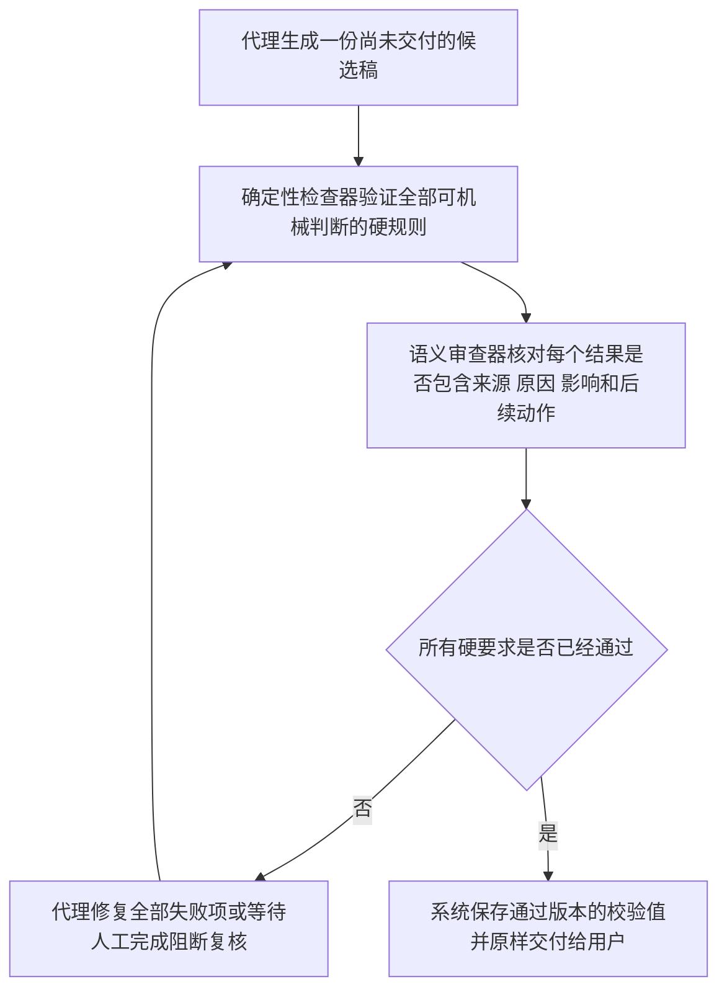

# 人类可读中文技能强制遵守审计报告

审计日期：2026 年 8 月 24 日

本报告中全部数值来自本地脚本输出、仓库文件、评测记录和用户授权查看的历史对话；每个结果所在段落继续说明直接来源、形成原因和使用边界

审计对象：`human-readable-technical-writing` Skill、仓库检查器、发布评测、全局代理指令和实际对话输出

审计目的：解释代理读取 Skill 后仍然违规的原因，并设计能够阻断违规交付的执行机制

## 1. 审计决定

建议改变执行方式（pivot），目标保持不变，执行方法从依靠代理记住规则改为每次交付必须通过阻断门禁

`Skill` 继续提供写作方法和判断标准

确定性检查器验证格式，语义审查器核对因果完整性，运行时控制层拦截未经验证的用户可见输出

这个改变可以保留现有内容资产，主要重做执行链路和验收方法，因此属于可逆的架构调整

## 2. 核心结论

### 2.1. 读取 Skill 不等于执行 Skill

Skill 是提供给代理的自然语言指令，代理仍然需要在生成时记住、解释并执行这些指令

OpenAI 官方文档说明，Skill 的隐式启用依赖名称和描述，完整正文会在代理决定使用后才加载；可用 Skill 较多时，初始列表还会受到上下文预算限制 [1]

这意味着失效可能发生在两个位置

1. Skill 没有被选中：代理只看到被压缩的名称或描述，没有读取完整规则

2. Skill 已经被读取：代理在长任务、冲突指令或多轮上下文中遗漏了部分规则

本轮实际案例已经证明第二种失效真实存在，因为相关代理明确记录了 Skill 和引用文件已经读取，后续输出仍然以中文分号结尾

### 2.2. 当前仓库只能检查部分交付物

现有 Skill 只要求大型任务运行完整检查，小型回答、中间进度和部分最终回复能够绕过检查器

这会造成同一条硬要求在长文中可能被检查，在短消息中完全依赖代理自觉，违规输出因此能够直接到达用户

### 2.3. 当前检查器没有覆盖结果后的因果解释

现有主检查器的唯一规则标识数量为 72

这个数量来自对脚本中规则标识的去重统计

现有规则没有覆盖量化结果、错误、取舍或状态之后的因果解释，因此当前门禁无法发现这类缺失

以下最小反例都被当前检查器判定为通过，也没有产生问题记录

直接原因是检查器只识别现有格式和措辞规则，没有建立结果说明的语义结构

1. `根据本次规则测试记录，179 个案例全部通过`

   这句话只有数量和结论，没有说明案例来源、通过原因、能够证明的范围以及不能证明的范围

2. `仓库内容检查失败`

   这句话只有错误状态，没有说明触发条件、已知原因、受影响范围和恢复动作

3. `最终采用方案 A`

   这句话缺少决定性依据和承担代价，也缺少放弃收益和重新选择条件

4. `生产部署已经完成`

   这句话只有完成状态，没有说明完成证据、已验证范围、未验证边界和后续动作

### 2.4. 当前高分属于代理指标，不能代表真实可读性

现有规则测试得到 179 个案例全部通过，原因是检查器与预先编写的正反例一致

这个结果能够证明固定案例没有破坏已知检测器，无法证明代理面对新任务时会遵守规则

现有质量评测得到 51 个固定案例全部通过，原因是评测对象是预先编写的答案

评测元数据明确声明新生成质量没有被测量，因此这个结果只能保护已知答案

现有仓库内容检查扫描的 `Markdown` 文件数量为 19

没有通过检查的文件数量为 11

直接原因是扫描范围包含迁移和备份目录，活动文件也存在新鲜生成证据缺失与链接缺失

这个结果说明仓库当前还没有达到可发布状态

另一个真实对话的规则评测显示满足数量为 40 项

同一评测记录的平均分为 98.75

用户随后指出输出语气不像本人

原因是评分器衡量了自己定义的代理规则，没有衡量用户真正关心的相似性，这属于代理指标替代真实目标

OpenAI 官方评测指南同样要求使用任务特定的真实案例、生产日志和人工判断，并提醒避免只凭整体感觉或忽略人工反馈 [2]

## 3. 实际案例调查

### 3.1. 本仓库迁移前的文档协作案例

用户连续指出架构文档过于复杂、执行协议难以理解、节点缺少解释、术语没有定义和形状示例

这些反馈说明标题、列表和术语检查能够改善表面结构，仍然无法单独保证首次阅读者理解内容

可读性必须把定义、用途、形状、来源和实际影响连成完整说明

### 3.2. 森林项目对话案例

任务标识 `019f8799-84cd-7ae0-904e-32c52d6facae` 用于定位原始对话

代理明确读取了本 Skill 和引用文件，后续进度消息仍然使用中文分号收尾

这个案例排除了单纯没有加载 Skill 的解释，直接证明已加载规则仍然需要交付前门禁

同一对话报告了 68、444、1096、3288、0 和 9/9 等多个数量

很多数量后面没有解释形成原因和决策影响，因此数量来源检查需要与因果解释检查分开实施

### 3.3. 表达风格项目对话案例

任务标识 `019fb7de-a0ff-77a3-9f8b-902503b5f26f` 用于定位原始对话

评测结果显示 40 项规则全部满足且平均分为 98.75，用户仍然拒绝输出风格；原因是评测目标由代理自己定义，缺少用户认可案例的外部校准

这个案例要求以用户接受或拒绝的真实输出建立回归集，任何再次出现的已知失败都应阻断发布

### 3.4. 工作流项目对话案例

任务标识 `019fc521-e36b-7fd3-8f60-ebd14a6657c9` 用于定位原始对话

该对话已经确定关键决策和周期审计应由控制层与状态机强制执行

这个结论与本轮证据一致，因为代理自身无法同时充当生成者、唯一裁判和最终放行者

### 3.5. 调查限制

本轮没有运行独立子代理，结论来自同一代理对官方资料、仓库实现、固定评测和真实对话的配对核查

这个调查方式能够定位直接矛盾和实现缺口，无法提供真正独立的第二意见

用户人工审核将承担当前阶段的外部门禁，后续可以在获准后加入独立语义审查

## 4. 根因分析

### 4.1. 触发链路存在不确定性

Skill 的完整内容只在被选中后进入上下文，隐式选中依赖名称和描述 [1]

当前仓库根目录中的 `SKILL.md` 也不是 Codex 仓库级自动发现位置，Codex 会从 `.agents/skills` 和个人安装目录发现 Skill [1]

本仓库版本与个人安装版本当前内容一致，但它们是两个物理副本；后续只修改仓库而没有同步安装目录时，代理会继续读取旧版本

### 4.2. 规则分散降低执行显著性

硬规则分布在 `SKILL.md`、多个引用文件、全局 `AGENTS.md` 和检查脚本中

部分引用文件只在特定任务或用户已经报告问题后才要求读取，这会让首次输出在读取完整规则前已经产生

OpenAI 官方模型指南建议每条指令只陈述一次，并用精确成功条件和输出形状减少歧义 [3]

### 4.3. 提示词没有交付阻断能力

自然语言中的必须仍然属于生成约束，不能拦截已经生成的违规文本

把软要求改写成硬要求能够提高优先级，仍然不能形成技术保证

真正的技术保证需要在发送前验证候选稿，并拒绝放行失败版本

OpenAI 官方 `AGENTS.md` 指南也建议保持代理指令简洁，并把格式和静态检查放到持续集成门禁中 [4]

### 4.4. 检查范围没有覆盖全部用户可见输出

当前完整检查只针对大型任务，进度消息、短回复和部分最终回答没有统一进入同一条验证链

用户要求所有写作规则都是硬要求，因此验证对象必须扩大到每一条用户可见中文内容，包括中间进度、最终回答、文档和报告

### 4.5. 两类规则需要分开验证

中文句号、标题编号和禁用词可以通过确定性规则判断，同一个输入会得到同一个结论

因果解释是否完整涉及上下文语义，字符串规则只能发现候选位置，无法可靠判断解释是否真实、相关和充分

字符串评分器适合明确的二元检查，模型评分器适合语义判断但仍然不是确定性证明 [5]

因此所有要求都保持硬性，验证方式按照问题性质分开；机器无法判定时进入阻断复核，不能以警告状态放行

## 5. 新的硬性写作契约

### 5.1. 要求强度只有硬性

每一条已登记写作要求都必须满足，没有建议项、可选项和仅供参考项

检查结果只有三种运行状态，这三种状态描述验证进度，不改变规则强度

1. 通过：确定性检查全部满足，语义审查项目全部解决，文本可以交付

2. 失败：已经确认至少一项违规，文本必须修改后重新检查

3. 需要复核：机器无法可靠判断语义是否完整，文本继续被阻断，直到人工或获准的独立审查确认

现有警告后仍然通过的行为必须取消，因为警告能够与交付同时发生，会把硬要求重新变成软要求

### 5.2. 每个结果必须形成完整解释单元

量化结果、错误、取舍、状态、限制、期限和结论出现后，文本必须自然回答五个问题

1. 结果是什么：读者先知道观察到的事实或作出的决定

2. 结果从哪里来：读者能够定位数据、测试、证据或判断方法

3. 结果为什么形成：读者知道直接原因、决定性依据或尚未确认的因果边界

4. 结果会改变什么：读者知道影响范围、风险、证明边界或决策后果

5. 接下来做什么：读者知道行动、恢复方法、复核条件或重新选择的条件

这五个问题是内部验证结构，最终正文使用自然句子连接，避免把字段标签机械地堆到用户面前

### 5.3. 不同结果使用对应的因果信息

1. 量化结果

   需要写明数据来源、计算方法、结果形成原因、解释边界和决策影响

2. 错误或失败

   需要写明触发现象、已知原因或原因尚未确认、受影响范围和恢复动作

3. 取舍或选择

   需要写明采用方案、决定性理由、承担代价、放弃收益和重新选择条件

4. 状态或完成声明

   需要写明验证证据、已证明范围、未证明边界和下一步动作

5. 限制或期限

   需要写明限制来源、形成原因、实际后果和解除条件

## 6. 强制执行架构

### 6.1. 最小执行流程

图 6.1　每条用户可见文本的阻断式交付流程

注：校验值是根据文本内容计算的固定标识，用于证明实际交付文本就是最后一次通过检查的版本

任何字符变化都会产生不同标识，因此修改后必须重新检查

### 6.2. 第一层：统一技能入口

Skill 描述需要把中文写作、技术解释、结果因果说明和硬性检查等触发词放在开头，提高隐式选中的稳定性

仓库版本作为唯一维护源，安装目录只保存经过发布流程同步的副本；发布门禁必须比较关键文件校验值，差异存在时阻断发布

全局 `AGENTS.md` 只保留调用入口和不可绕过的门禁命令，详细规则只在 Skill 中维护，避免多个副本逐渐分叉

### 6.3. 第二层：精简核心契约

`SKILL.md` 只保留适用范围、全部硬性原则、执行顺序、阻断状态和引用路由

详细案例、检测模式和解释方法放入引用文件，核心规则在一个位置定义一次，引用文件负责展开而不重新定义强度

### 6.4. 第三层：确定性检查

每条用户可见文本都运行确定性检查，不再使用大型任务作为是否检查的分界线

检查范围至少覆盖行尾标点、标题编号、列表结构、禁用表达、术语首次解释、数量来源提示、引用格式和代码注释

任何确定性违规直接返回失败，检查器不再产生能够随通过状态一起放行的警告

### 6.5. 第四层：结果因果完整性审查

检查器先定位数量、错误、取舍、状态、限制、期限和结论等结果候选位置

语义审查器再验证附近文本是否真正说明来源、形成原因、影响和后续动作，同时返回支持判断的原文片段

模型无法稳定判断时返回需要复核，系统继续阻断；这个设计保留了硬要求，也避免机器猜测被当成通过证据

### 6.6. 第五层：原样交付

系统记录最后一次通过检查的文本校验值，用户界面只允许交付校验值一致的文本

这个步骤能够防止代理在检查完成后重新润色并引入新违规，也是格式准确性可以获得技术保证的关键

### 6.7. 第六层：运行时控制

仓库检查器可以阻止不合格文档进入版本库，无法自动拦截 Codex 已经发送的中间进度和最终回答

要覆盖全部用户可见消息，`AIALRA-WORKFLOW` 控制层需要在消息发送前执行图 6.1 的流程

这是基于官方 `Skills` 与 `AGENTS.md` 机制边界作出的工程推断，因为官方文档描述了指令发现和合并，没有提供 Skill 自身拦截每条最终消息的通用接口 [1][4]

## 7. 用户审核通过后的实施计划

### 7.1. 第一阶段：冻结契约

- 第一步，用户审核本报告中的硬性范围、三种阻断状态和五项结果解释结构

- 第二步，把用户修改意见写入同一份报告，并为每项修改记录原因和影响范围

- 第三步，用户确认报告后建立基线版本，后续实现必须能够逐项追溯到基线条款

### 7.2. 第二阶段：重写 Skill 核心

- 第一步，压缩 `SKILL.md`，删除重复要求和大型任务才能检查的例外

- 第二步，把结果因果说明写入核心硬性契约，并明确每条用户可见中文内容都要执行门禁

- 第三步，调整 `agents/openai.yaml` 的触发描述，使常见写作、报告、解释、状态和计划请求都能够命中本 Skill

### 7.3. 第三阶段：扩展检查器

- 第一步，为确定性规则建立一个唯一登记表，规则标识、检测方式、修复提示和测试案例都从登记表派生

- 第二步，加入结果候选位置检测，并分别覆盖量化结果、错误、取舍、状态、限制、期限和结论

- 第三步，把现有警告改成失败或需要复核，任何未解决项目都不能产生通过结果

- 第四步，加入最后通过文本与最终交付文本完全一致的校验

### 7.4. 第四阶段：引入真实失败案例

- 第一步，从用户明确拒绝的历史输出中抽取最小失败片段，删除敏感信息后保存为回归案例

- 第二步，为每个案例记录用户拒绝原因、应触发规则、正确版本和验收依据

- 第三步，要求旧检查器漏过且新检查器能够阻断，证明新增门禁确实解决了观察到的问题

- 第四步，用户每次拒绝新输出时把该案例加入回归集，持续把实际偏好变成可重复验证的资产

### 7.5. 第五阶段：修复仓库评测

- 第一步，明确发布内容范围，迁移备份目录和输入暂存目录不参与活动文档质量统计

- 第二步，保留对活动文件的真实失败，不用排除目录掩盖缺失链接或新鲜生成证据不足

- 第三步，运行 51 个隔离的新鲜生成案例

  数量沿用当前计划规模，原因是它能够与现有固定案例形成同规模对照；后续再根据真实失败分布调整样本量

- 第四步，使用用户审核结果校准语义审查器，防止自动评分再次替代真实可读性

### 7.6. 第六阶段：发布已同步版本

- 第一步，全部仓库门禁通过后生成候选发布版本

- 第二步，对比仓库与个人安装目录的关键文件校验值，确认代理读取的内容与审核版本一致

- 第三步，直接发布到用户指定分支或主分支，并保存测试证据和发布校验值

### 7.7. 第七阶段：接入运行时控制层

- 第一步，在 `AIALRA-WORKFLOW` 中增加发送前拦截点，使进度消息和最终回答都先形成候选稿

- 第二步，接入确定性检查、语义审查和人工阻断复核

- 第三步，只有校验值一致的通过版本可以发送，运行时日志记录每次阻断原因和修复结果

这一阶段涉及另一个仓库和消息发送链路，用户批准本报告后仍需单独确认实施范围

## 8. 验收标准

### 8.1. 规则回归验收

全部登记的确定性规则案例必须通过，任何一个失败都阻断发布；这个标准证明已知规则没有回归，不能单独证明未知语义质量

用户选定的历史失败案例必须全部被新门禁阻断，修复版本必须全部通过；这个标准证明实现覆盖了真实观察到的问题

### 8.2. 新鲜生成验收

51 个隔离的新鲜生成案例必须全部通过，并且没有未解决的需要复核项目

这个规模用于与现有固定评测建立对照，最终可信度仍然取决于案例是否覆盖真实任务

每个数量、错误、取舍、状态、限制、期限和结论都必须能够定位来源、原因、影响和后续动作；缺少任何一项时由语义门禁阻断

### 8.3. 仓库发布验收

活动文档检查必须全部通过，迁移和备份目录依据明确的发布范围排除

这个结果证明当前发布内容合格，历史备份内容不在本次证明范围内

仓库发布版本与个人安装版本的关键文件校验值必须完全一致；这个结果证明代理实际读取的是用户审核后的版本

### 8.4. 运行时验收

每条实际发送消息的校验值必须与最后一次通过版本一致；这个结果证明发送后没有发生未经复核的改写

任何确定性失败、语义失败或未解决复核都必须阻止发送；这个结果证明所有规则在执行层保持硬性

### 8.5. 用户验收

用户抽查的真实任务必须全部接受，任何拒绝案例都会立即成为阻断式回归案例

这个标准让用户判断持续校准系统目标，避免自动评分再次自我证明

## 9. 保证边界

### 9.1. 可以形成技术保证的部分

确定性格式规则可以对经过检查且原样交付的文本形成保证，因为相同文本会得到稳定结论，校验值还能证明交付内容没有变化

仓库文档可以通过提交前检查和持续集成形成强制门禁，因为不合格变更能够被版本管理流程拒绝

### 9.2. 需要阻断复核的部分

因果解释是否真实、相关和充分属于语义判断，单一字符串规则无法形成绝对证明

系统可以保证未确认文本不被放行，不能保证模型第一次判断永远正确；因此高风险或歧义案例必须由人工或获准的独立审查确认

### 9.3. Skill 单独无法保证的部分

Skill 单独无法保证 Codex 的每条即时消息都被拦截，因为 Skill 是生成指令，不是消息发送控制器

全部用户可见输出的强制保证需要 `AIALRA-WORKFLOW` 或等价宿主在发送前执行门禁

在该控制层完成前，仓库交付物可以强制，实时对话只能提高遵守率，无法诚实宣称绝对保证

## 10. 本轮暂不执行的变更

本轮只新增审计与计划文档，不修改 `SKILL.md`、检查脚本、全局 `AGENTS.md`、个人安装副本和 `AIALRA-WORKFLOW`

当前工作区包含迁移前遗留的多项未提交修改，本轮不会把这些修改合并提交

原因是这些修改尚未经过本报告定义的审核，直接发布会混入未经确认的行为变化

## 11. 参考资料

[1] OpenAI, “Skills,” OpenAI Developers, 2026 [在线] 可访问：[https://developers.openai.com/codex/skills/](https://developers.openai.com/codex/skills/)

[2] OpenAI, “Evaluation best practices,” OpenAI API Documentation, 2026 [在线] 可访问：[https://developers.openai.com/api/docs/guides/evaluation-best-practices](https://developers.openai.com/api/docs/guides/evaluation-best-practices)

[3] OpenAI, “GPT-5.1 Prompting Guide,” OpenAI Developers, 2026 [在线] 可访问：[https://developers.openai.com/api/docs/guides/latest-model](https://developers.openai.com/api/docs/guides/latest-model)

[4] OpenAI, “Custom instructions with AGENTS.md,” OpenAI Developers, 2026 [在线] 可访问：[https://developers.openai.com/codex/guides/agents-md/](https://developers.openai.com/codex/guides/agents-md/)

[5] OpenAI, “Graders,” OpenAI API Documentation, 2026 [在线] 可访问：[https://developers.openai.com/api/docs/guides/graders](https://developers.openai.com/api/docs/guides/graders)
