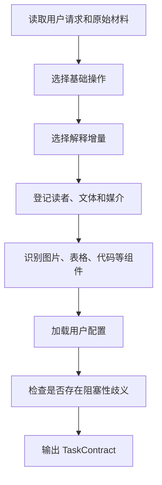

# 任务编译

## 1. 作用

任务编译把用户请求转换成一次写作契约；它只决定当前任务需要做什么、允许补充到什么程度、面向谁、使用什么媒介和加载哪些组件规则

## 2. 编译顺序

图 2.1 任务编译顺序

这张图从基础操作开始收窄任务范围，再决定解释增量、读者、组件和用户配置；最后一步只检查会改变事实、范围、来源要求或输出规模的歧义；没有阻塞性歧义时，编译器直接生成结构化任务合同

## 3. 基础操作判断

- 原文同语种重写：`TRANSFORM`
- 原文跨语种转换：`TRANSLATE`
- 用户明确允许删减：`COMPRESS`
- 围绕问题重新组织知识：`EXPLAIN`
- 根据问题和来源从零成文：`GENERATE`
- 只改结构和版式：`FORMAT_ONLY`

一个任务默认只有一个主要基础操作；不同材料需要不同操作时拆成多个子契约，并保留共同任务标识

## 4. 解释增量判断

- 用户只要求同语种改写，并且材料已经自足：`NONE`
- 用户只要求翻译：`GLOSS`
- 用户要求能够看懂、补齐背景或解释机制：`EXPLANATORY`
- 用户要求从零开始教会：`TEACHING`
- 用户要求调查、最新信息、争议或外部来源：`RESEARCHED`

## 5. 输出条件

任务契约必须通过 `contracts/task-contract.schema.json`；`TRANSFORM` 和 `TRANSLATE` 默认把源信息覆盖目标设为 `1.0`；存在会改变结果的歧义时，`clarification.status` 必须为 `BLOCKED`

独立阅读单元使用 `reading_context: standalone`，并把 `known_terms` 设为空数组；连续文档只有在前文实际完成术语解释后，才能把对应术语加入 `known_terms`

任务包含图片、表格或代码时，`component_order` 登记原始组件是否先于解释出现；两个以上承担同一作用的内容登记为 `parallel_groups`；`section_plan` 根据内容区块决定是否需要标题、实际标题层级和分区依据，并固定禁止冒号伪标题；代码任务登记 `annotated_code` 或 `line_by_line_explanation` 及每个有效语句的解释位置；使用注释代码时，`comment_alignment` 固定为每个代码块按照最长可注释代码行同行对齐并允许增加行宽，使用逐行解释时登记为 `not_applicable`；`boundary_requirements` 登记缺失证据、重要性和下一项验证方法，`boundary_visibility` 固定为内部保存、重要时自然说明并禁止直接标签

`delivery.iteration_policy` 固定要求重新读取规则、确定性复核、语义复核、最多三轮修复和最小完整单元补丁；调用方不得把初稿直接标记为可交付结果

独立阅读单元中的专业名词需要登记官方中文、官方英文、缩写、中文定义、名称含义、名称依据、当前作用和实际影响；官方写法无法核对时，编译结果进入 `BLOCKED`，禁止自行创造全称

多轮任务通过 `conversation` 登记已经失效的要求；追加要求替换旧要求后默认只保留当前有效内容，用户要求变更历史、撤销说明、审计或证据核对时才把保留开关设为 `true`

GitHub 图片、表格和 Mermaid 任务需要登记 1280 像素与 390 像素、亮色与暗色四种实际渲染证据；源码中的居中标记不能代替页面结果

Mermaid 默认使用纵向布局；只有横向排列表达并列比较且纵向布局会明显破坏理解时，才在 `layout_exceptions` 登记组件、原因和纵向布局不可用的依据

本地程序使用 `python -X utf8 scripts/run_vnext.py compile --input <输入 JSON> --output <任务合同 JSON>`；输入 JSON 由 Agent 提供已经识别的任务类型、读者和组件，程序只填充固定默认值并验证合同，不从任意自然语言中猜测语义
