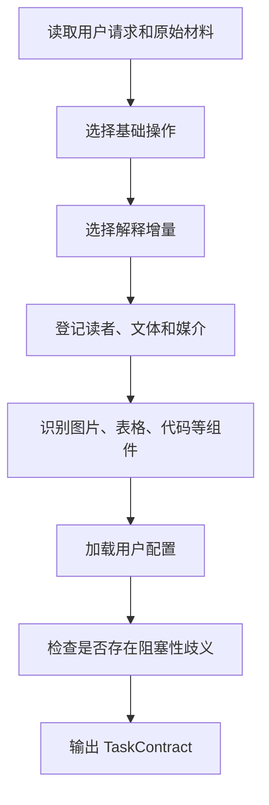

# 任务编译

## 1. 作用

任务编译把用户请求转换成一次写作契约；它只决定当前任务需要做什么、允许补充到什么程度、面向谁、使用什么媒介和加载哪些组件规则

## 2. 编译顺序

图 2.1 任务编译顺序

这张图从基础操作开始收窄任务范围，再决定解释增量、读者、组件和用户配置；最后一步只检查会改变事实、范围、来源要求或输出规模的歧义；没有阻塞性歧义时，编译器直接生成结构化任务合同

## 3. 基础操作判断

- 原文同语种重写：`TRANSFORM`
- 原文跨语种转换：`TRANSLATE`
- 用户明确允许删减：`COMPRESS`
- 围绕问题重新组织知识：`EXPLAIN`
- 根据问题和来源从零成文：`GENERATE`
- 只改结构和版式：`FORMAT_ONLY`

一个任务默认只有一个主要基础操作；不同材料需要不同操作时拆成多个子契约，并保留共同任务标识

## 4. 解释增量判断

- 用户只要求同语种改写，并且材料已经自足：`NONE`
- 用户只要求翻译：`GLOSS`
- 用户要求能够看懂、补齐背景或解释机制：`EXPLANATORY`
- 用户要求从零开始教会：`TEACHING`
- 用户要求调查、最新信息、争议或外部来源：`RESEARCHED`

## 5. 输出条件

任务契约必须通过 `contracts/task-contract.schema.json`；`TRANSFORM` 和 `TRANSLATE` 默认把源信息覆盖目标设为 `1.0`；存在会改变结果的歧义时，`clarification.status` 必须为 `BLOCKED`

独立阅读单元使用 `reading_context: standalone`，并把 `known_terms` 设为空数组；连续文档只有在前文实际完成术语解释后，才能把对应术语加入 `known_terms`

任务包含图片、表格或代码时，`component_order` 登记原始组件是否先于解释出现；正文存在证据边界时，`boundary_requirements` 分别登记缺失证据、缺失证据的重要性和下一项验证方法

Mermaid 默认使用纵向布局；只有横向排列表达并列比较且纵向布局会明显破坏理解时，才在 `layout_exceptions` 登记组件、原因和纵向布局不可用的依据
