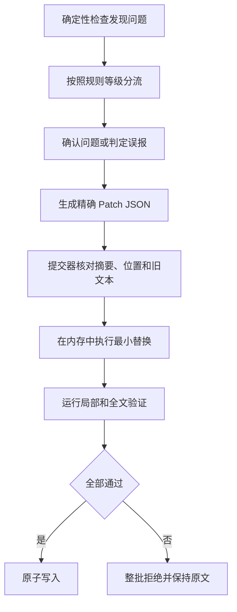

# 验证与精确修复

## 1. 处理顺序

图 6.1 验证与精确修复流程

图中的程序先按照规则等级分流问题，再由 Agent 处理依赖语境的候选项；提交器只有在文档摘要、目标位置、旧文本和授权范围全部一致时才执行替换；任一条件变化都会拒绝整批补丁并保留原文

## 2. 规则分流

- `MACHINE_FINAL`：代码确认后直接阻断，Agent 不能随意否决
- `MACHINE_CANDIDATE`：Agent 根据上下文标记确认、误报或需要用户决定
- `PROFILE_REQUIRED`：只在当前任务或用户配置启用时阻断
- `ADVISORY`：提供优化建议，不单独阻断

## 3. 修复范围

修复范围按照词或符号、短语、单句、信息段落、相邻段落、小节和整体骨架逐级扩大；低一级能够修复时禁止扩大范围，默认禁止重新生成全文

## 4. 事务规则

互不重叠并且绑定同一文档摘要的补丁可以组成一批；任一补丁摘要不一致、位置越界、旧文本次数不符、授权范围不符或验证失败时，整批不写入
