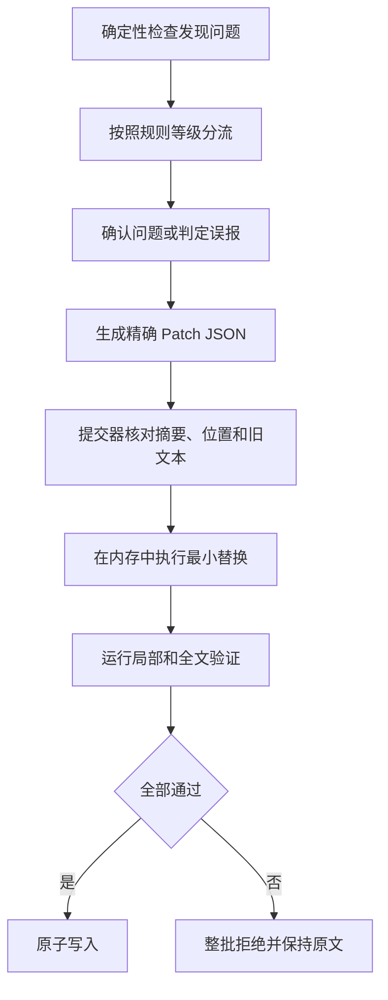

# 验证与精确修复

## 1. 处理顺序

图 6.1 验证与精确修复流程

图中的程序先按照规则等级分流问题，再由 Agent 处理依赖语境的候选项；提交器只有在文档摘要、目标位置、旧文本和授权范围全部一致时才执行替换；任一条件变化都会拒绝整批补丁并保留原文

## 2. 规则分流

- `MACHINE_FINAL`：代码确认后直接阻断，Agent 不能随意否决
- `MACHINE_CANDIDATE`：Agent 根据上下文标记确认、误报或需要用户决定
- `PROFILE_REQUIRED`：只在当前任务或用户配置启用时阻断
- `ADVISORY`：提供优化建议，不单独阻断

## 3. 修复范围

修复范围按照词或符号、短语、单句、信息段落、相邻段落、小节和整体骨架逐级扩大；低一级能够修复时禁止扩大范围，默认禁止重新生成全文

## 4. 事务规则

互不重叠并且绑定同一文档摘要的补丁可以组成一批；任一补丁摘要不一致、位置越界、旧文本次数不符、授权范围不符或验证失败时，整批不写入

本地程序提供以下入口：

- `verify` 检查来源引用、段落分配、支持映射、术语覆盖、排比组、代码单元、多轮替换、组件顺序、GitHub 实际渲染证据和证据边界
- `verify` 同时检查注释代码的目标列、同行状态和单元覆盖，并检查内容类型、首屏任务、证据绑定、未知状态和删除测试
- `repair` 调用精确补丁提交器，只有摘要、位置、次数和冲突检查全部通过时才写入文件
- `close` 在同一干净 Agent 会话中重新读取适用规则，合并确定性与语义发现，最多执行三轮最小补丁和全文复验
- `report` 验证并输出 `PASS`、`FAIL` 或 `REVIEW_REQUIRED` 结果，同时保留问题位置、原因、影响和下一步

这些入口使用 `python -X utf8 scripts/run_vnext.py <入口> --input <输入 JSON>`；程序不负责理解任意自然语言，也不把结构检查通过解释成完全同义已经得到证明

每轮语义复核先建立不可丢失清单，逐项检查用户明确要求保留的正确部分、事实、条件、范围、数值、机制、关系和源内容，再检查结构与风格；同一轮已经可见的问题必须一次报告，不能因为格式问题较多而把内容缺失推迟到最后复核；解释任务需要一般背景时，初稿必须把实际使用的背景主张及其来源类型登记完整，不能先生成无支持机制再在修复中被迫删空

术语检查在独立阅读单元中验证确属专业名词的正式中文、官方英文、缩写、定义、名称含义、当前作用、可观察表现和实际影响，并按注册表的 `required_meanings` 检查首次语义位置；`name_origin` 必须覆盖 `name_rationale` 的实际含义，不能只给一般定义或依靠后置术语表补救；行内代码中的专业缩写仍需在相邻文字中完成解释；代码块、网址、路径和逐字引用保持原样；`core_terms`、主题关键词和普通操作短语不能单独证明专业身份；普通任务标签使用自然中文解释且不得创造英文，确属专业名词但无法从登记表或官方来源确认形式时才返回 `REVIEW_REQUIRED`

排比组由 Agent 按语义登记，程序只检查登记项目是否全部换行并采用正确缩进；正则表达式只能提出候选，不能单独决定自然语言是否构成排比

自迭代闭环的正文补丁只允许 `token`、`phrase` 和 `sentence`；无变化正文补丁、摘要失配、定位不唯一、整段、相邻段、整节和全文范围全部拒绝；正文已经正确而清单陈旧时，允许只更新清单，但必须减少确定性问题且不得改动正文；无法局部修复时返回 `REVIEW_REQUIRED`

普通交付只显示闭环后的最终正文；初稿、复核发现、补丁和中间摘要只进入内部运行证据；人工评测明确要求时才在审核包展示脱敏迭代摘要

GitHub 居中检查以 1280 像素与 390 像素、亮色与暗色四种实际渲染证据为准；源码存在居中容器但页面仍然偏移或溢出时继续失败

注释代码以每个代码块的最长可注释代码显示宽度为基准；目标列必须等于最长宽度加二，每个可注释 `CODE` 单元都要在该列保持同行；逐行解释路径不得登记伪造的注释对齐证据
